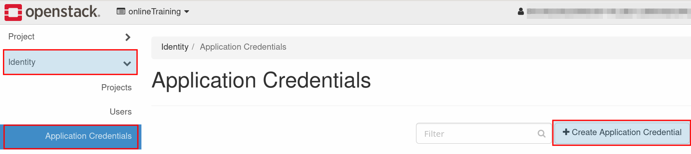
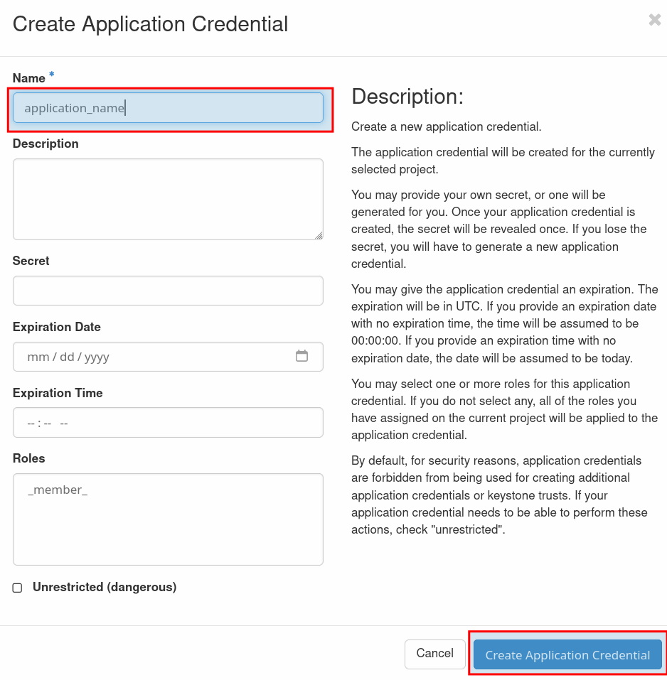
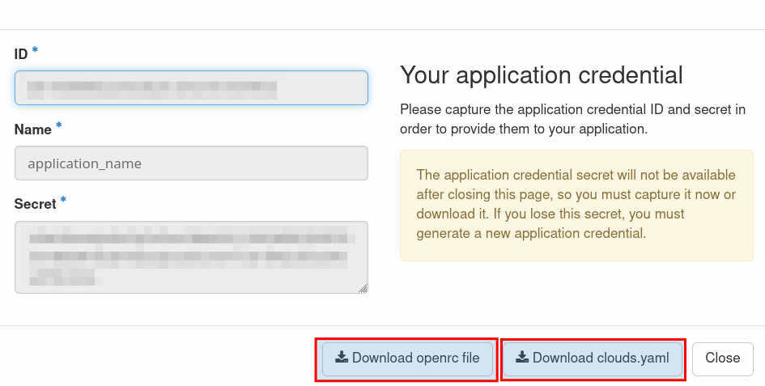

# de.NBI Cloud Berlin
Welcome to the de.NBI Cloud site Berlin. In the following guide we want 
to give you a quick introduction how to use our cloud site.

Please note, you are responsible for everything that happens with the virtual
machines (VMs) you deploy! We as resource provider are not liable for 
anything and do not give any guarantees. Keep this in mind and try to make your setup as reproducible as possible from the beginning.

## How to get in contact with us
In case you have questions or want to give us any kind of feedback, please 
contact us via <denbi-cloud@bih-charite.de>.

## Access to the de.NBI Cloud Berlin
### OpenStack Dashboard
The OpenStack dashboard gives you all information about your 
project, e.g. your available resources, your virtual machines etc. The 
dashboard is available [here](https://denbi-cloud.bihealth.org).
To access your project, use LifeScience AAI as authentication provider. After 
authentication you will be redirected to the OpenStack dashboard.

**Hint:** We block access from several countries in our firewall. In case you have problems to reach our dashboard or can not access our jumphost from outside of Germany, please get in contact with us!

### Deploy your VMs
The networks are already preconfigured, so you can directly start and deploy 
your VMs. Therefore go to **Project - Compute - Instances** and choose the 
button **"Launch Instance"** on the right side. Now you have to provide 
information at least in the categories **Details, Source and Flavor**.

  **Details:**
  
  - In the field "Instance Name", assign a name to your VM
  
  **Source:**
  
  - Choose "Image" as "Boot Source"
  - If you choose "Create New Volume" **No**, the vm volume will be created on hypervisor and be limited to 20GB.
  - If you choose "Create New Volume" **Yes**, your volume will be placed on our separate storage system and can be bigger than 20GB. **Please to not create volumes bigger than 250 GB!** (You can use a share instead) 
  - Choose an appropriate image from the list (e.g. CentOS)
  
  **Flavor:**
  
  - Choose a Flavor from the list that fits your resource requests (e.g de.NBI 
  default provides 2 cores with 4GB of RAM)

  **Network:**
  
  - For new projects (09/2021) it is recommended to choose "yourProject-network-2". You will be able to use floating ips within subnet of public2: `172.17.0.10 - 172.17.7.250` 
  - Older projects (prior 09/2021) can still use their existing "your-Project-network". You will be able to use floating ips within subnet of public: `172.16.102.200 - 172.16.103.220`
  
Now hit the button "Launch Instance". The VM will be deployed and accessible
in a few seconds. To connect to your VM you need to assign a floating ip 
address to the machine. Therefore click on the arrow on the right side of the
spawning VM, choose "**Associate Floating IP**" and use one available
floating ip addresses from the drop-down menu.

**Hint:** To connect to one of your VMs without a floating ip address you have to 
assign at least one floating ip address to another of your machines. As soon 
as you are connected to this machine you are inside of your project network 
and can connect to VMs without any floating ip address.

## Connect to your VMs with ssh

None of your VMs will be directly visible and accessible from the internet. To 
connect to one of your VMs, you have to use our jumphost server
denbi-jumphost-01.bihealth.org with your LifeScience login name. In case you are not sure, check for your login name
on the [profile page](../portal/user_information.md) of the de.NBI Cloud Portal.

#### SSH-Keys

Your public ssh must be added in the de.NBI portal: https://cloud.denbi.de/portal/ to be able to connect to our jumphost.
and make sure that you import a public ssh-key into your 
OpenStack project (**Project - Compute - Key Pairs - Import 
Key Pair**) so that you can access your VMs later on.


##### Distribution logins
Please take care, as for now, that our images are shipped with the standard 
users for the respective Linux distribution. Here you can see a list of 
standard users for some common distributions:
 
  - **CentOS**: centos
  - **Ubuntu**: ubuntu


#### Windows 10 
To connect via Windows 10 you can use PowerShell as OpenSSH ist already installed by default. Create the ssh config file ```$HOME\.ssh\config``` with notepad or use the PowerShell command ```Set-Content -Path $HOME\.ssh\config -Value '<add file content here>'```
When you use PowerShell, make sure to edit the input of the file. Fill in your information and make sure that the sections HostName, IdentityFile, User, and ProxyJump are indented with four spaces for both entries.
```bash
Host denbi-jumphost-01.bihealth.org
    HostName denbi-jumphost-01.bihealth.org
    User LifeScienceLogin
    IdentityFile PATH_TO_KEY


Host NAME_OF_VM  # first vm
    HostName 172.16.XXX.XXX
    IdentityFile PATH_TO_KEY
    User ubuntu / centos
    ProxyJump denbi-jumphost-01.bihealth.org
```

Save the file without a filename extension. To open a ssh connection issue the following command in PowerShell:
```console
ssh NAME_OF_VM
```

#### Linux .ssh/config

```bash
Host denbi-jumphost-01.bihealth.org
    HostName denbi-jumphost-01.bihealth.org
    User LifeScienceLogin
    IdentityFile PATH_TO_KEY
    ServerAliveInterval 120

Host NAME_OF_VM
    HostName 172.16.XXX.XXX
    IdentityFile PATH_TO_KEY
    User ubuntu / centos
    ProxyJump denbi-jumphost-01.bihealth.org

```

#### Setting up a SOCKS proxy
In some cases it would also make sense to configure a permanent SOCKS proxy to 
communicate with your VMs behind the jumphost, e.g. when using web 
applications etc. As long as you have an open SOCKS connection to the 
jumphost you can directly connect to your VMs from a different console. In the
following example socat is used but also netcat (nc) works in a similar way. 
Add the following lines to your **local ~/.ssh/config**:

    # Access to the de.NBI jumphost
    Host denbi-jumphost-01.bihealth.org
      # Use your LifeScience login name
      User LifeScienceLogin
      # Use your ssh-key file
      IdentityFile YOUR-SSH-KEY-FILE
      # Open a SOCKS proxy locally to tunnel traffic into the cloud environment
      DynamicForward localhost:7777
      # Forward locally managed keys to the VMs which are behind the jumphosts
      ForwardAgent yes
      # Send a keep-alive packet to prevent the connection from beeing terminated
      ServerAliveInterval 120
      
    # Access to de.NBI cloud floating IP networks via SOCKS Proxy
    Host 172.16.102.* 172.16.103.*
      # Tunnel all requests through dynamic SOCKS proxy
      ProxyCommand /usr/bin/socat - socks4a:localhost:%h:%p,socksport=7777 or socks5h:localhost:%h %p,socksport=7777
      # Use your ssh-key file
      IdentityFile YOUR-SSH-KEY-FILE
      # Forward locally managed keys
      ForwardAgent yes
      # Send a keep-alive packet to prevent the connection from beeing terminated
      ServerAliveInterval 120
      
## Storage

#### Create Volumes

If you need more disk space than the initial image provides (20GB), one 
way is to create a volume and attach it to your VM. Please keep in mind that 
a volume can only be attached to one VM at the same time. The advantage of a 
volume is that it will be available also after you deleted your VM. So you can
use it to store data temporally. **Please to not create volumes bigger than 250GB**

To create a volume choose **Project - Compute - Volumes** followed by **Create 
Volume** on the right side. Now assign a name to your volume and set the size
according to your needs. After the successful creation of the  volume you have 
to attach it to your VM. Choose the arrow on the right side of the created 
volume and select **Attach Volume**. In the new window you have to choose your 
VM from the drop-down menu under **Attach to Instance**.

On your VM you now have to make a filesystem on the device so that you can 
mount it to your machine. Use e.g. mkfs to make an ext4 filesystem:

    sudo mkfs.ext4 /dev/vdb
    
After creating the filesystem you can mount the filesystem to your VM and start 
using it:

    sudo mount /dev/vdb /mnt

#### Create a NFS share
In case you need a NFS share to store big amounts of data and share it within
your project, you can use OpenStack to create and manage the share.

To create a NFS share choose the section **Shares** and click on **Create 
Share**. In the popup you have to provide the following information:

  **Share Name:**
  - Provide a share name.
  
  **Share Protocol:**
  - Please use the preselected "NFS" as protocol.
  
  **Size (GiB):**
  - Provide the size of the share. Info: You have an overall quota for NFS 
  shares on your project. Please make sure that you set the size below the 
  project quota.

  **Share Type:**
  - Please select "isilon-denbi" (or dmz, if you want to use a share from a server within the dmz)
  
  **Availability Zone:**
  - Please select "nova".

#### Manage access rules for your NFS share
After the creation of a NFS share, the share will not be accessible by anyone
. To grant your VMs access to the share you have to configure the access rules.

**Important: Please make sure to keep the access rule list of your NFS share up
 to date**, so that only your VMs can access the share.

To manage the access rules click on the **arrow** on the right side of your 
newly created NFS share and choose **Manage rules**. Now you have to choose 
**Add rule**. In the popup you have to provide the following information:

  **Access Type:**
  - Select ip to allow a certain VM access to the share.
  
  **Access Level:**
  - Choose **read-write** or **read-only** appropriate to your needs. In some
   cases it may make sense that specific VMs just get read-only permissions.
  
  **Access to**
  - Please fill in the ip address of your VM you want to grant access to the 
  NFS share.
  
#### Access your NFS share
In order to use your created NFS share you have to mount it to your VMs. 
Click on the created share in the **Shares** section of the OpenStack 
dashboard to get information about the complete mount path. Under the 
**Export locations** section, please choose the **Path** e.g.:
     
    manila-prod.isi.denbi.bihealth.org:/ifs/denbi/prod/share-YOUR_UIID

You can mount the share with the following command:

    sudo mount -o vers=4.0 manila-prod.isi.denbi.bihealth.org:/ifs/denbi/prod/share-YOUR_UIID /mnt/
    
Alternatively you can add the mount path to the "/etc/fstab". Make sure that 
you use NFS version 4.0. In order to use NFS version 4.0, you might need to set the host's DNS domain name:

```
cat /etc/idmapd.conf 
[General]
#Verbosity = 0
# The following should be set to the local NFSv4 domain name
# The default is the host's DNS domain name.
Domain = denbi.bihealth.org
```

Please make sure that your user (depending on the used distribution: centos, 
debian, ubuntu) is the owner of the NFS share. Therefore run the following 
command to set the user as owner of the NFS share:

    sudo chown centos:centos /mnt/
    
**Hint** This example is for a Centos based image.

### Using the OpenStack API
First, you will need to request a password to use the OpenStack API, 
therefore write a mail to the support team at <it.digitalhealth@charite.de>. 
Second, the API is not directly accessible from the outside, so the only way to 
access the API from a local machine is through the jumphost. So make sure you've
configured your SOCKS proxy as described before. In addition you will need to 
configure your environment to use the SOCKS proxy for the API requests. 
Therefore set your environment variables for the http/https proxy:

    export http_proxy=socks5h://localhost:7777
    export https_proxy=socks5h://localhost:7777
    export no_proxy=localhost,127.0.0.1,::1

Now, if you have an active SOCKS connection to the jumphost, you should be 
able to use the OpenStack API from your local machine.

### Adding multiple SSH-Keys
To access your VM you have to provide a public ssh-key. In the deployment 
step of your VM you can choose which public ssh-key you want to use for your 
VM in the section **Key Pair**.

In case you want to directly deploy a VM and give access to more than one 
user you can use the section **Configuration - Customization Script** in the 
deployment part. Here you have to list the full **public keys** in the 
following format:

    #cloud-config
    ssh_authorized_keys:
        - Full public ssh-key of User-1
        - Full public ssh-key of User-2

After the successful deployment of the VM, user 1 and user 2 will have access 
to the VM.

### Upload your own Linux images
If you need an extra Linux image we do not provide, you also can upload your 
own images via **Project - Compute - Images**. Select **Create Image** and 
choose a name and the path for the image and also make sure that you choose 
the correct format (typically qcow2). If there are special requirements for 
your image, you can specify the minimum disk size and also the minimum 
amount of RAM. After the successful upload only the members of your project 
can use the image.

## openstack-cli

This tutorial shows how you can setup openstack-cli in a project to manage your project from the vm without a web browser. This tutorial does only apply to the de.NBI site Berlin and was only tested with the Ubuntu 22.04 image.


1. Create Application credentials in your project.





2. Download both files presented to you: openrc.sh and cloud.yaml



3. Create a vm in your project.
4. Copy both files to your vm. Save 'clouds.yaml' to the directory ```~/.config/openstack/```. 
5. Install virtual environment for python
```bash
sudo apt-get install python-virtualenv
```
6. Create virtual environment named 'venv'.
```bash
virtualenv ~/venv
```
7. activate the environment
```bash
source ~/venv/bin/activate
```
8. Install the openstack cli client in the environment
```bash
pip install python-openstackclient
```
9. Source the ```openrc.sh``` file to use the credentials to use openstack-cli
```bash
source openrc.sh
```
10.  Use openstack-cli to get information about your project
```bash
openstack server list
```