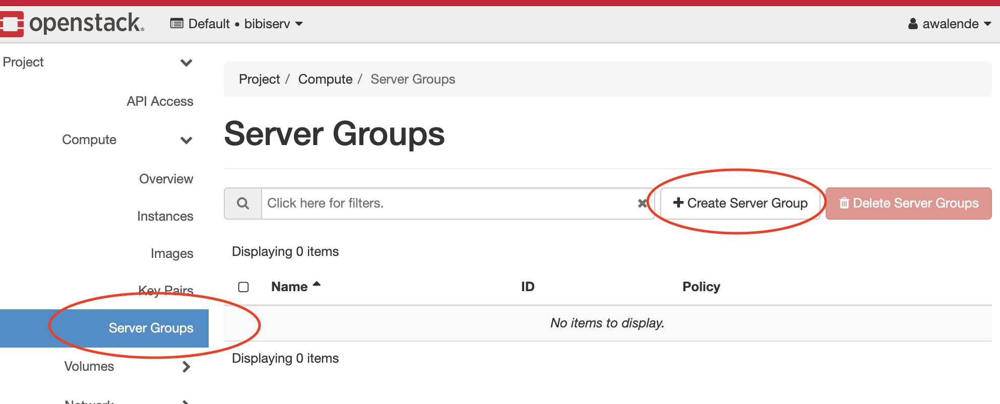
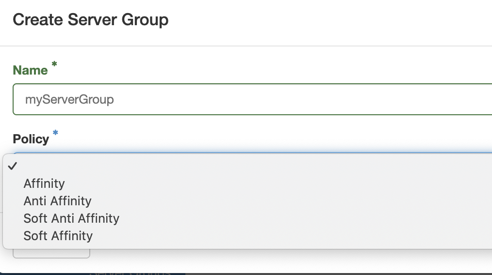
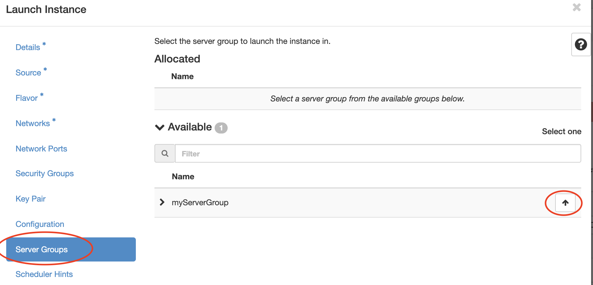
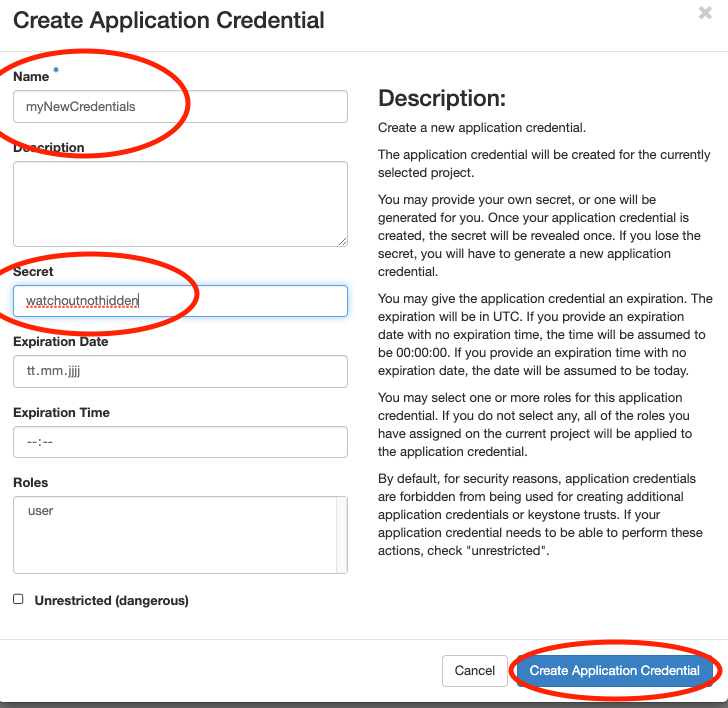
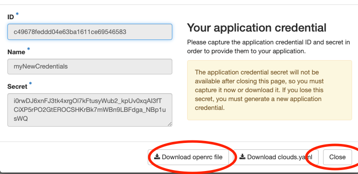
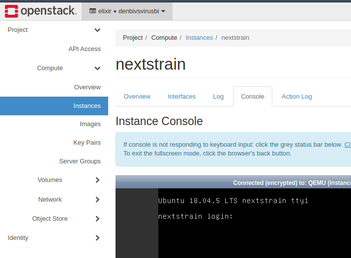
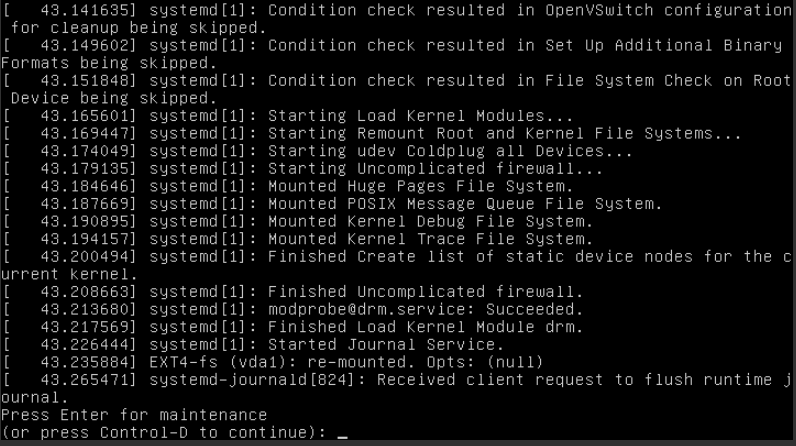

# de.NBI cloud at Bielefeld University

The Bielefeld cloud site currently has OpenStack Train installed. That means that the general descriptions with 
screenshots based on OpenStack Newton differs from our installation. 

## Contact
The de.NBI cloud team in Bielefeld can be contacted via email: os-service(at)cebitec.uni-bielefeld.de


## Entrypoint
The OpenStack Dashboard as main entry point to the de.NBI Cloud Bielefeld is available 
at [https://openstack.cebitec.uni-bielefeld.de](https://openstack.cebitec.uni-bielefeld.de).

## Endpoints

You can get an up-to-date list of API endpoints of the available services using the dashboard or 
the OpenStack command-line tool (`openstack endpoint list`).

## Login
The Bielefeld cloud site supports login using Elixir AAI via OpenID Connect or default Keystone credentials. 
Using Elixir AAI is the preferred way for all cloud users and the only way for non-cloud users not working 
at Bielefeld university. 


## Network

The Bielefeld cloud currently has 3 different _external_ networks available.

- external
- external-service
- cebitec

### external

The external network is a publicly available network. There are no limitations from our side and it is the 
preferred network if you don't have access to the Bielefeld university LAN. 

### external-service

The external-service network is a public network that is restricted to ssh, http and https. It should only 
be used for (web-)services running in the cloud. Each IP address must be activated before usage.

!!! warning "Warning"
    In general this network shouldn't be used, ask cloud support if unsure.

### cebitec

The cebitec network is a non-public _external_ network, that can only be used from the Bielefeld university LAN. 
However, since this network represents a non-public ip address range, it is possible to have more than one in 
use at the same time. The access is limited to SSH, HTTP and HTTPS. Access to the world is only possible using 
the CeBiTec Proxy and only for HTTP, HTTPS and FTP.

```
export http_proxy=proxy.cebitec.uni-bielefeld.de:3128
export https_proxy=proxy.cebitec.uni-bielefeld.de:3128
export ftp_proxy=proxy.cebitec.uni-bielefeld.de:3128
```

### MTU settings

We make use of a network virtualization technology called Virtual Extensible LAN (VXLAN). The MTU value provided 
to the network interfaces is 1450 and therefore differs from an expected default *value* (e.g. 1500). You have to 
consider this if running docker or any other container technology.

## Images

Preconfigured cloud images are available for Ubuntu LTS (18.04, 20.04, and 22.04) and Debian (10 and 11). 
These images apply some auto-configuration on boot specific to the cloud site Bielefeld:

- Site-local APT mirror is used as default
- If needed, APT, Docker and the environment are configured to use the local proxy

All images are able to run on other cloud sites without any further modifications.

### Ubuntu apt mirror

We run an apt mirror for Ubuntu LTS releases (18.04, 20.04 and 22.04) to speed up package download. The mirror is available 
at the Bielefeld cloud site through the external (http://apt-cache.bi.denbi.de:9999 or http://129.70.51.2:9999) and cebitec
(http://172.21.40.2:9999) network.
This mirror is synced every midnight with the official Canonical/Debian repositories.

## Object storage

The storage backend used by the Bielefeld cloud site is powered by [Ceph](https://www.ceph.com/en/). The Object storage 
endpoint provides API access via SWIFT and S3. The latter should be preferred due to better performance.
You can find a tutorial [here](../Tutorials/ObjectStorage/index.md) on how to use this service.

## Protection against loss of data

Users should be aware, that instances are ephemeral. This means, that instances can go offline for various
reasons. This is most likely due to hardware issues on the hypervisor. Users can prepare against this
by storing their data in the storage infrastructure of this compute center. For this you can
use Snapshots and Volumes. This data is stored redundantly on our Ceph Cluster three times on different
locations of the cloud-center. Beware that this does not act as a backup. If you want true backups (which
are independent of this cloud-center), you have to copy your data to a safe location, like an external harddrive,
for yourself. We do our best to prevent any data loss, but we can't guarantee that 100%.
Here is a quick overview about our solutions for storing data:

| Data Location | Description | Performance |
| ------------- | ----------- | ----------- |
| Root Disk     | The root disk of an instance is hosted on a RAID10 backend. This means that data is safe against single harddrive failures. However, if the hypervisor itself goes bad your data will be also completely unavailable. | Fast |
| Ephemeral Disk | Some flavors provide an extra disk called "ephemeral disk". While this storage is practical for most use-cases it is also the most unsafe one. They are **not** included in Snapshots and should be used for temporarily used data. | Fast |
| Volumes       | Volumes are stored redundantly in our Ceph-Storage. Since volumes are network-backed storage, random read/write operations performance is significantly slower than using the local disk space. Volumes offer a great solution for storing persistent data since volumes can be swapped to different instances. | Medium - Fast |
| S3 Object Storage | This data is also stored in our Ceph-Storage just like volumes. Access to this data is completely independent from instances since access is done via regular HTTPS. Therefore data in S3 is safe against any hypervisor issues. Performance heavily depends on the client used to access the object storage. A single-threaded connection is slow but can heavily speed up using multiple connections retrieving different chunks of the same object. Pushing data is much slower than retrieving data. | Slow - Fast |


## Server Groups for optional performance gains

Our OpenStack cluster consists of multiple compute nodes hosting all running instances. Some applications
can benefit if you schedule the instances of your project on as many different compute nodes as possible.

- Distributed systems (like HPC, databases...) can get a significant performance gain.
- Spreading instances over several compute nodes increases the availability when running a high availability setup. 

This can be achieved with *Server Groups*. Server Groups act as a "container" for instances and describe 
a "policy" on how those instances should be scheduled across the OpenStack Compute nodes.

In order to create such Server Group, login to the OpenStack Dashboard and navigate to Compute -> Server Groups. 
Afterwards click on *Create Server Group*:


On the new screen, give this security group a name and assign the wanted affinity policy:


The policies are defined as following:

| Policy | Description |
|--------------|--------------|                                                
| affinity        | Force schedule all instances on one single compute node. |
| soft affinity         | Try to schedule all instances on a single compute node. Allow to violate the policy when there is not enough space on this single node.      |
| anti affinity     | Force schedule all instances as spread as possible on all compute nodes.     |
| soft anti affinity    | Try to schedule all instances as spread as possible on all compute nodes. Allow to violate this policy when there are not enough compute nodes with such capacity.     |

It is recommended to use the "soft" variant. Otherwise, instances can fail to start when they would violate 
the more strict policy options.

Afterwards the creation of a new Server Group, you can add instances to it when you are creating them. 
It's not possible to add already running instances to a Server Group since they are already scheduled.
On the *Server Groups* tab, add the group by clicking on the small up-arrow:


Afterwards, the scheduling of this instance will respect your selected Server Group policy.


## Application Credentials (use OpenStack API)

In order to access the OpenStack Cloud via command-line tools, you need to source a so called rc file.
This _standard_ procedure does not work on all Cloud locations. Executing `source` on the 
downloaded rc file prompts for a password. This password **is not the same** you have used when 
authenticating to ELIXIR in order to access the OpenStack Dashboard.

Internally, OpenStack does not set a local password for your ELIXIR-ID, since it does not need to 
hence OpenStack confirms your authorization separately via ELIXIR AAI.
However, the commandline-tools can only function with a set local password. Prior to the new 
OpenStack release, users had to contact the cloud site administrators in order for them to set an 
explicit local password and send it back to the user via encrypted mail or de.NBI vault service. 

Luckily, there is a new feature since OpenStack Rocky where users are able to set their own *local* 
credentials via the dashboard.

Log in to the OpenStack Dashboard as usual, on the left side navigate to Identity -> Application 
Credentials and create a new credential set:


Afterwards, you have to specify your new credential set. You can leave the 'secret' field blank, 
OpenStack will autogenerate a long and cryptic password string afterwards. Of course you can also 
provide your own secret.
**Warning: The secret field is not hidden in the browser!**. Afterwards click on *Create Application Credential*:


In the new window, you can directly download a generated rc file. Make sure that you explicitly 
click on *Close* afterwards, otherwise the credential won't be saved:



After the credential has been downloaded to your favourite location,
you can simply source the file with:

```
#Depends on your location.
source ~/Downloads/<NAME OF RC FILE>
```

Now you can use the openstack commandline tools.

### Note

Application credentials are currently not supported by all applications or development kits accessing the 
Openstack API. In this case users have to contact the cloud site administrators in order for them to set 
an explicit local password.

## (Information) Security

Our [information security policy (german language)](assets/bielefeld/informationssicherheitsleitlinie.md)  
ensures that we follow defined protocols and procedures.

### Clock synchronisation

Our cloud infrastructure and user virtual machines are clock synchronised using the Network Time Protocol (NTP).

### Information security incidents

If users become aware of a security incident or notice an abnormal behaviour of their instances (e.g. unexpected high CPU 
load or high network traffic without actively running anything), they should immediately contact 
the cloud administrators (os-service@cebitec.uni-bielefeld.de). The administrators will assist in isolating
the affected instances from the public network and will (with the owner's consent) start a basic forensic analysis.
Depending on the analysis results a security incident report is written and the security incident 
officer of Bielefeld university is informed. If any personal data is affected, the data security officer 
is also consulted.

### Cryptography

We use cryptographic methods to protect user data stored on our infrastructure:

- Client connections to our OpenStack Dashboard and Openstack API 
  are encrypted using TLS
- Local disks of instances are located on encrypted devices (LUKS)
- Cloud storage is LUKS encrypted

### Regular vulnerability scans

We are scanning our external reachable instances regularly for vulnerability's in order to prevent
any security incidents. These scans are scheduled daily around midnight and are non-disruptive.

Vulnerabilities are classified either as Low, Middle or High.

If we detect an instance with a **HIGH** vulnerability:

- We immediately disconnect any network connectivity ingress and egress
- We send you a detailed report about our findings
- We reach out to you and specify the necessary actions in order to fix this issue and restore connectivity.

If we detect an instance with a **MEDIUM** vulnerability:

- The instance will continue to exist and connect to the internet as usually UNLESS this issue is not fixed in a specified time
- For this, you will also be contacted by us with an attached report
  - These reports also give hints on how to fix the listed vulnerability
- You can contact us if you need help in resolving a vulnerability


## Current Known Problems

- Spawning large GPU instances can fail after 10~ minutes. These instance have special requirements for main-memory and spawning them can therefore cause timeouts. The solution is simply to try again or pick a flavor which requires less memory. If spawning GPU-instances fail repeatedly, please contact us. 

If you notice any issues which are not part of this list, don't hesitate to contact us.

## Frequently Asked Questions (F.A.Q)

### Automatic A-Records are not created

Automatic DNS A-records following the scheme `<instance_name>.<project_name>.projects.bi.denbi.de` are removed due to
incompatibility with the new setup. If you wish to have custom A-records, write us a mail with the desired
name and the associate FloatingIP.

### I can't connect to my instance via SSH. Why?

This can have many causes. The first crucial troubleshooting-step is to examine the error message when trying
to connect to an instance via an ssh client.

If the client times out or throws an error like `Destination not reachable`:

- Make sure that the instance is running and in an `ACTIVE` state.
- Make sure that the instance has a floating-ip attached to it. You can't ssh into an instance which only has a private ip.
- Check the SecurityGroups of your project and allow ingress port for SSH (Port 22).
  - You can check this in the OpenStack-Dashboard: Project -> Network -> Security Groups.
- You are using a broken snapshot or image which is not able to configure its internal network configuration via `cloud-init`.
- There may be network issues on our side.

If you are receiving `Connection refused`:

- Network connectivity to your instance is given and the internal ssh-server is running, but the instance itself is not allowing your connection.

- You are using a wrong or too open SSH-Key. 
  - Make sure to use the correct private key-file and that the key on your local machine has correct permissions. Usually only the logged-in user should have access to it. The OpenSSH-Client won't try keys with too open permissions.

- You are using the wrong remote user.
  - If you are using an ubuntu based image or snapshot, the remote user is `ubuntu`. For debian it is `debian`.

- The instance is stuck in maintenance-mode.
  - See [here](Bielefeld.md#my-instance-is-stuck-in-maintenance-mode-while-booting) on how to resolve this.

- Something is misconfigured inside your instance.
  - The public key in `/home/ubuntu/.ssh/authorized_keys` is missing.
  - The permissions are broken or too open in `/home/ubuntu/` or `/home/ubuntu/.ssh/`. (Too open eg. with `chmod 777`).
  - In these cases, you are completely locked out, and you won't be able to access your instance in some way again. In rare and urgent cases, we can manually repair this but for this we need your explicit consent to do so.
  
### My instance is stuck in maintenance mode while booting.

When using a regular OpenStack-Project, you can check this by opening the VNC-Console of the instance. 
Click on your instance on the OpenStack-Dashboard and select `Console` in the tab-menu.



You may confirm the maintenance mode by looking at the last messages in the console:



You can then continue the boot process by pressing Control-D.
If the console is not receiving your keystroke, click on the bar beforehand which states `Connected(encrypted) to: ...`.

You should then scan and repair all your filesystems. You can list all your connected filesystems with `lsblk`.
Afterwards perform a check and repair all issues with (replace the last character with the disk of your choice):
```shell
sudo fsck.ext4 /dev/vd[a,b,c]
```

If you are using a SimpleVM-Project, you are not able to access this console. Please contact the [Cloud-Helpdesk](https://cloud.denbi.de/portal/webapp/#/help).

### I can't suspend or shelve my instance

Shelving and suspending is disabled on this installation. Please use the snapshot-functionality instead.

### My instance is suddenly listed as `Shut Off` in the dashboard. Why?

Instances in the cloud can crash like any other machine and therefore can go offline.
This can also indicate an issue with our underlying compute infrastructure.

You can try to re-start (Hardreboot) your instance in the dashboard. If this fails for some reason, then there
is probably an issue with the underlying compute infrastructure. In this case, please contact us.

If your instance is starting up fine, you can check some log-files which may give you an indication on why the
instance went offline. They are usually located here on your instance:

- `/var/log/kern.log`
- `/var/log/syslog`

