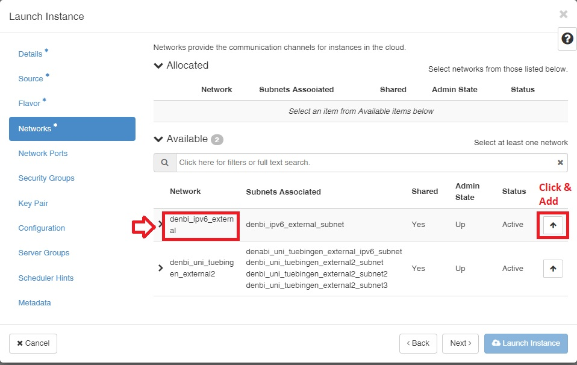

# de.NBI Cloud Tübingen
Welcome to the de.NBI Cloud site Tübingen. In the following we will
give you a basic introduction how to use our cloud site.

## How to get in contact with us
In case you have questions or want to give us any kind of feedback, please
contact us via <denbi@zdv.uni-tuebingen.de>.

If you need help please add the **ID** of your instance/volume, your operating system and in which region it is located.

## Giving access to de.NBI admins
If like to give us access to your VM that we can help you "hands on", add our keys by adding the following lines to the file ~/.ssh/authorized_keys

```
ssh-ed25519 AAAAC3NzaC1lZDI1NTE5AAAAIAzQ86aCv9uzRcm9LTt4lP7sLgNAucZoZuqCtWGvF4sy FabianPaz@denbiadmin
ssh-rsa AAAAB3NzaC1yc2EAAAADAQABAAABgQCfgmdfTN99ARbIsk4IuadXC1mQrSRwZHkrjx6VPRvFS3Keq0Z77qOIawn/Umyf4GiqJHzm2hcwGsUHcCpIbLfZylY0qAmW+rNvCvescU36CKJhI4d4Rax1NGy7As+hiSXbFollr64kwhSIguT4r/khWMzCLWGQIHH+UlKOirk+snYJ5skFtrT9NlBNme7juj2PatiIH58gthlkexoxfnH/mhk5DDIqNcBHbQwS5Rw9CUnlWSNJSV1DvSXUcp7ncIWJgHVSh4yUxDn/LcH/fp0yhdB5dXAJtetNYnnXacXPA4k/dneCJm4lUtmyv8nsSDQ2Dzqv9dlAsPssNp6l1qV8LqvBrwqPneuyzgZhz1s3URoaDzZ2EVvg7aH/DMtRZq7RJKnzCSqGAeZFWMd574VEv5Ghmc1Hw93AZcmD7DZERp0NmF/kSKIJcaslcblkSkDHUlVFiudNaXBVafV2aR/EuA86+zO5n5s3vCKRw4LKc50i6DReUwHgXvjbHcy5R8s= AmirBaleghi@denbiadmin
```

## General concept of the de.NBI Cloud Tübingen
A cloud like the one you will use here can be seen as computing resources which are available on demand.
You can get much more compute cores (CPU), main memory (RAM) and also storage capacity than you have
available on your own work station. The de.NBI Cloud Tübingen provides you the mentioned resources as an infrastructure (IaaS).
The available resources are used by starting Virtual Machines (VMs) on the provided computing machines.
You can start different virtual machines with different Linux based operating systems (OS) which consume different kind of
resources. The VMs can be customized on your own to fit your needs in the best way.
What you get is a computing infrastructure where you can run calculations or simulations with a flexible amount of resources
in your own computing environment (VM).

## Login
You need to apply for a login for https://denbi.uni-tuebingen.de. 

The cloud site in Tübingen consists of two sites that are called RegionOne and RegionTwo. The two regions offer different resources. RegionOne offers low memory CPU nodes and high memory CPU nodes. RegioTwo offers medium memory CPU nodes and GPU nodes (NVIDIA V100). Also the storage components of these two regions are divided but have the same capabilities. Depending on which region your resources are please switch to the specific region. Per default RegionOne is chosen after the login. If you need to change to RegionTwo click on the `RegionOne` button in the upper left corner of the browser window. 

Please note, you are responsible for everything that happens with the virtual machines (VMs) you deploy! We as resource provider are not liable for anything and do not give any guarantees.


## SSH-Keys
To access your VMs, a valid SSH key pair is required. On all POSIX operating systems (including Windows 10 and 11) `ssh-keygen` may be used to create a key pair. An example is given below:
```bash
ssh-keygen –t ed25519
```

Please note, keep your private key as private as you would do it with your credit card PIN number. We will never ask you to share your private key.

### Deploying a Key Pair
Login to the Horizon dashboard https://denbi.uni-tuebingen.de and navigate to `Project / Compute / Key Pairs`. Click on `Import Key Pair` and insert your public key after giving it a name.

## Launching an Instance
Navigate to `Project / Compute / Instances` and click on `Launch Instance` (upper right). The following entries for the VM are only examples, please chose the appropriate settings for your work case (Operating System (Images), Resources (Flavors)).

#### Details
```
Instance Name: <some name you like>
Availability Zone: Nova
Count: 1
```

#### Source
```
Select Boot Source: Instance Snapshot or Images
Create New Volume: No (Otherwise the root partition of the instance is launched on a volume which is not recommended!)
Allocated: Select the required OS by clicking on the up arrow
```

#### Flavor
```
Allocated: Select the required flavor by clicking on the up arrow
```

#### Networks

For network selection, since we cannot provide enough IPv4 for all users, we need to ask all users to use IP version 6 for general use. In this case, we have created an IP version 6 network with the same name `denbi_ipv6_external` in both regions that you can select for general use. you could see the process of adding a network in the following figure:

<br/>




<br/>
<br/>
<br/>

> **Note**
> IP version 6 and version 4 are the same to use and the only different of IPv6 is that the number count is longer than IPv4. you could access your VM with IPv6 like IPv4 via ssh. 

<br/>
<br/>

> **Note**
> If for some reason you need to use IP version 4, please send us your request by email to denbi@zdv.uni-tuebingen.de and we can talk about the possibilities.


<br/>
<br/>

#### Network Ports
```
Leave it unchanged
```

#### Security Groups
```
Allocated: Select the set up network by clicking on the up arrow beneath the network name and move ‘default’ to the Available section
```

#### Key Pair
```
Select your key pair
```

#### Configuration
```
Leave it unchanged
```

#### Server Groups
```
Leave it unchanged
```

#### Scheduler Hints
```
Leave it unchanged
```

#### Metadata
```
Leave it unchanged
```

Finally launch the instance. You should see a fresh instance entry. It may take a couple of minutes to spawn the instance depending on the requested resources. 

## Accessing a VM via SSH
Just use ssh, specifying the correct IP, the right key and the username of the OS (centos, ubuntu, debian, ...), you have chosen for example ‘centos’. An example of a Linux command is given below:
```
ssh –i /path/to/private/key <osname>@<IP-Address>
```

- An example for a centos machine with the IP v6 (example IPv6 address: `2001:7c0:801:XXXX:XXXX:XXXX:XXXX:XXXX`) or 

```
ssh –i /path/to/private/key centos@2001:7c0:801:XXXX:XXXX:XXXX:XXXX:XXXX

```

- An example for a centos machine if you need to use to IP v4 (example IPv4 address : `1.2.3.4`) would be:

```
ssh –i /path/to/private/key centos@1.2.3.4

```

If you need x-forwarding for graphical user interfaces don’t forget to set the –X flag and check if the xauth package is installed on the host and the server and the x-forwarding settings are correct. For Windows user we suggest to use xming (https://sourceforge.net/projects/xming/). 

If you are using Putty you have to navigate in Putty to Connection / Data and enter ‘centos’ as Auto-login username. The user name may be different for different Boot Sources, but here we have a CentOS based image. Under Connection / SSH / Auth select the file containing your private key matching the public one you have used during the creation of your VM. Enable X11 forwarding under Connection / SSH / X11. Go back to Session and save the settings for later reuse.
Click on Open to connect to your VM via SSH. When connecting for the first time a warning related to server host keys may appear. Confirm with yes. Enter the passphrase you have set during the creation of your key pair.
You now should have a prompt on your VM.
Please note, each time you redeploy the VM the IP address will change. So first check if you have the correct IP address if problems occur. If are just logging out of the VM via the exit command, the IP address will not change.

## Security Groups - Tips and Best Practices

- Security groups in openstack are basically the firewall of your project. They determine which traffic from what sources can reach your instances, and which destinations your instances can reach.
- **Egress**: Your instance **to** "the internet"
- **Ingress**: "The internet" **to** your instance
- _Possibly helpful documentation at __https://hdacloud.h-da.io/os-user-docs/projects/sec-groups/#example-web-servers-and-databases_
- IP-Adress: Comparable to a street address. This essentially tells devices on a network where to find a host. 0.0.0.0/0 refers to any IPv4 address, ::0/0 is the equivalent in IPv6.
- Ports: Comparable to a postbox. This essentially tells devices on a network where to send traffic intended for a service. 22 is the default port for SSH for example.

### Recommendations

* **Least Privilege Principle**: Only open necessary ports required for the desired functionality. If you are unsure about which ports are needed for a specific application, consult the relevant documentation or ask the admin team for help. Opening ports based on guesswork can lead to unnecessary risks and accidental exposure of sensitive data.
* **Never use all:**  Avoid rules that open all ports. Even if you're intending to open all ports for one instance only to a local network, this overcomplicates finding potential problems and determining the purpose of the security groups in the future. You are essentially opening Pandora's Box by opening all ports (not to mention opening all ports to 0.0.0.0/0).
* **Use meaningful names and don't combine services**: This ties in to the previous principle. Use meaningful names for your security groups, and try not to use a single security group for multiple applications. If you have a security group named after your instance opening twenty-eight different ports, it becomes cumbersome to remember which port is needed for what service and turns debugging in case of errors a nightmare.
* **Do not rely on local firewalls**: Do not rely carelessly on specific rules set in tools like iptables or ufw on your instance and open everything up in your security groups. OpenStack security groups are designed for traffic filtering with ease of use in mind, making it more transparent and enabling you to manage or update your rules with ease.
* **Use specific IP ranges (if possible)**: If you want to make a service available in trusted networks or for certain teams only, use specific IP ranges (CIDR notation) to limit access. If you are unsure about which ranges are needed, consult the admins responsible for the network in question or ask your de.NBI admins for assistance.
* **Regularly audit your groups**: If you are making changes to your infrastructure and adding or removing services, remember to also apply the corresponding changes to your security groups (e.g., if you remove or disable a web server on one of your instances, remove the rules for ports 80 and 443).
* **Don't change without checking**: Don't alter the settings of a security group if you're unsure which instances the group is assigned to or what the specific rules are used for. If you have just created a new instance that slightly differs from the other instances in their function, it's probably a good idea to recreate the security group for the new instance and apply changes there.
* **Prefer SSH port forwarding to opening ports**: Especially if the service you want to access isn't secured with authentication and encryption mechanisms, opening the port through a security group is not a good option. Instead, you can use port forwarding. Let's say an application is exposing a web dashboard on port 8080 on your instance. By using `ssh -L 80:localhost:8080 youruser@yourinstace` you can forward port 8080 from the instance (localhost refers to itself in the above) and make it accessible only to your local machine on port 80. By visiting [http://localhost:80](http://localhost) in a browser, you can thus easily access the web dashboard without needing to change your security groups. Please note: The SSH connection must be kept open or reopened every time you want to access the dashboard.

### Example and Tip: Using remote security groups in your rules

_Remote Security Group_ rules in Security Groups are a useful way to manage access between VMs in Openstack. When understood, they make it much easier and safer to scale and modify within Openstack projects.

Imagine I have a proxy service that receives connections from the internet, terminates the HTTPS and passes requests on to webservers. My proxy needs to accept connections from the outside world, so it will have the standard http/https rules:

| Direction | Ether Type | IP Protocol | Port Range | Remote IP Prefix | Remote Security Group | Description |
|-----------|------------|-------------|------------|------------------|-----------------------|-------------|
| Ingress | IPv4 | TCP | 80 (HTTP) | 0.0.0.0/0 | \- | IPv4 http from public networks |
| Ingress | IPv4 | TCP | 443 (HTTPS) | 0.0.0.0/0 | \- | IPv4 https from public networks |
| Ingress | IPv6 | TCP | 80 (HTTP) | ::/0 | \- | IPv6 http from public networks |
| Ingress | IPv6 | TCP | 443 (HTTPS) | ::/0 | \- | IPv6 https from public networks |

These rules say, "_allow IPv4 and IPv6 connections to the proxy on ports 80 and 443, from any IP address_".

So far, as normal. My security group for the proxy is called **my_proxies**. For my webservers I will create a security group called **my_webservers**. The webservers need to communicate within my Openstack project only, to and from the proxy(s). So, in the security group **my_webservers** I can use Remote Security Groups instead of an IP address space.

| Direction | Ether Type | IP Protocol | Port Range | Remote IP Prefix | Remote Security Group | Description |
|-----------|------------|-------------|------------|------------------|-----------------------|-------------|
| Ingress | IPv4 | TCP | 80 (HTTP) | \- | **my_proxies** | IPv4 http from a proxy VM |

This rule says: "_allow IPv4 traffic to port 80 from any VM that is using the security group my_proxies_". This has the advantage that I can add any number of proxies to my infrastructure, or change the internal address of the proxy(s), without needing to make any changes to the security groups. It is also much easier to understand this security group quickly.

### Security groups and instance firewalls

- Using security groups as a firewall is relatively easy and convenient compared to most on-machine firewall solutions available (`iptables/nftables`, `ufw`, etc.), but there might be situations in which a combination of both is useful to some use cases. `fail2ban` or advanced firewall configurations (rate-limiting, counters, packet validation, port-knocking, source port filtering, etc.) can't be realized with security groups, so combining the use of both can be a viable option to achieve advanced configurations for your instances. We strongly recommend relying on security groups for the vast majority of your firewall needs and only falling back to instance internal firewall tooling if you really need it.

## Transferring data
Per default you will have a varying amount of space available (root disc) within your VM depending on the chosen operating system. More is easily available through Swift or Cinder volumes. How to use Cinder Volumes is explained below. Further you can use a flavor with 20GB of root disc space to enlarge the available default space.
You may copy data from and to your VM using simply the  `scp`  command with the `–i` flag to use your SSH key.

## Using Cinder Volumes
Cinder Volumes are nothing else than block devices like a hard drive connected to your computer but in this case virtual. You can mount format and unmount it like a normal block device. In the following it is explained how to create a Cinder Volume and how to use it in your VM. But before some remarks. It is only possible to attach a Cinder Volume to exactly one VM. So you can not share one Volume with other VMs. A more cheerful remark is that the data saved on a Cinder Volume is persistent. As long you do not delete the Volume in the Dashboard your data will not get lost by deleting the VM or anything else happening with the VM. They are also stored three times redundant. But be aware that this comes to a price: While the throughput of cinder volumes can be even faster then local discs, latencies are a few magnitudes higher. So running databases or lots of small file operations on it can be extremely slow.

On the Dashboard navigate to `Project / Volumes / Volumes`.
To create a new volume click on `Create Volume` and enter the following parameters
```
Volume name: Type in any name you want to
Description: Describe for which purpose you will use the volume (optional) 
Volume Source: Set it to `No source, empty Volume` to get an empty block device
Type: Please use `ceph`/`ceph2_hdd` in RegionOne/RegionTwo. Additional types might be made available on request.
Size (GiB): Select the desired size in Gigabytes
Availability zone: nova
```

Then click `create volume` and your volume will appear in the list of volumes with the status `Available`.
Now you have to attach the just created volume to your VM. This is done by changing to the `instance` section under the `compute` section and clicking on the arrow on the right side belonging to your VM. Choose `Attach Volume` and choose the just created volume. Now your volume is connected to your VM like if connect a hard drive via USB with your computer.
Now you have to login into your VM, format and mount the volume.
You will find your volume with the command
```
lsblk
```
This command will list all your block devices connected to your VM.
Chose the correct device (mostly the name will be the second entry, you can orientate oneself on the SIZE parameter) and format it with a filesystem if you are using this volume for the first time. Common filesystems are ext4 or xfs. **This command needs to be executed just for a new volume, otherwise all residing data on it will be deleted!**
```
mkfs.ext4 /dev/device_name
```

After the formating you have to create a mountpoint
```
mkdir -p /mnt/volume
```

And mount the Cinder Volume under the created directory
```
mount /dev/device_name /mnt/volume/
```


Now you should see your device by executing the command
```
df -h
```

If you do not need you Cinder Volume you can also unmount it with
```
umount /dev/device_name
```

## Resize a Cinder Volume
If you find out that you need more space for your Cinder volume and want to increase the volume size, you can do this over the dashboard. Go to the Volumes section on the left side. If the Cinder volume is already attached to a VM please unmount the Cinder volume in the VM and detach it over the dashboard. Only if the Cinder volume is detached you can increase the size. Now choose the “Extend Volume” button after you have clicked on the down showing arrow on the right of the Cinder volume you want to extend. Enter the new size (in Gigabytes) and click on the button “Extend Volume”.
After this procedure has finished successfully you can attach the extended Cinder volume to your VM. Depending on which filesystem you use on your Cinder volume there are different procedures necessary to make the new capacity available.

For an ext4 formatted filesystem:
Do not mount the volume. If you can see it with the lsblk command that is enough. Run the following command to get increase the capacity
```
sudo resize2fs /dev/device_name
```
The `/dev/device_name` is the same you have used in the mount command above.
Now you can mount and use it as usual and also use the extended capacity.

For an xfs formatted filesystem:
Mount the volume as usual and run the following command
```
sudo xfs_grow -d MOUNTPOINT
```
If you followed the instructions above the `MOUNTPOINT` would be `/mnt/volume` After that you can use the extend volume with the new capacity.

If you use another filesystem than xfs or ext4 please look up if and how an increase of the capacity is possible.

## Different storage types on the de.NBI Cloud site Tübingen 
We will differentiate in the following between different kinds of storage access.
All mentioned options have backends such as _Ceph_ or _Quobyte_, that might further differentiate their handling and functionalities.

**Cinder volumes:** Cinder is the OpenStack volume service. As a user you are able to create new volumes, according to the granted project quotas, on your own via the web interface (Dashboard). These volumes are good for storing general data and are a good start. A drawback of this simple solution is, that Cinder volumes can only be attached to one VM at a time. In general, a Cinder volume can be seen as a large virtual _thumb-drive_.

**Quobyte volumes (DEPRECATED):** Further, it is possible to use the Quobyte backend directly. _Direct Quobyte volumes_ are mounted via an additional network interface in the VM using the quobyte-client tool. These kind of volumes offer the possibility to mount them on multiple VMs at the same time, use different kinds of hardware (SSDs, HDDs), replication methods and also make them available via the S3 protocol. If such a Quobyte volume is required, please contact us. They cannot be created by users themselves, they have to be provided from our side. 

### Handling Cinder Volumes 
If you do any actions like snapshoting, shelving, pausing, suspending on your VM make sure that you unmount the volume first.

### Handling Quobyte Volumes 
This is now deprecated.
Legacy information about installing and mounting a Quobyte volume is explained in a separate document that will be send to you on request.

### S3
The required S3 credentials (EC2 Access Key and Secret) are provided over the Dashboard. Login to the Dashboard and on the left side go to `Project / API Access / View Credentials`.
Please make sure you are logged in to **RegionOne** as the credentials are not displayed on **RegionTwo**. Please be aware that these credentials are project specific **not** user specific.

There are two possibilities to make use of the S3 service. 

#### 1. Make a Quobyte volume accessible via S3
This will be **deprecated** soon.

More precise, you can make files and directories inside of this volume accessible. A mounted Quobyte volume is required for this and it needs to be enabled for S3 from our side. After that you can access it via the following URL schema (if permissions allow it). All the following steps need to be executed from the machine/VM where the quobyte volume is mounted. 

`https://s3.denbi.uni-tuebingen.de/BUCKET_NAME/FILENAME_OR_DIRECTORY`

**Please be aware that S3 is thought to handle flat structures and not multiple nested directory structures, where you might hit some limits.** The URL can be used in a browser or via wget/curl to download the specified content. 

Files and directories have to be made accessible using the `nfs4-acl-tools` that need to be installed. Via the following command for example a file can be made accessible for everyone (mountpoint of the volume here is /mnt/qbvol/ ): 
```bash
sudo nfs4_setfacl -a A:g:EVERYONE@ANONYMOUS:rtncx /mnt/qbvol/
sudo nfs4_setfacl -a A:g:EVERYONE@ANONYMOUS:rtncx /mnt/qbvol/folder
sudo nfs4_setfacl -a A:g:EVERYONE@ANONYMOUS:rtnc /mnt/qbvol/folder/file-object
```

Further, you can grant read access to another OpenStack project `other_proj`
```bash
sudo nfs4_setfacl -a A:g:EVERYONE@%other_proj_ID%:rtncx /mnt/qbvol/
sudo nfs4_setfacl -a A:g:EVERYONE@%other_proj_ID%:rtncx /mnt/qbvol/folder
sudo nfs4_setfacl -a A:g:EVERYONE@%other_proj_ID%:rtnc /mnt/qbvol/folder/file-object
```

Or grant write/full access to another OpenStack project `other_proj` 
```bash
sudo nfs4_setfacl -a A:g:EVERYONE@%other_proj_ID%:rwadtTnNcCx /mnt/qbvol/
sudo nfs4_setfacl -a A:g:EVERYONE@%other_proj_ID%:rwadtTnNcCx /mnt/qbvol/folder
sudo nfs4_setfacl -a A:g:EVERYONE@%other_proj_ID%:rwadtTnNcC/mnt/qbvol/folder/fileobject 
```

These are just examples, you can further try other settings from the nfs4_setfacl. This kind of Quobyte volume (S3) is only available on RegionOne. 

#### 2. Use an S3 client
... to create, list, push, pull buckets and data. We have tested and therefore can recommend the `awscli` client. Please install it and provide the credentials to it. More on the awscli client and downloads can be found [here](https://aws.amazon.com/de/cli/) 

To use the `awscli` please install it and provide your credentials through .aws/credentials the following way (e.g. replace `test_user:ec2-access_key` with your access_key, do the sanme for the secret_key): 


```
[default] 
aws_access_key_id=test_user:ec2-access_key
aws_secret_access_key=test_user:ec2-secret_key

[PROJEKT_NAME] 
aws_access_key_id=test_user:ec2-access_key
aws_secret_access_key=test_user:ec2-secret_key
```
Further you can create different profiles as seen above with the bracket notation.
Also make sure you have enforced the PathStyle s3 URLs with

```
aws configure set default.s3.addressing_style path
```

The general command to interact with the S3 storage is the following: 


```
aws --endpoint https://s3.denbi.uni-tuebingen.de s3 CMD
```
and should then perform the documented s3 CMD on the Quobyte storage. Please note that not all of the aws commands provided by aws and the awscli client are available and implemented on the Quobyte storage backend. A list of general commands and examples can be found on the [aws documentation website](https://docs.aws.amazon.com/cli/latest/userguide/cli-services-s3-commands.html) 

Simple commandline examples are listed below:
List all your buckets:

```
aws --endpoint https://s3.denbi.uni-tuebingen.de --profile PROJECT_NAME s3 ls

```

List the content of bucket test: 

```
aws --endpoint https://s3.denbi.uni-tuebingen.de --profile PROJECT_NAME s3 ls s3://test

```

Copy file test from local machine to bucket test:

```
aws --endpoint https://s3.denbi.uni-tuebingen.de --profile PROJECT_NAME s3 cp test.txt s3://test

```

Download file test from S3 to the current directory of the local machine:

```
aws --endpoint https://s3.denbi.uni-tuebingen.de --profile PROJECT_NAME s3 cp s3://test/test.txt ./

```


## Attach a second interface
If you need a second interface for example to use direct volume mounts of our Quobyte storage for handling sensitive data or you need an internal network to build a virtual cluster where the compute nodes usually do not need to be accessed by the outside network this guide will help you to get them configured.
In the following we will give example an for Ubuntu.

### Ubuntu 20.04. (Focal)
1. First launch a VM with a publicly acessible IP address, as usual

2. Attach a second interface of your choice via the webinterface (OpenStack Dashboard)

3. Check the interface name of the second interface, usually it should be 'ens6' but can also be 'ens4' so please check for the name, with the following command:
```
ip a
```
The output should look be similar to the following:
```
1: lo: <LOOPBACK,UP,LOWER_UP> mtu 65536 qdisc noqueue state UNKNOWN group default qlen 1000
    link/loopback 00:00:00:00:00:00 brd 00:00:00:00:00:00
    inet 127.0.0.1/8 scope host lo
       valid_lft forever preferred_lft forever
    inet6 ::1/128 scope host 
       valid_lft forever preferred_lft forever
2: ens3: <BROADCAST,MULTICAST,UP,LOWER_UP> mtu 1500 qdisc fq_codel state UP group default qlen 1000
    link/ether fa:16:3e:XX:XX:XX brd ff:ff:ff:ff:ff:ff
    inet 193.196.XX.XXX/XX brd 193.196.XX.XXX scope global dynamic ens3
       valid_lft 85662sec preferred_lft 85662sec
    inet6 fe80::f816:3eff:xxxx:xxxx/64 scope link 
       valid_lft forever preferred_lft forever
3: ens6: <BROADCAST,MULTICAST> mtu 1500 qdisc noop state DOWN group default qlen 1000
    link/ether fa:16:3e:XX:XX:XX brd ff:ff:ff:ff:ff:ff
```

4. After that create a new configuration file with the following command and name (you can also use other names but make sure that it is named with 01 in front to be executed before other config files):
```
sudo vi /etc/netplan/01-second-if.yaml
```
Enter the following content depending on the interface name ens6 or ens4 or ... and the corresponding MAC address.
```
network:
    version: 2
    ethernets:
        ens4:
            dhcp4: true
            match:
                macaddress: fa:16:3e:XX:XX:XX
            mtu: 1500
            dhcp4-overrides:
                use-routes: false
            set-name: ens4
```
Save and close the file with `:wq`

5. Apply the network changes with the follwoing command:
```
sudo netplan apply
```

6. Check if the interface has been configured correctly running the command:
```
ip a
```
The made changes here are directly persistent.

## Install CUDA Driver for NVIDIA V100 or NVIDIA RTX A6000
The following installation instructions help you if you want to install the NVIDIA CUDA drivers for the available NVIDIA V100 GPUs or the NVIDIA RTX A6000 GPUs (CUDA 11.4 required).
It is assumed that you have a running VM with one or more GPUs attached already running. Otherwise please launch VM using one of the GPU flavors if GPUs are available for your project. The instructions are made for CentOS 8 and Ubuntu. We also offer existing images with CUDA already installed (CentOS 8.4 CUDA 11.4 2021-07-01, Ubuntu 20.04 LTS CUDA 11.0 2020-07-31).

### CentOS 8
1. Update the existing installation
```
sudo yum update
```

2. Install development tools
```
sudo yum groupinstall "Development Tools"
```

3. Install additional, required tools, please execute the commands after an other
```
sudo yum install kernel-devel 
sudo yum epel-release
sudo yum wget htop vim pciutils dkms
```

4. Next we need to disable the Linux kernel default driver for GPU cards in. For this open the file `/etc/default/grub` with vim for example and add
the parameter `nouveau.modeset=0` to the line starting with `GRUB_CMDLINE_LINUX=`. The line should be similar to the following example:
```
GRUB_TIMEOUT=1
GRUB_DISTRIBUTOR="$(sed 's, release .*$,,g' /etc/system-release)"
GRUB_DEFAULT=saved
GRUB_DISABLE_SUBMENU=true
GRUB_TERMINAL="serial console"
GRUB_SERIAL_COMMAND="serial"
GRUB_CMDLINE_LINUX="console=tty0 crashkernel=auto net.ifnames=0 console=ttyS0 nouveau.modeset=0"
GRUB_DISABLE_RECOVERY="true"
```

5. Make the changes effective
```
sudo grub2-mkconfig -o /boot/grub2/grub.cfg
```

6. Reboot the VM
```
sudo reboot
```

7. Login again and download the CUDA installer (11.4)
```
wget https://developer.download.nvidia.com/compute/cuda/11.4.0/local_installers/cuda_11.4.0_470.42.01_linux.run
```

8. Run the installer and type in `accept` and go down to install and hit enter
```
sudo sh cuda_11.4.0_470.42.01_linux.run
```

9. If the installation has finished you can check if everything works by running the following command
```
nvidia-smi
```

That should print out something similar to the following output depending on the number of GPUs requested
```
+-----------------------------------------------------------------------------+
| NVIDIA-SMI 450.51.05    Driver Version: 450.51.05    CUDA Version: 11.0     |
|-------------------------------+----------------------+----------------------+
| GPU  Name        Persistence-M| Bus-Id        Disp.A | Volatile Uncorr. ECC |
| Fan  Temp  Perf  Pwr:Usage/Cap|         Memory-Usage | GPU-Util  Compute M. |
|                               |                      |               MIG M. |
|===============================+======================+======================|
|   0  Tesla V100-SXM2...  Off  | 00000000:00:05.0 Off |                    0 |
| N/A   31C    P0    37W / 300W |      0MiB / 32510MiB |      0%      Default |
|                               |                      |                  N/A |
+-------------------------------+----------------------+----------------------+                                                                               
+-----------------------------------------------------------------------------+
| Processes:                                                                  |
|  GPU   GI   CI        PID   Type   Process name                  GPU Memory |
|        ID   ID                                                   Usage      |
|=============================================================================|
|  No running processes found                                                 |
+-----------------------------------------------------------------------------+
```
10. In order to use for example `nvcc` please make sure the cuda directory `/usr/local/cuda` is in your path
```
export PATH=/usr/local/cuda/bin:$PATH
```
```
export LD_LIBRARY_PATH=/usr/local/cuda/lib64:$LD_LIBRARY_PATH
```

### Ubuntu
1. Load package updates
```
sudo apt update
```

2. If wanted, install the loaded updates
```
sudo apt upgrade
```

3. Install additional, required tools
```
sudo apt install build-essential gcc-multilib dkms xorg xorg-dev libglvnd-dev
```

4. Download the CUDA installer (11.0)
```
http://developer.download.nvidia.com/compute/cuda/11.0.2/local_installers/cuda_11.0.2_450.51.05_linux.run
```

5. Run the installer and type in `accept` and go down to install and hit enter
```
sudo sh cuda_11.0.2_450.51.05_linux.run
```

6. If the installation has finished you can check if everything works by running the following command
```
nvidia-smi
```

That should print out something similar to the following output depending on the number of GPUs requested
```
+-----------------------------------------------------------------------------+
| NVIDIA-SMI 450.51.05    Driver Version: 450.51.05    CUDA Version: 11.0     |
|-------------------------------+----------------------+----------------------+
| GPU  Name        Persistence-M| Bus-Id        Disp.A | Volatile Uncorr. ECC |
| Fan  Temp  Perf  Pwr:Usage/Cap|         Memory-Usage | GPU-Util  Compute M. |
|                               |                      |               MIG M. |
|===============================+======================+======================|
|   0  Tesla V100-SXM2...  Off  | 00000000:00:05.0 Off |                    0 |
| N/A   31C    P0    37W / 300W |      0MiB / 32510MiB |      0%      Default |
|                               |                      |                  N/A |
+-------------------------------+----------------------+----------------------+
+-----------------------------------------------------------------------------+
| Processes:                                                                  |
|  GPU   GI   CI        PID   Type   Process name                  GPU Memory |
|        ID   ID                                                   Usage      |
|=============================================================================|
|  No running processes found                                                 |
+-----------------------------------------------------------------------------+
```
7. In order to use for example `nvcc` please make sure the cuda directory `/usr/local/cuda` is in your path
```
export PATH=/usr/local/cuda/bin:$PATH
```
```
export LD_LIBRARY_PATH=/usr/local/cuda/lib64:$LD_LIBRARY_PATH
```


## Upgrade Ubuntu
The following steps will help you to upgrade your system from Ubuntu 16.04 codename: Xenial to the next LTS (Long Term Support) Version, that is 18.04 codename Bionic. This is necessary as the support with updates (e.g Security updates) ends with the 31.03.21. If you run any instances of Ubuntu 16.04 it is a potential security risk. Therefore it is necessary to update your instances. The following instructions explain how to upgrade an Ubuntu System from Version Xenial to Bionic. The following instruction is tested with a plain Ubuntu 16.04 without any installations or configurations. We can not make sure that the steps are 


### Check your current version
In order to check if which Ubuntu version you are using run the following command:
```
lsb_release -a
```

If the output tells you something like the following:
```
No LSB modules are available.
Distributor ID:	Ubuntu
Description:	Ubuntu 16.04.X LTS
Release:	    16.04
Codename:	    xenial
```
Please upgrade to next LTS release with the following instructions. If a version of 20.04 or higher is shown you are fine.

### Prior steps
In order make the upgrade as simple as possible, please unmount any mounted volumes to the VM and also detach any attached Cinder volumes. If your operating system runs on a cinder volume, usually attached to `/dev/vda` please let it there and do not try to unmount it, as this is not possible and would break your VM. Further, make sure to make a snapshot of the VM to have a backup, if somehting fails during the upgrade process.

### Upgrade to next LTS release
You should now be logged in to the VM you want to upgrade.
First update and upgrade the current system, executing the following commands:
```
sudo apt-get update
sudo apt-get upgrade -y
sudo apt-get dist-upgrade #(confirm with yes)
```
Afterwards the update manager has to be installed with the following command:
```
sudo apt install update-manager-core
```
Due to the made updates a reboot might be necessary, so please reboot the VM with the following command:
```
sudo reboot
```
You will be logged out automatically, after a minute the reboot should have suceeded and you can login again.
Please login and start the upgrade process with the following command:
```
sudo do-release-upgrade
```
Afterwards you will be asked to start the process confirm with `y` and press `ENTER`.
After some seconds you will be asked to allow the creation of an additional iptables entry,
confirm with `y` and press `ENTER`. 
After that you will be asked again, again confirm with `y` and press `ENTER`. 
After a while a pink screen will appear and asks you, if the sshd config should be replaced, please keep the, normally, default answer `keep the local version currently installed` and press `ENTER`, as we want to keep the SSH configuration.
Depending on your configuration this can happen multiple times, please check carfully every time this message occurs if you want to keep a specific configuration or if it can be overwritten.
After some minutes you will get another notice with the text `XX packages are going to be removed`, again you can confirm with `y` and press `ENTER` or let you show the details with `d` and press `ENTER`, depending on your installed packages.
The last message is that the system needs to be restarted, which you need to confirm again with `y` and press `ENTER`.
After that you will be logged out automatically.
After the reboot is finished you can login and check the version with the command `lsb_release -a` again.
Now you should get something similar to the following output:
```
No LSB modules are available.
Distributor ID:	Ubuntu
Description:	Ubuntu 22.04.X LTS
Release:	22.04
Codename:	jammy
```
The upgrade has succeeded and is finished. You can now attach and remount your volumes if necessary. Further please check if the system is working like expected or the upgrade process broke anything.
