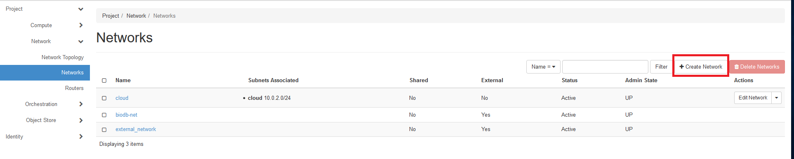
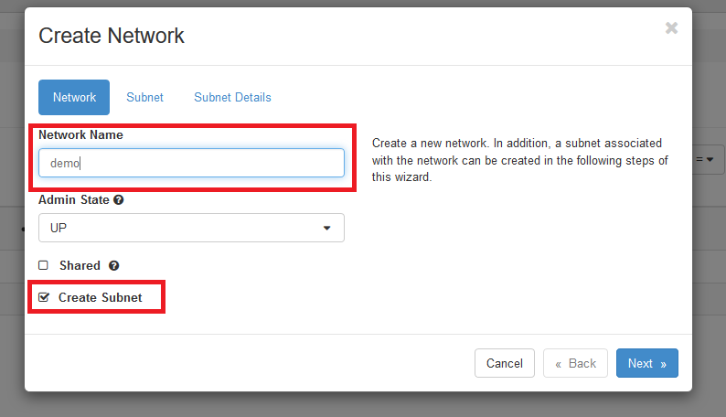
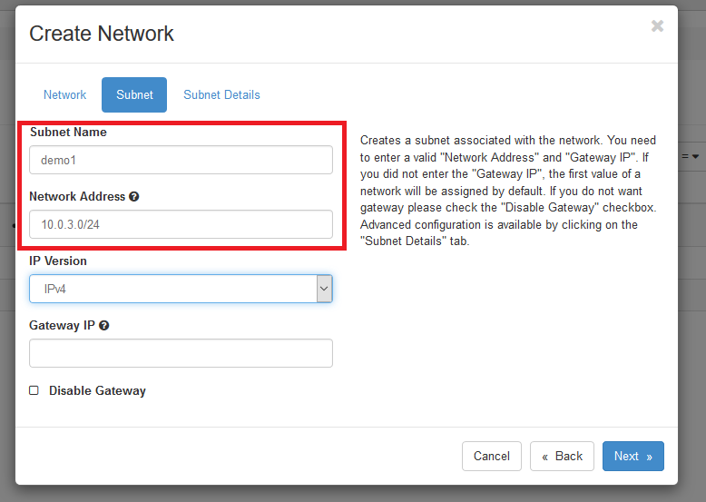

## Networking

### Introduction

Openstacks networking component is called Neutron. During the first steps of the quickstart guide it is shown how to build up a network using a single VM. This section will give some brief background information on Openstack networking as well as some suggestions regarding the Openstack installation in de.NBI cloud sites. Some of the details described in the following are shortened for the purpose of simplicity and better understanding. If you want and or need to get a deep understanding of Openstack networking please refer to the official documentation.
[This tutorial](http://superuser.openstack.org/articles/everything-you-need-to-know-to-get-started-with-neutron-f90e2797-26b7-4d1c-84d8-effef03f11d2/) gives a short introduction to Openstack networking based on a generic Openstack installation using the command line client. In the following section of these parts are replicated using the horizon dashboard.

!!! note "Note" 
	 This section is based on the Openstack Newton release. There are some minor differences in later versions (Ocata and beyond), see cloud site specific pages that case.

### Connecting VMs

To connect VMs to each other a network is reqiured. To create such a network in Openstack it is necessary to first create a network and then associate a subnet with that network. The network acts like a VLAN whilst the subnet contains a block of IP adresses along with a certain configuration (e.g. DHCP settings).
To connect VMs to each other a network has to be created and associated with a subnet. To create a new network go to `Project -> Network -> Networks` and click on `Create Network`.

Enter some name for the network and click `next`. In the next form the subnet associated with the network is created. The following parts of the form have to be filled to create a basic subnet:

*  Subnet Name: Name of the subnet

*  Network Address: Adress space of the subnet in [CIDR](https://de.wikipedia.org/wiki/Classless_Inter-Domain_Routing) notation
The other options can be left on default.
Some words on the CIDR notation:
The CIDR notation defines a certain adress space inside the IPv4 space. Usually an IP block from a private IP subnet is used. In our case we will use the 10.2.0.0/16 net. This means that the IP addresses range from 10.2.0.1 to 10.2.0.254.

After clicking next some details of the subnet can be configured:

*  Enable DHCP: Assign IPs to host using DHCP *(recommended )*

*  Allocation Pools: Pool of IP adresses that can be used (for example 10.0.2.100, 10.0.2.150 means that only adresses ranging from 10.0.2.100 to 10.0.2.150 are used).

*  DNS Name Servers: DNS server for the specific subnet. Can be used to make machines accessible by using DNS instead of IP. *(recommended )*

*  Host Routes: Routes to other IP subnets.

Usually none of these settings are relevant for a basic network configuration.
After clicking on create the network is ready for use.
If you want to connect a running VM to a network go to `Project -> Compute -> Instances`. In the row the VM that should be connected to the network click on the arrow in the leftmost column and select "Attach Interface". In the following form select the network you want to connect to the network and click `Attach Interface`. The VM is now connected to a VM.
It is also possible to connect a VM to a network on startup. In the Instances section click on `Launch Instance`. In the Networks form select the network using the `+` button. One network is usually selected by default.
If you connect multiple machines to the same network they are connected to each other and can be accessed using their IP Adresses that are displayed in the Instances section in the IP Address Column from each other.
Although they are internally connected they can not see other networks. This includes other networks in the cloud as well as networks outside of the cloud like the internet.
It is also not possible to access any of the VMs from outside their own network.

### Connecting VMs in different networks

To access VMs in seperate networks a router is needed.
Routers are used to connect networks to each other so VMs in one network can access machines in the other network. To create a router go to `Project -> Network -> Routers` and click on Create Router in the upper right corner. The following form as three fields:

*  Router Name: Name of the router

*  Admin State: Whether the network is up and forwarding packets

*  External Network: External network connected with the router
The relevant fields are `Router name` which can be chosen freely and `External Network` which is the external network connected to the Router. External Network can be left free if no external network should be used. Please mind that an external network is needed to access adresses outside the networks connected to the router like the internet. 

!!! note "Note" 
	 See the cloud site specific pages to get more informations about available external networks.

### Floating IPs

Floating IPs are used to make VMs publicly accessible from other networks, for example the internet. Floating IPs come from external networks. As described there are two external networks currently available in the cloud. The external_network and the biodb-net. To make a VM accessible from the Internet it is necessry to allocate a floating IP from the external_network. The problem in most cloud sites is  that the number of available public IPs is very limited which means that each project is only allowed to allocate a single one. In well founded circumstances it is possible to get another IP. 

There are some possibilities to access several VMs through one IP address.

- Jump Host : Use one VM as jump host. That VM has the credentials to ssh into all the other VMs.

- Gateway : Another possibility to use one floating IP for several instances is to setup a gateway. See [UserData tutorial](/Tutorials/UserData) for detailed description how to achieve this.

- VPN : Advanced users can setup a VPN (e.g. using [OpenVPN](https://openvpn.net)) to access cloud instances directly.
