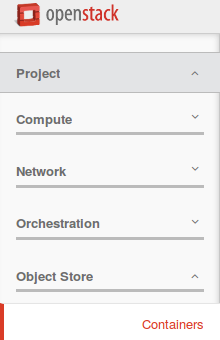
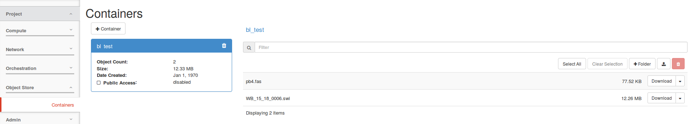
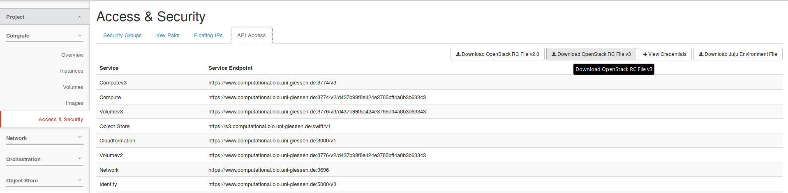

## S3/Swift object storage in the de.NBI Cloud

### Introduction

Object storage is a type of storage to store and share data in cloud environments. An object consists of a unique name, the actual data and associated metadata (like access restrictions and user defined metadata). Contrary to filesystems objects are not organised in a hierarchy, but in a flat container. The data is accessed via http based protocols/APIs (application programming interfaces), like s3 and swift.

Object stores have a higher abstraction from the underlying hardware than filesystems, enabling for more flexibility on the administration side, e.g. distribution of data, replication of data and transparent storage capacity extension.

Users benefit from the ubiquitous availability of the storage service. The data can be accessed and written from anywhere, as long a the user has the appropriate access/write permissions. These permissions can be controlled via access control lists by the container owners. With the concept of large objects, object have no size limitations. A caveat on object stores is the possible higher network latency between the storage servers and the client machines.

See also: [Introduction to object storage by Rackspace](http://blog.rackspace.com/introduction-to-object-storage)

### Object storage access 

The object storage in the de.NBI cloud can be accessed either via the S3-API or the Swift-API. These APIs differ in their terminology, capabilities and respective tools: Objects are stored in containers (swift) or buckets (s3). Access is controlled via access control lists (s3 and swift) or via policies (only s3).

The s3 and swift APIs in the de.NBI cloud is based on radosgw, a part of the ceph object store. For further details on this implementation see http://docs.ceph.com/docs/luminous/radosgw/ .

Both APIs have command line clients as well as graphical user interfaces.

URL of s3/swift server: [https://s3.computational.bio.uni-giessen.de](https://s3.computational.bio.uni-giessen.de).

### Access via website

The OpenStack dashboard provides an easy way to manage the object storage in the side menu:



By clicking on **Containers**, the object storage buckets available to the current project are displayed:



This basic interface allows the definition of containers and upload/download of files.

### Access via s3

S3 offers a lot of functionality and a very fine grained authorization model (see [ Amazon's description of the S3 API](http://docs.aws.amazon.com/AmazonS3/latest/API/Welcome.html)). The functionality in the OpenStack dashboard offers only the bare minimum to handle buckets and files. The same is also true for the Swift API, which is not explained on this site.

In all standard use cases, ** a bucket should be created via the OpenStack dashboard**. This assign the bucket to the OpenStack project, and will grant all project user's access to the bucket. Bucket for individual users or use cases are possible, but require a different way to create access credentials. Contact the de.NBI cloud team in Giessen if you need such a bucket.

#### Retrieving access credentials

Access to the S3 API requires credentials acceptable for the radosgw instance. The instance is linked to keystone and it able to authenticate users based on credentials generated by OpenStack. These credentials are bound to a project, so different projects require different credentials.

Unfortunately the OpenStack dashboard does not provide access to the necessary credentials, so the command line has to be used:


*  Create a OpenStack v3 RC file



Project -> Compute -> Access & Security -> API Access -> Download OpenStack RC File v3


*  Source the downloaded file in a terminal session on a desktop machine or lummerland. This will prompt for your password and set a number of environment variable.

*  You can list all your S3 access keys using 

```bash
openstack --os-identity-api-version 3 ec2 credentials list
```    


*  To create new credentials, use

```bash
openstack --os-identity-api-version 3 ec2 credentials create
```    

*  The ''access'' and ''secret'' values are the credentials for accessing the S3 buckets of the project.

#### Configuration of S3 clients

Using the ''s3cmd'' command line utility, this section demonstrates how to access the BCF S3 object storage. The setup should be similar for other tools, libraries or applications.


*  Invoke ''s3cmd --configure'' to start the interactive configuration dialog
*  Enter the access and secret key
*  Do not change the default region
*  Setup encryption if necessary, or press enter to skip it
*  Use HTTPS protocol (S3 at BCF is **NOT** available via HTTP)
*  Enter proxy details if necessary
*  Skip test access since s3cmd contacts the amazon servers by default
*  Save settings
*  Edit the generated configuration and change the ''host_base'' value to ''s3.computational.bio.uni-giessen.de''
*  Change ''host_bucket'' value to ''%(bucket).s3.computational.bio.uni-giessen.de''
*  Test the configuration, e.g. by invoking ''s3cmd ls'' to list all buckets. The output should print one line containing ''s3://`<bucket name>`'' for all buckets in the project

If you need access to different project, you can create multiple configuration files with s3cmd.

### Limitations of Ceph RadosGW

Certain aspects of S3 are not supported yet in Ceph, including:

*  S3 based web sites


### For programmer

#### Java

The official ceph doku for the aws sdk java library is outdated and results in an error. Please use the builder component of AmazonS3Client class.
An example can be found here:

```java
    AWSCredentials credentials = new BasicAWSCredentials(this.executorS3Key, this.executorS3Secret);
    ClientConfiguration clientConfiguration = new ClientConfiguration();
    AwsClientBuilder.EndpointConfiguration regionOne = new AmazonS3Builder.EndpointConfiguration("s3.computational.bio.uni-giessen.de", "RegionOne");
    
    AmazonS3 amazonS3 = AmazonS3Client.builder().withCredentials(new AWSStaticCredentialsProvider(credentials)).withRegion("RegionOne").withEndpointConfiguration(regionOne).build();
    for(Bucket bucket : amazonS3.listBuckets()) {
            System.out.println(bucket.getName());
    }
```        

### Access via swift

The de.NBI object storage can be accessed through the swift API with the swift commandline tool. Therefore you need a cloud project, the swiftclient and an openstack rc file (see Setup of swift tool).

#### Setup of swift tool


*  Install python3-swiftclient (Ubuntu)
*  Obtain an openstack rc file: Cloud Webinterface -> login -> Compute -> Access & Security -> Tab "API Access" -> Button "DOWNLOAD OPENSTACK RC FILE V3"
*  On the commandline: 

```bash
source `<youropenstackrc>`
```    

*  Enter your password when asked
*  Check if everything worked with

```bash
swift list
```    
 
*  If everthing is okay you will either see your containers (if you have some) or you will see nothing. Otherwise you will see an error message

#### Create container

```bash
swift post `<containername>`
```

#### Upload file

```bash
# for small files
swift upload `<container>` `<file>`
```    

```bash
# for large files >=5GB
swift upload -S `<chunksize in bytes max 5GB>` `<container>` `<file>` 
```

#### Download file

```bash
swift download `<container>` `<file>`
```

#### Remove file

```bash
swift delete `<container>` `<file>`
```

#### Remove container

```bash
swift delete `<container>`
```

