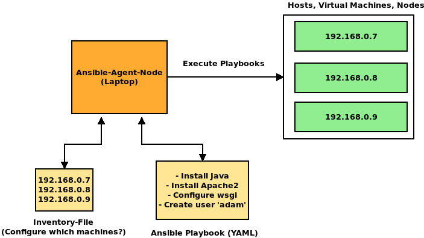

# Ansible Tutorial

### Quick Introduction
[Ansible](https://www.ansible.com) is an open source application for orchestrating, deploying and automation of multiple hosts, VMs or cloud instances.
For this, it uses a simple instruction language ([YAML](http://yaml.org)) and basic tools like SSH.
Ansible itself does not need to be installed on the targeted hosts. Only one "Ansible-agent" with allowed SSH-connection to all hosts is required.

### Requirements
For the targeted hosts:

* Python 2 or Python 3 is installed.
* Hosts can be reached passwordless via SSH and SSH-Keys.
* Thats it!

### Installing the Ansible Agent
Installing the Agent is very simple since packages are available for many common Linux distributions.
If you are using a Debian based system (Debian, Ubuntu, Mint) simply install it via Aptitude:


```
sudo apt-get install ansible
```

For RHEL-based Systems, issue the following commands:
```
sudo rpm -i epel-release-latest-7.noarch.rpm
sudo yum update
sudo yum install ansible
```
Probably the most universal method for installing Ansible, is using the python module manager pip.
While having pip installed on your System, you could simply install it with:
```
pip install ansible
```

  
 You can check if everything is set-up by typing ``ansible --version`` in your command line. You should see an output similar like this:
 ```
 ansible 2.5.1
  config file = /etc/ansible/ansible.cfg
  configured module search path = [u'/home/awalende/.ansible/plugins/modules', u'/usr/share/ansible/plugins/modules']
  ansible python module location = /usr/lib/python2.7/dist-packages/ansible
  executable location = /usr/bin/ansible
  python version = 2.7.15rc1 (default, Apr 15 2018, 21:51:34) [GCC 7.3.0]
 ```
 
 ### Ansible Overview
 In short terms, Ansible is simply connecting to targeted Hosts via SSH for executing remote tasks on them.
 
 
   
 Ansible needs two main components for executing tasks:
 
 * An inventory host-file, which lists all target hosts via IP (or hostname) in user described groups.
 * A playbook-yaml file, which describes all tasks that will be executed on the targeted hosts.
 
We take a quick look on those two important components.

#### Inventory
 
 A standard inventory file is located in ``/etc/ansible/hosts``. It is usually loaded by Ansible when no other inventory file is passed to it.
 An example of an inventory can look like this:

  
```
[web]
192.168.10.12
192.168.10.13
192.168.10.14
  
[cassandra_db]
192.168.10.27
192.168.10.28
192.168.10.29
```
  
 In this example, we have two groups: web and cassandra_db.
 These groups have each 3 different Hosts assigned by their IP-Address.
 
#### Playbooks
A playbook is a text-file in YAML-Syntax, which describes a list of tasks to be executed on targeted groups. Let's look on an example
which installs various software packages on our two groups: web and cassandra_db.
```
- hosts: web
  become: true
  tasks:
    - name: Install the Apache 2 Webserver.
      apt:
        name: apache2
        state: present
      
    - name: Restart the Apache 2 webservice.
      systemd:
        name: apache2
        state: restarted
        
- hosts: cassandra_db
  become: true
  tasks:
    - name: Install MySQL
      apt:
        name: mariadb-server
        state: present
```
What is happening in this playbook?

* This playbook targets our two host-groups. This means that the following tasks are being executed on all hosts which are described in the inventory file.
* The `become: true` field is signaling, that the following tasks are being executed as the root user on the target host.
* Most important in this example is the task list described with `tasks:`.

Each task has two mandatory fields:
* A name, for making playbooks more readable.
* An Ansible module, which defines the actual task.

In this example, the `apt` and `systemd` modules were used. On the first group, we install an Apache-Webserver with apt und restart the corresponding service with the systemd-module.
  
Ansible provides a bunch of modules for nearly everything. It ranges from installing software with a package manager to modifying MySQL permissions.
Luckily, there is a well documented description of all Ansible modules with a rich variety of examples.
You can view the module index [here](https://docs.ansible.com/ansible/2.9/modules/modules_by_category.html).

### Getting started with Ansible!

For testing purposes, we try to use some "ad-hoc" Ansible-Modules on some hosts.
##### Using Ansible-Environment with BibiGrid
For this section you will need one (or multiple) available Hosts you can SSH into. If you are setting up a cluster with
[BibiGrid](https://cloud.denbi.de/wiki/Tutorials/BiBiGrid/), then you have everything ready set up on your master node.
There is even no need for you to write an inventory file since it is also inlcuded on the master node on
`/home/ubuntu/playbook/ansible_hosts`.

##### Using on local system
If you want to try some Ansible commands on your local machine (i.e Laptop or a single VM), you can add your own machine
in a new inventory file:
```
echo [myself] >> hosts
echo localhost >> hosts
```
You will need to have an SSH-Daemon running on your local system and add your own ssh-key to your authorized-keys file.
You can create and add an ssh-key with these steps:
```
1. ssh-keygen -t rsa
Press enter for each line 
2. cat ~/.ssh/id_rsa.pub >> ~/.ssh/authorized_keys
3. chmod og-wx ~/.ssh/authorized_keys 
```

#### Quick Test
Let's run a quick ping check on all our hosts with ansible. For this task type in:
```
ansible all -i hosts -m ping
```
What are we doing here?

* `all` declares, that we want to let ansible target all available hosts described in the hosts file.
* `-i hosts` tells ansible, which inventory file we would like to use. In this case a file called hosts.
* `-m ping` tells ansible, that we want to use the ping module, which simply asks the hosts if they are available.

If everything works correctly, you should get an output like this one:
```
192.168.20.11 | SUCCESS => {
    "changed": false, 
    "ping": "pong"
}
```

Let's try a more interesting command:
```
ansible all -i hosts -m shell -a "df -h"
```
In this call, we use the shell module followed by the -a argument with a shell command.
Ansible now executes on all available hosts the disk-free command, which will report us the free available harddisk
space on all hosts at the same time:
```
192.168.20.11 | SUCCESS | rc=0 >>
Filesystem               Size  Used Avail Use% Mounted on
udev                     7.9G     0  7.9G   0% /dev
tmpfs                    1.6G  8.8M  1.6G   1% /run
/dev/vda1                 20G  1.9G   18G  10% /

192.168.20.16 | SUCCESS | rc=0 >>
Filesystem               Size  Used Avail Use% Mounted on
udev                     7.9G     0  7.9G   0% /dev
tmpfs                    1.6G  8.7M  1.6G   1% /run
/dev/vda1                 20G  1.9G   18G  10% /
```
  
Imagine you have a bigger cluster and you want to add some software on ALL nodes via the Ubuntu package manager (apt).
Instead of doing it manually on every node, you could simply ask ansible to do it for you automatically:
```
ansible all -b -i hosts -m apt -a "name=ipython state=present"
```
(the additional `-b` flag tells ansible to execute this command as root user, since apt needs root access).

### Combining multiple commands with playbooks

Instead of typing in every ansible task as individual commands, you can bundle them into a single file.
This bundle is called "playbook". As mentioned above in the Overview-Section, it is written in a YAML-Style
file. Lets see how our last 2 calls would look like in a playbook:
```
- hosts: all
  become: yes
  tasks:
    - name: Show us the free disk space.
      shell: "df -h"
      
    - name: Install ipython
      apt:
        name: ipython
        state: present
```
Executing a playbook is as simple as running the above ansible calls:
```
ansible-playbook -i hosts myPlaybook.yml
```
It is recommended to gather your tasks in a playbook, rather then making seperate ansible "ad-hoc" calls,
since playbooks allow an ordered view of all tasks. Also it is easier to read than bash scripts ;)

You can learn more about [Ansible Playbooks here](https://docs.ansible.com/ansible/latest/user_guide/playbooks.html).


### Combining Roles and Playbooks

Sometimes it is not very practical to write every task you want to execute into a single big playbook file.
Especially if you are setting up multiple seperate entities like a webserver, database and storage system.
Maybe you want to seperate those entities in different parts.
For this desire, Ansible provides Roles.
A role has a distinct directory structure containing multiple folders:


```
Ansible/
+- play.yml
+- roles
   +- nginx
      +- files
      |  |- index.html
      |  |- index.php
      +- handlers  
      |  |- main.yml
      +- meta
      +- tasks
      |  |- main.yml
      +- templates
      +- vars		   	
```
  
This example "nginx" role has the following directorys included:

* files: Here are static files located which are copied over to the target host.
* handlers: This folder contains playbook-tasks, which are executed after all other tasks have been finished.
* meta: Needed for Ansible Galaxy (see below) which contains meta informations about this role.
* tasks: Here are all playbooks located, which are containing regular tasks.
* templates: Mostly used for templated config files, which are generated/filled during runtime with jinja2 templating.
* vars: Containes variables, which can be used in templates.

Roles can be quite complex at first in terms of functionality, but they help seperating tasks into reusable roles.
For more information on roles, see the [docs](https://docs.ansible.com/ansible/latest/user_guide/playbooks_reuse_roles.html).

Including roles into a playbook is very simple. For this, make sure that your playbook file is on the same directory level
as the role directory (which includes all roles), similar like in the picture above.
In your playbook, simply add a list of all roles you want to include with the *role* key:
```
- hosts: all
  become: yes
  roles:
    - role1
    - role2
    - rolexyz
``` 

### Ansible-Galaxy, the GitHub of Ansible Roles
Keeping tasks compact in a role also has an amazing positive effect: sharing!
  
With [Ansible-Galaxy](https://galaxy.ansible.com), everyone can upload and download roles which are publicly available
online. Also, Ansible-Galaxy is included as a command-line-tool with every ansible installation. With this tool, you can
create, search, list and download roles.
Installing new roles is very simple:
```
ansible-galaxy install anxs.nodejs
```
After installation, you can simply include this role in every playbook you want.
  
Hint: Ansible Galaxy usually downloads roles in a hidden folder in your home directory (~/.ansible/roles or /etc/ansible/roles).
Ansible searches these paths automatically when you include a role into a playbook.
