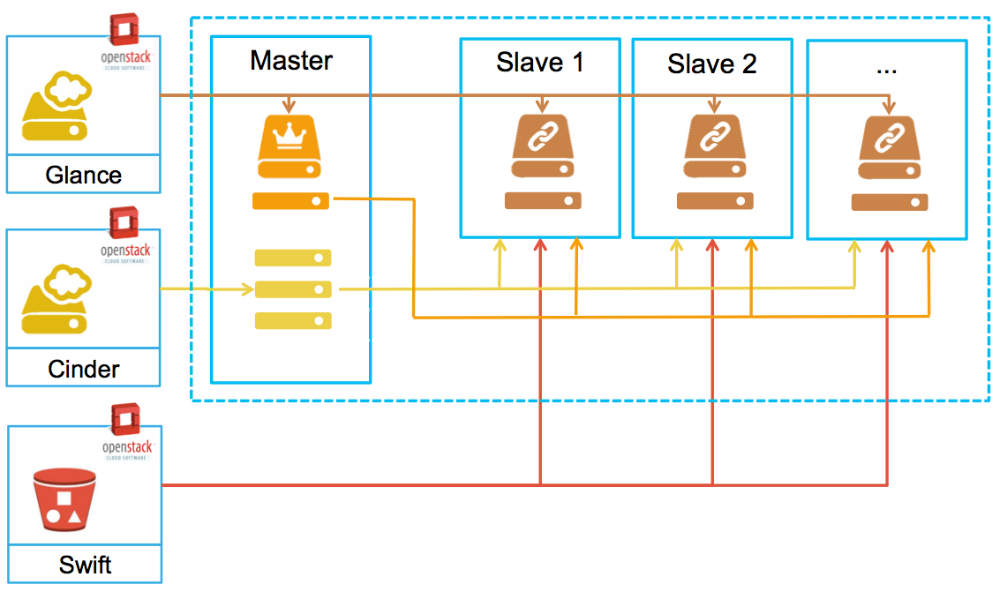

#  BiBiGrid tutorial 

### Prerequisites

- Java 8/9
- Openstack API access
- git & maven 3.3 (or better) to build bibigrid from sources

## Build from sources

- Clone GitHub repository: `git clone https://github.com/BiBiServ/bibigrid.git`
- Change into project dir: `cd bibigrid`
- Build Java executable for Openstack `mvn -P openstack clean package`
- Call `java -jar bibigrid-main/target/bibigrid-openstack-2.0.jar -h` to get help messages and check if executable works


## Download Binary

If you don't want build the client from sources you can use a prebuilt binary ([BiBiGrid Openstack Java executable](http://bibiserv.cebitec.uni-bielefeld.de/resources/bibigrid/bibigrid-openstack-2.0.jar))


# Getting started

*Check the [GitHub repository](https://github.com/BiBiServ/bibigrid/tree/development) for detailed information about BiBiGrid.* 

BiBiGrid is an open source tool hosted at github  for an easy cluster setup inside a cloud environment. BiBigrid is operating system  and cloud provider independend, there exist currently backend implementations for Amazon (AWS), Google (Google Compute), Microsoft (Azure) and Openstack. It provides a HPC like environment providing a shared FS between all nodes and Grid Batch Scheduler.

### BiBiGrid configures a classic master / slaves cluster.




1. One master and one or more slave nodes. The used images could be blank Ubuntu 16.04 images or could come with preinstalled software. BiBiGrid uses [Ansible](https://www.ansible.com) to install and configure the instances.
2. All instances run in the same security group with default ssh access. Additional ports could be easily configured. 
3. Local disk space of the master node is provided as a shared spool disk (/vol/spool) space between master and all slaves. Local storage of the slaves is configured as temporary scratch space.
4. Volumes provided by Cinder can be mounted to the master node and optionally distributed to all slaves (as NFS shares).
5. Object Store is available to all nodes


## Configuration

The goal of this session is to setup a small HPC cluster consisting of 4 nodes  (1 master, 3 slaves) using BiBiGrid. The template below does the job, you have to replace all XXX's with your environment.

### Template

```
#use openstack
mode: openstack

openstackCredentials:
  username: XXX
  tenantName: XXX
  domain: elixir
  tenantDomain: elixir
  endpoint: https://openstack.cebitec.uni-bielefeld.de:5000/v3/
  password: XXX


#Access
identityFile: XXX
sshUser: ubuntu
keypair: XXX
region: Bielefeld
availabilityZone: default

#Network
subnet: XXX

#BiBiGrid-Master
masterInstance:
  type: unibi.micro
  image: febceb9a-fb0f-4f1c-ad06-8caf6340de64

#BiBiGrid-Slave
slaveInstances:
  - type: unibi.micro
    count: 4
    image: febceb9a-fb0f-4f1c-ad06-8caf6340de64

#Firewall/Security Group
ports:
  - type: TCP
    number: 80

#services
nfs: yes
oge: yes
cloud9: yes

```

*The openstack credentials requires the **name** not the **id**.*

*The image is referenced as **id** not by **name**.*


You can simply check your configuration using :

`java -jar bibigrid-openstack-2.0.jar -ch -o bibigrid.yml`

## Start the Cluster

`java -jar bibigrid-openstack-2.0.jar -c -o bibigrid.yml`

or more verbose:

`java -jar bibigrid-openstack-2.0.jar -c -v -o bibigrid.yml`

Starting with blank Ubuntu 16.04 images takes up to 20 minutes to finish.
Using preinstalled images is much faster (about 5 minutes).


## Good to know

- `/vol/spool` -> shared filesystem between all nodes.
- `/vol/scratch` -> local diskspace (ephemeral disk, if provided)


## Login into the Cluster

After a successful setup you can login into the master node. Run `qhost` 
to check if there are 4 execution nodes available.


### Cloud9

Cloud9 is Web IDE that allows a more comfortable way to work with your cloud instances. Although cloud9 is an alpha state, it is stable enough to use for an environment like ours. Let's see how this works together with BiBiGrid. 
For security reasons cloud9 is not started during startup. We need a valid certificate and some kind of authentication to create a safe connection, which is not that easy in a dynamic cloud environment. 

However, we use ssh to tunnel the default cloud9 port (8181)  to our local machine and start cloud9 listening only on localhost.


1. create ssh tunnel : `ssh -L 8181:localhost:8181 129.70.51.20`.

2. start cloud9 listening at localhost and using `~/playbook` as workspace: `cloud9 --listen localhost -w ~/playbook`

3. cloud9 IDE is then available at `http://localhost:8181`

4. at first start, cloud9 needs to install some additional software, follow the on-screen instructions


## Hello World BiBiGrid!

After successful starting a cluster in the cloud, start with a typically  example : *Hello World !*

- Login into master and change to the spooldir 
`cd /vol/spool`
- Create a new shell script `helloworld.sh` containing a "hello world" :

```
#!/bin/bash
echo Hello from $(hostname) !
sleep 10
```

- Submit this script to each node: ` qsub -cwd -t 1-4 -pe multislot 2 helloworld.sh`
- See the status of our cluster: `qhost`
- See the output: `cat helloworld.sh.o.*`

## List running cluster

Since it is possible to start more than cluster at once, it possible to list all running clusters: 

`java -jar bibigrid-openstack-2.0.jar -l`

The command returns a informative list about your running clusters.

## Terminate a cluster

Terminating a running cluster is quite simple :

`java -jar bibigrid-openstack-2.0.jar -t <clusterid>`


