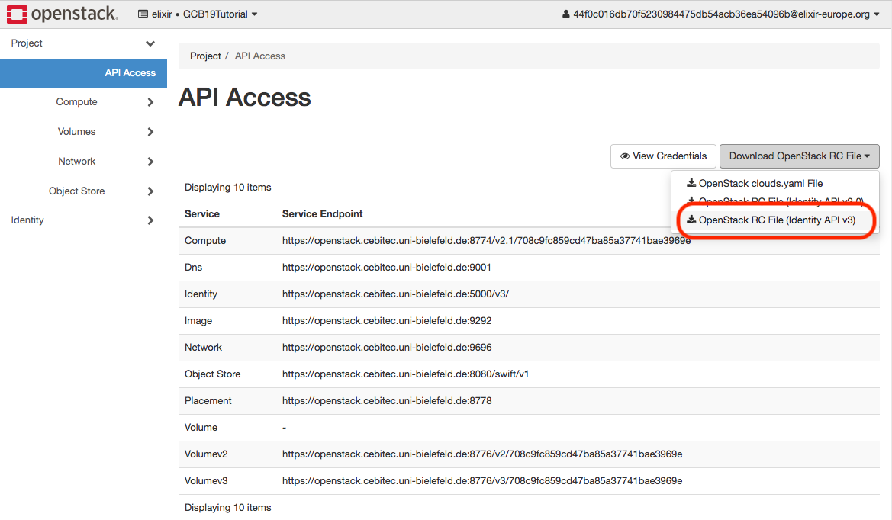
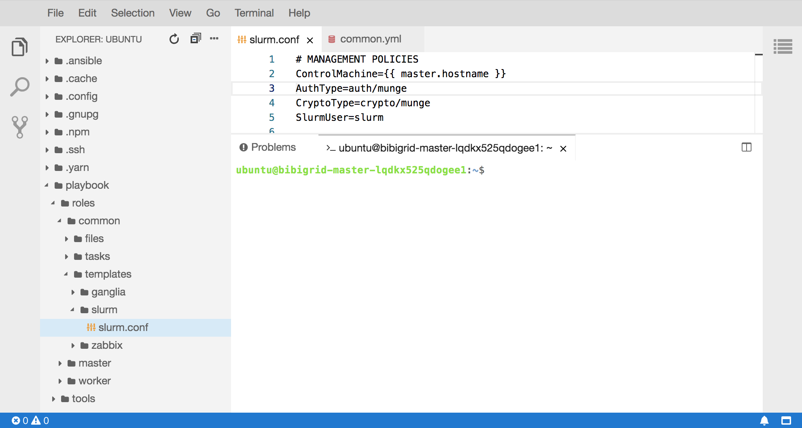

#  BiBiGrid tutorial 

### Prerequisites


- Java 8+ (required)
- Openstack API access (required)
- Openstack CLI installed (recommend)
- git & maven 3.3+ (required to build from sources)


## Build from sources

- Clone GitHub repository: `git clone https://github.com/BiBiServ/bibigrid.git`
- Change into project dir: `cd bibigrid`
- Build Java executable for Openstack `mvn -P openstack clean package`
- Call `java -jar bibigrid-main/target/bibigrid-openstack-<version>.jar -h` to get help messages and check if executable works


## Download Binary


If you don't want to build the client from sources you can [download a prebuilt binary](http://bibiserv.cebitec.uni-bielefeld.de/resources/bibigrid). It is always recommend to choose the latest one.


# Getting started

*Check the [GitHub repository](https://github.com/BiBiServ/bibigrid) for detailed information about BiBiGrid.* 

BiBiGrid is an open source tool hosted at github for an easy cluster setup inside a cloud environment. BiBigrid is operating system and cloud provider independent, currently there are existing backend implementations for Amazon (AWS), Google (Google Compute), Microsoft (Azure) and OpenStack. It provides a HPC like environment, providing a shared filesystem between all nodes, a Grid Batch Scheduler(SLURM, OGE) and a monitoring system (Zabbix, Ganglia)

### BiBiGrid configures a classic master / worker cluster.


1. One master and one (or more) worker nodes. The used images could be blank Ubuntu LTS (16.04/18.04) or Debian (9/10) cloud images or could come with pre-installed software. BiBiGrid uses [Openstack4J]() to setup the virtual hardware  and [Ansible](https://www.ansible.com) to install and configure all instances.
2. All instances run in the same security group with default ssh access. Additional ports can easily be configured. 
3. Local disk space of the master node is provided as a shared spool-disk space (`/vol/spool`) between master and all workers. Local storage of the worker is configured as temporary scratch space.
4. Volumes provided by Cinder can be mounted to the master node and optionally distributed to all workers (as NFS shares).
5. Object Store is available to all nodes.


## Configuration

The goal of this session is to setup a small HPC cluster consisting of 3 nodes  (1 master, 2 workers) with basic service on top of Ubuntu 18.04 using BiBiGrid. 
Basic Services means BiBiGrid provides a shared file system between all nodes and setup a Slurm cluster. For easy access we also install Theia (a Web-IDE).

This tutorial targets users running BiBigrid on the de.NBI cloud. Depending on the cloud site (Berlin, Bielefeld, DKFZ, Giessen, Heidelberg or Tübingen) the usage of BiBiGrid differs a bit.


#### Java Opts

The cloud sites Berlin, DKFZ and Heidelberg have some restrictions accessing their openstack API and also running instances. All traffic must be tunneled through a socks proxy. See cloud-site specific informations in de.NBI cloud wiki on how to set up a socks proxy on your system. The REST API BiBiGrid uses, for communication with OpenStack, also a socks proxy. If your socks proxy is configured to run on localhost port 7777, you have to call java with some additional options as follows:

```
export JAVA_OPTS="-DsocksProxyHost=localhost -DsocksProxyPort=7777 -DproxySet=true"

java ${JAVA_OPTS} -jar bibigrid ...
```


#### Template

Use the [template](resources/bibigrid.yml) as base for a BiBiGrid configuration. You can use the openstack cli or access openstack dashboard to fetch the necessary informations from your cloud site/project.


### Credentials
The credentials are stored in separated file and linked 
from the general configuration. 

```
credentialsFile: /path/to/your/credentials.yml
```


#### credentials.yml
Download a [template](resources/credentials.yml) as base for your own credentials file.  The necessary informations are available via Openstack Dashboard (left side menu -> Project -> API access).



The *endpoint* needed is the identity API endpoint, which is used to ask Openstack for all other public API endpoints. BiBigrid uses Version 3 of the API, you have to add the suffix `/v3` to identity API endpoint, e.g.

`
https://cloud.denbi.dkfz.de:13000/v3
`

  The *domain* and *tentantdomain* values are for de.NBI projects normally the same  and is for all cloud sites 'elixir'. Make sure that the credentials file can only be read by yourself (especially in a multi user environment).


### Access
If not already done, you have to create an ssh key pair, upload your public key to Openstack and give it a name. BiBiGrid supports password protected keys using an ssh agent.

```
sshPrivateKeyFile: path/to/private/key
sshPublicKeyFile: path/to/public/key
keypair : name_of_the_uploaded_keypair
``` 
You have to give the *full path* to your private and public key here. The keypair value is the name of the uploaded public key.

#### ssh-user

The ssh-user depends on the cloud image your cluster is based on. Since we run on top of Ubuntu 18.04 the ssh-user is *ubuntu*.

#### region

The region is can be determined easily by running the openstack cli.

```
$ openstack region list
```

#### availabilityZone

The availability zone where your instances are created.

```
$ openstack availability zone list
```

### Network
If you have the permissions to create networks, BiBiGrid offers the possibility to  create a new private network connected to an existing router. For our tutorial we work on an existing *subnet*. Determine the subnet name or id using the cli.


```
$ openstack subnet list
```

Depending on the de.NBI cloud site we have to enable the *localDNSLookup* feature. Some cloud sites do not offer a full DNS service for instances, BiBiGrid can start this
This currently the case in Berlin, HD-DKFZ, HD-BioQuant and Tuebingen.

### Instances 

Get the id of the Ubuntu 18.04 image ...

```
$ openstack image list
```

... and add it to the master/worker configuration.


#### master

```
masterInstance:
  type: de.NBI default
  image: image_id_of_Ubuntu_18.04
```

Choose a flavor type for 

#### worker

```
workerInstances:
  - type: de.NBI tiny
    count: 2
    image: image_id_of_Ubuntu_18.04
```

Choose the number of worker nodes to be started. BiBiGrid supports to start different type workers in a single grid. It is not guaranted that everything works if mix up different image types in a single cluster. A list of usable flavors can be optained by openstack cli ...

```
$ openstack flavor list
```

### Services

As mentioned before our cluster is very basic. That means we have to enable a shared fs (*nfs*), a grid batch scheduler (*slurm*) and a web-ide (*theia*).
Theia is build from sources. This is a time consuming task, depending of your instance type and the real hardware behind it this takes some time.

Since our demo cluster is small we let the master also do some work (enable *useMasterAsCompute*).


### Verify your configuration.

You can simply check your configuration using :

`java -jar bibigrid-openstack-<version>.jar -ch -o bibigrid.yml`


## Start the Cluster

`java -jar bibigrid-openstack-<version>.jar -c -o bibigrid.yml`

or more verbose:

`java -jar bibigrid-openstack-<version>.jar -c -v -o bibigrid.yml`

or in debug mode:

`java -jar bibigrid-openstack-<version>.jar -c -v -d -o bibigrid.yml`

Starting with blank Ubuntu 18.04 images takes up to 20 minutes to finish, depending on the cloud performance and bibigrid configuration.


## Good to know

- `/vol/spool` -> shared filesystem between all nodes.
- `/vol/scratch` -> local diskspace (ephemeral disk, if provided)


## Login into the Cluster

After a successful setup ... 

```
SUCCESS: Master instance has been configured. 
Ok : 
 You might want to set the following environment variable:

export BIBIGRID_MASTER=XXX.XXX.XXX.XXX

You can then log on the master node with:

ssh -i /path/to/private/ssh-key ubuntu@$BIBIGRID_MASTER

The cluster id of your started cluster is: vnqtbvufr3uovci

You can easily terminate the cluster at any time with:
./bibigrid -t XXX 

```
... you can login into the master node. Run `sinfo` 
to check if there are 3 execution nodes available.

## List running Cluster

Since it is possible to start more than one cluster at once, it is possible to list all running clusters: 

`java -jar bibigrid-openstack-<version>.jar -o bibigrid.yml -l`

The command returns an informative list about all your running clusters.


## Web IDE (Theia)

[Theia](https://www.theia-ide.org/) is a Web-IDE that allows a more comfortable way to work with your cloud instances. Let's see how this works together with BiBiGrid. 



If the theia option is enabled in the configuration, theia will be run as systemd service on localhost. For security reasons, theia is not binding to a standard network device. A valid certificate and some kind of authentication is needed to create a safe connection, which is not that easy in a dynamic cloud environment. 


However, Bibigrid has the possibility to open a ssh tunnel from the local machine to bibigrids master instance and open up a browser window/tab running theia web ide. 

`java -jar bibigrid-openstack-<version>.jar -o bibigrid.yml --ide <clusterid>`


## Hello World, Hello BiBiGrid!

After successful starting a cluster in the cloud, start with a typical example : *Hello World !*

- Login into your master node and change to the spool directory. 
`cd /vol/spool`
- Create a new shell script `helloworld.sh` containing a "hello world" :

```
#!/bin/bash
echo Hello from $(hostname) !
sleep 10
```
- Make the script executable:

`chmod u+x helloworld.sh`

- Submit this script as array job 50 times : `sbatch --array=1-50 --job-name=helloworld hello-world.sh `
- See the status of our cluster: `squeue`
- See the output: `cat slurm-*.out`

## Terminate a cluster

Terminating a running cluster is quite simple :

`java -jar bibigrid-openstack-<version>.jar -o bibigrid.yml -t <clusterid>`


## Attaching a volume to a running cluster
If you have successfully run a cluster, you may want to attach a volume to an instance. 
See [Using Cinder Volumes](https://cloud.denbi.de/wiki/quickstart/#using-cinder-volumes) to get information about how to work with a volume.


## Share a volume between all nodes
After attaching a volume to the master, you might want to share it between all slave nodes. 
One way of sharing data between master and slaves in the BiBiGrid is the *spool* directory. 
Instead, you have the possibility to share the volume created before with the [Ansible](https://cloud.denbi.de/wiki/Tutorials/Ansible/) tool.
Ansible lets you automatically execute commands on several nodes in your cluster.

When you fulfilled the attaching of a volume to the master node (or any other node) you will see,
that the other nodes in your cluster don't have access to it, neither does the volume exist at all.

- Create mount points
- Mount NFS shares

Instead of letting Ansible execute every single command, you can simply create a playbook.

- Create shareVolume.yml
- Copy & Paste the following lines into the file - XXX has to be changed like in the tutorial above:
```
- hosts: slaves
  become: yes
  tasks:      
    - name: Create mount points
      file:
        path: "/vol/XXX"
        state: directory
        owner: root
        group: root
        mode: 0777
    
    - name: Mount shares
      mount:
        path: "/vol/XXX"
        src: "internal.master.ip:/vol/XXX"
        fstype: nfs4
        state: mounted
```
- Save the changes

Run the playbook: `ansible-playbook -i ansible_hosts shareVolume.yml`

To share a volume (or a file) one has to configure the `/etc/exports` file and add a line as follows: 

`/vol/XXX CIDR.of.subnet(rw,nohide,insecure,no_subtree_check,async)`

E.g.: `/vol/test 192.168.0.0/24(rw,nohide,insecure,no_subtree_check,async)`


