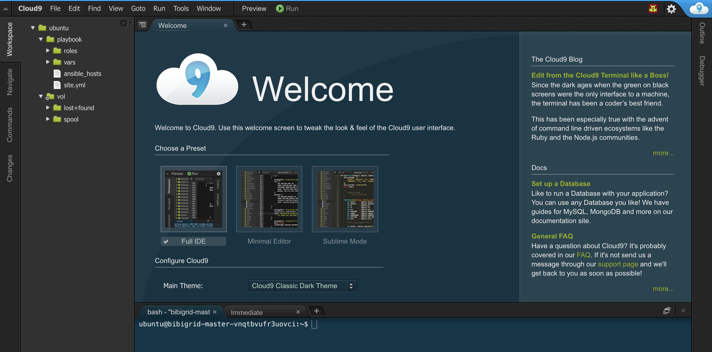

#  BiBiGrid tutorial 

### Prerequisites

- Java 8/9
- Openstack API access
- git & maven 3.3 (or better) to build bibigrid from sources

## Build from sources

- Clone GitHub repository: `git clone https://github.com/BiBiServ/bibigrid.git`
- Change into project dir: `cd bibigrid`
- Build Java executable for Openstack `mvn -P openstack clean package`
- Call `java -jar bibigrid-main/target/bibigrid-openstack-2.0.jar -h` to get help messages and check if executable works


## Download Binary

If you don't want to build the client from sources you can use a prebuilt binary ([BiBiGrid Openstack Java executable](http://bibiserv.cebitec.uni-bielefeld.de/resources/bibigrid/bibigrid-openstack-2.0.jar))


# Getting started

*Check the [GitHub repository](https://github.com/BiBiServ/bibigrid/tree/development) for detailed information about BiBiGrid.* 

BiBiGrid is an open source tool hosted at github for an easy cluster setup inside a cloud environment. BiBigrid is operating system and cloud provider independent, currently there are existing backend implementations for Amazon (AWS), Google (Google Compute), Microsoft (Azure) and OpenStack. It provides a HPC like environment, providing a shared filesystem between all nodes and a Grid Batch Scheduler.

### BiBiGrid configures a classic master / slaves cluster.


1. One master and one (or more) slave nodes. The used images could be blank Ubuntu 16.04 images or could come with pre-installed software. BiBiGrid uses [Ansible](https://www.ansible.com) to install and configure all instances.
2. All instances run in the same security group with default ssh access. Additional ports can easily be configured. 
3. Local disk space of the master node is provided as a shared spool-disk space (/vol/spool) between master and all slaves. Local storage of the slaves is configured as temporary scratch space.
4. Volumes provided by Cinder can be mounted to the master node and optionally distributed to all slaves (as NFS shares).
5. Object Store is available to all nodes.


## Configuration

The goal of this session is to setup a small HPC cluster consisting of 4 nodes  (1 master, 3 slaves) using BiBiGrid. The template below does the job, you have to replace all XXX's with your environment.

### Templates

**bibigrid.yml:**

```
#use openstack
mode: openstack

credentialsFile: /path/to/your/credentials.yml

#Access
sshPrivateKeyFile: path/to/private/key
sshPublicKeyFile: path/to/public/key
sshUser: ubuntu
keypair: XXX
region: Bielefeld
availabilityZone: default

#Network
subnet: XXX

#BiBiGrid-Master
masterInstance:
  type: de.NBI.medium+ephemeral
  #ubuntu 16.04
  image: c1ac4343-cc53-4827-a3bf-9fdde2a67c8c

#BiBiGrid-Slave
slaveInstances:
  - type: de.NBI.medium+ephemeral
    count: 3
    #ubuntu 16.04
    image: c1ac4343-cc53-4827-a3bf-9fdde2a67c8c

#Firewall/Security Group
ports:
  - type: TCP
    number: 80

#services
useMasterAsCompute: yes
nfs: yes
oge: yes
cloud9: yes

```

**credentials.yml:**

```
tenantName: XXX
username: ELIXIRID@elixir-europe.org
password: PASSWORD
endpoint: https://openstack.cebitec.uni-bielefeld.de:5000/v3/
domain: elixir
tenantDomain: elixir
```

*The openstack credentials requires the **name** not the **id** .*

*The image is referenced as **id** not by **name**.*


You can simply check your configuration using :

`java -jar bibigrid-openstack-2.0.jar -ch -o bibigrid.yml`

## Start the Cluster

`java -jar bibigrid-openstack-2.0.jar -c -o bibigrid.yml`

or more verbose:

`java -jar bibigrid-openstack-2.0.jar -c -v -o bibigrid.yml`

Starting with blank Ubuntu 16.04 images takes up to 20 minutes to finish.
Using pre-installed images is much faster (about 5 minutes).


## Good to know

- `/vol/spool` -> shared filesystem between all nodes.
- `/vol/scratch` -> local diskspace (ephemeral disk, if provided)


## Login into the Cluster

After a successful setup ... 

```
SUCCESS: Master instance has been configured. 
Ok : 
 You might want to set the following environment variable:

export BIBIGRID_MASTER=XXX.XXX.XXX.XXX

You can then log on the master node with:

ssh -i /path/to/private/ssh-key ubuntu@$BIBIGRID_MASTER

The cluster id of your started cluster is: vnqtbvufr3uovci

You can easily terminate the cluster at any time with:
./bibigrid -t XXX 

```
you can login into the master node. Run `qhost` 
to check if there are 4 execution nodes available.

## List running Cluster

Since it is possible to start more than one cluster at once, it is possible to list all running clusters: 

`java -jar bibigrid-openstack-2.0.jar -l`

The command returns an informative list about all your running clusters.


### Cloud9

[Cloud9](https://github.com/c9/core) is a Web-IDE that allows a more comfortable way to work with your cloud instances. Although cloud9 is in an alpha state, it is stable enough to be used for an environment like ours. Let's see how this works together with BiBiGrid. 



If the cloud9 option is enabled in the configuration, cloud9 will be run as systemd service on localhost. For security reasons, cloud9 is not binding to a standard network device. A valid certificate and some kind of authentication is needed to create a safe connection, which is not that easy in a dynamic cloud environment. 

However, Bibigrid has the possibility to open a ssh tunnel from the local machine to bibigrids master instance and open up a browser running cloud9 web ide. 

`java -jar bibigrid-openstack-2.0.jar --cloud9 <clusterid>`

**At first start, cloud9 needs to install some additional software, follow the on-screen instructions.**


## Hello World, Hello BiBiGrid!

After successful starting a cluster in the cloud, start with a typical example : *Hello World !*

- Login into your master node and change to the spool directory. 
`cd /vol/spool`
- Create a new shell script `helloworld.sh` containing a "hello world" :

```
#!/bin/bash
echo Hello from $(hostname) !
sleep 10
```

- Submit this script to each node: ` qsub -cwd -t 1-4 -pe multislot 8 helloworld.sh`
- See the status of our cluster: `qhost`
- See the output: `cat helloworld.sh.o.*`

## Attaching a volume to a running cluster
If you have successfully run a cluster, you may want to attach a volume to an instance. 
See [Using Cinder Volumes](https://cloud.denbi.de/wiki/quickstart/#using-cinder-volumes) to get information about how to work with a volume.


## Share a volume between all nodes
After attaching a volume to the master, you might want to share it between all slave nodes. 
One way of sharing data between master and slaves in the BiBiGrid is the *spool* directory. 
Instead, you have the possibility to share the volume created before with the [Ansible](https://cloud.denbi.de/wiki/Tutorials/Ansible/) tool.
Ansible lets you automatically execute commands on several nodes in your cluster.

When you fulfilled the attaching of a volume to the master node (or any other node) you will see,
that the other nodes in your cluster don't have access to it, neither does the volume exist at all.

- Create mount points
- Mount NFS shares

Instead of letting Ansible execute every single command, you can simply create a playbook.

- Create shareVolume.yml
- Copy & Paste the following lines into the file - XXX has to be changed like in the tutorial above:
```
- hosts: slaves
  become: yes
  tasks:      
    - name: Create mount points
      file:
        path: "/vol/XXX"
        state: directory
        owner: root
        group: root
        mode: 0777
    
    - name: Mount shares
      mount:
        path: "/vol/XXX"
        src: "internal.master.ip:/vol/XXX"
        fstype: nfs4
        state: mounted
```
- Save the changes

Run the playbook: `ansible-playbook -i ansible_hosts shareVolume.yml`

To share a volume (or a file) one has to configure the `/etc/exports` file and add a line as follows: 

`/vol/XXX CIDR.of.subnet(rw,nohide,insecure,no_subtree_check,async)`

E.g.: `/vol/test 192.168.0.0/24(rw,nohide,insecure,no_subtree_check,async)`

## Terminate a cluster

Terminating a running cluster is quite simple :

`java -jar bibigrid-openstack-2.0.jar -t <clusterid>`


