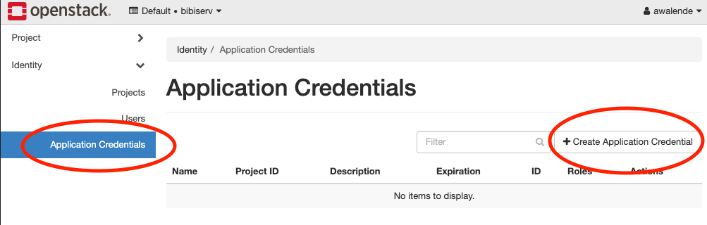
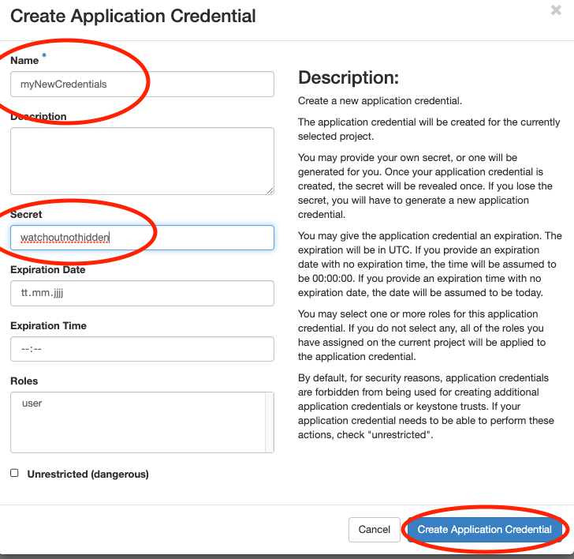

# BiBiGrid Hands-on

## Prerequisites

- System base on Linux, OSX (tested) or Windows Subsystem for Linux (untested)
- required software packages 
  - Python >= 3.10
  - git (required)
  - openssh 
- Openstack API access

## Clone bibigrid and bibigrid_clum
```shell
git clone https://github.com/BiBiServ/bibigrid.git
git clone https://github.com/deNBI/bibigrid_clum.git
```

Your bibigrid folder should contain:

```sh
$ ls bibigrid
# bibigrid  bibigrid_rest.sh  bibigrid.sh  bibigrid.yaml  documentation  README.md  requirements-dev.txt  requirements-rest.txt  requirements.txt  resources  tests
```

## Learning Goals and Expectations

The goal of this tutorial is to set up a small HPC cluster consisting of 3 nodes (1 master, 2 [on demand](https://github.com/BiBiServ/bibigrid/blob/master/documentation/markdown/features/configuration.md#workerinstances) workers) using BiBiGrid with [Slurm](https://slurm.schedmd.com/quickstart.html) (workload manager), [Network File System](https://linux.die.net/man/5/nfs) (allows file sharing between servers) and [Theia](https://theia-ide.org/docs/user_getting_started/) (Web IDE). This setup will be tested by running a simple [Nextflow](https://www.nextflow.io/) workflow. This tutorial targets users that plan to run BiBiGrid on de.NBI cloud.

1. [Preparation](#preparation)
2. [Configuration](#configuration)
3. [The Cluster](#the-cluster)

## Preparation

### Premade Template

Use the prefilled configuration template [resources/bibigrid.yaml](resources/bibigrid.yaml) as a basis for your personal BiBiGrid configuration. 
Later in this tutorial you will use [OpenStackClient](https://pypi.org/project/python-openstackclient/) or access 
Openstack's dashboard manually to get all necessary configuration information from your project.

Copy the [configuration template](resources/bibigrid.yaml) to `~/.config/bibigrid/`.

```shell
mkdir ~/.config/bibigrid
cp bibigrid_clum/resources/bibigrid.yaml ~/.config/bibigrid/bibigrid.yaml
```

This premade template includes volume keys for both master and worker giving you a permanent volume for your master 
that is shared via nfs (see `nfsShares`) and one semipermanent volume for each worker.
Each volume has 25 GB.

### Authentication

In this section you will create an [application credential](https://access.redhat.com/documentation/zh-cn/red_hat_openstack_platform/14/html/users_and_identity_management_guide/application_credentials) and download the autogenerated `clouds.yaml`. `clouds.yaml` contains all required authentication information. Follow the images:



Don't use the input field secret.
- Its input is not hidden
- OpenStack will generate a strong secret for you, if you leave it blank.

Pick a sensible expiration date.




Save the downloaded `clouds.yaml` under `~/.config/openstack/` **and** `~/.config/bibigrid/`. That will allow both OpenstackClient and BiBiGrid to access it:
```sh
cp ~/Downloads/clouds.yaml ~/.config/bibigrid/clouds.yaml
mkdir ~/.config/openstack
cp ~/Downloads/clouds.yaml ~/.config/openstack/clouds.yaml
```

<details>
<summary>Why not store BiBiGrids `clouds.yaml` in openstack and avoid the extra copy?</summary>

In the future BiBiGrid will support more than just one cloud infrastructure. Therefore, using the `~/.config/openstack` folder would be a disadvantage later.
</details>

### Virtual Environment

A virtual environment is something that gives you everything you need to run specific programs without altering your system.

#### Creating a [Virtual Python Environment](https://docs.python.org/3/library/venv.html)

`python3 -m venv ~/.venv/bibigrid`

If this command fails, you probably need to install python3-venv manually. 
For that first update `sudo apt update && sudo apt upgrade` and then `sudo apt install python3.??-venv` (use the correct version for your system).

#### Sourcing Environments

In order to actually use the virtual environment we need to [source](https://www.theunixschool.com/2012/04/what-is-sourcing-file.html) that environment:

`source ~/.venv/bibigrid/bin/activate`

Following [pip](https://manpages.ubuntu.com/manpages/bionic/en/man1/pip.1.html) installations will only affect the virtual environment.
The virtual environment is only `sourced` in the terminal where you executed the source command. Other terminals are not affected.

#### Fulfilling Requirements

Now let's move into the bibigrid folder `cd bibigrid` we will stay in it unless explicitly mentioned otherwise.

You will now install packages required by BiBiGrid within your newly created virtual environment. If you haven't `sourced` your environment yet, please go [back](#sourcing-environments). To install all BiBiGrid requirements, we simply install from the given requirements file:

`pip install -r requirements.txt`

Try executing `openstack subnet list --os-cloud=openstack` within this environment. If it runs without errors, you are ready to proceed. Otherwise you need to check your `clouds.yaml` and your virtual environment.

## Configuration

Following the next steps you will update the [premade template](#premade-template).

<details>
<summary>Why are some keys in the template already set?</summary>

In this hands-on, we want to make things as easy as possible for you. Just check whether the key you've found is the correct one and matches with the one we've written down in the configuration file already.
</details>

### SSH access information

BiBiGrid needs to know which [sshUser](https://www.redhat.com/sysadmin/access-remote-systems-ssh) to use in order to connect to your master. You can set this key in your `~/.config/bibigrid/bibigrid.yaml` file. 

The [sshUser](https://www.redhat.com/sysadmin/access-remote-systems-ssh) depends on your server image. Since we run on top of Ubuntu 22.04 the ssh-user is `ubuntu`. Set the template's `sshUser` key to `ubuntu`.

### Network

If you have your own project and would like to create a subnet, take a look at the [OpenStack Quickstart from de.NBI Cloud Wiki](https://cloud.denbi.de/wiki/quickstart/#network-and-subnet). Depending on your cloud location, steps might slightly differ.

Once you have a subnet, determine your subnet's `Name` by running:

```sh
openstack subnet list --os-cloud=openstack
```

Set the template's `subnet` key to the result's `Name` key.

### Instances

BiBiGrid needs to know `type` and `image` for each server. Since those are often identical for the workers, 
you can simply use the `count` key to indicate multiple workers with the same `type` and `image`.

#### Image
Images are virtual disks with a bootable operating system. Choosing an image means choosing the operating 
system of your server.

Since [images](https://docs.openstack.org/image-guide/introduction.html) are often updated, you need to 
look up the current active image using:

```shell
openstack image list --os-cloud=openstack | grep active
```

Since we will use Ubuntu 22.04 you might as well use:

```shell
openstack image list --os-cloud=openstack | grep active | grep "Ubuntu 22.04"
```

Set the template's `image` key of all instances to the result's `ID`  **or** `NAME` entry of the Ubuntu 22.04 row. 
All servers will share the same image.

<details>
<summary>Do I have to update my configuration file whenever there is a new image version?</summary>

If you use the method described above, yes. However, you can also use a regex instead of a specific name to select an image during runtime. This has also avoids issues that may arise whenever an image is deactivated while your cluster is still running. For our Ubuntu 22.04 images you could use `^Ubuntu 22\.04 LTS \(.*\)$`, but usually you need to check what image names are available at your location and choose the regex accordingly. For more information on this functionality take a look at BiBiGrids [full documentation](https://github.com/BiBiServ/bibigrid/blob/master/documentation/markdown/features/configuration.md#using-regex).
</details>

#### Flavor

Flavors are available hardware configurations.

The following gives you a list of all flavors:

```shell
openstack flavor list --os-cloud=openstack
```

Set the template's `flavor` keys (provide an `ID` or `NAME` - we will use `NAME` in the following examples) to flavors of your choice - in this tutorial we will use `de.NBI medium` for our master and `de.NBI small` for our two workers. You can use a different flavor for the master and each worker-group.

<details>
<summary>Example: Multiple worker groups</summary>

The key `workerInstances` expects a list. Each list element is a `worker group` with an `image` + `type` combination and a `count`. In our tutorial we use a single worker group containing two workers. Since they are in the same worker group, they are identical in flavor and image. We could, however, define two worker groups with one worker each in order to use different flavors for them.

```shell
workerInstances:
  - type: de.NBI tiny
    image: ubuntu-22.04-image-name
    count: 1
  - type: de.NBI default
    image: ubuntu-22.04-image-name
    count: 1
```
</details>

### Waiting for post-launch Services

Some clouds run one or more post-launch services on every started instance, to finish the initialization after an 
instance is available (e.g. to configure local proxy settings or local available repositories). That might interrupt 
BiBiGrid setting up the node (via Ansible). Therefore, BiBiGrid needs to wait for your post-launch service(s) to finish. For that BiBiGrid needs the 
services' names. Set the key `waitForServices` to the list of services you would like to wait for. For Bielefeld 
this would be `de.NBI_Bielefeld_environment.service`. In the future you should be able to find post-launch service names by 
taking a look at your location's [Wiki](https://cloud.denbi.de/wiki/) site (Computer Center Specific) - if 
post-launch services exist at your location.

```yaml
  waitForServices: 
    - de.NBI_Bielefeld_environment.service
```

### Jump Hosts

If you have to use a Jump Host or your started machines are for other reasons not able to reach your Openstack Provider, use `onDemand: False` to disable the on demand scheduling.
When on demand scheduling is active, worker instances power up whenever they are needed and power down when they are no longer used. This is very valuable because it allows clouds to oversubscribe resources which leads to more resources for everyone.

However, if your master is unable to communicate with your cloud's openstack api, on demand scheduling is not possible. For that we need to disable it.

```shell
workerInstances:
  - type: de.NBI tiny
    image: ubuntu-22.04-image-name
    count: 1
    onDemand: False
  - type: de.NBI default
    image: ubuntu-22.04-image-name
    count: 1
    onDemand: False
```

If you are unsure whether you have to use a Jump Host or if the connection is not possible, take a look at your location's [Wiki](https://cloud.denbi.de/wiki/) site (Computer Center Specific).

### Check Your Configuration
Run `./bibigrid.sh -i bibigrid.yaml -ch -v` to check your configuration. The command line argument 
`-v` allows for greater verbosity which will make it easier for you to fix issues.

## The Cluster

The most important folders to know are:
- `/vol/spool` -> shared filesystem between all nodes
- Additional folders you created to mount your volumes as described by your configuration. In this tutorial `/vol/permanent` on the master and `/vol/semipermanent` on the workers.

<details>
<summary>Some more interesting folders</summary>

You do not need to know more about them for regular BiBiGrid use.

- `/opt/bibigrid-venv` -> python venv for all bibigrid python scripts on the cluster and ansible
- `/opt/playbook` -> bibigrid's ansible playbook
- `/opt/slurm` -> where create, fail, terminate scripts and node initialization userdata are stored
- `/var/log/slurm` -> where slurm stores all log files
- `/var/log/slurm/worker_logs` -> contains (ansible) runs separately for each create call
</details>

### Starting the cluster
`./bibigrid.sh -i bibigrid.yaml -c -vv` creates the cluster with a verbose verbose output - great for us to see what's happening. Cluster creation time 
depends on the chosen flavor and the overall load of the cloud and will take up to 15 minutes.

### List Running Cluster
Since several clusters can run simultaneously in a single project, listing all running clusters can be useful:

Execute `./bibigrid.sh -i bibigrid.yaml -l`. You will receive a general overview of all clusters running 
in your project.

### Cluster SSH Connection

After a successful setup, BiBiGrid will print some information. For example:

```
Cluster 6jh83w0n3vsip90 with master 123.45.67.890 up and running!
SSH: ssh -i '~/.bibigrid/tempKey_bibi-6jh83w0n3vsip90' ubuntu@123.45.67.890
Terminate cluster: ./bibigrid.sh -i 'bibigrid.yaml' -t -cid 6jh83w0n3vsip90
Detailed cluster info: ./bibigrid.sh -i 'bibigrid.yaml' -l -cid 6jh83w0n3vsip90
```

You can now establish an SSH connection to your cluster's master by executing the `SSH` line of your `create`'s 
output: 
```shell
ssh -i '~/.bibigrid/keys/tempKey_bibi-6jh83w0n3vsip90' ubuntu@123.45.67.890 
```
But make sure to use the one generated for you by BiBiGrid since 

- cluster-id (here `6jh83w0n3vsip90`), 
- key name (here `~/.config/bibigrid/keys/tempKey_bibi-6jh83w0n3vsip90`) 
- user@IP (here `ubuntu@123.45.67.890`) 

will differ on every run. Run `sinfo` after logging in. You should see something like this:

```
PARTITION AVAIL  TIMELIMIT  NODES  STATE NODELIST
openstack    up   infinite      2  idle~ bibigrid-worker-6jh83w0n3vsip90-[0-1]
openstack    up   infinite      1   idle bibigrid-master-6jh83w0n3vsip90
All*         up   infinite      2  idle~ bibigrid-worker-6jh83w0n3vsip90-[0-1]
All*         up   infinite      1   idle bibigrid-master-6jh83w0n3vsip90
```

<details>
<summary>Why are there two partitions (openstack and all) with the same nodes?</summary>

BiBiGrid creates one partition for every cloud (here `openstack`) and one partition called `all` containing all nodes from all partitions. Since we are only using one cloud for this tutorial, we only have `openstack` and `all`.
</details>

However, dealing with the cluster from just a terminal can be quite bothersome. That's were Theia Web IDE comes in. Log out of your ssh connection for now.

### Using Theia Web IDE

[Theia Web IDE's](https://www.theia-ide.org/) many features make it easier to work on your cloud instances. Take a look:


When enabled, Theia Web IDE is configured to listen on localhost port 8181 on the master instance. Since this address 
is not directly available you have to forward it to your machine using ssh. However, BiBiGrid handles that for you. Simply execute 

```shell
./bibigrid.sh -i bibigrid.yaml -ide -cid [cluster-id]
```

to connect to Theia. A Theia IDE tab will be automatically opened in your browser. You could have omitted `-cid [cluster-id]`. If no `-cid` is given, BiBiGrid will attempt to connect to your last created cluster.

## Hello BiBiGrid, Hello Antibiotic Resistance!

In this section, you will execute the `resFinder` workflow to create a heatmap of antibiotic resistances using your cluster. We will only focus on the workflow language [Nextflow](https://www.nextflow.io/) within this tutorial. However, you could use any software that comes with a SLURM executor instead or even run the jobs directly through SLURM's CLI.

<details>
<summary>Digression: Job Scheduling (SLURM)</summary>

[Slurm](https://slurm.schedmd.com/) is used for job scheduling/workload management. To see all nodes in your cluster execute `sinfo`. You will notice that workers are `idle~`. That means they are `idle` and `~` (powered down). Slurm uses many symbols and words to indicate node states. See [here](https://slurm.schedmd.com/sinfo.html#SECTION_NODE-STATE-CODES) for more about that. To see all running jobs, execute `squeue`. You will notice that no job is currently running.

After successfully connecting to Theia IDE, we will now run our first job on our cluster. Let's start with a "hello world".

- Open a terminal

- Create a new shell script `nano /vol/spool/helloworld.sh`:

```shell
#!/bin/bash
echo Hello from $(hostname) !
sleep 10
```

- Make `helloworld.sh` executable using [chmod](https://linux.die.net/man/1/chmod): `chmod u+x /vol/spool/helloworld.sh`
- Change into the /vol/spool/ directory: `cd /vol/spool/`
- Submit this script as an array job 50 times : `sbatch --array=1-50 --job-name=helloworld helloworld.sh` (run the job 50 times). The job `helloworld` runs now. It will take a while to finish, but you can already inspect some information while it runs.
- The master will now power up worker nodes (as you described it in `bibigrid.yaml`) to assist him with this job. Execute `sinfo` after a few seconds to see the current node status.
- View information about all scheduled jobs by executing `squeue`. You will see your job `helloworld` there.
- You can see `helloworld`'s output using [cat](https://linux.die.net/man/1/cat) `cat /vol/spool/slurm-*.out`.
</details>

### Setting up nextflow

#### Install Java

```shell
sudo apt install default-jre
```

#### Download Nextflow into your /vol/permanent folder

```shell
cd /vol/permanent
wget -qO- https://get.nextflow.io | bash
```

#### Get and execute resFinder
Execute locally in this repository's folder in order to copy our test workflow to the master; use your own key path (here `6jh83w0n3vsip90`) and master ip (here `123.45.67.890`)

```shell
scp -i '~/.config/bibigrid/keys/tempKey_bibi-6jh83w0n3vsip90' resources/Resistance_Nextflow.tar.xz ubuntu@123.45.67.890:/vol/permanent/Resistance_Nextflow.tar.xz
```

Execute on remote within `/vol/permanent` in order to unpack our workflow and run it on the master.

```shell
tar -xvf Resistance_Nextflow.tar.xz
./nextflow run resFinder.nf
```

Using `squeue` in another terminal will show you that this execution is not running on our slurm cluster.

##### On Slurm

In order to run our workflow on our slurm cluster, we need to set the executor to slurm. We have done that using a profile definition (see `nextflow.config`).

```shell
./nextflow run resFinder.nf -profile slurm
```

Once our workflow has finished, we can see the generated heatmap in `outputs/collected_heatmaps/`.

## Ansible - Let's Automate
<!-- TODO: Rework for new structure -->

[Ansible](https://docs.ansible.com), an open source community project by Red Hat, enables the idempotent setup of servers - installing software you need and so on. Knowing more about Ansible can be very helpful when handling clusters.

Let's automate our setup using Ansible! We have already prepared most of it in our generel user_role example. To include the user role `resistance_nextflow` at `~/playbook/roles_user`. Open `~/playbook/site.yaml` and add `resistance_nextflow` to the `hosts: master` section:

```yaml
- become: 'yes'
  hosts: master
  roles:
  - role: bibigrid
    tags:
    - bibigrid
    - bibigrid-master
  - role: resistance_nextflow
    tags:
    - resfinder
    become: False
  vars_files:
  - vars/common_configuration.yaml
  - vars/hosts.yaml
```

Next, we need to change our paths from `/vol/spool` to `/vol/permanent` given that we would like to store the workflow and its outputs on our permanent volume.

```yaml
- debug:
    msg: 
    - "Hello {{ ansible_user }}!"

- name: Unarchive ZIP file from GitHub repository
  unarchive:
    src: "https://github.com/deNBI/bibigrid_clum/raw/main/resources/Resistance_Nextflow.tar.xz"
    dest: "/vol/permanent/"
    remote_src: yes

- name: Install Java JRE on Debian/Ubuntu
  become: True
  apt:
    name: default-jre  # Package name for Java JRE on Debian-based systems
    state: present     # Ensure that the package is present, you can use "latest" as well

- name: Get Nextflow
  shell: wget -qO- https://get.nextflow.io | bash
  args:
    chdir: /vol/permanent/
```

And let's execute our role, but first we need to remove everything we have done manually to ensure that our role actually works (for simplicity we will not uninstall java):

```sh
sudo rm -r /vol/permanent/* # in order to reset
bibiplay -t resfinder # bibiplay is a short-form for roughly "ansible-playbook path-to-site.yaml -i path-to-ansible-hosts"
```

Taking a look at `/vol/permanent/`, we can see that the `output` folder has been generated once again.

## Terminate a cluster

Execute `./bibigrid.sh -i bibigrid.yaml -t -cid [cluster-id] -v`. `./bibigrid.sh -i bibigrid.yaml -t` also does the trick, since BiBiGrid will fall 
back on your last created cluster if no cluster-id is specified.

## Moving Forward

### More BiBiGrid

Congratulations! You have finished BiBiGrid's Hands-on.

You may want to take a look at the "real" `bibigrid.yaml` inside BiBiGrid's repository. It has a lot more options. However, everything you learned here stays true.

If you would like to deepen your knowledge maybe give BiBiGrid's [Features](https://github.com/BiBiServ/bibigrid/blob/master/documentation/markdown/bibigrid_feature_list.md) (e.g. create, check, update, ...) or the [Software](https://github.com/BiBiServ/bibigrid/blob/master/documentation/markdown/bibigrid_software_list.md) (e.g. Slurm, Ansible, Zabbix, Theia, ...) used by BiBiGrid a read. If you would like to know more about the configuration file see [Configuration](https://github.com/BiBiServ/bibigrid/blob/master/documentation/markdown/features/configuration.md).

### More Ansible
You can learn more about Ansible here:
- [de.NBI Wiki Ansible Tutorial](https://cloud.denbi.de/wiki/Tutorials/Ansible/)
- [clum2022-ansible](https://gitlab.ub.uni-bielefeld.de/denbi/ansible-course)
- [Getting started with Ansible](https://docs.ansible.com/ansible/latest/getting_started/index.html)
- [Ansible Galaxy](https://galaxy.ansible.com/ui/)