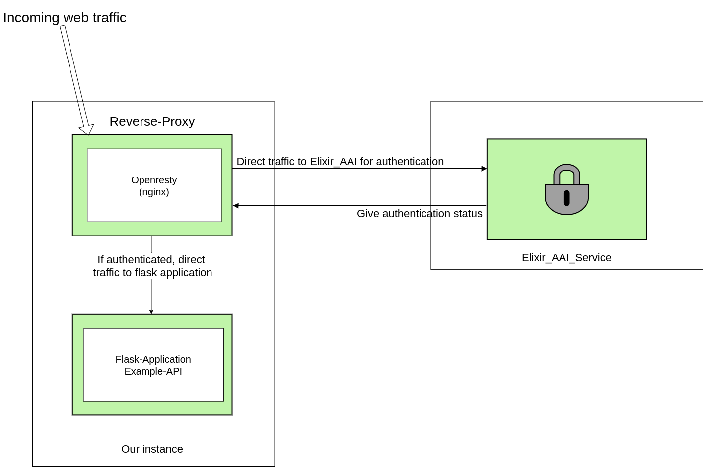
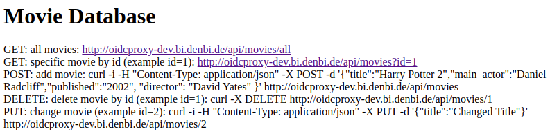

# Create a Reverse Proxy with Elixir AAI, Openresty and Flask
Welcome to the de.NBI Cloud site Elixir AAI. In the following guide we want
to give you a quick step by step guide how to configure an Openresty webserver as reverse proxy which:
​
1. Directs incoming traffic to an OpenIDC service, in our case Elixir, to authenticate the user and
2. Redirects the user to a locally running flask application working as an API

Please note, you are responsible for everything that happens with the virtual machines (VMs) you deploy!
​
### Picture of our goal architecture
In this section you can see an illustration of our finished architecture.

​
## What do we need before we start?
1. We need a running virtual instance that is accessible from the web. You can find a tutorial on how to create one in the de.NBI wiki: <https://cloud.denbi.de/wiki/simple_vm/new_instance/>. The hardware specs we used for this project are: OS: Ubuntu 18.04 LTS; RAM: 4GB; HDD: 20 GB. 
2. You need a registered Elixir client. You can register here: <https://elixir-europe.org/register>. After the registration you can access your personal profile via this link: <https://perun.elixir-czech.cz/fed/profile/>. Here you can find e.g . your personal Elixir client ID. 
3. Create an Elixir service you will use to authenticate at the reverse proxy later on. This service can be registered here: <https://spreg.aai.elixir-czech.cz/spreg/auth/requests/new>. 
4. To be able to access the services in the test environment, you need to register to a special "virtual organization" representing this environment. You can register at: <https://perun.elixir-czech.cz/fed/registrar/?vo=elixir_test>. Note: The membership in this VO is valid for one month and has to be extended to be able to use the test environment in the future. 
5. You can find your Elixir service information here: <https://spreg.aai.elixir-czech.cz/spreg/auth/facilities/myServices>. Later on you will need your `Client ID`, `Client Secret` and `Redirect URIs` which can be found under your generated Service -> SAML/OIDC. 

## Configure the virtual instance to serve as a reverse proxy
​The following section guides you through the process of configuring your virtual instance to serve as a reverse proxy. All steps listed in the following have to be executed on the instance.

#### OpenResty + OIDC Plugin Installation​
1. Install OpenResty like it is described here <https://openresty.org/en/linux-packages.html>. Note: This also installs nginx as openresty is based on nginx.
2. Install the openidc plugin with `opm install zmartzone/lua-resty-openidc`.

### Configure nginx.conf locally
Next step is to configure your nginx configuration file (`nginx.conf`). It should be located at: `/usr/local/openresty/nginx/conf`.

You can simply copy and paste the following `nginx.conf` code:
​
```
worker_processes  1;
# /usr/local/openresty/nginx/logs/
error_log  logs/error.log;
error_log  logs/error.log  notice;
error_log  logs/error.log  info;
error_log  logs/error.log  debug;
events {
    worker_connections  1024;
}
http {
    include       mime.types;
    default_type  application/octet-stream;
    #For some reason, nginx wants a hardcoded Name Resolver
    resolver 8.8.8.8;
    sendfile        on;
    keepalive_timeout  65;
    #LUA caches for various session modules
    lua_shared_dict discovery 1m;
    lua_shared_dict jwks 1m;
    lua_code_cache off;
    #Create global LUA variable which keeps our ELIXIR AAI Configuration dict
    init_by_lua_block {
         opts2 = {
                redirect_uri = "http://oidcproxy-dev.bi.denbi.de/redirect_uri",
                discovery = "https://login.elixir-czech.org/oidc/.well-known/openid-configuration",
                client_id = "YOUR_ELIXIR_CLIENT_ID",
                client_secret = "YOUR_ELIXIR_OIDC_CLIENT_SECRET",
                logout_path = "/logout",
                ssl_verify = "no"
          }
     }
    server {
        listen 80 default_server;
        listen [::]:80;
        server_name oidcproxy-dev.bi.denbi.de;
        set $session_secret YOUR_SESSION_SECRET;
        location / {
                access_by_lua_block {
                     -- Start actual openid authentication procedure
                     local res, err = require("resty.openidc").authenticate(opts2)
                     -- If it fails for some reason, escape via HTTP 500
                     if err then
                         ngx.status = 500
                         ngx.say(err)
                         ngx.exit(ngx.HTTP_INTERNAL_SERVER_ERROR)
                      end
                }
                proxy_pass http://127.0.0.1:5000/; #redirects traffic to our running flask application
        }
   }
}
```

1. We create a global LUA variable (`opts2`) which keeps our ELIXIR AAI configuration. In this block the OpenIDC credentials are described. Change the following values:
    - `redirect_uri` (Make sure that you have a matching redirect_url defined both in the OpenIDC-Client and the nginx config file. See section "What do we need before we start?")
    - `client_id`
    - `client_secret`
2. As we opened our port 80 for incoming traffic we configure the service to run on this port 
``` 
listen 80 default_server; 
listen [::]:80; 
```
3. Generate a strong `$session_secret` in the server section
4. After a successful authentication procedure the script redirects the traffic to our locally running flask application. As our application runs on `http://127.0.0.1:5000/` we direct it there (`proxy_pass http://127.0.0.1:5000/;`).
5. Start the openresty service with  `sudo systemctl start openresty.service`. 
    - You can get a status output via: `sudo systemctl status openresty.service` 
    - To restart the service after you changed the `nginx.conf` you can use: `sudo systemctl restart openresty.service`

### Example Flask-API
For this little project we chose a flask application that works as an API. We implemented a small hard coded database with example movies. The entries for the movies have the values `id`, `title`, `director`, `main_actor` and `published`. Our API can execute GET, POST, PUT and DELETE requests. 
​
### my_flask.py​
```
from flask import Flask
from flask import request, jsonify
​
app = Flask(__name__)
​
​#We used a simple hard coded python list as our database
movies = [
    {'id': 0,
     'title': 'Hunger Games',
     'director': 'Garry Ross',
     'main_actor': 'Jennifer Lawrence',
     'published': '2012'},
    {'id': 1,
     'title': 'Lord of the  Rings',
     'director': 'Peter Jackson',
     'main_actor': 'Elijah Wood',
     'published': '2001'},
    {'id': 2,
     'title': 'Titanic',
     'director': 'James Cameron',
     'main_actor': 'Kate Winslet',
     'published': '1997'}
]
​

#For our example application we implemented the following functions: GET, POST, PUT, DELETE
​@app.route('/', methods=['GET'])
def hello():
    return '''<h1>Movie Database</h1>
<p> GET:  all movies: <a href="http://oidcproxy-dev.bi.denbi.de/api/movies/all">http://oidcproxy-dev.bi.denbi.de/api/movies/all</a href> <br> 
GET: specific movie by id (example id=1):  <a href= "http://oidcproxy-dev.bi.denbi.de/api/movies?id=1"> http://oidcproxy-dev.bi.denbi.de/api/movies?id=1 </a href> <br>
POST: add movie: curl -i -H "Content-Type: application/json" -X POST -d '{"title":"Harry Potter 2","main_actor":"Daniel Radcliff","published":"2002", "director": "David Yates" }' http://oidcproxy-dev.bi.denbi.de/api/movies <br>
DELETE: delete movie by id (example id=1): curl -X DELETE http://oidcproxy-dev.bi.denbi.de/api/movies/1 <br>
PUT: change movie (example id=2): curl -i -H "Content-Type: application/json" -X PUT -d '{"title":"Changed Title"}' http://oidcproxy-dev.bi.denbi.de/api/movies/2 </p>'''
​
# A route to return all of the available entries in our catalog.
@app.route('/api/movies/all', methods=['GET'])
def api_all():
    return jsonify(movies)
​
#Get a specific database entry by ID
@app.route('/api/movies', methods=['GET'])
def api_id():
    # Check if an ID was provided as part of the URL.
    # If ID is provided, assign it to a variable.
    # If no ID is provided, display an error in the browser.
    # check url 
    if 'id' in request.args:
        id = int(request.args['id'])
    else:
        return "Error: No id field provided. Please specify an id."
​
    # Create an empty list for our results
    results = []
​
    # Loop through the data and match results that fit the requested ID.
    # IDs are unique, but other fields might return many results
    for movie in movies:
        if movie['id'] == id:
            results.append(movie)
​
    # Use the jsonify function from Flask to convert our list of
    # Python dictionaries to the JSON format.
    if not results:
        return page_not_found(404)
    else:
        return jsonify(results)
​
​#Add an Error hanlder for invalid requests
@app.errorhandler(404)
def page_not_found(e):
    return "Error 404: Resource not found", 404

#Implement a POST method for the example API
@app.route('/api/movies', methods=['POST'])
def create_movie():
    if not request.json or not 'title' in request.json:
        abort(400)
    movie = {
        'id': movies[-1]['id'] + 1,
        'title': request.json['title'],
        'main_actor': request.json.get('main_actor', ""),
        'published': request.json.get('published', ""),
        'director': request.json.get('director', "")
    }
    movies.append(movie)
    return jsonify({'movie': movie}), 201

#Implement a DELETE method for the example API
@app.route('/api/movies/<int:movie_id>', methods=['DELETE'])
def delete_movie(movie_id):
    movie = [movie for movie in movies if movie['id'] == movie_id]
    if not movie:
        abort(404)
    movies.remove(movie[0])
    return jsonify({'result': True})

#Implement a PUT method for the example API
@app.route('/api/movies/<int:movie_id>', methods=['PUT'])
def update_movie(movie_id):
    movie = [movie for movie in movies if movie['id'] == movie_id]
    if not movie:
        abort(404)
    if not request.json:
        abort(400)
    if 'title' in request.json and type(request.json['title']) != unicode:
        abort(400)
    if 'published' in request.json and type(request.json['published']) is not unicode:
        abort(400)
    if 'main_actor' in request.json and type(request.json['main_actor']) is not unicode:
        abort(400)
    if 'director' in request.json and type(request.json['director']) is not unicode:
        abort(400)

    movie[0]['title'] = request.json.get('title', movie[0]['title'])
    movie[0]['published'] = request.json.get('published', movie[0]['published'])
    movie[0]['main_actor'] = request.json.get('main_actor', movie[0]['main_actor'])
    movie[0]['director'] = request.json.get('director', movie[0]['director'])

    return jsonify({'movie': movie[0]})    
```
1. Before running the application you need to set the following Flask variables in your current session
    - `export FLASK_APP=myflask` (`myflask` = name of your .py file)
    - `export FLASK_ENV=development`
2. Run the flask application by running `flask run` in the directory of your .py-file

Per default flask applications run on `127.0.0.1:5000`. Remember this is important for the configuration of your openresty service (`nginx.conf`).

### Test the configuration
You can test the whole architecture simply by accessing your virtual instance via a browser either by its public IP or its DNS name. After a successful authentification at the Elixir AAI service you are redirected to your running flask application. With the given `myflask.py` you should see the following output: 

Another way to test the reverse proxy is via curl commands. Example commands can be seen in the screenshot above or in the following:
- `curl -X DELETE http://oidcproxy-dev.bi.denbi.de/api/movies/1`
- `curl -i -H "Content-Type: application/json" -X POST -d '{"title":"Harry Potter 2","main_actor":"Daniel Radcliff","published":"2002", "director": "David Yates" }' http://oidcproxy-dev.bi.denbi.de/api/movies`


## How to get in contact with us
In case you have questions or want to give us any kind of feedback, please
contact us via <awalende@cebitec.uni-bielefeld.de>.

### Developer
- <verena.kannegiesser@uni-bielefeld.de> 
- <rzatrib@techfak.uni-bielefeld.de>
