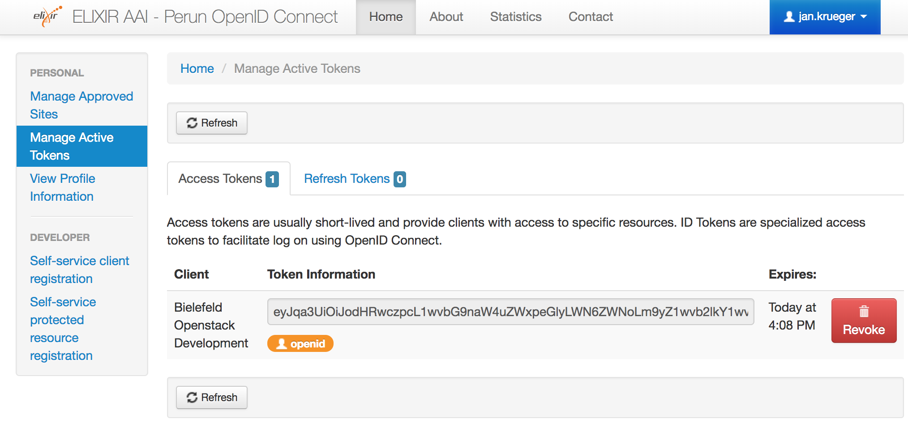

# Configure Openstack (Keystone) to use Elixir AAI via OpenID Connect

## Introduction

This document describes how to authenticate in Openstack via Elixir AAI using OpenID Connect (OIDC). 

### Prerequites

This guide was testet against Openstack Newton on top of Ubuntu 16.04 LTS, but should also work with later Openstack versions and other operating systems (maybe with slightly modifications).

- Openstack
	- Keystone API 3 
	- Authorization must be done in a separate step, users will not be added to a default project.

- Elixir
	- The Openstack Keystone endpoint is registered as service provider within Elixir AAI.

## OpenID Connect
Since OpenID Connect is handled via an Apache module, we have to make sure that the neccessary Apache module is installed and enabled.

```~bash
$ apt install libapache2-mod-auth-openidc
$ a2endmod auth_openidc
```

## Keystone

Keystone has two configuration files, its own (`/etc/keystone/keystone.conf`) and the Apache virtual host configuration (`/etc/apache/sites_available/keystone.conf`).

### Virtual host configuration 

In the virtual host configuration the auth_openidc module must be loaded (*before* the VirtualHost section).

```
...
LoadModule auth_openidc_module /usr/lib/apache2/modules/mod_auth_openidc.so
...
```

In the virtual host section for the public keystone url we have to configure the OIDC access. The *oidc.provider_url* is in our case the Elixir oidc provivder (https://login.elixir-czech.org/oidc/). Replace *oidc.client_id* and *oidc.client_secret* with the values you got when register your Openstack(Keystone) instance as Elixir OIDC endpoint. 
The *oidc.crypto_passphrase* can be freely chosen, however it must be set.

```
# public keystone url
<VirtualHost  XX.XX.XX.XX:5000>
	...
	ServerName https://{{controller.public_hostname}}:5000

	OIDCResponseType "code"
	OIDCClaimPrefix "OIDC-"
	OIDCClaimDelimiter ;
	OIDCScope "openid"
	OIDCProviderMetadataURL {{ oidc.provider_url }}.well-known/openid-configuration
	OIDCClientID {{ oidc.client_id }}
	OIDCClientSecret {{ oidc.client_secret }}
	OIDCCryptoPassphrase {{ oidc.crypto_passphrase }}
	OIDCRedirectURI https://{{ controller.public_hostname }}:5000/identity/v3/auth/OS-FEDERATION/websso/oidc/redirect

	# OAuth for CLI access
	OIDCOAuthIntrospectionEndpoint {{ oidc.provider_url }}introspect
	OIDCOAuthClientID {{ oidc.client_id }}
	OIDCOAuthClientSecret {{ oidc.client_secret }}

	<Location ~ "/v3/auth/OS-FEDERATION/websso/oidc">
	     AuthType  openid-connect
	     Require   valid-user
	</Location>

	<Location ~ "/v3/OS-FEDERATION/identity_providers/elixir_oidc/protocols/oidc/auth">
	     Authtype oauth20
	     Require   valid-user
	</Location>
```

### Keystone configuration
Configure your keystone.conf to include in the [auth] section oidc in the list of authentication methods and the keystone.auth.plugins.mapped.Mapped class for its implementation: 

```
[auth]
methods = password,token,oidc
oidc = keystone.auth.plugins.mapped.Mapped
```

Add your horizon host as trusted dashboard to the [federation] section and configure the SSO callback template.
```
[federation]
trusted_dashboard=https://{{ oidc.endpoint }}/horizon/auth/websso/
sso_callback_template = /etc/keystone/sso_callback_template.html
```

Define the identity provider in the [oidc] section using the HTTP_OIDC_ISS attribute
```
[oidc]
remote_id_attribute = HTTP_OIDC_ISS
```


## Dashboard (Horizon)

After setup Keystone to be OIDC aware, we have to a enable SSO (single sign on) in Openstack horizon and add Elixir_OIDC as choice in the list of providers via mapped drivers.

```
WEBSSO_ENABLED = True
WEBSSO_CHOICES = (
  ("credentials", _("Keystone Credentials")),
  ("oidc", _("ELIXIR_OIDC")),
)

WEBSSO_INITIAL_CHOICE="oidc"
```

### Running Dashboard behind a HA-Proxy
If you run Openstack in a HA setup behind a HA-Proxy you have to make sure that you configure the keystone public url and that this url can be reached by all Openstack controller. Otherwise the redirect from Elixir back to Keystone will not work.

```
OPENSTACK_HOST = "{{ controller.public_hostname }}"
OPENSTACK_KEYSTONE_URL = "https://%s:5000/v3" % OPENSTACK_HOST
OPENSTACK_ENDPOINT_TYPE = "publicURL"
```

### Running Dashboard behind a Proxy

If your controller uses a http[s] proxy to connect to external addresses you have to configure the apache to make use of it. The environment can be set in `/etc/apache2/envvars`. Don't forget to configure `no_proxy` if your proxy only proxies external addresses.

```~bash
export http_proxy=
export https_proxy=
export no_proxy=
```

*Be sure to restart the Webserver. A reload won't load in any changes made to the envvars file.*


## Create Federated Resources
In this section we create all necessary federated resources.

### Federated domain

First create a domain *elixir* for federated usage.

```~bash
$ /usr/bin/openstack domain create --description 'The Elixir domain' --enable elixir

```

### Identity provider
Then we have to create a new indentity provider https://login.elixir-czech.org/oidc/ named *elxir_oidc*


```~
$ /usr/bin/openstack identity provider create --remote-id https://login.elixir-czech.org/oidc/ elixir_oidc
```

### Mapping rules

The mapping describes how the attributes provided by the OIDC services are mapped to Keystone. In our case 
we map the *Elixir ID*  (HTTP_OIDC_SUB) to the Users name. The mapping is described in a JSON  ...

```~json
[{
  "local": [
    { "user": { "name": "{0}", "type": "local", "domain": {"name": "elixir"} } }
  ],
  "remote": [{ "type": "HTTP_OIDC_SUB" }]
}]

```
... saved (`/tmp/elixir_oidc_mapping_rules.json`) and imported into Openstack Keystone.

```~bash
$ /usr/bin/openstack mapping create --rules /tmp/elixir_oidc_mapping_rules.json elixir_oidc_mapping
```

### Federal protocol

At last we have to create a federation protocol that connects the imported mapping with the created indentity-provider

```~bash
$ /usr/bin/openstack federation protocol create oidc --mapping elixir_oidc_mapping --identity-provider elixir_oidc
```

## Test/Demo

For a first test we have to add a demo user, a demo project and associate the user to an Elixir ID.

### Get your ELIXIR ID
First, you need to determine your (persistent) ELIXIR ID.

Log in to Perun. On the menu on the left-hand side select User → Authentication. Your ELIXIR ID can be found in the field "Login in ELIXIR-PERSISTENT".

### Create a demo user/project
Now, create a demo project and a local entry for your user:

```~bash
$ openstack project create elixir-demo --domain elixir
$ openstack user create <your_elixir_id> --domain elixir
```

Next, add your user as a member of the demo project:

```~bash
openstack role add --user <your_elixir_id> --user-domain elixir --project elixir-demo _member_
```

That's all. Login into Openstack using Elixir OIDC in the demo project should now be possible.


## Openstack CLI

After a successfull authentication an active OIDC token can be used to obtain a keystone token using the Openstack cmdline tools. 

- Login into [https://login.elixir-czech.org/oidc/]()




- Select *Manage Active Tokens* on the left side
- In **Access Tokens** you see tokens from all registered clients. In our screenshot there is only one active token from the "Bielefeld Openstack Development"  client 
- Copy/paste the token it: `export iam_at={{ ACCESS.TOKEN }}`
- Use the openstack cmdline tools to create an openstack token for further processing.

```~bash
openstack --os-auth-type v3oidcaccesstoken --os-access-token ${iam_at} \
--os-auth-url https://openstack-dev.cebitec.uni-bielefeld.de:5000/v3 --os-protocol oidc \
--os-identity-provider elixir_oidc --os-identity-api-version 3 \
token issue
```

**Attention: At the time of writing this tutorial retrieving a keystone token using using OIDC token ends in a 401 Error (not authorized). This might be a problem of an outdated Openstack version (Newton)**


