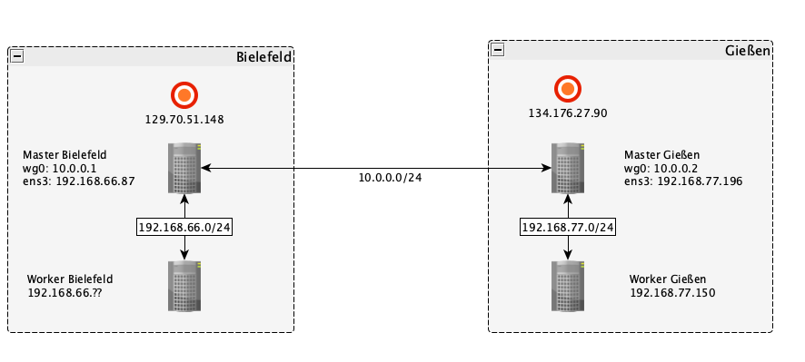

## General

The general idea is to create a computing cluster which has worker nodes in 
different cloud locations. Such a hybridcloud approach would have the benefit
that worker nodes can run in cloud locations where the data, they are working
on, is located. Thus negating the need to transfer very large amounts of data
between different cloud locations. Calculated results are usually much smaller
in size and can be transferred back to the master node very swiftly.

# Experimental Setup

This section will describe a proof of concept of such a hybrid cloud 
approach. This minimal setup will consist of a cluster created with 
[BiBiGrid](https://github.com/BiBiServ/bibigrid) running in the Bielefeld cloud.
This cluster will consist of one master and
one worker node. Additional a VPN node, a pseudo master which just relays
traffic between the two cloud locations, and a worker node will be created
in the Gießen cloud. The master node and the VPN node will be connected
over a VPN created with [Wireguard](https://www.wireguard.com/). The local 
workers in turn are connected to their master/VPN node via their local subnet.

The diagram shows the described setup. Note that the IPs attached to the red
circles are the public floating IPs of the corresponding master and VPN node
and that they will most definitely differ in your setup. `wg0` signifies
the Wireguard VPN interface, the IPs will be set in the
[Configure Wireguard](#configure-wireguard) section.
The master and worker node in Bielefeld are part of a subnet with an IP range of
`192.168.66.0/24` whereas the subnet in Gießen has the range `192.168.77.0/24`.
The ranges can be freely chosen while setting up the subnets, but the ranges of
different cloud locations should not overlap.

## Create Setup
For the cluster in Bielefeld and Gießen follow the steps in the 
[Quickstart Tutorial](https://cloud.denbi.de/wiki/quickstart/) up to the point of
launching your own instance. For Bielefeld proceed by creating a cluster using
[BiBiGrid](https://github.com/BiBiServ/bibigrid). Then for Gießen launch two
instances, as described 
[here](https://cloud.denbi.de/wiki/quickstart/#launching-an-instance). Create
one Instance which will be the VPN node, this node only relays traffic, so it 
is enough to choose a minimal flavor. Then create a second instance which will be
a remote worker node.

### Install Wireguard

Wireguard is only needed to connect the master node with the VPN node therefore you
only need to install it on these instances. To install the necessary packages and dependencies on Ubuntu,
you can run:

~~~BASH
$ sudo apt install wireguard
~~~

For other operating systems take a look at the installation instructions
on the official [wireguard site](https://www.wireguard.com/install/).

After successfully installing the package run the following to create a directory 
which will hold the keys, and the config file:

~~~BASH
$ sudo mkdir /etc/wireguard
~~~

### Generate key pairs

Got to the directory you just created:
~~~BASH
$ cd /etc/wireguard/
~~~

Then run the following two commands to generate a private key and the
corresponding public key:

~~~BASH
$ umask 077 # This is to make sure that credentials don't leak
$ wg genkey | tee privatekey | wg pubkey > publickey
~~~

You can simply display the keys to the terminal like this:

~~~BASH
$ cat privatekey
$ cat publickey
~~~

### Configure Wireguard Interfaces

With Wireguard we can create a VPN interface from a config file. 
For both the master node and the VPN node create a config file inside
`/etc/wireguard`:

~~~BASH
$ nano wg0.conf
~~~

The following is the config file for the master node in Bielefeld.
The group `[Interface]` holds options about the interface that will be created
on the local machine. Here `Address` signifies the IP address the master node will
have in the VPN. `Privatekey`is the private key of the master node which we
generated earlier and `ListenPort` is the port on which the Wireguard interface
will send its packages. The group `[Peer]` holds information and options about
a specific peer, which we want to be able to connect to our interface. 
`PublicKey` is simply the public key of the peer, in our setup the peer is the 
VPN node in Gießen. `AllowedIPs` signifies which packages will be let through
our interface. Of course we want to accept all packages from inside our VPN
therefore we add `10.0.0.0/24` but since only the VPN node is part of the VPN
we wouldn't be able to receive packages from the worker nodes in Gießen without
also allowing the local subnet.

~~~
# Config Master node Bielefeld

[Interface]
Address = 10.0.0.1/24
PrivateKey = <privatekey of master node Bielefeld>
ListenPort = 51820

[Peer]
PublicKey = <publickey of VPN node>
AllowedIPs = 10.0.0.0/24 <subnet in Gießen>

PersistentKeepalive = 25
~~~

The config for the VPN node in Gießen follows the same principals.
~~~
# Config VPN node Gießen

[Interface]
Address = 10.0.0.2/24
PrivateKey = <privatekey of VPN node>
ListenPort = 51820

[Peer]
PublicKey = <publickey of master node>
AllowedIPs = 10.0.0.0/24 <subnet in Bielefeld>

PersistentKeepalive = 25
~~~

### Adjust Security Groups

Wireguard sends traffic over its interface as UDP packets. So we have to make
sure that our security group in Bielefeld and Gießen allow incoming UDP packets
from each other. Therefore, you would have to add the following rule:

| Direction | Ether Type | IP Protocol | Port Range | Remote IP Prefix |
|-----------|------------|-------------|------------|------------------| 
| Ingress   | IPv4       | UDP         | 51820      | public ip of master/VPN node|

### Connect the nodes

To connect the nodes via our VPN we first have to create the interfaces.
On master node run the following:

~~~BASH
$ wg-quick up wg0
~~~

If everything was set up correctly you will get this output:

~~~
[#] ip link add wg0 type wireguard
[#] wg setconf wg0 /dev/fd/63
[#] ip -4 address add 10.0.0.1/24 dev wg0
[#] ip link set mtu 1370 up dev wg0
[#] ip -4 route add <subnet Gießen> dev wg0
~~~

Then repeat the same on the VPN node.
The to test if a connection could be established run the following from
the master node:

~~~BASH
$ wg
~~~

If everything works correctly you should get the following output:

~~~
interface: wg0
  public key: xxxxx
  private key: (hidden)
  listening port: 51820

peer: xxxxx
  endpoint: <public ip VPN node Gießen>:51820
  allowed ips: 10.0.0.0/24, <subnet in Gießen>
  latest handshake: xxx seconds ago
  transfer: xxx B received, xxx B sent
  persistent keepalive: every 25 seconds
~~~

If a connection couldn't be established the lines `endpoint:`,
`latest handshake:` and `transfer:` will be missing.

You can actually run the `wg` command from either node, running it from
master node was only advised so that it was easier to compare outputs. Also note
that the connection will be established immediately after both interfaces are
up and running. The `wg` command just prints some info to the terminal.

### Exempt traffic from Anti-Spoofing measures

Neutron prevents an instance from sending or receiving traffic with an IP
which is not part of its Neutron port. More information can be found
[here](https://www.packetcoders.io/openstack-neutron-port-security-explained/)
and [here (Section:ML2/Open vSwitch port-security)](https://www.redhat.com/en/blog/whats-coming-openstack-networking-kilo-release)
.
For our setup we will need to add allowed address pairs for the master nodes
and the workers running in a different location. This can be done by using the
following openstack command:

~~~BASH
$ openstack port set <port-id> --allowed-address <ip-address to allow>
~~~

