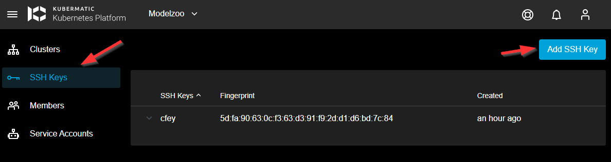
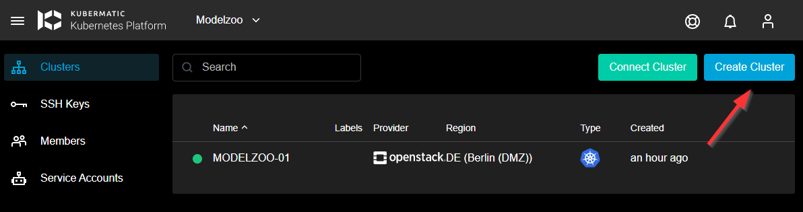
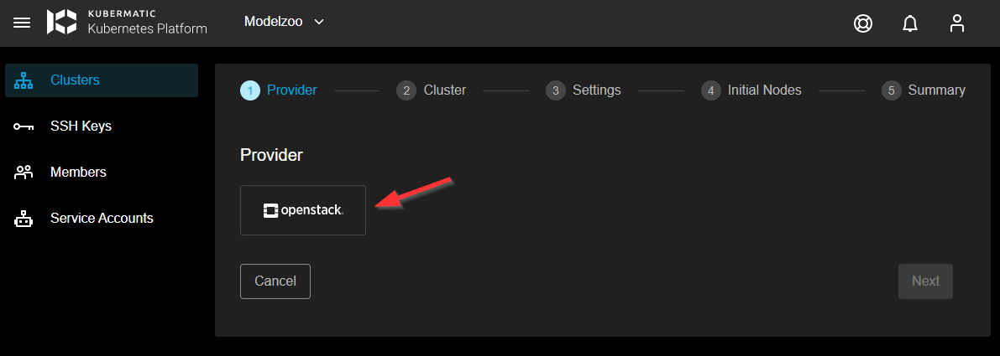
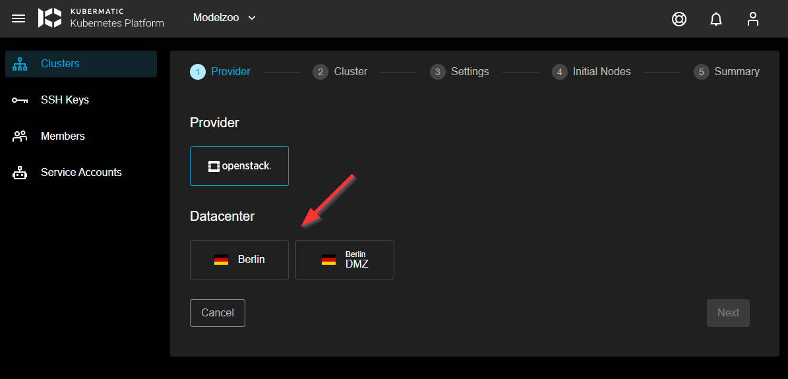
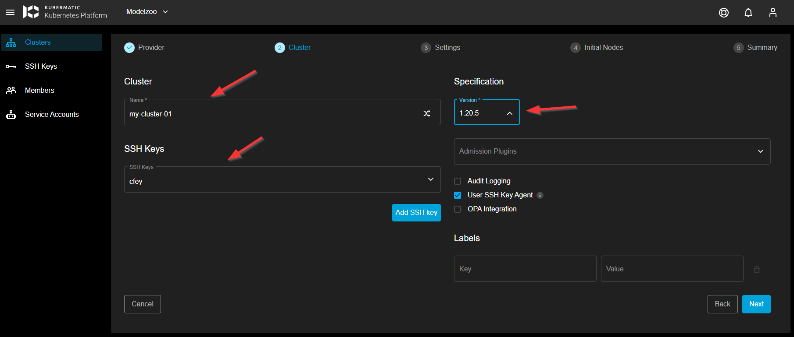
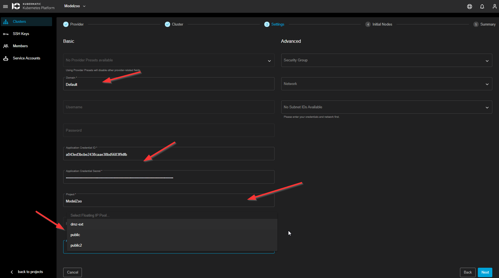
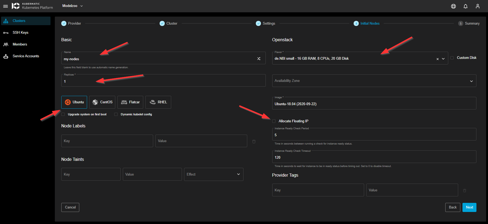
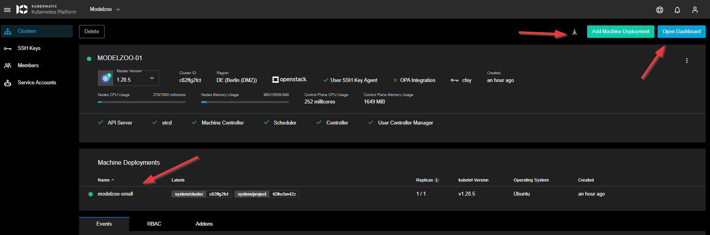
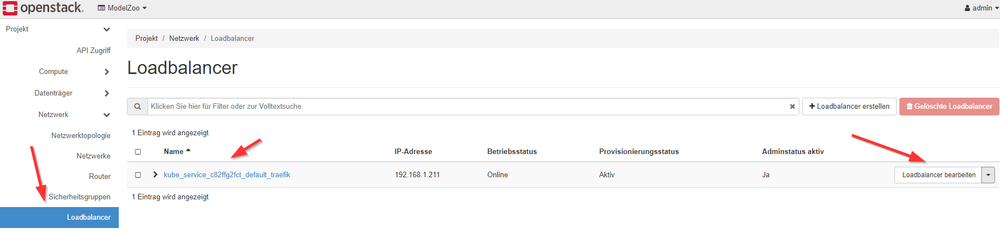

## Kubermatic in de.NBI cloud (Berlin)

At the de.NBI cloud site in Berlin we use Kubermatic as software to deploy "vanilla" kubernetes cluster into OpenStack projects. We will describe here, how you can use this.

Contact us via mail: <it.digitalhealth@charite.de> to discuss further details and take usage of this.

After we initally setup your kubernetes project, you can access your resources at our Kubermatic login page: https://k.denbi.bihealth.org/

## Get helm and kubectl going on the jumphost (with your user)

```bash
mkdir ~/bin
cd ~/bin
curl -LO https://storage.googleapis.com/kubernetes-release/release/$(curl -s https://storage.googleapis.com/kubernetes-release/release/stable.txt)/bin/linux/amd64/kubectl
chmod +x ./kubectl
## https://github.com/helm/helm/releases
curl -s https://get.helm.sh/helm-v3.7.0-rc.1-linux-amd64.tar.gz | tar xvz
mv linux-amd64/helm ~/bin
echo "export PATH=\$PATH:~/bin/" >> ~/.bashrc

## Install k9s as simple way to explore your cluster on the cli
curl -sS https://webinstall.dev/k9s | bash
```

## How to create K8s Cluster with Kubermatic

As a first step, it makes sense to upload a SSH key to your project. With that, you have the ability to access the K8s nodes created in a later step via ssh.



Continue to create your K8s cluster:



Select the cloudprovider (there is only OpenStack available):



You need to decide wether you will deploy your cluster in the public area (this should be the default) or in the dmz area (if you want your ingress to be available from outside).



Here you can configure your basic cluster settings, like name and version. For most setups this is sufficient. Note: you can always start with an "older K8s" version and issue an upgrade later.



In this window you configure the advanced settings. In the first place use `Default` as the Domain, and type in the OpenStack application credentials, that you have created for your project.
**Note:** If you have access to multiple projects, you need to take care, that you are using the right credentials for the project that you select as "Project". Kubermatic will always display all projects that you can see, but the cluster will be spawned in the project that belongs to the application credentials (this is a OpenStack thing).

Use the corresponding floating ip pool, to your setup (if you have decided for DMZ earlier use `dmz-ext` in all other cases use `public2`.

You don't need to fill out the Advanced area (but you can if you want), Kubermatic will create everything needed.



Now you can create your first worker nodes. This is done with a machine deployment that you can configure (name, count of nodes (replicas), Image (we support ubuntu and CentOS) and flavor. You can also assign your workers floating ips, but you can also create a loadbalancer lateron.



The last step shows a summary window in that you can click on "create cluster" at the bottom right.

The controlplane of your cluster will now be created and you will see instances (workers) spawned in your OS project. After a few minutes it should look like the following. 

You can access the K8s dashboard and download your kubeconfig with the buttons at the top right.



**Note:** Since the MTU for the overlay network is not applied correctly, you need to do the following workaround:
- create your cluster and download kubeconfig
- patch canal with: `kubectl patch configmap/canal-config -n kube-system --type merge -p '{"data":{"veth_mtu": "1450"}}'`
- scale the machine deployment to `0` and after that back to your desired count

## create ingress with traefik

- you have your kubeconfig
- helm and kubectl is installed on the jumphost

```bash
helm repo add traefik https://helm.traefik.io/traefik
helm install traefik traefik/traefik 
```

This will create a loadbalancer in OpenStack and you can assign a floating IP to it.

