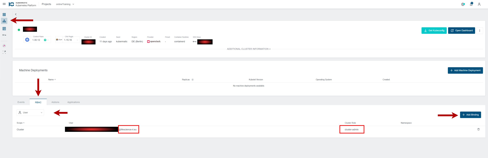
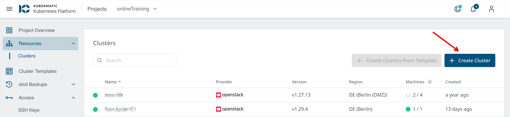
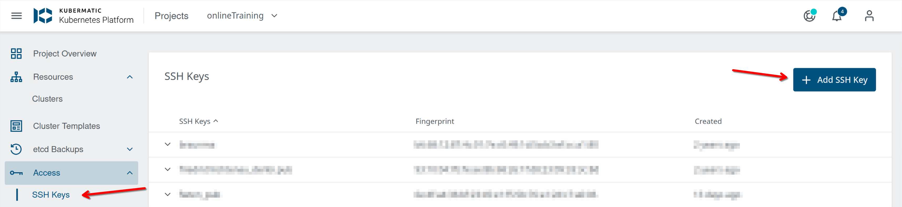
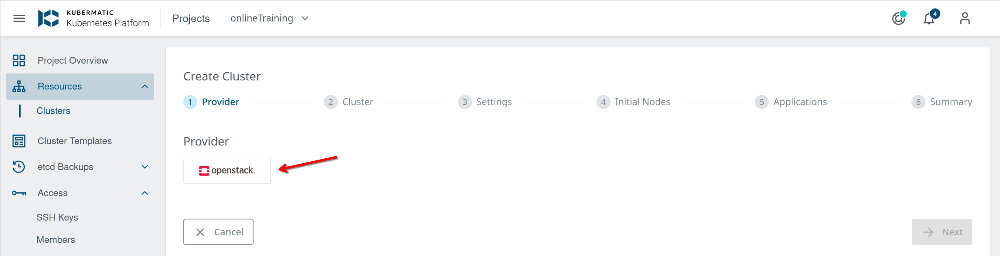
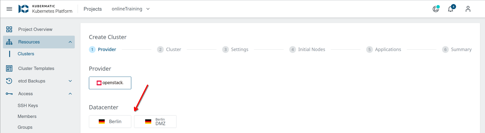
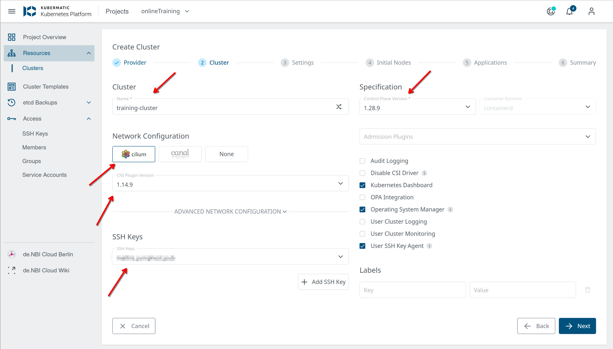
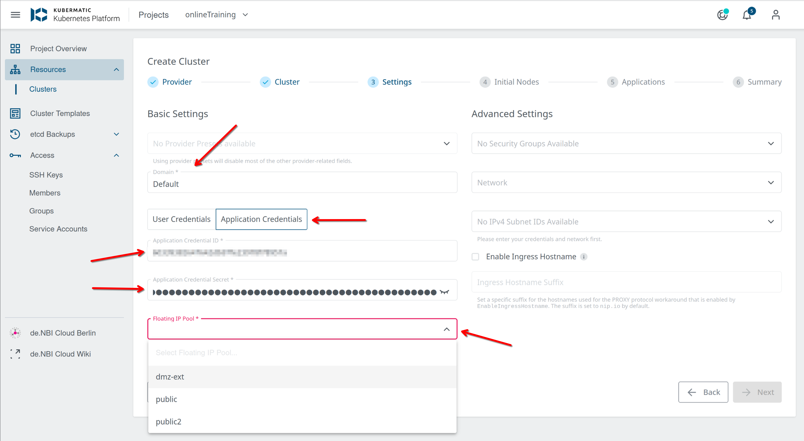
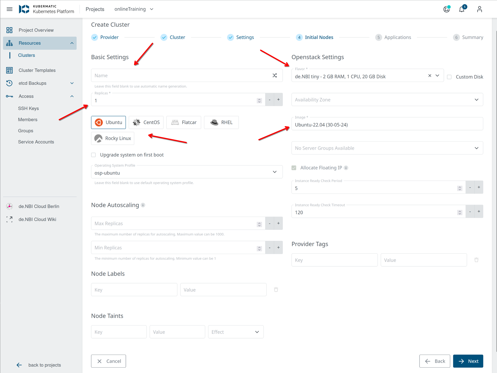
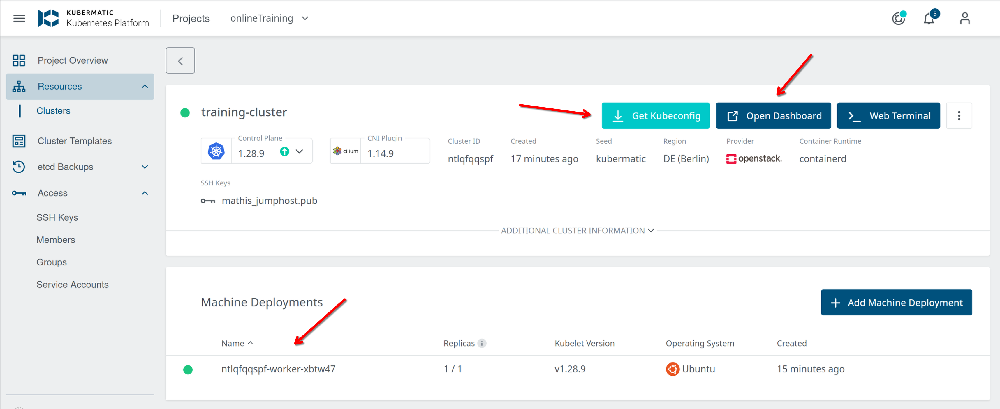
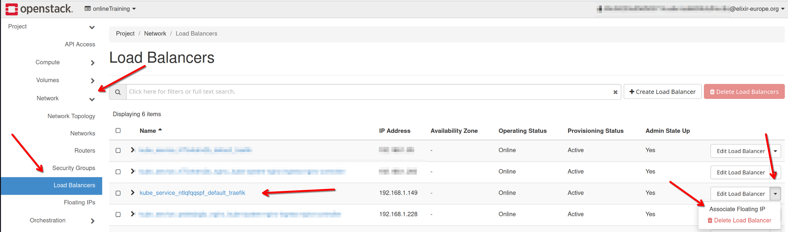

sec## Kubermatic in de.NBI cloud (Berlin)

At the de.NBI cloud site in Berlin we use Kubermatic as software to deploy "vanilla" kubernetes cluster into OpenStack projects. We will describe here, how you can use this. To gain access to Kubermatic you first need to apply for a OpenStack Project. Please state in the application that you want to use Kubernetes. After your project got approved you can access your resources at our Kubermatic login page: https://k.denbi.bihealth.org/

Contact us via mail in case you need further assistence: <denbi-cloud@bih-charite.de> 

>[!NOTE] 
> ```If you can`t access your exisiting cluster via kubectl, please take a look on the following chapter Fix k8s-ClusterAccess with Role Based Access Control (RBAC) after LifescienceAAI migration```


## Fix k8s-ClusterAccess with Role Based Access Control (RBAC) after LifescienceAAI migration 

After migration from ElixirAAI to LifescienceAAI the OICD-Endpoints changedin Kubermatic and therefore the RBAC-access to clusters in your project could be restricted when trying to communicate with the cluster via the kubeconfig/kubeapi. The root of this access problem is based on the missing LifescienceAAI-ID for the users who are in charge of the administration and can fixed by adding the missing ID's as new **User** to the cluster settings in the kubermatic dashboard.

The following steps are required to solve the problem:

1) Login to the [Kubermatic Dashboard](https://k.denbi.bihealth.org/)
2) Choose your project
3) Choose the k8s-cluster in the project environment which needs to be adapted
4) In the lower section choose **RBAC**
5) In the dropdown menu select **User**
6) Check which Users are already setup
7) Identify the needed LifescienceAAI-ID for the users who need access to the cluster
   - Check [de.NBI loud Portal](https://cloud.denbi.de/) for your own ID
   - Check Kubermatic-project for members and there sufficient ID`s
   - Ask the users for there LifescienceAAI-ID
>[!NOTE] 
> ```Users accounts have the same identifier but another domain-ending. Please add the user-ID with the ending @lifescience-ri.eu```
8) Choose on the right lower corner **Add Binding**
9) Add the user with a sufficient role (**cluster-admin** mostly the right choice but granularity is possible)
10) Clusteraccess should be granted now



## Get helm and kubectl going on the jumphost (with your user) 

The configuration and cluster management via terminal commands is done from jumphost-01.denbi.bihealth.org. In order to configure the cluster you first need to setup the environment in the jumphost with your Elixir user. So connect to the jumphost via ssh. When the cluster is all setup you can download the configuration file from Kubermatic to actially connect to the cluster. We will come back to this later. For now issue the following commands in your home directory. 

```bash
mkdir ~/.kube
## Later you will be copying your Kubeconfig from the Kubermatic UI to `~/.kube/config` in this folder

mkdir ~/bin
cd ~/bin
curl -LO https://storage.googleapis.com/kubernetes-release/release/$(curl -s https://storage.googleapis.com/kubernetes-release/release/stable.txt)/bin/linux/amd64/kubectl
chmod +x ./kubectl
## https://github.com/helm/helm/releases
curl -s https://get.helm.sh/helm-v3.15.3-linux-amd64.tar.gz | tar xvz
mv linux-amd64/helm ~/bin
echo "export PATH=\$PATH:~/bin/" >> ~/.bashrc

## Install k9s as simple way to explore your cluster on the cli
curl -sS https://webinstall.dev/k9s | bash
```

## How to create K8s Cluster with Kubermatic

>[!NOTE] 
> ```Since September 2025 major changes to our network infrastructure were introduced. The hardware moved to a new datacentre which led to changes in the network environment and therefore to the openstack-environment. Since the kubermatic-projects and therefore the k8s-clusters are provisionend in the de.NBI Cloud Berlin this changes affect the way of setting up k8s-infrastructure. This introduces a new approach on how to set up specific solutions like the k8s-clusters in the kubermatic user projects. Please read the following chapter carefully if you are introducing a new cluster or if you wanna expose your exisiting cluster to external sources.```

In order to create a kubernetes cluster in your OpenStack project you need the application credentials from your project. If you not already created application credentials, please follow this [guide](https://cloud.denbi.de/wiki/Compute_Center/Bielefeld/#application-credentials-use-openstack-api) to do so.

When you have the application credentials, it makes sense to upload a SSH key to your Kubermatic project. With that, you have the ability to access the K8s nodes created in a later step via ssh.



Continue to create your K8s cluster:



Select the cloudprovider (there is only OpenStack available):



>[!NOTE] 
> ```Datacentre "Berlin DMZ" is DEPRECATED. Follow the new instructions for setting up an external access```

You need to decide wether you will deploy your cluster only for internal use, or if you need to make services accasable from the internet. When you only whant to use the cluster internally choose 'Berlin' as datacenter (this should be the default) otherwise choose 'Berlin DMZ'. When using the cluter for external services you also need to apply for a public IP. Please do so by writing an email to us <denbi-cloud@bih-charite.de>.



Here you can configure your basic cluster settings, like name and version. For most setups this is sufficient. Note: you can always start with an "older K8s" version and issue an upgrade later. The default network provider for the cluster is cilium the CNI Plugin Version can be left unchanged. 



In this window you configure the advanced settings. In the first place use `Default` as the Domain, and type in the OpenStack application credentials , that you have created for your project.
**Note:** If you have access to multiple projects, you need to take care, that you are using the right credentials for the project that you select as "Project". Kubermatic will always display all projects that you can see, but the cluster will be spawned in the project that belongs to the application credentials (this is a OpenStack thing).

Use the corresponding floating ip pool, to your setup (if you have decided for DMZ earlier use `dmz-ext` in all other cases use `public2`).

You don't need to fill out the Advanced area (but you can if you want), Kubermatic will create everything needed.



Now you can create your first worker nodes. This is done with a machine deployment that you can configure (name, count of nodes (replicas), Image (we support ubuntu and CentOS) and flavor. If you are familiar with kubernetes and have specific needs for the nodes you can use custom images by uploading them to OpenStack. If not just keep the default entires here. Flavors and images can be looked up in your OpenStack project. You can also assign your workers floating ips, but you can also create a loadbalancer lateron. 


You can install applications into the cluster in the next window. By default nothing is installed here, you can later install applications via helm charts.




The last step shows a summary window in that you can click on "create cluster" at the bottom right.

The controlplane of your cluster will now be created and you will see instances (workers) spawned in your OS project. After a few minutes it should look like the following. 

**Note:** The creation of you cluster could take up to 20 Minutes due to internal processes.

You can access the K8s dashboard and download your kubeconfig with the buttons at the top right.



The kubeconfig file must be copied to the jumphost in order to use it to access the clutser from there. Copy the file to your home directory into ```~/.kube/config```.

When all is setup you can ssh into jumphost-01.denbi.bihealth and use ```kubectl get all``` to see all available resources in your cluster.

## create ingress with traefik

- you have your kubeconfig
- helm and kubectl is installed on the jumphost

```bash
helm repo add traefik https://traefik.github.io/charts
helm repo update
helm install traefik traefik/traefik
```

This will create a loadbalancer in OpenStack and you can assign a floating IP to it. To allocate a floating IP, go to your OpenStack peject and go to Network &rarr; Loadbalancers and look for the loadbalancer with the cluster id from Kubermatic in the name. Click on the small arrow on the right and select Associate Floating IP. Select the Floating IP that was given to you when applying for a public IP.




All other cluster configurations must be done from jumphost-01.denbi.bihealth.org.
