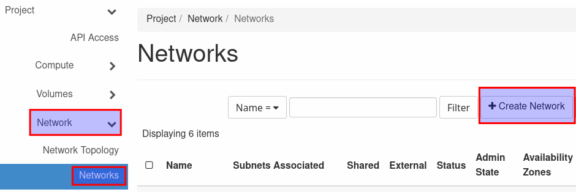
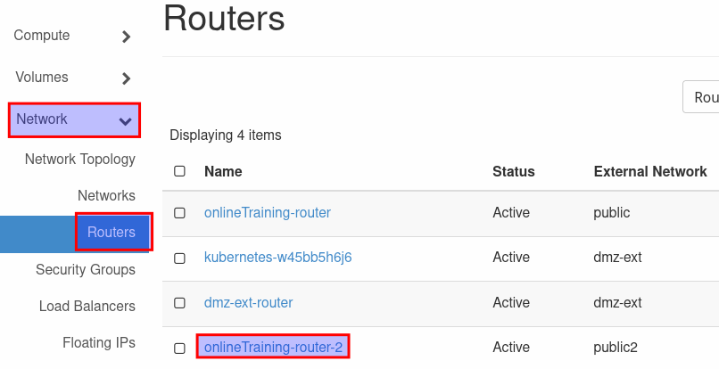
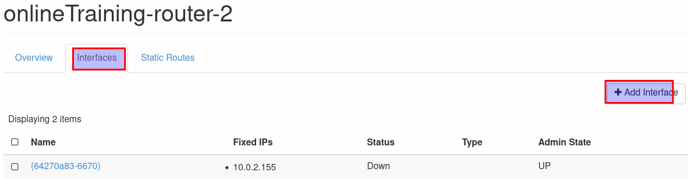
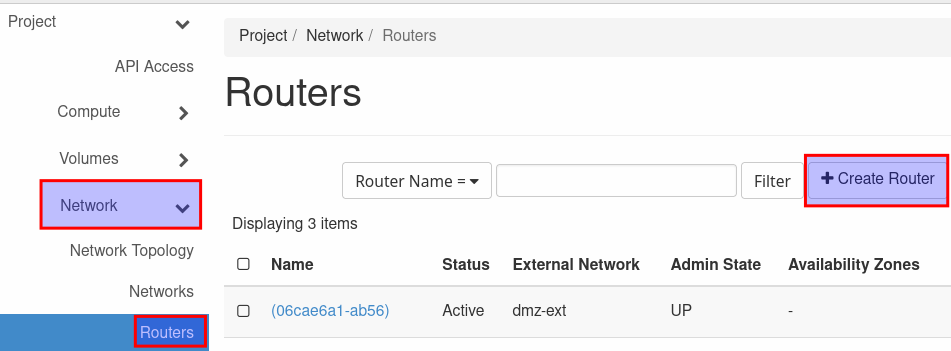
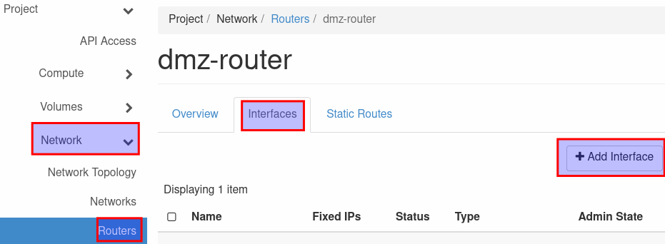

# Documentation for setup of secure web-service with reverse-proxy and load balancer in the de.NBI cloud site in Berlin

This guide will explain how to setup a web-service behind a reverse proxy in the de.NBI cloud site in Berlin. If you want to setup a similar structure in another site, please refer to the tutorial for that site, as this tutorial is only applicable to the de.NBI cloud site in Berlin. The reverse proxy will only be accessible over a load balancer from the internet. The web-service itself is secured in a separated network and only specific ports for incoming traffic are allowed for the web-service. The ports will be setup with security groups in OpenStack. Only one defined port for the forwarded requests from the reverse-proxy to the web-service and ssh for the configuration will be allowed. For the load balancer there will be a dmz network to secure the access from the load balancer to the reverse-proxy. A guide for the basic setup of a vm can be found in the quick start section of this wiki and will not be provided here.

## Setup the internal network

In the de.NBI cloud site Berlin to use the load balancer in a dmz and secure the web-service in an internal network you firstly need to create the network structure. To do that create a new network with a private address range (10.0.0.0 – 10.255.255.255, 10.0.0.0 – 10.255.255.255, 192.168.0.0 – 192.168.255.255). We will use this network as internal network for the web-service. To create the network go to the OpenStack dashboard and click on 'Network' and on the 'Networks' section. Click on 'Create Network' in the overview. 



Use an easy recognizable name for the internal network (e.g. webservice-internal-network) and a name for the subnet (e.g. webservice-internal-subnet) and fill in the IPv4 address range (e.g. 10.10.0.0/24). The section 'Gateway' and the 'Subnet Details' can be left blank. Click on 'Create' to create the network.


To use the network we must connect it to a router. We use the automatically generated router that already connects the networks 'public2' and the automatically generated network. Got to the 'Routers' section in 'Network' and select the according router. 



In the overview window select the tab 'Interfaces' and click on 'Add Interface' to add another interface to the router. 



Here, select your newly generated network as subnet and leave the 'IP Address' section free. Click on 'Submit' to create the interface. 


## Setup security group

Before we can create the vm for the web service we need a security group that only allows one port to connect the web service to the reverse proxy and the ssh port.
In the OpensStack dashboard go to the section 'Network' and select 'Security Groups'. Click on 'Create New Group' and give the new group an easy recognizable name (e.g. secure-web-service). 


Click on 'Create Security Group' and on 'Add Rule' in the next window. Select 'SSH' from the drop down menu and click on 'Add'. This rule set only allows incoming SSH traffic and all outgoing traffic.


## Setup Web-Service 

Now that we have two separated networks and a security group for the web-service we can setup the vms. At first setup the vm for the web service. Select Image and flavor as needed and select the network we just created (e.g. webservice-internal-subnet). 

Deselect the default security group by clicking on the arrow pointing down and select the new created security group with the arrow up. 

Select your public key or create a new pair if you must and click on 'Launch Instance'. When the vm is created, select 'Associate Floating IP' in the drop down menu in the 'Instances' section to allocate a floating IP. 

Select one from the drop down menu, the correct network should already be selected. Now you should be able to connect to this vm either with Linux terminal, PowerShell or PuTTY.

Connect to your vm with one of the methods mentioned in the Berlin section of the [wiki](https://cloud.denbi.de/wiki/Compute_Center/Berlin/). When you have access to your vm update the system and install the web-service you want to use. When configuring the web-service you likely are given the choice to define a port wich will be open for connections from the outside. The default ports for most applications are 80 for http and 443 for https. To use the reverse proxy we will setup the service with another port. The connection from the outside shall always be made over the reverse-proxy. In our example we will use port 8080 as the open port for the web-service. To illustrate the process we will setup FastAPI in this tutorial. Please feel free to setup your own web-service, as this is only a guide for setting up a service behind a reverse-proxy.

## Setup Reverse-Proxy

Setup a second vm in your project but this time select the automatically generated network and not you own created internal network. Also select the default security group. Everything else can be the same as for your web-service. When finished allocate a floating IP and connect to the vm. 
Now update your system and install nginx:
```console
sudo apt update -y && sudo apt upgrade -y
sudo install nginx -y```

When nginx is installed check if it is running:
```console
sudo systemctl status nginx
```

It should start automatically, if not you can setup the start with systemboot and start it now by issuing the following command:
```console
sudo systemctl enable nginx --now
```

After the installation you need to configure the server for nginx to listen on Port 80 and depending on your setup on port 443 and forward the incoming requests to the web-service. 
To do that, you can change the existing file ```/etc/nginx/sites-available/default```. Search for the section 
```conf
server {
    listen 80 default_server;
    listen [::]:80 default_server;

    root /var/www/html;

    index index.html index.htm index.nginx-debian.html;

    server_name _;

    location / {
            try_files $uri $uri/ =404;
    }

}
```


Replace the line ```try_files $uri $uri/ =404;``` with the following:

```conf
            proxy_set_header X-Real-IP $remote_addr;
            proxy_set_header X-Forwarded-For $proxy_add_x_forwarded_for;
            proxy_set_header X-NginX-Proxy true;
            proxy_pass http://<internal_ip_address_of_web_service>:8080;
            proxy_ssl_session_reuse off;
            proxy_set_header Host $http_host;
            proxy_cache_bypass $http_upgrade;
            proxy_redirect off;
```

Replace the </internal_ip_address_of_web_service>/ with the actual internal IP address of your web-service (e.g. 10.10.0.232), the port should be the one you used for your web-app. When all ist setup, restart the nginx service:
```console
sudo systemctl restart nginx
```

## Security groups port

Before you can reach the web-service from the reverse-proxy the security group of the web-service must be configured with the ip address of the reverse-proxy and the defined port. 
To create a new rule click on 'Network' and select 'Security Groups' here click on 'Manage Rules' for the security group associated to your web-service. 


Click on 'Add Rule' in the next window and fill in the information for the new rule. Select 'Custom TCP Rule' and enter port 8080 (or the port you defined for the web-service). In the section 'CIDR' fill in the IP address of the reverse proxy with the subnet mask length as shown in the image (e.g. 10.0.2.71/24). Now click on 'Add' to add the rule to the security group. 


## DMZ network

In the de.NBI cloud site Berlin to use the reverse-proxy with a load balancer you first need an internal demilitarized zone (dmz) network. This can be created the way you did before. So select 'Network' in the dashboard and then 'Networks' again. In the next window click on 'Create Network' to open the network creation panel.

Give the network the name 'dmz-int' and name the subnet 'dmz-int-subnet'. Now use a private IP address range that is not already in use (e.g. 10.0.10.0/24) and leave everything else free. Click on 'Next' and 'Create' in the last window. When the network is created, you need to create another router which connects the dmz-int network you just created to the dmz-ext network which is created automatically. 
Click on 'Routers' in the 'Network' section and select 'Create Router'. 



Give the route a recognizable name (e.g. dmz-router) and select the network 'dmz-ext' as external network. Now go to 'Routers' in the 'Network' section and go to the 'Interfaces' tab. Here click on 'Add interface' to add another interface for the dmz-int network. 



Select the subnet 'dmz-int' and fill in the last possible ip address in this range (e.g.10.0.10.254). Click on 'Submit' to create the interface.


## Load-Balancer

Now you can create a load balancer. Click on 'Load Balancer' in the 'Network' section and click on 'Create Load Balancer' to open the creation panel. 


Give the load balancer a recognizable name (e.g. web-service-lb) and select the subnet 'dmz-int' you created for the dmz. In the next window you will create the first listener for the load balancer. In this case it is the listener for port 80. Name it 'http' select 'TCP' as protocol and port 80 (even if it is possible to choose "HTTP" as protocol, it must be "TCP" here). 


Next create a pool, name it 'http' and select 'LEAST CONNECTIONS' as 'Algorithm'. 


Add the reverse-proxy as an allocated member and fill in port 80. 


Name the monitor 'http' again and use 'TCP' in the section 'Type'. Now click on 'Create Load Balancer' to create it. 


Now you can add another listener for https to the load balancer if you want. Select the load balancer you want to create the listener for and select the 'Listeners' tab. Click on 'Create Listener' to open the listener creation panel. 


As before use 'https' as name and select 'TCP' as protocol now use 443 as port. Name the pool 'https' and select the algorithm 'LEAST CONNECTIONS'. Select the reverse-proxy as a pool member and fill in port 443. Name the monitor https and select the type 'TCP'. By clicking on 'Create Listener' you create the listener for https. To make the load balancer reachable from the internet you need to associate a floating ip. With the public ip of your project comes a floating ip for the load balancer. This floating ip must be selected here to map the public ip to the load balancer. When the floating ip is associated your web-service should be reachable with a browser over the public IP or a FQDN if you have registered one for the IP address.

