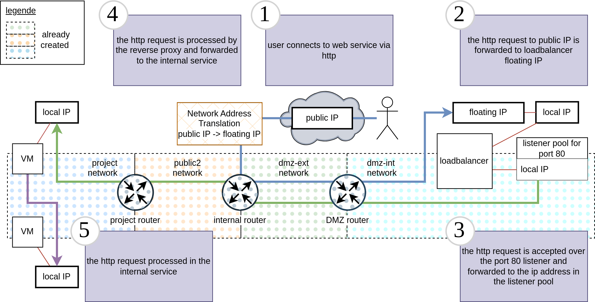
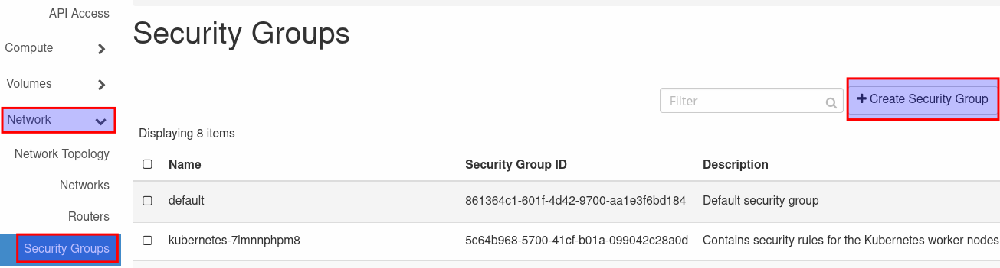
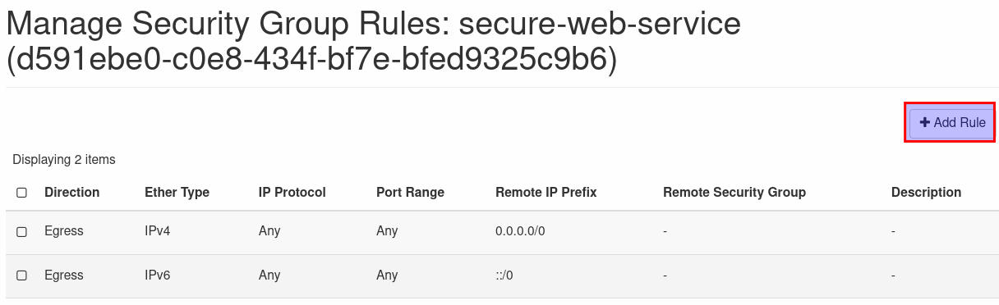
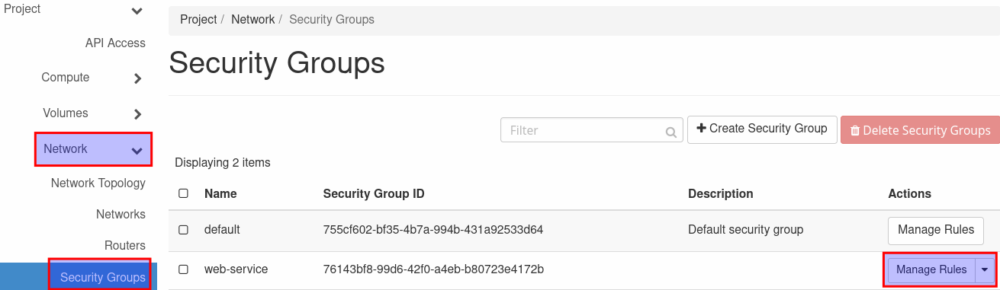
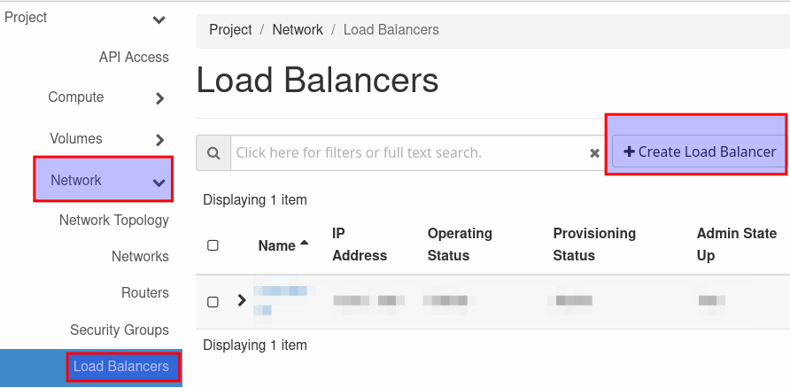
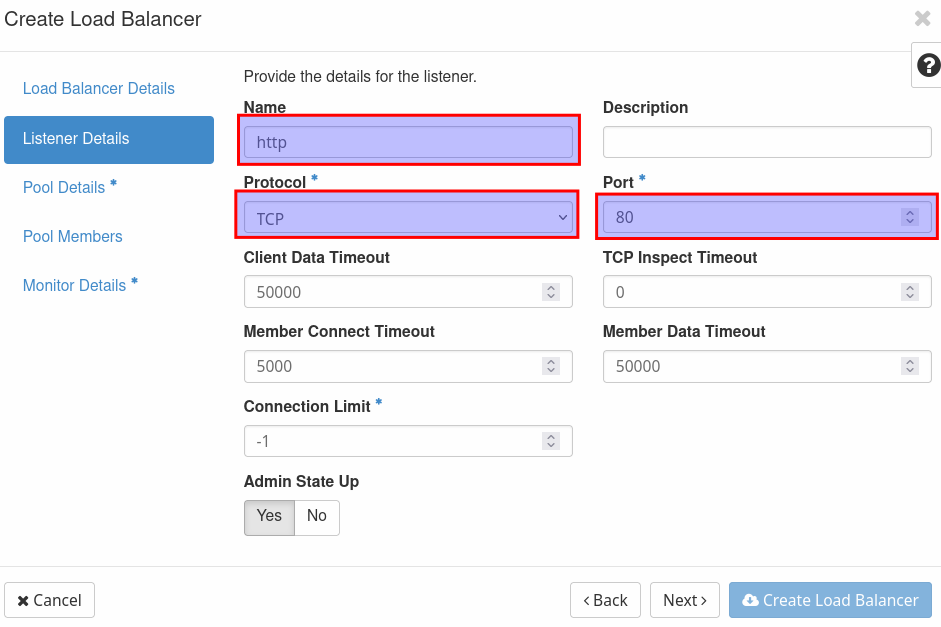
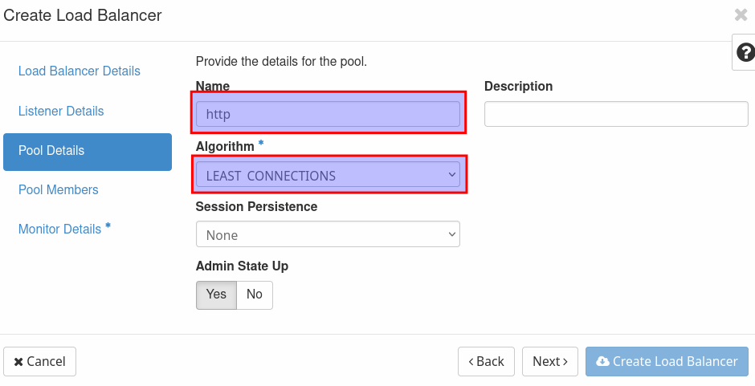
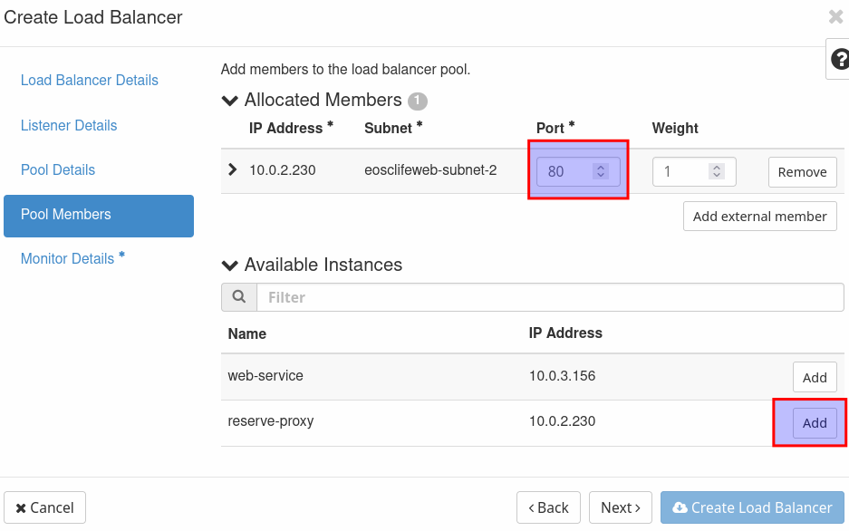
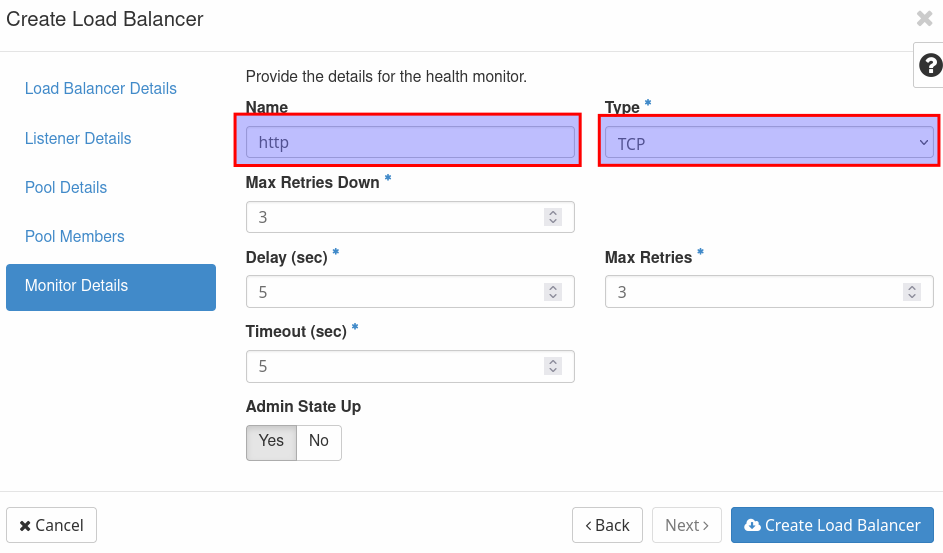
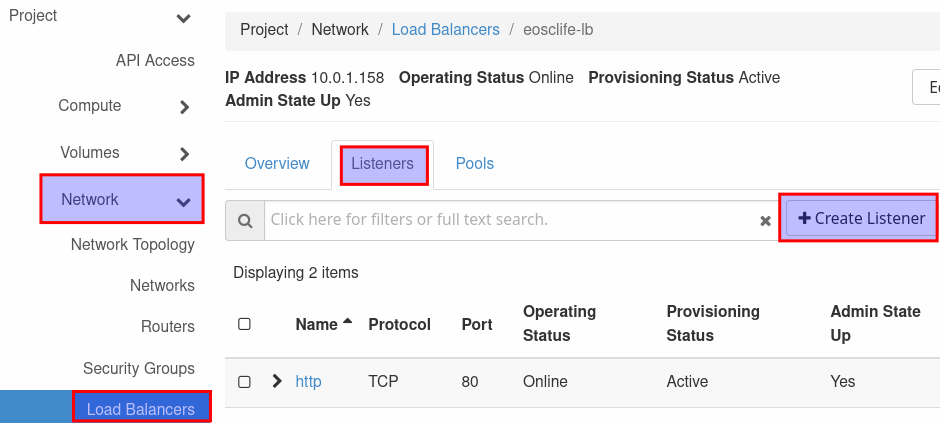

# Documentation for setup of secure web-service with reverse-proxy and load balancer in the de.NBI cloud site in Berlin

> [!IMPORTANT]
> Preparation: You have one running vm for the reverse-proxy and one running vm for the web-service. Both vms are supposed to be connected to the default network. If you do not have set this up, follow this [guide](https://cloud.denbi.de/wiki/Compute_Center/Berlin/).

This guide will explain how to setup a web-service behind a reverse proxy with an internal load balancer in the de.NBI cloud site Berlin to make the web-service accessible from the internet. For an overview of how the setup looks like in the end take a look at the graphic.



> [!TIP]
> - If you want to setup a similar structure in another site, please refer to the tutorial for that site, as this tutorial is only applicable to the de.NBI cloud site in Berlin. 
> - In this tutorial you will learn to setup an infrastructure with a public IP. To use a public ipv4 address and the dmz network you need to apply for them. If you have not already done so with your project application please write us an email to denbi-cloud@bih-charite.de. 

> [!WARNING]
> Please make sure to read the security section when opening your infrastructure to the internet as you are responsible for everything happening in your project.

## Setup security group

> [!NOTE]
> To allow only a specific port to be used, create a new security group, add the used port (e.g. port 80) and add it to the vm. By default even ports 80 and 443 are blocked by the "default" security group.

1. Go to the section 'Network' and select 'Security Groups'. Click on 'Create New Group' and give the new group an easy recognizable name (e.g. secure-web-service). 



Click on 'Create Security Group' and on 'Add Rule' in the next window. Select 'HTTP' from the drop down menu and click on 'Add'. This rule set only allows incoming http traffic and all outgoing traffic.

2. Add the security group to the existing vm for the reverse-proxy to make it accessible over port 80.




## Setup Web-Service 

1. Setup the web service you want to use and add a security group to it with the port you want to use to access it. 

> [!NOTE]
> The connection to the web service from the internet should always go over the reverse-proxy, so you could also set up another port like 8080 for the internal service. If you do so, make sure to add the port to the security group attached to the vm.

## Setup Reverse-Proxy

1. Setup the reverse-proxy on the other vm, so that web service and reverse proxy are not running on the same vm. In this tutorial nginx will be used.

2. Update your system and install nginx:

```bash
sudo apt update -y && sudo apt upgrade -y
sudo install nginx -y
```

When nginx is installed check if it is running:

```bash
sudo systemctl status nginx
```

It should start automatically, if not you can setup the start with systemboot and start it now by issuing the following command:

```bash
sudo systemctl enable nginx --now
```

3. After the installation you need to configure the server for nginx to listen on Port 80 and depending on your setup on port 443 and forward the incoming requests to the web-service. 
To do that, you can change the existing file ```/etc/nginx/sites-available/default```. Search for the section 
```conf
server {
    listen 80 default_server;
    listen [::]:80 default_server;

    root /var/www/html;

    index index.html index.htm index.nginx-debian.html;

    server_name _;

    location / {
            try_files $uri $uri/ =404;
    }

}
```


Replace the line ```try_files $uri $uri/ =404;``` with the following:

```conf
            proxy_set_header X-Real-IP $remote_addr;
            proxy_set_header X-Forwarded-For $proxy_add_x_forwarded_for;
            proxy_set_header X-NginX-Proxy true;
            proxy_pass http://<internal_ip_address_of_web_service>:8080;
            proxy_ssl_session_reuse off;
            proxy_set_header Host $http_host;
            proxy_cache_bypass $http_upgrade;
            proxy_redirect off;
```

Replace the </internal_ip_address_of_web_service>/ with the actual internal IP address of your web-service (e.g. 10.10.0.232), the port should be the one you used for your web-app. When all ist setup, restart the nginx service:
```console
sudo systemctl restart nginx
```

## Security group ip and port

> [!TIP]
> To allow only traffic from the reverse-proxy to the web-service you can add the internal ip address of the reverse-proxy to the security group of the web-service.
 
1. To create a new rule click on 'Network' and select 'Security Groups' here click on 'Manage Rules' for the security group associated to your web-service. 



2. Click on 'Add Rule' in the next window and fill in the information for the new rule. Select 'Custom TCP Rule' and enter port 8080 (or the port you defined for the web-service). In the section 'CIDR' fill in the IP address of the reverse proxy with the subnet mask length as shown in the image (e.g. 10.0.2.71/24). Now click on 'Add' to add the rule to the security group. 

## Load-Balancer

When both services are setup , you can create a load balancer. This can be done over the web UI or via the openstack-cli. To make the openstack-cli available. please follow this [guide](https://cloud.denbi.de/wiki/Compute_Center/Berlin/#openstack-cli).

### Web UI

Click on 'Load Balancer' in the 'Network' section and click on 'Create Load Balancer' to open the creation panel. 



Give the load balancer a recognizable name (e.g. web-service-lb) and select the subnet 'dmz-int'. Leave everything else blanc. In the next window you will create the first listener for the load balancer. In this case it is the listener for port 80. Name it 'http' select 'TCP' as protocol and port 80 (even if it is possible to choose "HTTP" as protocol, it must be "TCP" here). 



Next create a pool, name it 'http' and select 'LEAST CONNECTIONS' as 'Algorithm'. 



Add the reverse-proxy as an allocated member and fill in port 80. 



Name the monitor 'http' again and use 'TCP' in the section 'Type'. Now click on 'Create Load Balancer' to create it. 



To make the load balancer reachable from the internet you need to associate a floating ip. With the public ip of your project comes a floating ip for the load balancer. This floating ip must be selected here to map the public ip to the load balancer. When the floating ip is associated your web-service should be reachable with a browser over the public IP or a FQDN if you have registered one for the IP address.

#### https listener

> [!TIP]
> - We recomment that you always use a secure conntection with https for your web services. For this to work, you need to setup a certificate in the reverse proxy. Please follow this [guide](https://certbot.eff.org/instructions?ws=nginx&os=snap) for a setup with letsencrypt. 
> - By default ports 80 and 443 are open for public IPs.
> - Nginx must be setup properly to use the certificate and allow connections over port 443.

You can add another listener for https to the load balancer. Go to network and loadbalancers and select the loadbalancer you want to create the additional listener for. Select the 'Listeners' tab, click on 'Create Listener' to open the listener creation panel. 



Name the listener 'https' and select 'TCP' as protocol, now use 443 as port. Name the pool 'https' and select the algorithm 'LEAST CONNECTIONS'. Select the reverse-proxy as a pool member and fill in port 443. Name the monitor https and select the type 'TCP'. By clicking on 'Create Listener' you create the listener for https. 


### openstack-cli

You can also use the openstack-cli API to create and assign the loadbalancer to an internal VM. To setup the openstack-cli follow this [guide](https://cloud.denbi.de/wiki/Compute_Center/Berlin/#openstack-cli). When you setup the environment you additionally need to install the clinet to controll the loadbalancer.

```term
pip install python-octaviaclient
```

To Create the loadbalancer, you need some information. The name of your project, the name of the dmz-int network to that you need to connect your loadbalancer, a name for the loadbalancer, the IP of the vm interface you want to attach the loadbalancer to and the floating IP that mapps the public IP to access your service from the internet. To make the setup easier you can just define variables in the terminal to use in the configuration. THe floating IP will be given to you when you apply for an public IP for your project. 

```bash
export ProjectName="MyProject"
export NetworkName="dmz-int"
export LoadbalancerName="MyProject-Loadbalancer"
export InternalIP="10.0.0.20"
export FloatingIP="172.0.0.20"
```
When you have setup this variables you can begin to define the project and network ID.

```bash
# get the prorect UUID
export ProjectUUID=$(sed "s/$ProjectName$//" <<< $(openstack project list -f value | grep $ProjectName))
# get nework
export NetUUID=$(sed "s/$NetworkName$//" <<<  $(openstack network list --project $ProjectUUID -c Name -c ID -f value | grep $NetworkName))
export SubnetUUID=$(openstack subnet list --network $NetUUID -c ID -f value)
```

With these information you can now create a loadbalancer for the defined project in the defines subnet with the defined loadbalancer name.

```bash
# create loadbalancer
openstack loadbalancer create --name $LoadbalancerName --vip-subnet-id $SubnetUUID --project $ProjectUUID --wait
```

When the loadbalancer is created you can retreive the ID of the loadbalancer to create the first listener for the loadbalancer. In this case we will be creating a listener for the http default port 80.

```bash
# create listener
export LBUUID=$(openstack loadbalancer list --name $LoadbalancerName -c id -f value)
openstack loadbalancer listener create --name http --protocol TCP --protocol-port 80 $LBUUID --wait
```

Now that the listener is created we need its ID to create a member pool for this listener. The member pool is later used to connect the interface of the vm to the loadbalancer.


```bash
# create pool
export ListenerUUID=$(openstack loadbalancer listener list -c id -f value --loadbalancer $LBUUID)
openstack loadbalancer pool create --name http-pool --lb-algorithm LEAST_CONNECTIONS --listener $ListenerUUID --protocol TCP --wait
```

To connect the loadbalancer to the vm we need the loadbalancer member pool ID from the pool we just created and the subnet ID from the internal subnet to which the vm is directly connected. The default network that is crated when your project is created is named after your project. The subnat to this network is then called ```MyProject-subnet-2``` in this case. You can use this name to get the ID of the subnet to that your vm is connected. In case you use another network that you created, you need to use the networkname to find the subnet ID. Use the internal IP, that is defined for the interface of your vm for the variable ```$InternalIP```.

```bash
# add member to pool
export PoolUUID=$(openstack loadbalancer pool list -c id -f value --loadbalancer $LBUUID)
export SubnetUUID=$(openstack subnet list -c ID -f value --name ${ProjectName}-subnet-2)
openstack loadbalancer member create --subnet-id $SubnetUUID  --address $InternalIP --protocol-port 80 $PoolUUID --wait
```
Now the loadbalancer should be ready to use. To make it accessible from the internet you need to allocate the floating IP that were given to you this the public IP to the vip_port of the loadbalancer. So first you need the corresponding port ID and then you can allocate the floating IP.

```bash
# add floating IP
export PortUUID=$(openstack loadbalancer show  -c vip_port_id -f value $LBUUID)
openstack floating ip set --port $PortUUID $FloatingIP
```

Now your service should be accessible over the internet. 
