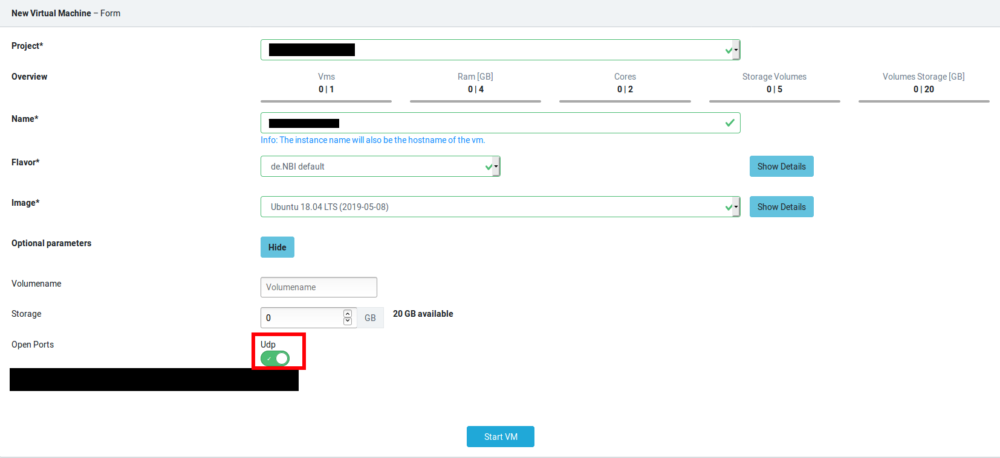
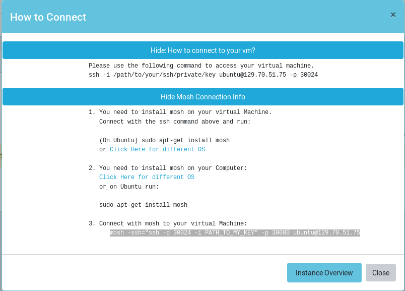
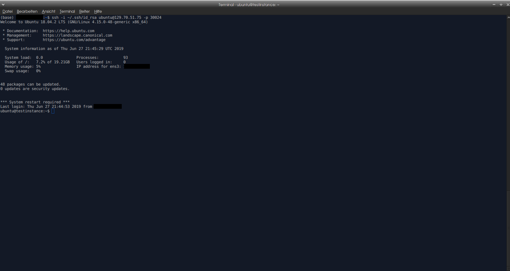
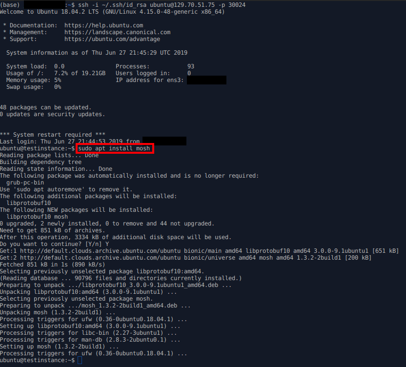
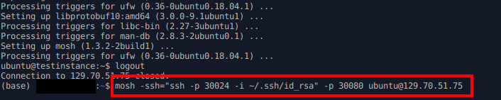

# Mosh Tutorial for SimpleVM
Version from 28.06.2019

### Introduction
[Mosh](https://mosh.org/) is a tool used to connect from a client computer to a server over the Internet, to run a remote terminal. Mosh is similar to SSH, with additional features meant to improve usability for mobile users. The major features are:

* Mosh maintains its session even when "roams" (when the client endpoint changes to different IP addresses), for example by moving to a different Wi-Fi network or when changing from Wi-Fi to 3G.
* Mosh maintains the terminal session (not "connection" in the TCP-sense because Mosh uses UDP) even when a user loses their Internet connection or puts their client to "sleep." In comparison, SSH can lose its connection in such cases because TCP times out.
* Mosh client attempts to be responsive to keyboard events (typing, erasing characters with the delete key, and so on) without waiting for network lag. It uses an adaptive system that predicts whether the application running on the server will decide to echo the user's keystrokes or deletions.

#### Prerequisites
To follow this Tutorial exactly, you need Ubuntu on your Computer and you have to be a member of a SimpleVM Project. If you are not a member of a SimpleVM Project, you can find information on how to apply in the "New Application Tab" in the Cloud Portal or in the Portal Tab in this Wiki.  
Further, we chose an Ubuntu 18.04 LTS image in the "New Instance" Tab for our Virtual Machine.  
In case you operate on another System and/or choose an other image for your Virtual Machine, the Steps will be generally the same but how to install Mosh is going to differ. Information on how to install Mosh for different Operating Systems can be found [here](https://mosh.org/#getting).

#### Open UDP Ports
When starting a Virtual Machine, you have the option to open UDP Ports by clicking on the UDP switch-button which you can find under Optional Parameters.

You need to turn on UDP Ports, as Mosh will not work without it!

#### Install Mosh on your Computer
Before you can connect to your Virtual Machine by using Mosh, you need to install Mosh on your Computer and on your Virtual Machine. In the following we will show you how to install Mosh on Ubuntu. If you have an other Operating System e.g. macOS, Android, iOS or Windows, you can find further information [here](https://mosh.org/#getting).
To install Mosh on your Ubuntu, simply run:
```
sudo apt install mosh
```

#### Install Mosh on your Virtual Machine
As said above, you also need to install Mosh on your Virtual Machine. For this Tutorial we chose Ubuntu 18.04 LTS as the image running on our Virtual Machine.
First, connect to your VM like specified in the How to connect to your vm Tab:

In our case we need to use ssh:
```
ssh -i /path/to/your/ssh/private/key ubuntu@129.70.51.75 -p 30024
```
And are connected to our Virtual Machine:


Next, we need to install Mosh:
```
sudo apt install mosh
```

Again: If you chose a different image with a different Operating System, you might have to look [here](https://mosh.org/#getting).

Now, if you have installed Mosh on your Computer and on your VM, you can exit your VM (usually by running exit or CTRL-D).

#### Connect to your Virtual Machine with Mosh
Next to the How to connect to your vm Tab, you can find a Mosh Connection Info Tab. As we already executed Step 1 and Step 2 by following this Tutorial, we are interested in the mosh command given in Step 3.

In our case we have to run
```
mosh -ssh="ssh -p 30024 -i PATH_TO_MY_KEY" -p 30080 ubuntu@129.70.51.75
```
and are connected to our Virtual Machine with Mosh.

