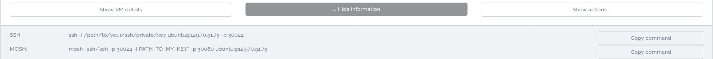

# Mosh Tutorial for SimpleVM
Version from 28.06.2019

### Introduction
[Mosh](https://mosh.org/) (short for mobile shell) is a replacement for interactive SSH terminals. It is a remote terminal application which provides some benefits:

* Mosh automatically roams as you move between internet connections. Use Wi-Fi on the train, Ethernet in a hotel, and LTE on a beach: you'll stay logged in.
* With Mosh, you can put your laptop to sleep and wake it up later, keeping your connection intact. If your internet connection drops, Mosh will warn you — but the connection resumes when network service comes back.
* Mosh gives an instant response to typing, deleting, and line editing. It does this adaptively and works even in full-screen programs like emacs and vim. On a bad connection, outstanding predictions are underlined so you won't be misled.  

For more information visit the [Mosh Homepage](https://mosh.org/)
#### Prerequisites
To follow this tutorial, you need Ubuntu on your computer and you have to be a member of a SimpleVM project. If this is not the case, you can find information on how to apply in the "New Application Tab" on the de.NBI Cloud Portal website or in the Portal Tab in this Wiki.  
Further, we chose an Ubuntu 18.04 LTS image in the "New Instance" Tab for our virtual machine.  
In case you operate on a different system and/or choose an other image for your virtual machine, the steps will be generally the same but how to install Mosh is going to differ. Information on how to install Mosh for different operating systems can be found [here](https://mosh.org/#getting).

#### Open UDP Ports
When starting a virtual machine, you have the option to open UDP ports by clicking on the UDP switch-button which you can find under **Optional Parameters**. 


As Mosh uses UDP to establish a SSH connection (SSH requires TCP), UDP has to be enabled when creating the virtual machine. You need to turn on UDP Ports, otherwise Mosh will not be working! 

#### Install Mosh on your Computer
Before you can connect to your virtual machine by using Mosh, you need to install Mosh on your computer and on your virtual machine. In the following we will show you how to install Mosh on Ubuntu. If you have a different operating system e.g. macOS, Android, iOS or Windows, you can find further information [here](https://mosh.org/#getting).
To install Mosh on your Ubuntu, simply run:
```
sudo apt install mosh
```

#### Install Mosh on your Virtual Machine
You have two ways of installing Mosh on your virtual machine:

1. By having it installed on vm creation, [see](./new_instance.md#mosh-udp-ports).

2. Installing it manually:  
For this Tutorial we chose Ubuntu 18.04 LTS as the image running on our virtual machine.
First, connect to your VM. Information on how to connect can be cound on the [instance overview](./instance_overview.md#8-how-to-connect) and on the [instance detail page](./instance_detail.md#general-information)
In our case we need to use ssh:
```
ssh -i /path/to/your/ssh/private/key ubuntu@129.70.51.75 -p 30024
```
And are now connected to our virtual machine:
  
Next, we need to install Mosh:
```
sudo apt install mosh
```

Again, if you chose a different image with a different operating system, you might have to look [here](https://mosh.org/#getting).  
Now, if you have installed Mosh on your computer and on your VM, you can exit your VM (usually by running exit or CTRL-D).

#### Connect to your Virtual Machine with Mosh
On the instance overview we find our mosh connection information.


In our case we have to run
```
mosh -ssh="ssh -p 30024 -i PATH_TO_MY_KEY" -p 30080 ubuntu@129.70.51.75
```
and are connected to our virtual machine via Mosh. The first -p <portnumber> is the TCP port (for SSH) and the second -p <portnumber> after the "PATH_TO_MY_KEY") is the UDP port (for Mosh).


