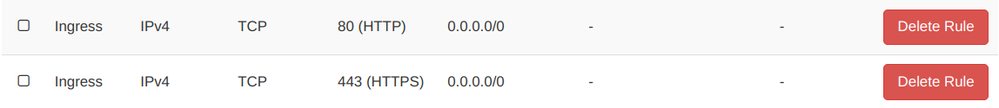
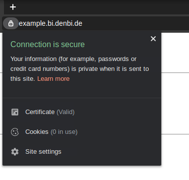
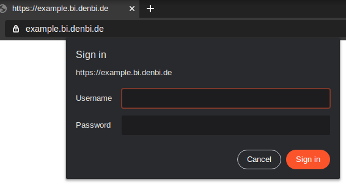

# Secure hosting of a public Web Server

When providing an online service to the public, **encryption** and **authentication** are the two main security aspects to consider.
Neglecting either one of them, could potentially lead to unauthorized access, privacy violations or even server hijacking.

One quick way to encrypt and authenticate is explained below.

It is assumed, that you already have a designated instance running inside the de.NBI Cloud with a public floating IP attached.
Please start the **backend service** (e.g. a Galaxy server) that you would like to make publicly available and configure it to listen on `localhost` or `127.0.0.1` only.

## Domain name registration

Every public website needs a domain name that people can type into their browser address bar to visit the site.
Domain names can usually be obtained from domain name registrars, which is out of scope of this document.

Please make sure your domain name points to the public floating IP of your web server instance.

For the Bielefeld site you may request a domain name ending in `.bi.denbi.de` (e.g. `myservice.bi.denbi.de`) by [contacting us](../../Compute_Center/Bielefeld.md#contact).

## Encryption

Using unencrypted HTTP communication is unsafe because it allows data to be transmitted in plain text,
making it easy for attackers to intercept and read sensitive information.

Therefore, do not expose your HTTP-only-speaking web server software directly, but use an encrypting reverse proxy in front.

TLS encrypts data during transmission, preventing unauthorized access and eavesdropping.
One simple way to use TLS is to place a [Caddy server](https://caddyserver.com/) in between the internet and the backend service you would like to make publicly available.
This way, Caddy will act as a [reverse proxy](https://en.wikipedia.org/wiki/Reverse_proxy) encrypting your traffic. Caddy will automatically provision a free TLS certificate for your domain name through the non-profit certificate authority Let's Encrypt and renew it when necessary.

### Caddy - Installation

Requirements:

- Operating system: Ubuntu/Debian

Execute the following commands on the instance that is going to be hosting the web server:
```
curl -1sLf 'https://dl.cloudsmith.io/public/caddy/stable/gpg.key' | sudo gpg --dearmor -o /usr/share/keyrings/caddy-stable-archive-keyring.gpg
curl -1sLf 'https://dl.cloudsmith.io/public/caddy/stable/debian.deb.txt' | sudo tee /etc/apt/sources.list.d/caddy-stable.list
sudo apt update
sudo apt install caddy
```

The Caddy server should now be installed and running.

Source: [Caddy installation steps for Ubuntu/Debian](https://caddyserver.com/docs/install#debian-ubuntu-raspbian)

### Caddy - Reachability

To make your Caddy server publicly reachable, outside access to the network ports `80` (HTTP) and `443` (HTTPS) has to be granted.

- Launch the OpenStack Dashboard
- In the menu on the left go to `Network` -> `Security Groups`
- Click on the button `+ Create Security Group`
- Name the new security group "public-web-server" and confirm the creation by clicking on `Create Security Group`

Now the security group rules list should be visible.

- Click on `+ Add Rule`
- Select "**HTTP**" as the `Rule`
- Enter "0.0.0.0/0" as the `CIDR` and click on `Add`

- Click on `+ Add Rule` again
- This time select "**HTTPS**" as the `Rule`
- Enter "0.0.0.0/0" as the `CIDR` and click on `Add`

The result should look like this:



Next, the security group needs to be added to the instance hosting your web server.

- In the menu on the left go to `Instances`
- Find your instance and select `Edit Security Groups` from its `Actions` drop-down list
- Add your new security group "public-web-server" to the list of Instance Security Groups by clicking on the `+` next to it, then click `Save`

The Caddy server should now be publicly reachable via HTTP on port `80` and serve its default web page.

### Caddy - Configuration

This section will configure the Caddy server to set up TLS and to proxy requests to your backend service.

Requirements:

- A domain name pointing to the public floating IP of your web server instance.
- A backend service that you would like to make public (e.g. a Galaxy server) listening on `localhost` or `127.0.0.1`.

Replace the contents of `/etc/caddy/Caddyfile` on your instance with the snippet below.
Replace `example.bi.denbi.de` with your own domain name and replace port `8080` with the port the
backend service is listening on.

`/etc/caddy/Caddyfile`
```
example.bi.denbi.de {
  reverse_proxy 127.0.0.1:8080
}
```

Reload the Caddy server:
`sudo systemctl reload caddy`

Afterwards, you should be able to access your backend service by simply entering the domain name (without any port).
Your browser should now indicate that the connection is secure, as seen below.



## Authentication

It is strongly advised to **make use of the authentication and user management features** your backend service provides.

In case the web server you make public does not offer any authentication methods,
**access must be regulated** by telling the Caddy server to ask visitors for their username and password.
Users are managed inside the Caddy server configuration file.
To create a new user, e.g. `alice`, generate a password hash using 

```
caddy hash-password
```

on the command line.
Add the username and the password hash by creating a new `basicauth` section as seen below.

`/etc/caddy/Caddyfile`
```
example.bi.denbi.de {
  reverse_proxy 127.0.0.1:8000
  basicauth / {
    alice $2a$14$osbZTr.aovwDoO8WULE7hu0rF8YbrZt5Ltp0W.tIARgkE8525HLCG
  }
}
```

To add more users, simply add more lines to the `basicauth` section:

```
  basicauth / {
    alice $2a$14$osbZTr.aovwDoO8WULE7hu0rF8YbrZt5Ltp0W.tIARgkE8525HLCG
    bob $2a$14$INrlWVMNeuULZYnkVIBclefLHGmXLB.WQdKQGr/FjpeJYDrmGUN1e
    carol $2a$14$nPEUHsqMDS7YfuVzo1n3iecRBexUI9wQINymbnedI0iG4E.Pchfe6
  }
```

Finally, reload the Caddy server: `sudo systemctl reload caddy`

Visitors should now be prompted for username and password:


