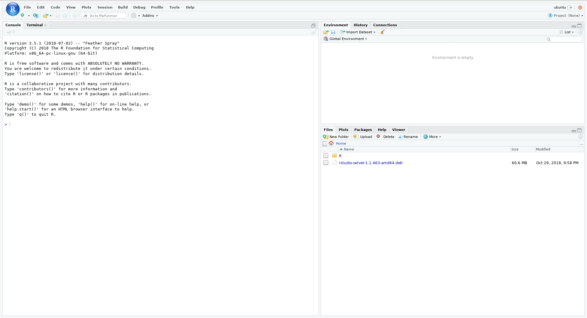

# Running RStudio Server in de.NBI Cloud
Tested with Simple VM Ubuntu 18.04 LTS

Version from 03.12.2018

## 1. Aim
This beginner tutorial shows you how to install and run RStudio Server to develop and run your R data analysis on the de.NBI Cloud. This tutorial is meant for beginner users working with the Simple VM for creation of new VM instances.

## 2. Requirements
* Member of a Simple VM project in the de.NBI Cloud. More information how to apply for access can be found here: ([https://www.denbi.de/cloud](https://www.denbi.de/cloud), [Project allocation](/portal/allocation/))
* An already running instance of a virtual machine (VM) in the de.NBI Cloud running on Ubuntu 18.04
* Access to the de.NBI Cloud via SSH

## 3. Overview
Basically these are the steps to install and configure your RStudio Server in the de.NBI Cloud
* Connect to a virtual machine (VM) in the de.NBI Cloud with port forwarding
* Install R on the VM
* Install RStudio Server on the VM
* Connect to newly installed RStudio Server

## 4. Step by Step Tutorial
Connect to de.NBI Cloud VM with locally forwarded ports via SSH. 

```
ssh -i new_id ubuntu@ip-address -p some_number -L 8787:localhost:8787
```

Here ``new_id`` is your private key file. The default user is ``ubuntu``. You have to specify the cloud VM’s IP address and port number. You can look up your IP and port number of your VM in de.NBI Cloud Portal. The numbers behind the ``@`` symbol are the IP address of your cloud VM. The parameter ``-p some_number`` is the port number of your cloud VM. The parameter ``-L 8787:localhost:8787`` means that the port 8787, which will be used by RStudio Server, will be forwarded to your local machine (localhost) at the port 8787.

We are now connected to the VM in the Cloud. Let’s install R (Version 3.5)!

Add R CRAN repository to your VM by modifying the file ``/etc/apt/sources.list`` . You could do this by hand in a texteditor or by copy&pasting the code below

```
echo -e "deb https://cloud.r-project.org/bin/linux/ubuntu bionic-cran35/ \n" | sudo tee --append /etc/apt/sources.list
```

Now we add the GPG key from R CRAN repository to allow downloading from the R repository

```
sudo apt-key adv --keyserver hkp://keyserver.ubuntu.com:80 --recv-keys 51716619E084DAB9
```

It’s time to update your software repositories to get the latest R version

```
sudo apt-get update
```

We are now able to install the latest R release

```
sudo apt-get install r-base
```

Next, we need to download and install RStudio Server. First install ``gdebi`` as it will allow us to install a deb-file with all dependencies

```
sudo apt-get install gdebi-core
```

In the next step we download the RStudio Server deb-File. To get the latest RStudio version check ([https://www.rstudio.com/products/rstudio/download-server/](https://www.rstudio.com/products/rstudio/download-server/)) as the file might change over time.

```
wget https://download2.rstudio.org/rstudio-server-1.1.463-amd64.deb
```

When the download has finished, we install RStudio Server with 

```
sudo gdebi rstudio-server-1.1.463-amd64.deb
```

So, now your RStudio server is installed and should be running. It should show something like the following after the installation:

```
Active: active (running)
```

We can now connect to the RStudio Server with any normal Linux system user on the VM. If you haven’t created additional users next to the default user ``ubuntu`` we need to set the password for user ``ubuntu``. By default no password for user ``ubuntu`` is set, but RStudio requires users to have a password, so we have to set it. Alternatively you could create a new user with password and use this user with the Rstudio Server.

To set the password for user ``ubuntu`` type in the following command. Afterwards you will be asked to enter a new password.

```
sudo passwd ubuntu
```

Ok, now everything is set up and running! We can now connect to the RStudio Server via our web browser from our local machine (e.g. Laptop). To connect to the RStudio Server open your web browser and enter the following into your browsers’ address bar

```
localhost:8787
```

Login with user ``ubuntu`` (or any other user you created) and your password. Welcome to your RStudio! You can now perform your analyses or install R packages. 

 


**Hint**: If you’ve finished installing all R packages you want to use, create a Snapshot of your VM so you can go back in case something went broke with your VM. You can resume your VM from this Snapshot anytime, so you won’t need to install RStudio Server again.

## 5. Troubleshooting
### 5.1 RStudio Server will not start
If you are unable to access the RStudio server after installation, try the verify command to get some more information what might went wrong

```
sudo rstudio-server verify-installation
```

### 5.2 I’m behind a firewall which doesn’t allow port-forwarding
If port-forwarding to your local machine is not possible, you can try to access RStudio Server from within your VM via a web browser. This is done by X Forwarding. To do so first install Firefox.

```
sudo apt-get install firefox
```

The X Server should install with Firefox, if it has not already been installed. Afterwards disconnect your existing SSH session to your VM by pressing CTRL+D or enter

```
logout
```

Reconnect to your cloud VM with X-forwarding enabled by using parameter ``-X``

```
ssh -X -i new_id ubuntu@ip-address -p some_number -L 8787:localhost:8787
```

At your very first connection using the ``-X`` parameter, the X Server will complain that some files (e.g. ``.ICEAuthority``) have not been created yet. They will be created automatically at your second login. So just close the connection again by pressing CTRL+D or type

```
logout
```

Reconnect again with (just the same command as above)

```
ssh -X -i new_id ubuntu@ip-address -p some_number -L 8787:localhost:8787
```

Now the X Server should work fine. You can now start Firefox by typing 

```
firefox &
```

to your terminal. After a few seconds a Firefox Window should pop up. This is your remote instance of Firefox on the cloud VM. So everything you open here is done in the cloud, not on you local machine.
To connect to the RStudio Server type 

```
localhost:8787
```

in the address bar of the new Firefox window.

### 5.3 I get an “installation of package XYZ had non-zero exit status” error when installing R packages
This is not really in the scope of this tutorial, but we try to help you anyway :-)

The error means, that some development software for retreiving R packages/data is missing on you Ubuntu VM. Probably your Ubuntu installation is missing one or all of these packages: ``libcurl4-gnutls-dev``, ``libssl-dev``, ``libcurl4-openssl-dev``, ``libxml2-dev``

You can install these packages via your SSH terminal with this command

```
sudo apt-get install libcurl4-gnutls-dev libssl-dev libcurl4-openssl-dev libxml2-dev
```
After the installation of these packages, try to re-install the R packages in RStudio Server. Hopefully the error vanished now!

## 6. Further Reading
For more information on RStudio and the RStudio Server please have a look at their documentation at ([https://support.rstudio.com/hc/en-us/categories/200035113-Documentation](https://support.rstudio.com/hc/en-us/categories/200035113-Documentation))
