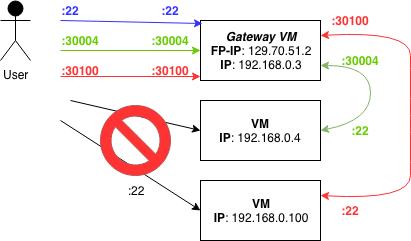
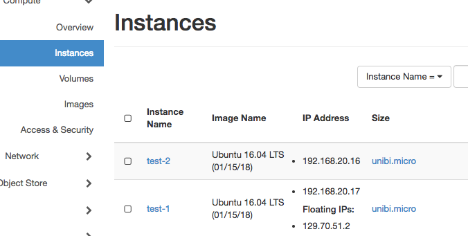
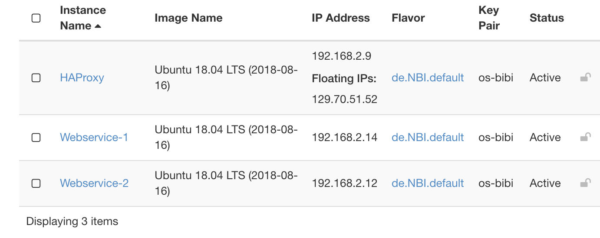
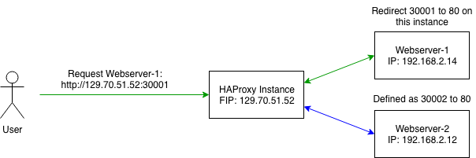
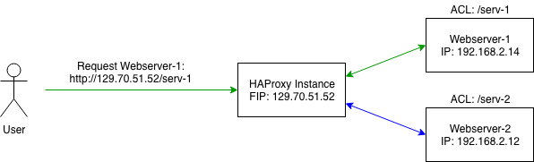

## Saving up on FloatingIPs for your Project!”


## Overview
External FloatingIPs are a rare resource and most projects only have 1 address available. This can be quite
challenging for the user if multiple instances need to be available via the internet.
Luckily there are some tricks and workarounds for this problem:

* Port forwarding via a gateway.
* Proxy service via HAProxy.

A Gateway directly maps its ports to a set of ports on another internal machines in the same network while the HAProxy-solution
acts as a direct proxy for other local instances in the same private network.
The latter is a great option for services that are providing web-resources like REST-APIs.

Both options are explained in the following tutorials.

### Gateway: Configure a single VM with an external IP address to act as gateway for other VMs only having private IP addresses.


The image above explains the basic idea. If I have created three VMs (192.168.0.3, 192.168.0.4 and 192.168.0.100) in my project network (192.168.0.0/24) and I have just one public IP address (129.70.51.2) available, I can access only one VM at once. I can use of course the public available VM as jump host, but this is not very handy for most situations. The idea is to use unneeded ports of the so called *gateway vm* to access the VMs.
  
Linux can be easily configured to act as gateway/router between networks. This linux property is used by a lot of commercial routers. We will now learn how to configure a linux instance to act as a gateway for a complete network. Let's start with a practical example:

To figure out how this can be achieved, start two instances and assign a floating ip to one of them. In my example I started two VMs named test-1 and test-2 and assign the floating ip to the first one.



Log in to the floating IP instance and enable IP forwarding (as root).

```
echo "1" > /proc/sys/net/ipv4/ip_forward
```

Setting this flag to *1* allows the linux kernel to forward IP packages, which is exaxctly what we want to do. We now have to **add nat rules** to allow IP forwarding from *129.70.51.2:30000* to *192.168.20.16:22*, this can be done using *iptables* (also as root).

```
iptables -t nat -A PREROUTING -i ens3 -p tcp -m tcp --dport 30000 -j DNAT --to-destination 192.168.20.16:22
iptables -t nat -A POSTROUTING -d 192.168.20.16/32 -p tcp -m tcp --dport 22 -j SNAT --to-source 192.168.20.17
```

But something is missing :

```
>ssh -i ~/.ssh/openstack/os-bibi.key ubuntu@129.70.51.2 -p 30000
...
ssh: connect to host 129.70.51.2 port 30000: Connection timed out
```

Openstack firewall settings are very strict by default. Therfore, we have to **add a firewall rule** to allow tcp traffic on port 30000 which results in ...

```
>ssh -i ~/.ssh/openstack/os-bibi.key ubuntu@129.70.51.2 -p 30000
Warning: Permanently added '[129.70.51.2]:30000' (ECDSA) to the list of known hosts.
Welcome to Ubuntu 16.04.3 LTS (GNU/Linux 4.4.0-109-generic x86_64)

 * Documentation:  https://help.ubuntu.com
 * Management:     https://landscape.canonical.com
 * Support:        https://ubuntu.com/advantage

  Get cloud support with Ubuntu Advantage Cloud Guest:
    http://www.ubuntu.com/business/services/cloud

40 packages can be updated.
0 updates are security updates.


*** System restart required ***
ubuntu@host-192-168-20-16:~$ 
```

After successfull running our test environment we now write an user-data script that does the job for the whole network at instance startup.

1. wait for metadata server to be available
2. get the CIDR mask from the metadata service
3. enable IP forwarding
4. add forwarding rules for ssh (Port 22), http (Port 80) and https (Port 443) for each available ip address (1 ... 254)
5. create a new security group that opens ports 30000-30765

The full script could look like the following:

```
#!/bin/bash
function check_service {
  /bin/nc ${1} ${2} </dev/null 2>/dev/null
  while test $? -eq 1; do
    log "wait 10s for service available at ${1}:${2}"
    sleep 10
    /bin/nc ${1} ${2} </dev/null 2>/dev/null
  done
}

# redirect ouput to /var/log/userdata/log
exec > /var/log/userdata.log
exec 2>&1

# wait until meta data server is available
check_service 169.254.169.254 80

# get local ip from meta data server
LOCALIP=$(curl http://169.254.169.254/latest/meta-data/local-ipv4)
LOCALNET=$( echo ${LOCALIP} | cut -f 1-3 -d".")

#enable ip forwarding
echo "1" > /proc/sys/net/ipv4/ip_forward

# Map port number to local ip-address
# 30000+x*3+0 -> LOCALNET.0+x:22
# 30001+x*3+1 -> LOCALNET.0+x:80
# 30002+x*3+2 -> LOCALNET.0+x:443
# x > 0 and x < 255


#ip forwarding rules
for ((n=1; n <=254; n++))
        {
        SSH_PORT=$((30000+$n*3))
        HTTP_PORT=$((30001+$n*3))
        HTTPS_PORT=$((30002+$n*3))

        iptables -t nat -A PREROUTING -i ens3 -p tcp -m tcp --dport ${SSH_PORT} -j DNAT --to-destination ${LOCALNET}.${n}:22
        iptables -t nat -A POSTROUTING -d ${LOCALNET}.${n}/32 -p tcp -m tcp --dport 22 -j SNAT --to-source ${LOCALIP}

        iptables -t nat -A PREROUTING -i ens3 -p tcp -m tcp --dport ${HTTP_PORT} -j DNAT --to-destination ${LOCALNET}.${n}:80
        iptables -t nat -A POSTROUTING -d ${LOCALNET}.${n}/32 -p tcp -m tcp --dport 80 -j SNAT --to-source ${LOCALIP}

        iptables -t nat -A PREROUTING -i ens3 -p tcp -m tcp --dport ${HTTPS_PORT} -j DNAT --to-destination ${LOCALNET}.${n}:443
        iptables -t nat -A POSTROUTING -d ${LOCALNET}.${n}/32 -p tcp -m tcp --dport 443 -j SNAT --to-source ${LOCALIP}
        }
```

### HAProxy: An externally available proxy for accessing project-internal web-resources.

HAProxy is a popular solution for proxying web-resources with the benefit of high-availability and load balancing.
For this tutorial, the proxying part is of interest. Also a plus is the optional usage of SSL-Encryption for all resources with
one single certificate via [SSL Termination](https://www.digitalocean.com/community/tutorials/how-to-implement-ssl-termination-with-haproxy-on-ubuntu-14-04).


We now configure this setup in a practical example:


On the Haproxy-node, install the HAProxy-package (Ubuntu/Debian):
```
sudo apt update
sudo apt install haproxy
```

You can use HAProxy in multiple ways. The following tutorial explains 2 options.
You can find the configuration file for HAProxy in ``/etc/haproxy/haproxy.cfg``.


#### Option 1: Redirect via Ports (safe option)

Just like in the gateway tutorial, the user can access various resources in a private network by redirecting traffic from the
HAProxy-Node to the internal network via ports.

The following image gives a short overview:



Here the user accesses port `30001` on the HAProxy-node. HAProxy then has a configuration which proxys all traffic from `Webserver-1` back to the user.

In this example, we add the following lines to our haproxy.cfg:

```
frontend front_web1
        bind *:30001
        use_backend resource_web1

frontend front_web2
        bind *:30002
        use_backend resource_web2


backend resource_web1
        balance roundrobin
        server web01 192.168.2.14:80

backend resource_web2
        balance roundrobin
        server web02 192.168.2.12:80
```
 
Reload the service with `sudo systemctl reload haproxy`.

This configuration contains multiple parts:

* We added 2 frontends which are listening on different ports. If a binded port is accessed, we redirect the traffic to the designated
internal webservice on target port 80.
* The 2 backends include the internal IP-Addresses of the webserver. You can also add more hosts in a backend if you wish to balance load between those.

#### Option 2: Redirect via URL-Path
This Overview shows the basic idea of this setup:



Here the user wants to access the web-resource of an instance called "Webserver-1". The user can't directly access "Webserver-1" since
this instance only has an internal private IP-address. The user now has configured a HAProxy-node with a rule (ACL) to proxy
requests to a designated resource. The target can be specified via an extended URL (like `/serv-1` to `Webserver-1` in this example).

For this current example, we add the lines under the existing haproxy.cfg:

```
frontend localnodes
        bind *:80
        acl web1 path_beg /serv-1
        acl web2 path_beg /serv-2
        use_backend resource_web1 if web1
        use_backend resource_web2 if web2

backend resource_web1
        balance roundrobin
        reqrep ^([^\ ]*)\ /serv-1(.*)  \1\ \2
        server web01 192.168.2.14:80

backend resource_web2
        reqrep ^([^\ ]*)\ /serv-2(.*)  \1\ \2
        balance roundrobin
        server web02 192.168.2.12:80
```

Reload the service with `sudo systemctl reload haproxy`.

What are we setting here?

* First we add a frontend, which listens to a specified **bind**, here port 80. All further requests on this port land on this frontend.
* If the request URL contains paths like ``/serv-1/``, then redirect me to a specified backend. This is achieved via `acl` rules.
* Each backend has a few options. You can also add more servers to a backend if you wish and balance the load between them.


!!! danger
    The regular expression in each backend is truncating the request URL to the root web path for the backend. Use with caution as it
probably can break the functionality of your webpages. See [here](https://stackoverflow.com/questions/41137494/ha-proxy-rule-404-not-found) for more infos.
    You can also leave out the regular expression but in that case your backend must be able to set a url prefix so that it is able to find the requested resource under the requested path.
