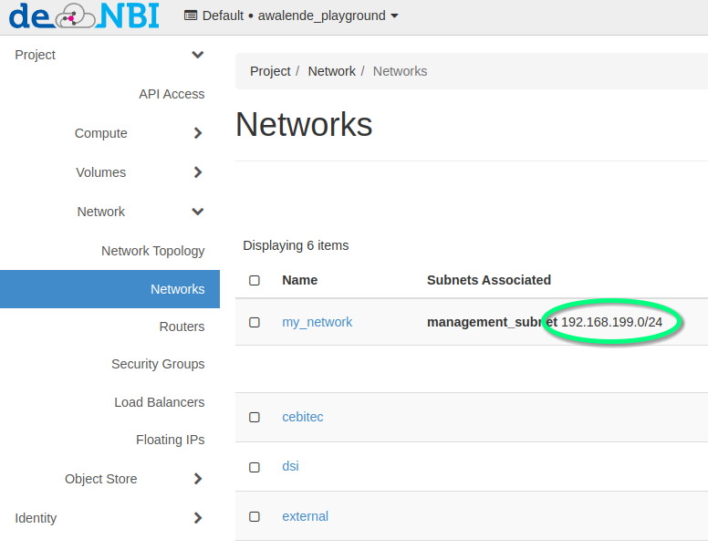

# Sshuttle Tutorial

## Quick Introduction

[Sshuttle](https://github.com/sshuttle/sshuttle) is a small application, which sets up
a transparent proxy/VPN connection to a remote and private network. This can also
include a private network in an OpenStack-Project.
It enables a secure and direct way to access a private network from a local
client, like a laptop.

## Requirements

* Linux or Mac based System. Windows is currently not supported.
* An OpenStack-Project
* One running instance, which holds a FloatingIP-Address
* SSH-Access to that instance

## Installing sshuttle

There is support for various Linux distributions as well as Mac.
The [project](https://github.com/sshuttle/sshuttle) includes installation
guides for all kind of systems.

For Debian based systems:

`sudo apt-get install sshuttle`

For Fedora:

`sudo dnf install sshuttle`

For Mac (via brew):

`brew install sshuttle`

## Sshuttle overview


In this example, `sshuttle` is connected to a single instance in the project
which holds an externally reachable FloatingIP. This instance acts as a
forwarder.

When the `sshuttle` tunnel is established, it intercepts all traffic designated
for the private network of an OpenStack-Project and sends it to the instance with a
FloatingIP. Afterwards, the request is finally forwarded to the target instance.

In effect, it seems like the local client is part of the private network.
The process of intercepting and forwarding traffic is hidden in the background.
This enables a secure way of interacting with all instances via a secure SSH-Tunnel,
therefore there is no need to open additional ports in a Security Group and expose
possible unsecure services onto the internet.

In this given example, the `sshuttle`-Tunnel is created on a local client (ex. Laptop):

```bash
sshuttle -r ubuntu@129.70.51.160 192.168.199.0/24
c : Connected to server.
```

In some scenarios you may have to extend the command to explicitly define the private ssh-keypair:

```bash
sshuttle -e "ssh -i ~/.ssh/os-bibi.key" -r ubuntu@129.70.51.160 192.168.199.0/24
c : Connected to server.
```

Afterwards, you can open a new terminal on your local client and directly access all instances
in your private network. Don't close the session where the `sshuttle`-Process has been established.

```bash
[awalende@myLaptop ~]$ ping 192.169.199.52
PING 192.169.199.52 (192.169.199.52) 56(84) Bytes of data.
64 Bytes from 192.169.199.52: icmp_seq=1 ttl=50 time=176 ms
64 Bytes from 192.169.199.52: icmp_seq=2 ttl=50 time=174 ms
64 Bytes from 192.169.199.52: icmp_seq=3 ttl=50 time=174 ms
```

The components in the command explained:

* `sshuttle -r` indicates to connect to a remote instance.
* `ubuntu@129.70.51.160` is the remote user followed by the FloatingIP address, similar to a regular SSH-Connection.
* `192.168.199.0/24` describes the private network in your OpenStack-Project on which `sshuttle` will react to and forward the traffic to the instance with the FloatingIP.

If you a are struggling to find the definition of your private network, you can look it up
in the OpenStack Dashboard:



In order to shut down the `sshuttle`-Process, switch back to the terminal where the session is running and press `Ctrl+c`. 