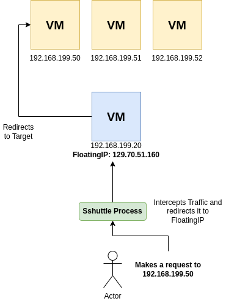

# Sshuttle Tutorial

### Quick Introduction

[Sshuttle](https://github.com/sshuttle/sshuttle) is a small application, which sets up
a transparent proxy/VPN connection to a remote and private network. This can also
include a private network in an OpenStack-Project.
It enables a secure and direct way to access a private network from a local
client, like a laptop.

### Requirements

* Linux or Mac based System. Windows is currently not supported.
* An OpenStack-Project
* One running instance, which holds a FloatingIP-Address
* SSH-Access to that instance

### Installing sshuttle

There is support for various Linux distributions as well as Mac.
The [project](https://github.com/sshuttle/sshuttle) includes installation
guides for all kind of systems.

For Debian based systems:

`sudo apt-get install sshuttle`

For Fedora:

`sudo dnf install sshuttle`

For Mac (via brew):

`brew install sshuttle`

### Sshuttle overview

