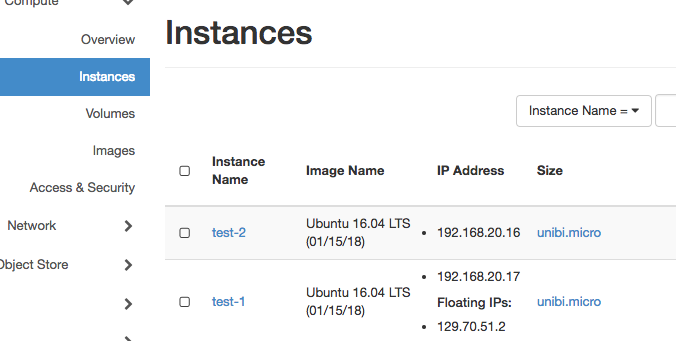

#Cloud for Intermediates - (Meta/User)data

Welcome to the short de.NBI tutorial concerning meta/user data. The goal of this session is to understand what meta data and user data is in cloud context and how it can used to configure virtual machines. The tutorial aims the more advanced cloud user and needs base understanding of the Linux command line and  Linux boot process.

##MetaData
Started Instances must be configured somehow. You normally starts with blank (unconfigured) images in a very dynamic environment, that means :

- different projects	
- different users 
- network setups changes depending on project
- different *hardware* , e.g. additional ephemeral disks

In every situation you want to have a ready to use instance. Openstack (and nearly all other clouds) solves this problem providing meta data to the started instances. Meta data could be provided as instance specific webservice (http://169.254.269.254) or as separate config drive, both possibilities are supported by OpenStack. The way how to propagate meta data is currently a de facto standard established by Amazon Web Services.

Meta data contains all the informations about the instance, needed to configure it :

- name 
- SSH keys
- network informations
- connected volumes
- provided ephemerals
- special puporse hardware

##Cloud-Init
[Cloud-Init](https://cloud-init.io) is a set of scripts bundled in a service utilize the propagated metadata. Cloud-Init is run as startup service and configure the instance during startup. Cloud-Init utilize meta data to:

- setting a default locale
- setting a hostname
- place your propagated public key
- prepare and mount available ephermals
- configure first network device (up + dhcp)

However, software is normally *not* perfect and so Cloud-Init is. Some features are missing in the standard configuration of Cloud-Init:

- only 1st network device is configured
- only 1st ephemeral is prepared and mounted

You can write your own plugin to extend Cloud-Init with the property of your need. There exists many useful (and not so useful) plugins.

Besides meta-data Cloud-Init also utilizes user-data to setup a instance with a user specific configuration (later).

##Cloud-Images
- Base images + cloud-init preinstalled
- Ready to use (in a cloud environment)
- Provided by nearly all Linux distributors, e.g.:
	- [Ubuntu](https://cloud-images.ubuntu.com/)
	- [Debian]()
	- [Fedora](http://cloud.fedoraproject.org/)
	- [CentOS](https://wiki.centos.org/Download#Cloud)
	
##HandsOn - MetaData
Lets start with a warming up

- Start a VM, provide your *own* meta information (k/v pair)
- Assign a floating ip
- Login into VM
- Use curl/wget to get information about instance
    - Name
    - Network
    - Public Keys
- Shutdown 

*Hint: You could also use the openstack command line to provide additional meta-data to your instance.*

##UserData 
When launching an instance in Openstack you have the option to pass user data to the instance. User data can be used to perform common automated  configuration task and even run scripts after the instance start.

*Notice: User data scripts only run during the first boot cycle when an instance is launched.*

### Wait for a service
Since cloud-init is run as boot service, it could be happen that during the execution of the user-data script not all services are yet available. Typically the network or a single network service is not yet ready during execution. Your script must be aware of it and check if a service is available before accessing it. 
A simple bash function can do job :

```
function check_service {
  /bin/nc ${1} ${2} </dev/null 2>/dev/null
  while test $? -eq 1; do
    log "wait 10s for service available at ${1}:${2}"
    sleep 10
    /bin/nc ${1} ${2} </dev/null 2>/dev/null
  done
}
```

If want wait for the meta-data service available we could easily call:

```
check_service 169.254.169.254 80
```


### Logging
Any output  - if not redirected - is written to `/var/log/cloud-init-output.log`.  


##HandsOn - UserData “Hello World”
Time for our first practical example. We want to write a simple script that prints Hello World in a file (e.g. /tmp/helloworld.txt)

``` 
#!/bin/bash
echo “Hello World!” > /tmp/helloworld.txt
```

- Start a Vm providing our helloworld script

- Assign a floating ip
- Login into your Vm
- View /tmp/helloworld.txt

```
ubuntu@host-192-168-0-6:~$ cat /tmp/helloworld.txt
Hello World!
```

- UserData is propagated throw the MetaData service :

```
ubuntu@host-192-168-0-6:~$ curl http://169.254.169.254/latest/user-data/
#!/bin/bash

echo "Hello World!" > /tmp/helloworld.txt
```


##HandsOn “Project Gateway”

####Goal: Configure a single VM with an external IP address to act as gateway for other VMs only having a private IP address. This solution addresses the “one floating ip per project” problem and partly solves it.

<Image>

Linux can be easily configured to be act as gateway/router between networks. This linux property is used by a lot of commercial router. We will now learn how configure a linux instance to act as gateway for complete network.

To figure out how this can be achieve start two instances and assign a floating to one of them.



Login into floating ip instance and enable ip forwarding (as root).

```
echo "1" > /proc/sys/net/ipv4/ip_forward
```

Setting this flag to *1* allows the linux kernel to forward IP packages and this exaxctly we want to do. We now have to add nat rules to allow ip forwarding from *129.70.51.2:30000* to *192.168.20.16:22*, this can be done using *iptables* (also as root).

```
iptables -t nat -A PREROUTING -i ens3 -p tcp -m tcp --dport 30000 -j DNAT --to-destination 192.168.20.16:22
iptables -t nat -A POSTROUTING -d 192.168.20.16/32 -p tcp -m tcp --dport 22 -j SNAT --to-source 192.168.20.17
```

But something is missing :

```
>ssh -i ~/.ssh/openstack/os-bibi.key ubuntu@129.70.51.2 -p 30000
...
ssh: connect to host 129.70.51.2 port 30000: Connection timed out
```

Openstack firewall setting are very strict by default. However we have to add a firewall rule to allow tcp traffic on port 30000. And then ...

```
>ssh -i ~/.ssh/openstack/os-bibi.key ubuntu@129.70.51.2 -p 30000
Warning: Permanently added '[129.70.51.2]:30000' (ECDSA) to the list of known hosts.
Welcome to Ubuntu 16.04.3 LTS (GNU/Linux 4.4.0-109-generic x86_64)

 * Documentation:  https://help.ubuntu.com
 * Management:     https://landscape.canonical.com
 * Support:        https://ubuntu.com/advantage

  Get cloud support with Ubuntu Advantage Cloud Guest:
    http://www.ubuntu.com/business/services/cloud

40 packages can be updated.
0 updates are security updates.


*** System restart required ***
ubuntu@host-192-168-20-16:~$ 
```

After successfull running our test environment we now write an user-data script that do the job for the whole network at instance startup.

1. wait for metadata server available
2. get the CIDR mask from the metadata service
3. enable ip forwarding
4. add forwarding rules for ssh (Port 22), http (Port 80) and https (Port 443) for each availble ip address (1 ... 254)
5. create a new security group allow  

The full script could look like the following:

```
#!/bin/bash
function check_service {
  /bin/nc ${1} ${2} </dev/null 2>/dev/null
  while test $? -eq 1; do
    log "wait 10s for service available at ${1}:${2}"
    sleep 10
    /bin/nc ${1} ${2} </dev/null 2>/dev/null
  done
}

# redirect ouput to /var/log/userdata/log
exec > /var/log/userdata.log
exec 2>&1

# wait until meta data server is available
check_service 169.254.169.254 80

# get local ip from meta data server
LOCALIP=$(curl http://169.254.169.254/latest/meta-data/local-ipv4)
LOCALNET=$( echo ${LOCALIP} | cut -f 1-3 -d".")

#enable ip forwarding
echo "1" > /proc/sys/net/ipv4/ip_forward

# Map port number to local ip-address
# 30000+x*3+0 -> 192.168.0.0+x:22
# 30001+x*3+1 -> 192.168.0.0+x:80
# 30002+x*3+2 -> 192.168.0.0+x:443
# x > 0 and x < 255


#ip forwarding rules
for ((n=1; n <=254; n++))
        {
        SSH_PORT=$((30000+$n*3))
        HTTP_PORT=$((30001+$n*3))
        HTTPS_PORT=$((30002+$n*3))

        iptables -t nat -A PREROUTING -i ens3 -p tcp -m tcp --dport ${SSH_PORT} -j DNAT --to-destination ${LOCALNET}.${n}:22
        iptables -t nat -A POSTROUTING -d ${LOCALNET}.${n}/32 -p tcp -m tcp --dport 22 -j SNAT --to-source ${LOCALIP}

        iptables -t nat -A PREROUTING -i ens3 -p tcp -m tcp --dport ${HTTP_PORT} -j DNAT --to-destination ${LOCALNET}.${n}:80
        iptables -t nat -A POSTROUTING -d ${LOCALNET}.${n}/32 -p tcp -m tcp --dport 80 -j SNAT --to-source ${LOCALIP}

        iptables -t nat -A PREROUTING -i ens3 -p tcp -m tcp --dport ${HTTPS_PORT} -j DNAT --to-destination ${LOCALNET}.${n}:443
        iptables -t nat -A POSTROUTING -d ${LOCALNET}.${n}/32 -p tcp -m tcp --dport 443 -j SNAT --to-source ${LOCALIP}
        }
```
