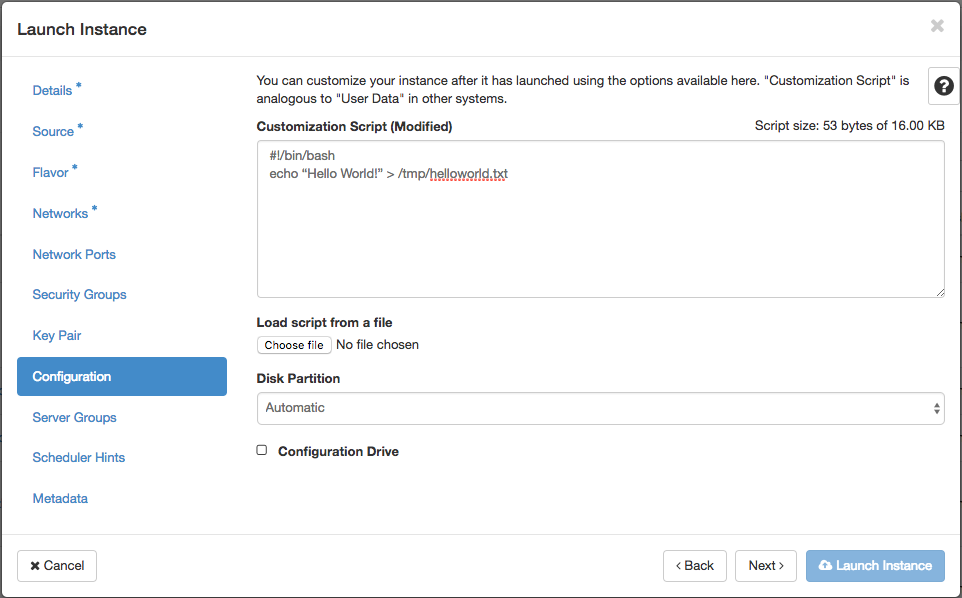

# Cloud for Intermediates - (Meta/User)data

Welcome to a short **de.NBI tutorial** concerning meta/user data. The goal of this session is to understand what meta data and user data is in a cloud computing context and how it can be used to configure virtual machines. The tutorial aims at the more advanced cloud user and needs basic understanding of the Linux command line and  Linux boot process.

The tutorial was tested on Ubuntu 16.04 LTS, but should work on any modern linux OS (see Cloud-Images) since nothing Ubuntu-specific has been used.

## MetaData
New instances need to be configured somehow. You normally start with blank (unconfigured) images in a very dynamic environment, which means :

- different projects	
- different users 
- network setup depending on project
- different *hardware* , e.g. additional ephemeral disks

In every situation you want to have an instance ready to use right after launching. Openstack (and nearly all other clouds) solve this problem providing meta data to the started instances. Meta data can be provided as instance-specific webservice (http://169.254.169.254) or as a separate config drive, both possibilities are supported by OpenStack. The way how to propagate meta data is currently a de facto standard established by Amazon Web Services. There exist different releases. Openstack supports all of them.

The meta data contains all the information about the instance needed to configure it:

- name 
- SSH keys
- network informations
- attached volumes
- provided ephemerals
- special puporse hardware

## Cloud-Init
[Cloud-Init](https://cloud-init.io) is a set of scripts bundled in a service utilizing the propagated metadata. Cloud-Init is run as startup service and configures the instance during startup. Cloud-Init utilizes meta data to:

- set a default locale
- set a hostname
- place your propagated public key
- prepare and mount available ephermals
- configure the first network device (up + dhcp)

However, software is normally *not* perfect and so Cloud-Init is not. Some features are missing in the standard configuration of Cloud-Init:

- only the 1st network device is configured
- only the 1st ephemeral is prepared and mounted

You can write your own plugin to extend Cloud-Init with the property of your need. There exists many useful (and not so useful) plugins.

Besides meta-data Cloud-Init also utilizes user-data to setup an instance with a user specific configuration (see below).

## Cloud-Images
- Base images + cloud-init preinstalled
- Ready to use (in a cloud environment)
- Provided by nearly all Linux distributors, e.g.:
	- [Ubuntu](https://cloud-images.ubuntu.com/)
	- [Debian](https://wiki.debian.org/Cloud)
	- [Fedora](http://cloud.fedoraproject.org/)
	- [CentOS](https://wiki.centos.org/Download#Cloud)
	
## HandsOn - MetaData
Let's start with warming up:

- start a VM
- assign a floating ip
- login to the VM
- use curl/wget to get information about the instance
    - name
    - network
    - public Keys
- shutdown the VM 

## UserData 
When launching an instance in Openstack you have the option to pass additional user data to the instance. User data can be used to perform common automated configuration tasks and even run scripts after the instance has been started.

*Notice: User data scripts only run during the first boot cycle when an instance is launched.*

### Wait for a service
Since cloud-init is run as boot service, it could happen that during the execution of the user-data script not all services are available yet. Typically the network or a single network service is not yet ready during execution. Your script must be aware of it and check if a service is available before accessing it.

A simple bash function can do job :

```
function check_service {
  /bin/nc ${1} ${2} </dev/null 2>/dev/null
  while test $? -eq 1; do
    log "wait 10s for service available at ${1}:${2}"
    sleep 10
    /bin/nc ${1} ${2} </dev/null 2>/dev/null
  done
}
```

If we want to wait for the meta-data service to be available we could easily call:

```
check_service 169.254.169.254 80
```


### Logging
Any output  - if not redirected - is written to `/var/log/cloud-init-output.log`. Since cloud-init logs everything to  `/var/log/cloud-init-output.log` - which makes it a bit confusing - it is often better to redirect stdout and stderr to a file.

The two lines

```
exec > /var/log/userdata.log
exec 2>&1
```
redirect the output (stdout and stderr) of the script to `/var/log/userdata.log`


## HandsOn - UserData “Hello World”
Time for our first practical example! We want to write a simple script that prints "Hello World" in a file (e.g. /tmp/helloworld.txt)

``` 
#!/bin/bash
echo “Hello World!” > /tmp/helloworld.txt
```

- Start a Vm providing our helloworld script

- Assign a floating ip
- Login into your VM
- View /tmp/helloworld.txt

```
ubuntu@host-192-168-0-6:~$ cat /tmp/helloworld.txt
Hello World!
```

- UserData is also propagated throw the MetaData service :

```
ubuntu@host-192-168-0-6:~$ curl http://169.254.169.254/latest/user-data/
#!/bin/bash

echo "Hello World!" > /tmp/helloworld.txt
```

