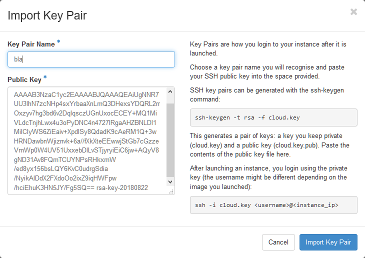

# Access to de.NBI Virtual Machines from Windows-10
This guide is intended for new users of de.NBI resources. It is assumed, that you have an ELIXIR ID and that your application for compute time was processed successfully. Hence, using your browser you should be able to login to the dashboard of the cloud site you were assigned to e.g., Tübingen (https://denbi.uni-tuebingen.de).

After logging in via ELIXIR AAI using your home organization credentials you should see the dashboard.

The deployment of Virtual Machines (VM) may vary in detail and is covered by other guides. The common element is the need to access the VM via its public IP address and to do this in a secure way using SSH keys.

There are many different ways, here we focus on a robust solution based on PuTTY (https://www.putty.org/). PuTTY is an SSH Client enabling you to connect to your remote VM, please just install it on your local computer. The installation package also contains a tool called PuTTYGen.
Click on ‘Generate’ and move your mouse cursor over the grey field to create some random input. Afterwards enter a passphrase and save your public and private keys into separate files e.g., bla_public.key and bla_private.ppk. Please note, your private key should stay private! Do not share it with anybody and do not upload it anywhere!
Now select the public key and copy it (ctrl+c; Windows clipboard; select all lines).

Switch back to your browser to the dashboard and navigate to the ‘Key Pair’ menu. After clicking the ‘Import Key Pair’ button on the upper right, you should assign an arbitrary name and paste the public key (ctrl+v) in the lower field. This step is completed after clicking on ‘Import Key Pair’.

You now may use this key during the deployment of a VM (see other guides). Assuming you have a running VM instance, navigate to the ‘Instances’ menu and take a note of its IP address.
 
Start the PuTTY client and enter the IP address in the ‘Hostname (or IP address)’ field.

On the left side navigate to ‘Connection | SSH | Auth’ and select your private key for ‘Private key file for authentication’. This represents the minimum settings and you may click on ‘Open’ to establish a connection to your de.NBI VM.
Connecting for the first time to a new VM will trigger a security warning. Please double check that you are accessing the right machine and confirm. Afterwards you have to enter the username e.g., ‘centos’ which might differ depending on the Linux you are using and the way the VM was set up. Afterwards you are asked for your password which is the same as you used as cipher for your private key.

Congratulations! You made it.

## Tips
We strongly suggest using the PuTTY save session option, otherwise all information has to be entered manually each time.
It is possible to set a default login name via ‘Connection | Data | Auto-login username’.
If you need an XServer to display graphical output from your VM on your local computer, Xming (https://sourceforge.net/projects/xming/) is a good option. Do not forget to check the X11 box in PuTTY under ‘Connection | SSH | X11’.
You may want to adjust the behavior of your PuTTY shell via ‘Window | Selection’ to facilitate cut-and-paste operations.
You can freely modify the appearance of your PuTTY shell via ‘Window | Colours’. Usually dark grey on white is more eye friendly, but green on pink background gives a pretty decent contrast.

