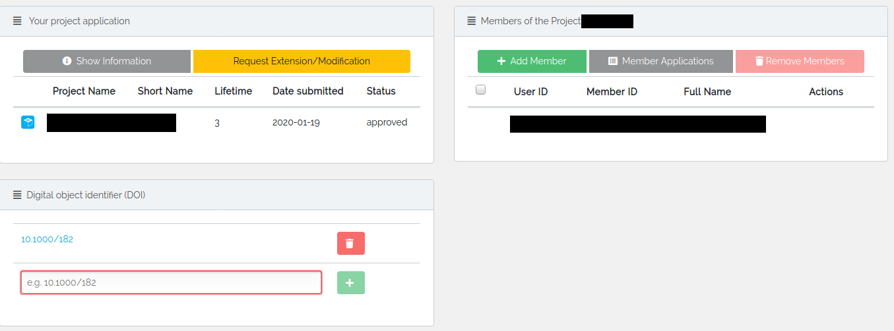
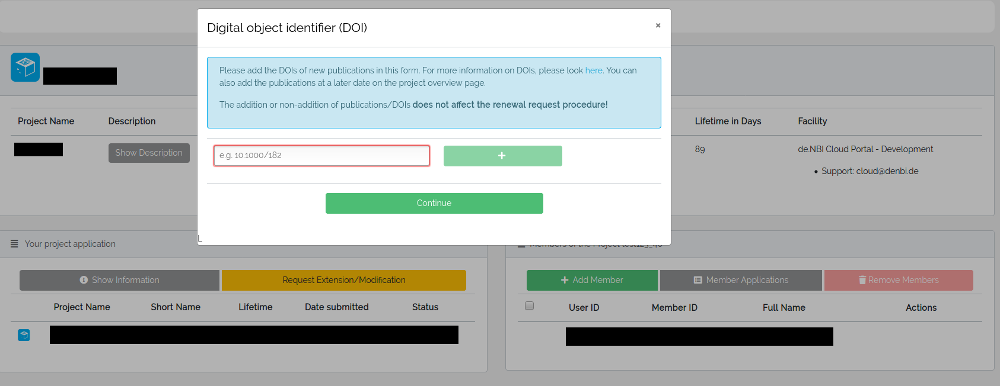

## Citation information
The development and support of the cloud is possible above all through the funding of the cloud infrastructure by the Federal Ministry of Education and Research (BMBF)! We would highly appreciate the following citation in your next publication(s):

!!! Citation 
    ‘This work was supported by the BMBF-funded de.NBI Cloud within the German Network for Bioinformatics Infrastructure (de.NBI) (031A532B,031A533A,031A533B,031A534A,031A535A,031A537A,031A537B,031A537C,031A537D,031A538A).

### Publications
To see a list of publications, respectively a list of projects that added a DOI, please have a look [here](https://cloud.denbi.de/publications/). We would greatly appreciate to have your publication listed here as well. To add your publication, please add your [DOI](#adding-a-doi-digital-object-identifier) like described below.

## Adding a DOI (Digital Object Identifier)
If you do not know about digital object identifier, the placeholder [10.1000/182](https://doi.org/10.1000/182) links to the DOI handbook, where you may find more information.

!!! note ""
    Please note that after completion, deletion or termination of your project, the association between the DOI and your project will remain.

### In the project overview

In your project overview you will find this field where you can enter a DOI, which will be associated with your project. There is no limit on the number of DOIs you can associate with your project. Clicking the delete button will remove the DOI and its association to your project.  

### In a modification request

When requesting an extension/modification of your project, you will be asked if you have any new publications that were made during your work with the de.NBI Cloud or in which the de.NBI Cloud is mentioned. After clicking 'Yes', you will have the opportunity to add one or more DOIs and continue to your modification request.

!!! note ""
    The addition or non-addition of publications/DOIs does not affect the renewal request procedure!
