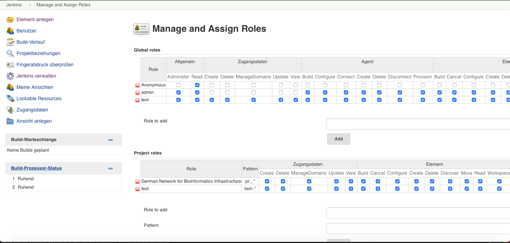

## Deploy and configure jenkins and haproxy with JuJu

The following instructions have been used to setup Jenkins and Haproxy using [JuJu](https://jujucharms.com) in the de.NBI Cloud.
It has been tested in the Bielefeld Cloud Compute Center but should be applicable with little modifications on all
de.NBI Cloud compute centers.

## Setup juju client 

First we have to set up the juju client in a VM in OpenStack, so it has full network access to
newly spawned VMs without assigning a floating IP.

```
sudo add-apt-repository -yu ppa:juju/stable
sudo apt install juju
sudo apt-get install python3-openstackclient
```

### Add cloud config

In the next step we need to configure our cloud setup. Therefore we create the
following config file `cebitec.yaml`:

```yaml
clouds:
  cebitec:
    type: openstack
    auth-types: [ userpass, access-key ]
    regions:
      Bielefeld:
        endpoint: https://openstack.cebitec.uni-bielefeld.de:5000/v3/

```
and create the cloud with:

```
juju add-cloud cebitec -f ./cebitec.yaml

```

### Add login credentials

To spawn VMs, juju must be able to login to OpenStack.
So add your credentials in a config file `cebitec-creds.yaml` like this

```yaml
credentials:
  cebitec:
    <credential name (e.g. username)>:
      auth-type: userpass
      username: <username>
      password: <password>
      tenant-name: <project>

```

and add them with

```
juju add-credential cebitec -f ./cebitec-creds.yaml

```

### Add image metadata

Before creating an image you have to

```
juju bootstrap

```
and choose localhost. Otherwise there will be an error when creating the metadata image.

if juju bootstrap doesnt work use:

```
dpkg-reconfigure -p medium lxd
```

and approve the steps till ipv6 configuration (decline this).

In order to use an image, juju needs to create some metadata for it first.

We create a directory for metadata with the following command:

```
mkdir -p ~/juju/images
```

Now we add metadata for the xenial image

look at this link: https://docs.jujucharms.com/2.1/en/howto-privatecloud to see how to generate a metadata image.
The final command should look like in the following example.

```
juju metadata generate-image -d ~/juju -i febceb9a-fb0f-4f1c-ad06-8caf6340de64 -s xenial -r Bielefeld -u https://openstack.cebitec.uni-bielefeld.de:5000/v3/

```

where the image ID in OpenStack has to be specified with the `-i` and the release name (series) with `-s`.

Destroy the local juju controller with:

```
juju destroy-controller localhost-localhost

```

## Deploy the juju controller

Basically, this is just `juju bootstrap`. Because we use a private cloud, we have
to specify the location of the image metadata with `--metadata-source`.

```
juju bootstrap --metadata-source ~/juju cebitec

```

If there are multiple networks available for your project, choose the right one
with the `--config network=<network id>` parameter. If you need a specific series add  
`--bootstrap-series=<series>` as parameter (juju will think it is bionic as standard).
## Deploy jenkins and haproxy

After deploying a juju controller it is possible to define a juju model in two yaml files.

- The first file describes the construction of the juju model.

- This model.yaml file creates 1 jenkins machine with docker installed and 1 haproxy machine.

- It also configures ssl termination with the files `ssl.key` and `ssl.crt`. 

```yaml
services:
  jenkins:
    charm: "cs:xenial/jenkins"
    num_units: 1
    constraints: "cores=8 mem=16G"
    options:
      release: http://pkg.jenkins-ci.org/debian/binary/jenkins_2.128_all.deb
      password: <passwort>
      install_keys: 0EBFCD88
      install_sources: https://download.docker.com/linux/ubuntu xenial stable
      extra_packages: docker-ce
  haproxy:
    charm: "cs:haproxy"
    series: "xenial"
    num_units: 1
    expose: true
    options:
      ssl_key: include-base64://ssl.key
      ssl_cert: include-base64://ssl.crt
relations:
  - - "jenkins:website"
    - "haproxy:reverseproxy"
``` 


!!! Note
    Do not forget to set a passwort in the options section of jenkins.<br/>
    Do the Optional steps if you want to use your own charm.<br/>
    The release version can be changed but errors in installation may occure.
    
To deploy jenkins and haproxy you have to execute the following command:

```BASH
juju deploy model.yaml
```


The second file configures our already deployed haproxy. It sets the exposed port of our setup to 443 to use ssl.

```yaml
- service_name: jenkins
  service_host: "0.0.0.0"
  service_port: 443
  crts: [DEFAULT]
  service_options:
      - balance leastconn
      - reqadd X-Forwarded-Proto:\ https
  server_options: maxconn 100 cookie S{i} check
``` 
to apply this configuration you need to run 

```BASH
juju config haproxy services=@config.yaml
```

After a few minuits Jenkins should be reachable over the haproxy ip via https://<haproxy_ip>.
All possible options can be found at the charm websites under configuration [haproxy-charm](https://jujucharms.com/haproxy/).

## Update jenkins

Before updating jenkins make sure no build instances are running.

To update Jenkins to the newest version you need to download the latest jenkins.war file [here](https://updates.jenkins-ci.org/download/war/) and fulfill the following steps.

Or download it with the following command:

```BASH
sudo wget https://updates.jenkins-ci.org/latest/jenkins.war
```
1. log into the jenkins machine and stop the jenkins service:

```BASH
juju run "sudo service jenkins stop" --machine <machine_number>
```
2. Remove the old jenkins.war file:
```BASH
juju run "sudo rm /usr/share/jenkins/jenkins.war" --machine <machine_number>
```

3. Place the new jenkins.war file on the machine:
```BASH
juju scp <path_to_jenkins.war> <machine_number>:/~
```

4. Move the jenkins.war file to the correct folder.
usr/share/jenkins/jenkins.war
```BASH
juju run "sudo mv ~/jenkins.war /usr/share/jenkins/jenkins.war" --machine <machine-number>
```

5. Start jenkins service again with:
```BASH
juju run "sudo service jenkins start" --machine <machine_number>
```
Jenkins should be accessable and updated now.

## Setup Jenkins
Follow this steps to setup jenkins after its deployed and updated.

### Plugins
The following jenkins plugins should be installed via Manage Jenkins --> Manage Plugins.

* Role-based Authorization Strategy (to set permissions for users).

* OpenId Connect Authentication (to authenticate with elixir).

* Pipeline (Is needed to create projects).

* Github integration.

* GitHub Branch Source (is needed for automatic pull request testing).

### Setup OpenId connect Authentication
To setup OpenId connect Authentication go to Manage Jenkins --> Configure Global Security and choose the Login with Openid Connect checkbox.

you have to enter the following dates:

* Client id

* CLient secret

* Token server url

* Authorization server url

* Scopes (in our case: openid email profile)

Optional are:

* UserInfo server url

* User name field (in our case: preferred_username)

* FullName field name (in our case: name)

* Email field name (in our case: email)

now apply the changes.

After reloading the page you should be able to login with your elixir account.

### Role-Based Authorisation

In order to give different permissions to different user we use the Role-based Authorization Strategy plugin.
To activate the plugin go to Manage Jenkins --> Configure Global Security and choose Role-Based Strategy.

### Manage and assign roles
To manage existing roles go to Manage Jenkins --> Manage and Assign Roles --> Manage Roles

Add the Role Anonymous (this are all the users who login with elixir) and give this role the needed rights (for example read overall).


Now go to Manage Jenkins --> Manage and Assign Roles --> Assign Roles and assign the Anonymous role to Anonymous user.


You can now add and assign a role to each user.

### Assign user to role

To assign a user to a specific role go to Manage Jenkins --> Manage and Assign Roles --> Assign Roles add the username and check the role you want to give him.

### Project role

It is also possible to give a user rights to a specific project to do this go to the Manage Roles menu and enter the project-pattern and name of a project.

The Project pattern defines what project the user sees.



You can assign a user to a project role in the Assign Roles menu and he will have rights in the project with the specific pattern.

## Create Credentials

In order to use github repositories dockerhub or a ssh connection when deploying a build you have to enter credentials.
This is possible by going to "credentials" --> "choosing a domain" --> "add credentials"

now you can enter credentials which you can use for projects (if you use a jenkins file you always reference the credential id).

## Create Project for repository

To create a build job for a repository in jenkins select "new item" --> "pipeline" --> "enter a name" --> "ok"

In Build Triggers selection check: GitHub hook trigger for GITScm polling (so jenkins will automatically build the Jenkinsfile when something is pushed into the branch). 

In Pipeline select "Pipeline script from SCM" --> "git" --> fill credentials repository url and choose a branch.

Choose the name of the Jenkinsfile you want to use and save the configuration.

Builds need to be run once before they get notified by a push notification.


## Run custom commands

It is possible to run custom commands with juju, using the run command:

```BASH
juju run  "<command>"  --machine <machine number>
```

The command below sets the docker group on machine 34:

```BASH
juju run "sudo usermod -aG docker $USER "  --machine  34
```
Jenkins service needs to be restarted agter setting docker group.

## Optional steps

### Edit and push existing juju charm
The following chapters will describe how to push a charm to your repository add layers and add the jenkins user to the docker group by default.

### Prerequisite
An [ubuntu one](https://login.ubuntu.com) account is needed to upload your own charm.
```
sudo apt-get install charm
``` 
to install the charm software

### Download charm

Download the charm you want to edit from the charmstore by pressing Download .zip.

Now extract the zip file and open a terminal in the charm folder.

### Edit charm
If you want to add layers (for example [docker-layer](https://jujucharms.com/new/u/lazypower/docker)) to the charm you have to add
```includes: ['layer:docker']```  to the other layers in the layer.yaml file. This will install docker+docker-compose to your charm.

!!! Note
    If you add the dockerlayer to your charm you dont need to add the docker-ce installation in your model.yaml


By editing the config.yaml you can adapt the charm description.

### Build charm
After adding a layer to your charm you have to rebuild the charm.

use:
```
charm build
cd builds/<charm-name> 
```
to generate code for the new layer and go into the ```builds/<charm name>``` folder with the terminal.

### Adding jenkins user to dockergroup and test charm
To add the jenkins user by default to the docker group add the import: <br/>
 `from subprocess import check_call `<br/>
at the top and the command: <br/>
 `check_call(['usermod', '-aG', 'docker', 'jenkins'])`<br/>
below the line: users = Users() in the <path to charm>/reactive/jenkins.py file

The charm can be tested by deploying it locally with 
```
juju deploy <path to local charm>
```

### Push charm and grant rights


To push the charm to your repository use:
```
charm push <path to local charm> 
```
It will ask you for your ubuntu one login.

Use:
```
charm grant <charm url> everyone 
```
To make the charm accessible to all users.

Now you can deploy your charm by using the charm url in your model.yaml

### Change MTU for docker

To change the MTU(Maximum Transmission Unit) for docker you have to login on your jenkins Machine with the command (use juju status to get the machine number):

```bash
juju ssh <machine number>
```

and then change the docker MTU with the following command:


```bash
sudo ifconfig docker0 mtu 1440
```

finally use
```bash
exit
```
to log off the machine.

## Usefull commands
Here is a list of usefull juju commands

* juju status: shows status of deployment.

* juju destroy-controller: deletes a full bootstrap configuration(all machines and models).

* juju ssh <machine_number>: connects to machine via ssh.


## Further Reading

* [Juju haproxy](https://jujucharms.com/haproxy/)

* [Juju jenkins](https://jujucharms.com/jenkins/)
