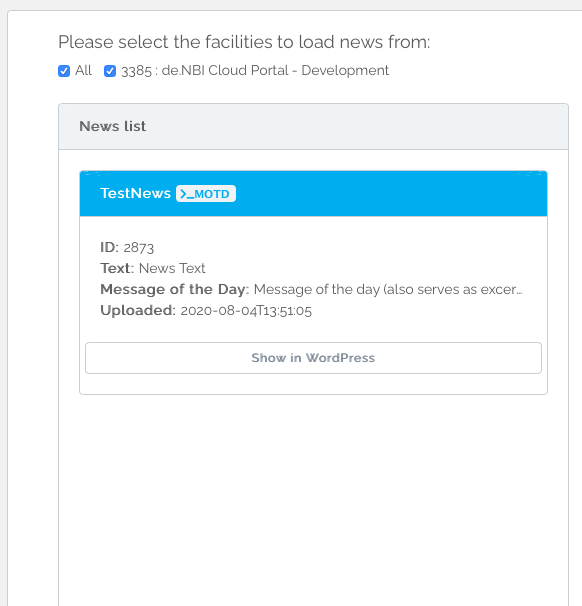
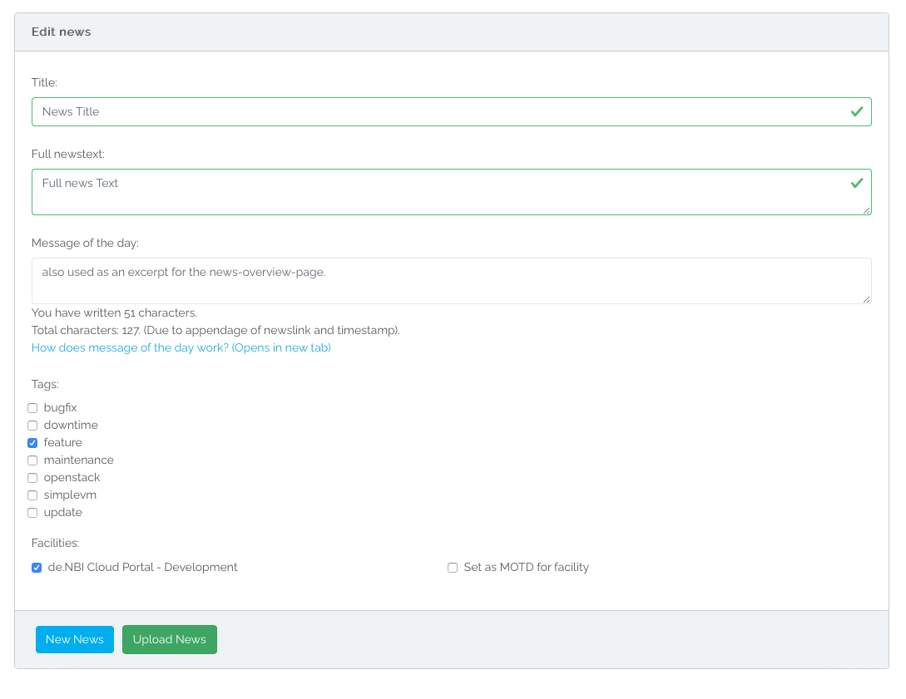
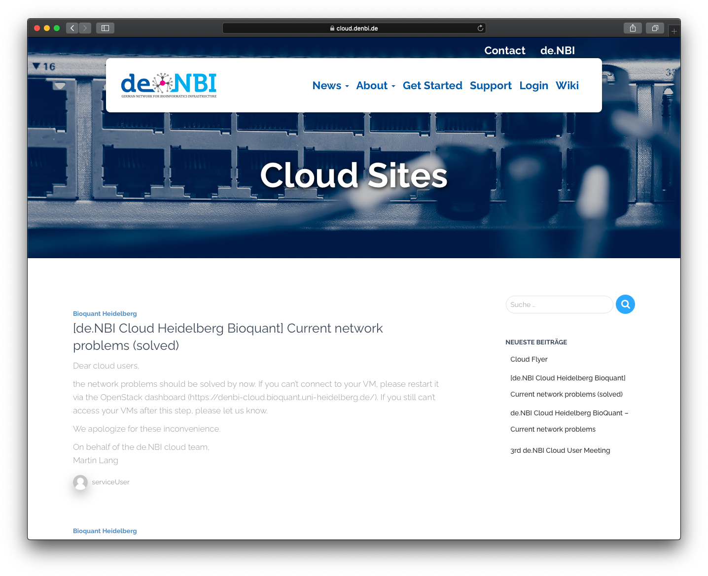

# Using the News Management
On the News Management page, you are able to manage almost everything regarding Facility News.  
You are able to add, delete and edit News for the facilities you are an admin of.  

On the top of the page you are able to select the facilities by which the News list will be filtered. You are only allowed to select the facilities you are also an admin of.  
On the left side of the page you will find a list of News connected to the chosen facilities at the top.
You can click on `Show in WordPress` to see the news on the de.NBI Cloud website.
You can edit existing news by clicking on the news-card and changing the values in the `Edit news` area on the right side of the page. 
Please note, that a News which is also connected to a Facility you are not an admin of, may not be deleted or edited. If you still wish to edit or delete it for whatever reason, please contact a VO-Admin.
## Adding a News
On the bottom of the right side you will find a `New News` Button. The `New News` Button will empty all fields and create an empty News you can fill with information and afterwards post by clicking `Add News`.  
Every News has to have a Title, a Newstext and at least one Facility you wish to connect the News to!  
The Message of the Day field is optional and may be left empty. For further information regarding Message of the Day, please see [below](news_management.md#message-of-the-day).  
You can also add different tags which categorize your news by clicking on the respecting checkboxes.
It is optional to add tags.
## Delete a News
If you find that a News should not be available anymore for whatever reason, you may delete the News completely. To do this, select the News from the list you wish to delete and click the `Delete News` button at the bottom. A Modal will open, asking you to verify your decision. You need to be an Admin for every Facility the News is connected to in order to delete the News.
## Edit a News

If you need to edit a News for whatever reason, please select the News you wish to edit from the list. You may change the Title, the Newstext, the Message of the Day, the Tags and the facilities the News is connected to. The News has to be connected to at least one Facility! Please note that the facility id and its public name which is set in the database will be appended automatically if you edit them out!  
What an Admin is not allowed to edit is the ID, the Author and the Timestamp of the News.  
If you are happy with your changes, click the `Update News` button at the bottom. A Modal will open, asking you to verify your decision. You may edit and update a News as often as you wish.
## Requesting News
News can be found on `https://cloud.denbi.de/category/facility/`. To show the news of one specific compute center you can use the specific url of the facility. E.g. `https://cloud.denbi.de/category/facility/bielefeld/`. 
You can also show all news with a specific tag. Therefore you can use the `/tag/<tag>` url for. E.g. `https://cloud.denbi.de/tag/update/` to get all news which are tagged with `update`.

## Message of the Day
You can get News in a specific Message of the Day format. To do this, you need to send a request to the Message of the day URL of the facility. You will receive a string which contains the current Message of the Day of the coresponding facility and a link to the full news article.
You need to send the request to `https://cloud.denbi.de/portal/public/news/motd/<facility-id>/` to get the Message of the Day of the respective facility. 

In case you need the Facility-ID of your facility, please [contact the de.NBI Cloud Governance](mailto:cloud@denbi.de) to receive the ID.