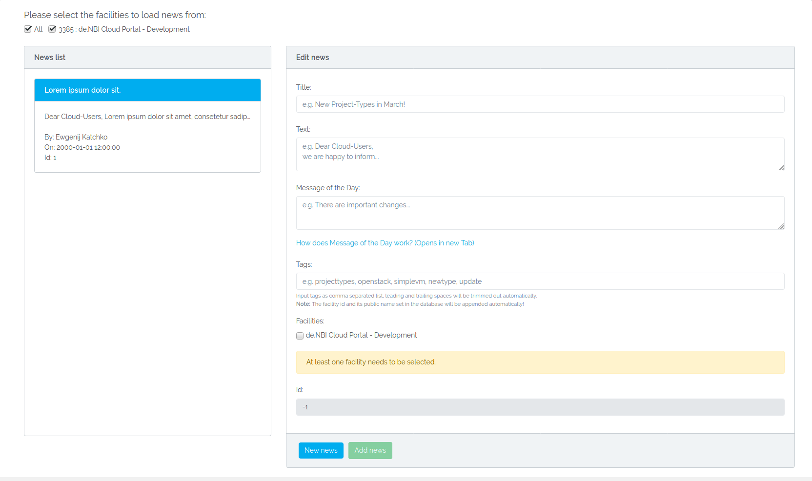

# Using the News Management
On the News Management page, you are able to manage almost everything regarding Facility News.  
You are able to add, delete and edit News for the facilities you are an admin of.  

On the top of the page you are able to select the facilities by which the News list will be filtered. You are only allowed to select the facilities you are also an admin of.  
On the left side of the page you will find a list of News connected to the chosen facilities at the top.  
On the right side of the page you will find the fields you may edit.  
Please note, that a News which is also connected to a Facility you are not an admin of, may not be deleted or edited. If you still wish to edit or delete it for whatever reason, please contact a VO-Admin.
## Adding a News
On the bottom of the right side you will find a `New News` Button. The `New News` Button will empty all fields and create an empty News you can fill with information and afterwards post to the Newsservice by clicking `Add News`.  
Every News has to have a Title, a Newstext and at least one Facility you wish to connect the News to!  
The Message of the Day field is optional and may be left empty. For further information regarding Message of the Day, please see [below](news_management.md#message-of-the-day).  
The Tags field is also optional and may be left empty. It takes a comma serperated list as input, e.g. `openstack, project-types, downtime`. Do not worry about leading or trailing spaces, as they will be trimmed out. Please note that the facility id and its public name which is set in the database will be appended automatically and may not be edited out!  
The ID field is set as -1, as a not yet posted News can not have an ID.
## Delete a News
If you find that a News should not be available anymore for whatever reason, you may delete the News completely. To do this, select the News from the list you wish to delete and click the `Delete News` button at the bottom. A Modal will open, asking you to verify your decision. You need to be an Admin for every Facility the News is connected to in order to delete the News.
## Edit a News

If you need to edit a News for whatever reason, please select the News you wish to edit from the list. You may change the Title, the Newstext, the Message of the Day, the Tags and the facilities the News is connected to. The News has to be connected to at least one Facility! Please note that the facility id and its public name which is set in the database will be appended automatically if you edit them out!  
What an Admin is not allowed to edit is the ID, the Author and the Timestamp of the News.  
If you are happy with your changes, click the `Update News` button at the bottom. A Modal will open, asking you to verify your decision. You may edit and update a News as often as you wish.
## Requesting News
News can be requested in different ways. In the following the News-URL `https://cloud.denbi.de/news` will be omitted for brevity, i.e. `/latest` should be read as `https://cloud.denbi.de/news/latest`.  
### Rendering News on the Newspage
- `/` will render and display all News by descending ID.  
- `/<tags>` will render and display all News tagged by <tags\>, which may be a comma seperated list, e.g. `/openstack,Bielefeld,downtime`.  
- `/id/<id>` will render and display the News with the ID <id\>.  
- `/facility/<facility_id>` will render and display all News connected to the facility ids of <facility_id\>, which may be a comma seperated list, e.g. `/facility/111,222,333`.
### Getting News for other purposes
- `/request?<id/title/tag/facilityid/text/author/motd/older/newer>=<input>` will return a JSON with all News matching your GET query, e.g. 
~~~BASH
/request?author=Max Mustermann?tag=openstack,Bielefeld
~~~
It will return in the format `{json_list: [List of your requested News]}`. Please note that the filters match News containing your <input\>, they do not only match News equal to your <input\>.  
- `/<tags>/latest` will return a JSON with the title, text, author and timestamp of the latest News containing the specified <tags\> if your request content-type ist set as `application/json`. If content-type is not set in your GET request it will return a string in the format `TITLE\nTEXT\nBy AUTHOR on TIMESTAMP\n`.  
- `/latest` will return a JSON with the title, text, author and timestamp of the latest News if your request content-type ist set as `application/json`. If content-type is not set in your GET request it will return a string in the format `TITLE\nTEXT\nBy AUTHOR on TIMESTAMP\n`.  
- `/<id>/formatted` will return a JSON with the title, text, author and timestamp of the News with the ID <id\> if your request content-type ist set as `application/json`. If content-type is not set in your GET request it will return a string in the format `TITLE\nTEXT\nBy AUTHOR on TIMESTAMP\n`.  
## Message of the Day
You can get News in a specific Message of the Day format. To do this, you need to append `/motd` to the requests you will find above in [Getting News for other purposes](news_management.md#getting-news-for-other-purposes), i.e. `/<tags>/latest/motd`, `/latest/motd` and `/<id>/formatted/motd`. `/request` can not be appended by `/motd`.  
If content-type is set as `application/json`, these requests will return a JSON, similiar to the requests without `/motd`, with the following differences:  
- The JSON will contain a news_link key, under which you may find the rendering link to the requested News.  
- If motd is set for the specific News, the text key will contain the Message of the Day. If motd is not set fot the specific News, the text key will contain the full Newstext.  
If content-type is not set in your request, these requests will return a string in the following format:
~~~Bash
TEXT\nSee the full news: https://cloud.denbi.de/news/id/ID\nTIMESTAMP\n
~~~
- If motd is set for the specific News, TEXT will be the motd. If motd is not set for the specific News, TEXT will be the full Newstext.
