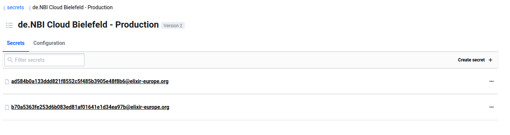
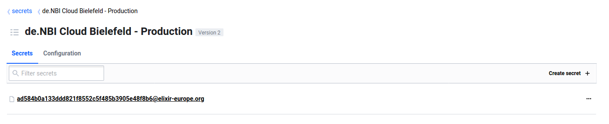
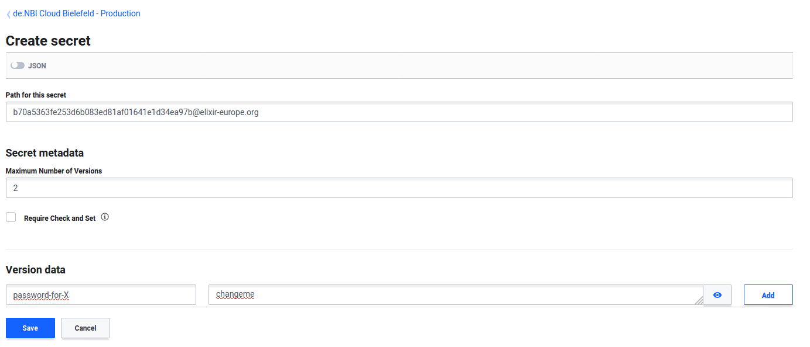
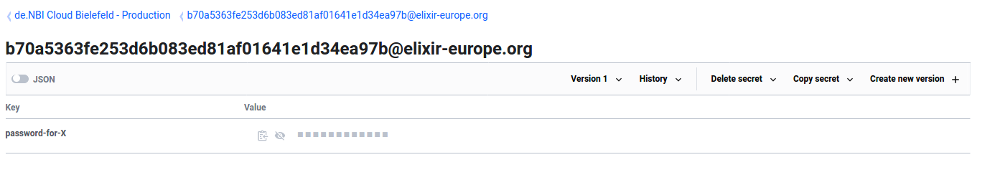
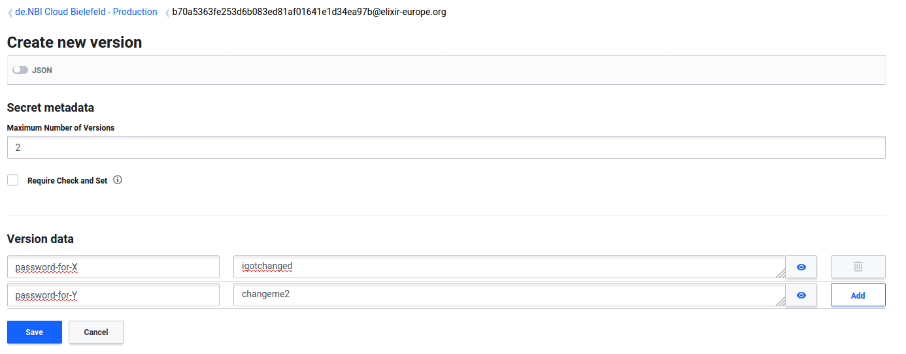
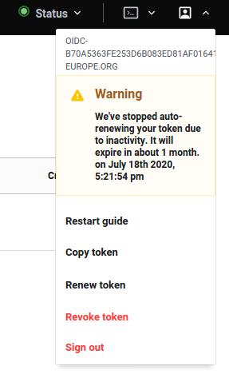
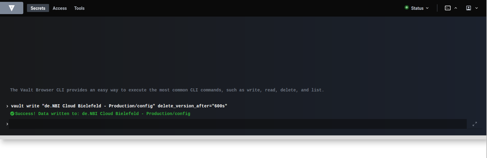

# Using Vault
For general information about Vault, please visit [Vault on github](https://github.com/hashicorp/vault).  

## Logging into Vault
You can find the Vault ui [here](https://cloud.denbi.de/ui/).  

!!! danger "OIDC popup"
    To log in with OIDC you need to have popups allowed for the vault login page! If the login is buggy after allowing popups, please reload the page.

The tab with OIDC as login method should be openeded by default. If the 'other' tab is opened, switch to the OIDC tab.  
If you are not yet a member of an admin group, please log in with OIDC as method. You can leave the role field blank. Then contact the de.NBI Cloud governance to be added to an admin group.  
If you already are member of an admin group, simply log in with OIDC as method and a blank role field.  
  

## Managing a secret
After logging in you should see the 'Secrets' tab. Click on your compute center, where you will find paths leading to a protected key/value store.  
For more information about the Secret engine, please click [here for the documentation](https://www.vaultproject.io/docs/secrets/kv/kv-v2) and [here for the API](https://www.vaultproject.io/api/secret/kv/kv-v2.html). For more information about versioning, please [click here](https://learn.hashicorp.com/vault/secrets-management/sm-versioned-kv#overview).

  
  

### Add a secret for a new user
Click on 'Create secret +' in the top right corner.  
  
  
In the field 'Path for this secret' put in the Elixir ID (with the @elixir-europe.org appendage) of the user you want to share secrets with.  
You can change the 'Maximum number of versions'. If you create a new secret version (see [Add a secret for an existing user](#add-a-secret-for-an-existing-user)) which exceeds the maximum number of versions, the oldest version will get deleted.  
Put some key in the key field and put the secret you want to share in the value field and click 'Save'.
  

### Add a secret for an existing user
Click on the Elixir ID of the user you want to share secrets with.  
  
  
Click on 'Create new version +' in the top right corner.  
  
Here you can put in a new version of secret key/value pairs and click 'Save'. Also you may delete key/value pairs in the new version by clicking on the trash icon.  
  

### Delete/Destroy a secret
To delete a whole path, click on the three dots next to the path and choose 'Permanently delete'.  
  
You can also delete specific versions, by clicking on the Elixir ID of the user you want to delete versions from and then clicking on 'Version X' in the paths headbar. Here you can delete or destroy the specific version. To delete the whole path, click on 'Delete secret' in the paths headbar.  
  

!!! Note
    Deleted versions are not removed from the filesystem, they can be undeleted. To completely remove the version from the filesystem, please destroy the version.

### Share a one time secret
You have the possibility to have Vault wrap a JSON and create a token, which can be used to unwrap the JSON once.  
Every user that is able to log in with OIDC has access to the wrapping and unwrapping tools.
#### Wrapping
In the headbar, click on 'Tools'. At the left, click on 'Wrap'.  
  
Here you can write a JSON and choose how long the token should be valid. Click on 'Wrap data' and afterwards you can share the token (e.g. by adding it as a secret for a user).  
  
#### Lookup
In the headbar, click on 'Tools'. At the left, click on 'Lookup'.  
  
Here you can input the wrapping token. If the token got already unwrapped or is not valid anymore, an error message appears.  

#### Unwrap
In the headbar, click on 'Tools'. At the left, click on 'Unwrap'. Here you can input the wrapping token. After clicking on 'Unwrap data' you should be able to see the whole JSON.  
  

## Configuration
You can configure your compute center. Please [visist here](https://www.vaultproject.io/api/secret/kv/kv-v2.html#configure-the-kv-engine) for all available options and API endpoints.  
### With curl
You can send requests to the API endpoints. You will need a token, which you can get in the web ui. Click on the profile icon in the top headbar and click `Copy token`.  
  
Next, send a request to an endpoint e.g.:
``` bash
curl \
    --header "X-Vault-Token: <your_token>" \
    --request POST \
    --data '{ "delete_version_after": "600s" }' \
    "https://cloud.denbi.de/v1/de.NBI Cloud Giessen - Production/config" 
```

### With web ui terminal
You can use the web ui terminal (second to right icon in the top headbar) to write, read, list etc. at the API endpoints e.g.:
``` bash
vault write "de.NBI Cloud Bielefeld - Production/config" delete_version_after="600s"
```
  
