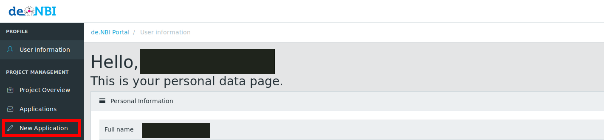
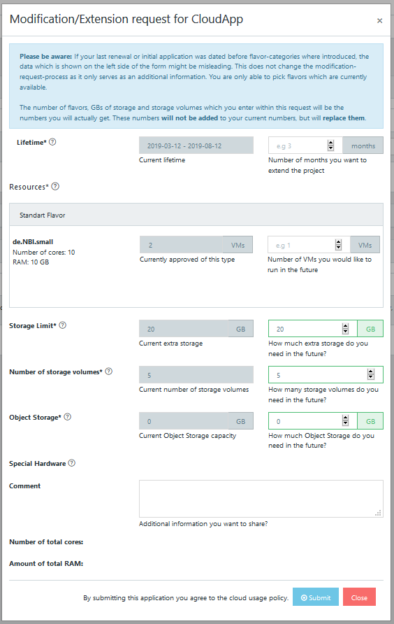
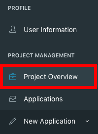
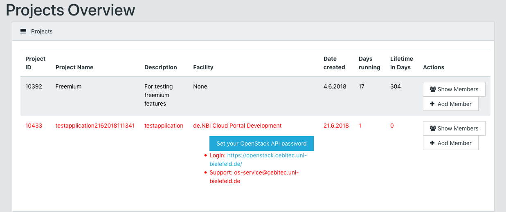
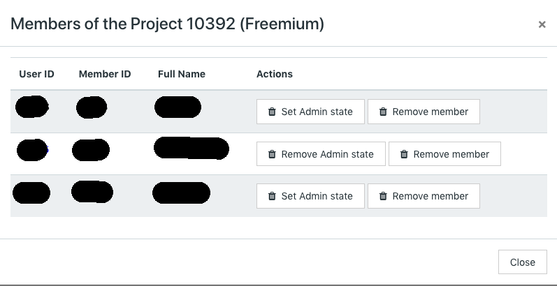
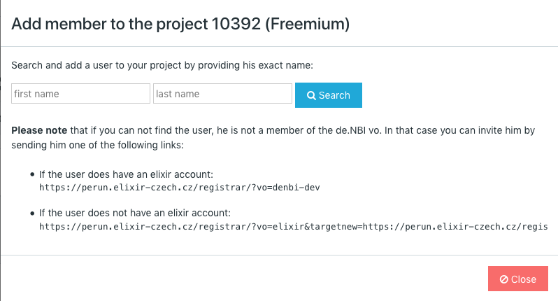
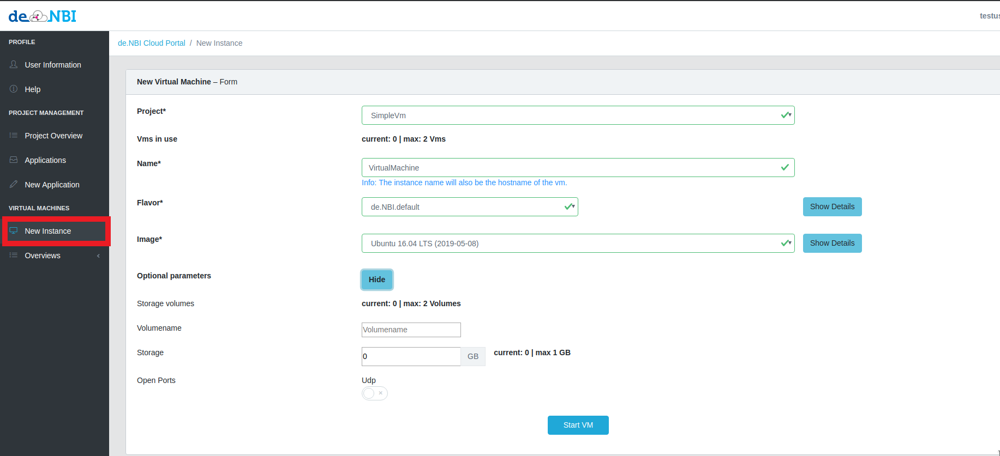
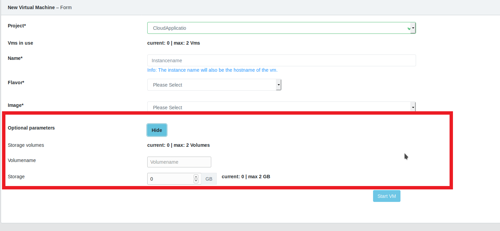
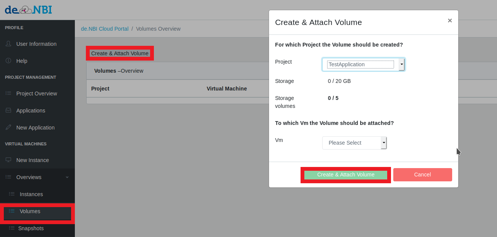

# Portal

The de.NBI Cloud portal represents the central access point to the de.NBI Cloud.

## Allocation

An application for resources in the de.NBI Cloud must be submitted by a principal investigator of a german university or research facility.
After you submitted the application, you will receive a confirmation mail. Your application will be reviewed by a scientific committee.
You will be notified as soon as possible whether your application is approved or declined. 

You can submit an application by login to the [de.NBI Cloud portal](https://cloud.denbi.de/portal/) and selecting the "New application" tab (see below).



Besides general project information like project name, project description, institution name and project lifetime, you also have to provide the information
independing on the project type you choose:
 
 * The **Simple VM** Project type allows you to start virtual machines without configuring a project in OpenStack (e.g. network configuration). 

 * In a **Cloud Project**  you will have your own OpenStack project and you are free to configure your network, virtual machines and storage setup.

### Simple VM

In a **Simple VM** project you just have to provide the number of virtual machines you would like to run in parallel in your project.
Once your application is approved you can choose between the following flavors for every virtual machine:

* de.NBI Large (CPUs:32, RAM:64 GB)

* de.NBI.large+ephemeral (CPUs: 32, RAM: 64GB, Disk: 250 GB)

* de.NBI Medium (CPUs:16, RAM:32 GB, Disk: 50 GB)

* de.NBI.medium+ephemeral (CPUs: 16, RAM: 32 GB, Disk: 150 GB)

* de.NBI Small (CPUs:8, RAM:16 GB)

* de.NBI.small+ephemeral (CPUs: 8, RAM: 16 GB, Disk: 50 GB)

### Cloud Project

For a **Cloud Project** you have to specify the following parameters:

* Number of Virtual Machines

* Cores per VM

* Disk per VM

* RAM per VM

* Object Storage

* Special Hardware (GPU/FPGA)

## Modification

If you want to extend a project or adjust various parameters, you can create a modification request.
You can submit a modification request by selecting the "Applications" tab and clicking on the "Request Extension/Modification" button (see below).


Then a new window opens in which the parameters of your project can be adjusted. 
On the left side are the current parameters and on the right side are input fields where you can enter new parameters for your project.




## Project Overview

In the Project Overview tab you get a list of all your running projects:





The color of the text indicates whether the lifetime of your project is reached or not. Red means that the project lifetime
is has beed exceeded.

The following actions are only available for a project manager:

* Show members: Shows all members of this project. Project managers are colored in blue.
    


* Appoint another member as admin (project manager).

* Remove the admin (project manager) state.

* Remove a member from this project.
    
* Add another user to this project by inserting their name, email or even ELIXIR ID and clicking on `add member`.
   


### Inviting Members

Through invitation links users can be easily added to a de.NBI Cloud project. The process is the following:

* __Step 1__: Send the invitation link which you can find in the "Add Member" modal to the user you want to add (see figure of the previous section).

* __Step 2__: By using this link the user will be requested to register for an ELIXIR and de.NBI Cloud account. In the final step the
user also registers for your project.


* __Step 3__: You will be informed by mail as soon as the user submits an application. You can then approve the application
in the application modal. Once the application is approved the user will have access to your project.


#### Citation Information

The development and support of the cloud is possible above all through the funding of the cloud infrastructure by the Federal Ministry of Education and Research (BMBF)! We would highly appreciate the following citation in your next publication(s):

!!! note "" 
    ‘This work was supported by the BMBF-funded de.NBI Cloud within the German Network for Bioinformatics Infrastructure (de.NBI) (031A537B, 031A533A, 031A538A, 031A533B, 031A535A, 031A537C, 031A534A, 031A532B).  


## Simple VM Project

### Start an Virtual Machine
If you are a member of a simple vm project you can start a virtual machine at the "New Instance" tab.
You may need to reload the website if you can't see the tab.
Then you can choose your project and fill the form to start an virtual machine.



With the optional params you can start the vm with an volume [see](portal.md#Create Volume).
Also if you want to use mosh (see https://mosh.org/ ) you can choose to open UDP ports.


### Images

#### X2Go Image

X2Go Images allow you to start your own desktop in the de.NBI Cloud which you can access from
any operating system (Windows, Linux, MacOS).

## (Windows only) Export key in OpenSSH format for X2GO

To connect to a machine with X2GO you have to export your private key in openssh format. To achieve this first load your private key into puttygen.


Then click Conversions and choose Export OpenSSH Key. Afterwards save this file on your computer. This file will be needed when you want to establish a connection to a machine with the X2GO client.


## Connect to X2GO machine

You can start an X2Go image when you select an image starting with the X2Go label e.g `X2Go_xfce`.
Once your image started, you will see a message similar to the following one:


Provide the data in the red rectangle in the settings of your x2go client:


You also have to select the session type and the private key of your public ssh key that you provided in the user information tab.

## Volume

### Create Volume

There are two ways to create a volume:

1.When starting a virtual machine you can choose to start a volume when selecting optional params.


The volume is automatically mounted this way.

2.At the Volume tab you can choose to create an volume.


In order to use the Volume you need to [mount](portal.md#mount-a-volume) it.

### Mount a volume

In order to mount a volume connect via ssh to your machine.
You will find your volume with the command

```BASH
lsblk
```

This command will list all your block devices connected to your VM.
Chose the correct device (mostly the name will be the second entry, you can orientate oneself on the SIZE parameter) and format it with a filesystem if you are using this volume for the first time.
Common filesystems are ext4 or xfs.

```BASH
mkfs.ext4 /dev/device_name
```

After the formating you have to create a mountpoint

```BASH
mkdir -p /mnt/volume
```

Check that you have the correct permissions for this directory, otherwise set them with the follwoing command

```BASH
chmod 777 /mnt/volume/
```

And mount the Cinder Volume under the created directory

```BASH
mount /dev/device_name /mnt/volume
```

Now you should see your device by executing the command

```BASH
df -h
```

If you do not need you Cinder Volume you can also unmount it with

```BASH
umount /dev/device_name
```

## Snapshots

A snapshot is an exact copy of your virtual machine. A snapshot of an instance can be used as the basis of an instance and booted up at a later time. 

### Create Snapshot

After starting a machine you can go to instance overview and create a snapshot. 

Now you can enter a name for your snapshot and confirm it by pressing Create Snapshot. 

### Start Snapshot

After the snapshot is successfully created you can go to the "New Instance" tab and choose the created snapshot as image to start a vm. 

