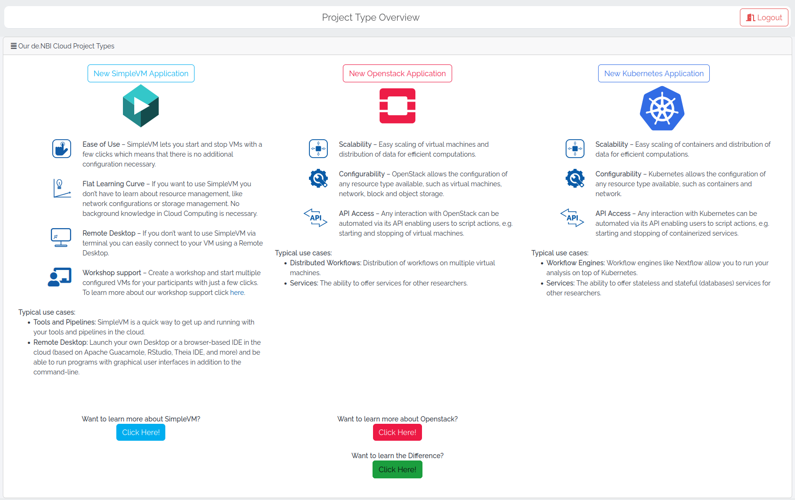

# Portal

The de.NBI Cloud portal represents the central access point to the de.NBI Cloud.

## Project Application

An application for resources in the de.NBI Cloud can be submitted by any team member, but must be verified by a principal investigator of a German university or research institution.
After you submitted the application, you will receive a confirmation mail. Your application will be reviewed by a scientific committee.
You will be notified as soon as possible whether your application is approved or declined. 

You can submit an application by login to the [de.NBI Cloud portal](https://cloud.denbi.de/portal/) and selecting the "New application" tab (see below).

Besides general project information like project name, project description, institution name and project lifetime, you also have to provide the information
independing on the project type you choose:
 
 * The **Simple VM** Project type allows you to start virtual machines without configuring a project in OpenStack (e.g. network configuration). 

 * In a **Cloud Project**  you will have your own OpenStack project and you are free to configure your network, virtual machines and storage setup.
 
### Application Status

The review of your application follows a series of different stages. The progress is visible in the [project overview](project_overview.md).

### Simple VM

In a **Simple VM** project you just have to provide the number of virtual machines you would like to run in parallel in your project.
Once your application is approved you can choose different flavors for every virtual machine.

### Cloud Project

For a **Cloud Project** you have to specify the following parameters:

* Number of Virtual Machines

* Cores per VM

* Disk per VM

* RAM per VM

* Object Storage

* Special Hardware (GPU/FPGA)
