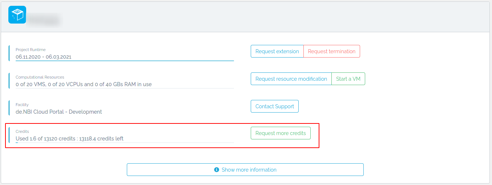
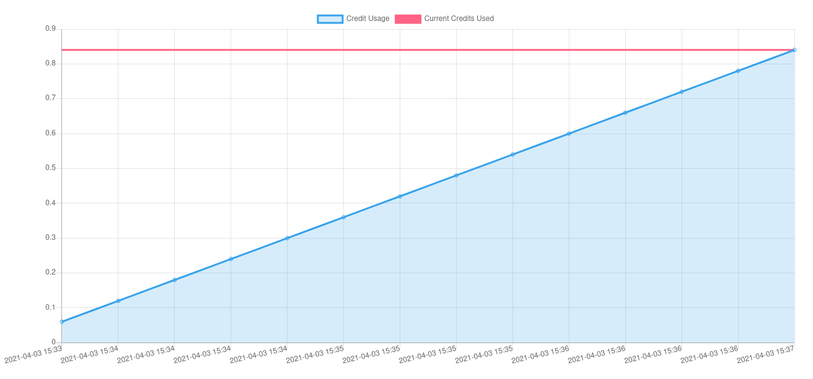
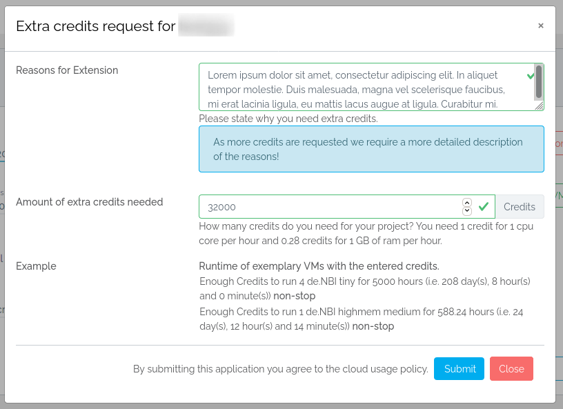
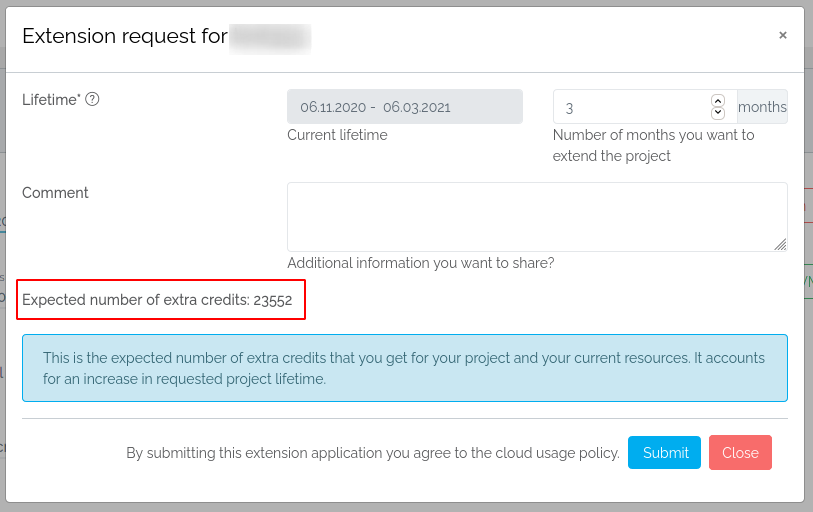
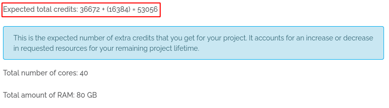

# Cloud Credits
The de.NBI Cloud is a cloud federation, providing compute and storage resources free of charge for academics. These resources
are expensive and in high demand which is why they should idle the least amount of time possible. Therefore we employ
'<strong>C</strong>loud <strong>C</strong>redit<strong>s</strong>' (CCs) to assist in your individual responsibility of 
monitoring your resource usage.  

CCs represent the equivalent of computing power per time and have no monetary equivalent, they can not be 
bought, sold or traded. The number of available CCs depend on the duration and the choice of resources for a project 
and are automatically allocated to each project. If you feel you do not have enough CCs, you may always request more CCs.

Below you will find an overview on the theoretical and practical aspect of CCs calculation and billing and 
where you may see your used and allocated CCs and how to request more CCs.  

!!! info "Subject to change"
    The usage of Cloud Credits is still in its beginning and therefore subject to change.  
    If you got questions which are not covered on this page or encounter an error, please contact us at cloud@denbi.de.

## Your Cloud Credits overview
At your project overview you will see an overview of your 'used Cloud Credits' and 'granted Cloud Credits'. Your used CCs 
will be updated in a certain interval.  
  
At the right side of it you may [request more cloud credits](#requesting-more-cloud-credits).  

At the bottom of your project overview you will see a history of your billed credits. If you want to know more about the 
calculation of Cloud Credits, please see [below](#cloud-credits-calculation).

### Requesting more Cloud Credits
Click on `Request more credits`. A modal will open in which you are asked for information on why you need more Cloud Credits, 
how many Cloud Credits you need and an example on how long these CCs will last for two example flavors.  
  

You will also be granted more Cloud Credits when you request a lifetime extension (for information how these are calculated 
please see [here](#calculating-lifetime-extension-request-ccs))  
  
or when you request a modification request (for information how these are calculated 
please see [here](#calculating-modification-request-ccs))  
    

## Cloud Credits calculation
We offer a CCs calculator [on this page](https://cloud.denbi.de/about/credits-calculator/) where you may calculate how many CCs
you need for a flavor configuration over a specified amount of time and how long you may run a flavor configuration 
with a specified amount of CCs.

### Theory
#### Variable overview
$\mathcal{I}_P=$ {Running instances of a single project $P$}  

$\mathcal{F}_P=$ {all chosen flavors of a project $P$}  

$\mathcal{R}=$ {Considered metrics} $=$ {amount of vcpus, amount of ram}  

$({t_i}_j)_{j\in\mathbb{N}}\in\mathbb{R}:=$ runtime in hours for an instance $i\in\mathcal{I}_P$ at point $j$  

$m_{ir}\in\mathbb{N}:=$ amount of metric $r\in\mathcal{R}$ of an instance $i\in\mathcal{I}_P$  (or flavor $f\in\mathcal{F}_P$)

$w:=\biggl\{\begin{array}{@{}r@{\;}l@{}}\mathbb{N}&\to\mathbb{Q},\\m_{ir}&\mapsto w(m_{ir})\end{array}$ , a weight function  

$({M_{rP}}_j)_{j\in\mathbb{N}}\in\mathbb{N}:=$ measurement of used resource $r\in\mathcal{R}$ for a project $P$ at point $j$  

$p_r\in\mathbb{Q}:=$ base cost of using one unit of $r\in\mathcal{R}$ for an hour  

$t_P\in\mathbb{N}:=$ the runtime in days of a project $P$  

$c_f\in\mathbb{R}:=$ the cost of running a flavor $f\in\mathcal{F}$ for an hour  

$C_P\in\mathbb{R}:=$ the granted Cloud Credits for a project $P$  

$({c_P}_j)_{j\in\mathbb{N}}\in\mathbb{R}:=$ the used Cloud Credits for a project $P$ at point $j$  

$H\in[0,24]\subset\mathbb{N}:=$ fixed amount of hours any flavor is allowed to run nonstop per day  

#### Calculating initial/granted CCs
The amount of granted Cloud Credits is calculated with $C_P=\lceil t_P\cdot H\cdot\displaystyle\sum_{f\in\mathcal{F}_P}c_f\rceil$.  
$c_f$ is calculated with $c_f=\displaystyle\sum_{r\in\mathcal{R}}m_{fr}\cdot w(m_{fr})\cdot p_r$.  

##### Example
First we need to calculate $c_f$. Let $P$ be a project with a lifetime of 3 months (whole April, May and June) so we get 
$t_P=91$.  
Let $H=8$, which means every flavor is allowed to run for $8$ hours per day.  
Let $\mathcal{F}_P=$ {de.NBI tiny, de.NBI tiny, de.NBI large}, $m_{\text{de.NBI tiny, vcpu}}=1$, $m_{\text{de.NBI tiny, ram}}=2$, 
$m_{\text{de.NBI large, vcpu}}=28$ and $m_{\text{de.NBI large, ram}}=64$.  
Let $w(m_{fr})=1$ if $m_{fr}\leq2$, $w(m_{fr})=2$ if $r=\text{vcpu}$ and $m_{fr}>2$, $w(m_{fr})=2.5$ if $r=\text{ram}$ and $m_{fr}>2$.  
Let $p_{\text{vcpu}}=1, p_{\text{ram}}=0.3$.  
Then we get

$$
\begin{alignat*}{3}
c_{\text{de.NBI tiny}}&= && && (m_{\text{de.NBI tiny, vcpu}}\cdot w(m_{\text{de.NBI tiny, vcpu}})\cdot p_{\text{vcpu}})\\
& && + &&(m_{\text{de.NBI tiny, ram}}\cdot w(m_{\text{de.NBI tiny, ram}})\cdot p_{\text{ram}})\\
&= && &&(1\cdot 1\cdot 1)\\
& && + &&(2\cdot 1\cdot 0.3)\\
&= && &&1.6
\end{alignat*}
$$

$$
\begin{alignat*}{3}
c_{\text{de.NBI large}}&= && && (m_{\text{de.NBI large, vcpu}}\cdot w(m_{\text{de.NBI large, vcpu}})\cdot p_{\text{vcpu}})\\
& && + &&(m_{\text{de.NBI large, ram}}\cdot w(m_{\text{de.NBI large, ram}})\cdot p_{\text{ram}})\\
&= && &&(28\cdot 2\cdot 1)\\
& && + &&(64\cdot 2.5\cdot 0.3)\\
&= && &&104
\end{alignat*}
$$

Thus running a de.NBI tiny for an hour costs $1.6$ CCs and running a de.NBI large for an hour costs $104$ CCs. Running the 
whole configuration for an hour would therefore cost $107.2$ CCs.  
To get the granted Cloud Credits for P, we can now calculate:  

$$
\begin{alignat*}{1}
C_P&=\lceil H\cdot t_P\cdot \displaystyle\sum_{f\in\mathcal{F}_P}c_f\rceil\\
&=\lceil 8\cdot 91\cdot (1.6+1.6+104)\rceil\\
&=\lceil 78041.6\rceil\\
&=78042
\end{alignat*}
$$

Thus our project P will have $78042$ CCs granted for its lifetime of 91 days.

####Calculating used CCs: 
We calculate a measurement ${M_{rP}}_j=\displaystyle\sum_{i\in\mathcal{I}_P}{t_i}_j\cdot m_{ir}\cdot w(m_{ir})$. After 
some time we take another measurement ${M_{rP}}_{j+1}$ and calculate the used Cloud Credits between the
measurements ${M_{rP}}_j$ and ${M_{rP}}_{j+1}$ with ${c_{r,\Delta}}_{j+1}=({M_{rP}}_{j+1}-{M_{rP}}_j)\cdot p_r$. 
We take ${c_P}_j$ (the 'used Cloud Credits' value until ${M_{rP}}_j$) and calculate the new 'used Cloud Credits' value 
with ${c_P}_{j+1}={c_P}_j+\displaystyle\sum_{r\in\mathcal{R}}{c_{r,\Delta}}_{j+1}$.

##### Example
Let $\mathcal{I}_P=${wone, wtwo, wthree}. wone and wtwo are de.NBI tiny machines and wthree is a de.NBI large machine. To 
simplify the example we take a measurement once at the beginning of the day, so let  
${t_\text{wone}}_0=0$, ${t_\text{wtwo}}_0=0$, ${t_\text{wthree}}_0=0$,  
${t_\text{wone}}_1=8$, ${t_\text{wtwo}}_1=4$, ${t_\text{wthree}}_1=6.8$,  
Let $m_{ir}$ and $w(m_{ir})$ as in the example above.  
Let ${c_P}_0=0$ as no Cloud Credits were used before starting these three instances.  
We calculate

$$
\begin{alignat*}{3}
{M_{\text{vcpu},P}}_0&= && &&\displaystyle\sum_{i\in\mathcal{I}_P}{t_i}_0\cdot m_{i,\text{vcpu}}\cdot w(m_{i,\text{vcpu}})\\
&= && &&({t_\text{wone}}_0\cdot m_{\text{wone},\text{vcpu}}\cdot w(m_{\text{wone},\text{vcpu}}))\\
& && + &&({t_\text{wtwo}}_0\cdot m_{\text{wtwo},\text{vcpu}}\cdot w(m_{\text{wtwo},\text{vcpu}}))\\
& && + &&({t_\text{wthree}}_0\cdot m_{\text{wthree},\text{vcpu}}\cdot w(m_{\text{wthree},\text{vcpu}}))\\
&= && &&(0\cdot 1\cdot 1)\\
& && + &&(0\cdot 1\cdot 1)\\
& && + &&(0\cdot 28\cdot 2)\\
&= && &&0
\end{alignat*}
$$

$$
\begin{alignat*}{3}
{M_{\text{ram},P}}_0&= && &&\displaystyle\sum_{i\in\mathcal{I}_P}{t_i}_0\cdot m_{i,\text{ram}}\cdot w(m_{i,\text{ram}})\\
&= && &&({t_\text{wone}}_0\cdot m_{\text{wone},\text{ram}}\cdot w(m_{\text{wone},\text{ram}}))\\
& && + &&({t_\text{wtwo}}_0\cdot m_{\text{wtwo},\text{ram}}\cdot w(m_{\text{wtwo},\text{ram}}))\\
& && + &&({t_\text{wthree}}_0\cdot m_{\text{wthree},\text{ram}}\cdot w(m_{\text{wthree},\text{ram}}))\\
&= && &&(0\cdot 2\cdot 1)\\
& && + &&(0\cdot 2\cdot 1)\\
& && + &&(0\cdot 64\cdot 2.5)\\
&= && &&0
\end{alignat*}
$$

$$
\begin{alignat*}{3}
{M_{\text{vcpu},P}}_1&= && &&\displaystyle\sum_{i\in\mathcal{I}_P}{t_i}_1\cdot m_{i,\text{vcpu}}\cdot w(m_{i,\text{vcpu}})\\
&= && &&({t_\text{wone}}_1\cdot m_{\text{wone},\text{vcpu}}\cdot w(m_{\text{wone},\text{vcpu}}))\\
& && + &&({t_\text{wtwo}}_1\cdot m_{\text{wtwo},\text{vcpu}}\cdot w(m_{\text{wtwo},\text{vcpu}}))\\
& && + &&({t_\text{wthree}}_1\cdot m_{\text{wthree},\text{vcpu}}\cdot w(m_{\text{wthree},\text{vcpu}}))\\
&= && &&(8\cdot 1\cdot 1)\\
& && + &&(4\cdot 1\cdot 1)\\
& && + &&(6.8\cdot 28\cdot 2)\\
&= && &&392.8
\end{alignat*}
$$

$$
\begin{alignat*}{3}
{M_{\text{ram},P}}_1&= && &&\displaystyle\sum_{i\in\mathcal{I}_P}{t_i}_1\cdot m_{i,\text{ram}}\cdot w(m_{i,\text{ram}})\\
&= && &&({t_\text{wone}}_1\cdot m_{\text{wone},\text{ram}}\cdot w(m_{\text{wone},\text{ram}}))\\
& && + &&({t_\text{wtwo}}_1\cdot m_{\text{wtwo},\text{ram}}\cdot w(m_{\text{wtwo},\text{ram}}))\\
& && + &&({t_\text{wthree}}_1\cdot m_{\text{wthree},\text{ram}}\cdot w(m_{\text{wthree},\text{ram}}))\\
&= && &&(8\cdot 2\cdot 1)\\
& && + &&(4\cdot 2\cdot 1)\\
& && + &&(6.8\cdot 64\cdot 2.5)\\
&= && &&1112.0
\end{alignat*}
$$

Now we are able to get the 'used Cloud Credits' value with  

$$
\begin{alignat*}{1}
{c_P}_0&=0\\
{c_{\text{vcpu},\Delta}}_1&=({M_{\text{vcpu},P}}_1 - {M_{\text{vcpu},P}}_0)\cdot p_{\text{vcpu}}\\
&=(392.8 - 0)\cdot 1\\
&=392.8\\
{c_{\text{ram},\Delta}}_1&=({M_{\text{ram},P}}_1 - {M_{\text{ram},P}}_0)\cdot p_{\text{ram}}\\
&=(1112.0 - 0)\cdot 0.3\\
&=333.6\\
{c_P}_1&={c_P}_0+\displaystyle\sum_{r\in\mathcal{R}}{c_{r,\Delta}}_1\\
&=0+392.8+333.6\\
&=726.4
\end{alignat*}
$$

After one day running one de.NBI tiny for 8 hours, one de.NBI tiny for 4 hours and one de.NBI large for 6.8 hours, the project $P$ 
has used $726.4$ CCs and has $78042-726.4=77315.6$ CCs left.  

#### Calculating lifetime extension request CCs
Let ${t_P}_\text{extension}$ the extended amount of lifetime in days.  
The amount of extra granted Cloud Credits is calculated with ${C_P}_\text{new}=\lceil ({t_P}_\text{extension}\cdot H\cdot
\displaystyle\sum_{f\in\mathcal{F}_P}c_f)+C_P\rceil$.  
##### Example
Our project $P$ will be extended by $2$ months (July and August), so we get ${t_P}_\text{extension}=62$.  
We calculate the new granted Cloud Credits  

$$
\begin{alignat*}{1}
{C_P}_\text{new}&=\lceil (H\cdot {t_P}_\text{extension}\cdot \displaystyle\sum_{f\in\mathcal{F}_P}c_f)+C_P\rceil\\
&=\lceil (8\cdot 62\cdot (1.6+1.6+104))+78042\rceil\\
&=\lceil 53171.2+78042\rceil\\
&=131214
\end{alignat*}
$$

Our project $P$ will have 131214 granted Cloud Credits after the approval of the lifetime extension.

#### Calculating modification request CCs
Let ${t_P}_\text{remaining}$ here the remaining amount of lifetime in days, ${\mathcal{F}_P}_\text{new}$ the new set 
of requested flavors and ${\mathcal{F}_P}_\text{old}$ the old set of requested flavors.  
First we take the difference between the two flavor sets ${\mathcal{F}_P}_\text{diff}={\mathcal{F}_P}_\text{new}-
{\mathcal{F}_P}_\text{old}$.  
The amount of granted Cloud Credits is calculated with ${C_P}_\text{new}=\lceil ({t_P}_\text{remaining}\cdot H\cdot
\displaystyle\sum_{f\in{\mathcal{F}_P}_\text{diff}}c_f)\rceil$.  
##### Example  
Our project $P$ requests one more de.NBI large and one less de.NBI tiny after 1 month of lifetime. 
We get ${\mathcal{F}_P}_\text{new}=$ {de.NBI tiny, de.NBI large, de.NBI large} and therefore ${\mathcal{F}_P}_\text{diff}=$ 
{-(de.NBI tiny), de.NBI large} and ${t_P}_\text{remaining}=61$.  
We calculate the new granted Cloud Credits  

$$
\begin{alignat*}{1}
{C_P}_\text{new}&=\lceil (H\cdot {t_P}_\text{remaining}\cdot \displaystyle\sum_{f\in{\mathcal{F}_P}_\text{diff}}c_f)+C_P\rceil\\
&=\lceil (8\cdot 61\cdot ((-1.6)+104))+78042\rceil\\
&=\lceil 49971.2+78042\rceil\\
&=128014
\end{alignat*}
$$

Our project $P$ will have 128014 granted Cloud Credits after the approval of the modification request.

### Cloud Credits practice
Additionally to the variables above, we include the starting date of a running machine and a start date since when we calculate 
the uptime and therefore the 'used Cloud Credits'.  
You may find our weight function [here](https://cloud.denbi.de/portal/public/creditsweights/)  
and our used start/since date [here](https://cloud.denbi.de/portal/public/startdate/).  
Our weight function works as follows:  
Let $s_i$ the starting date of an instance $i$, $W_\text{timestamps}=$ {timestamps of the weight function}, 
$W_{r,t}=$ {weights for a metric $r\in\mathcal{R}$ at timestamp $t\in W_\text{timestamps}$}.  
We iterate through the **descending sorted** timestamps $t\in W_\text{timestamps}$ and use the possible weights when we get either 
the first hit with $t\geq s_i$ or $t=|W_\text{timestamps}|$.  
Next we iterate through the ascending sorted weights $w\in W_{r,t}$ and use the weight when we get either the first hit with 
$w\leq m_{i,r}$ or $w=|W_{r,t}|$.  
The runtime $({t_i}_j)_{j\in\mathbb{N}}$ will be calculated by counting the uptime between the since/start date and the timestamp 
$j$ of the measurement.
