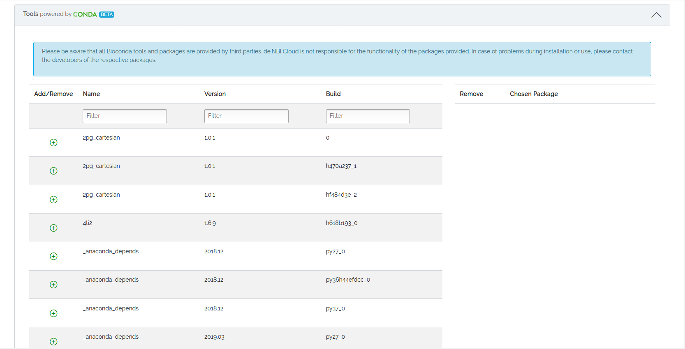
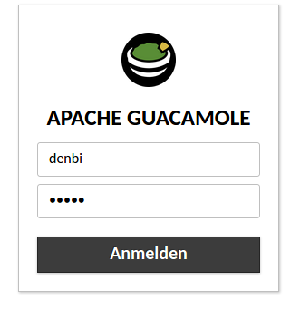
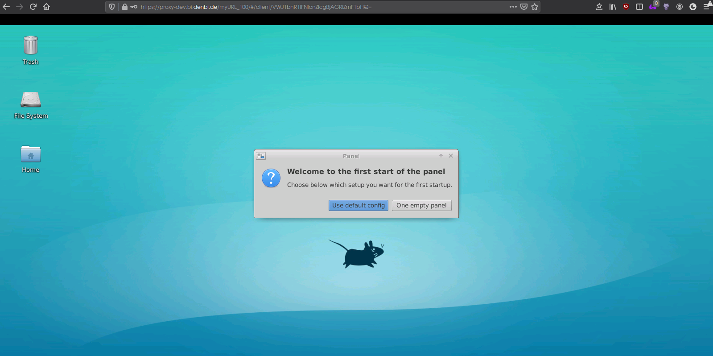

# Customization
Currently we offer the following ways of customizing your virtual machine at startup  
  - [Conda packages](#conda)  
  - [Research environments](#research-environments)
## Conda
From the project page:
>[Conda](https://docs.conda.io/projects/conda/en/latest/index.html) is an open-source package management system and environment management system that runs on Windows, macOS, and Linux. Conda quickly installs, runs, and updates packages and their dependencies. Conda easily creates, saves, loads, and switches between environments on your local computer. It was created for Python programs but it can package and distribute software for any language.  

!!! Responsibility
    All Conda tools are created, provided and maintained by third parties. The de.NBI cloud is not responsible for the functionality of the packages provided. In case of problems during installation or use, please contact the developers of the respective packages.


You may choose from a list of Bioconda, Anaconda and Condaforge tools. You may filter for name, version und build version to find the tools you need.  
Click on the green plus sign to add the tool or click on the red minus sign to remove the tool from your selection of tools.  

When you are happy with your selection, we need your confirmation about the install process which will proceed.  

### Installation process

!!! Minoconda3
    Miniconda3 will be installed, which is a lightweight package manager, not the full (~1500 package) Anaconda set of tools. If you wish to install Anaconda, you will have to choose it from the list of packages.

We will create a temporary private and public key pair which will be used to access your virtual machine at startup. Then we will install your selection with [Ansible](https://docs.ansible.com/ansible/latest/index.html). At the end of the installation process we will remove the temporary key from your machine and copy your public key onto it, regardless of whether the installation of your selection will succeed or fail. Also you will be able to download the installation logs (as pdf or txt file) and look into the them if you wish.  

### Environment
A [Conda environment](https://docs.conda.io/projects/conda/en/latest/user-guide/concepts/environments.html) named 'denbi' will be created. You may find your selection of tools in this environment. For your convenience, we initialize the .bashrc for conda and create an alias, so that you may load the 'denbi' environment simply by running 
~~~BASH
$ denbi
~~~
as a command once you logged into your virtual machine.
## Research environments
Here you may find a selection of research environments you will be able to use over your web browser, e.g. [RStudio](#rstudio), [Apache Guacamole](#apache-guacamole) or [Theia IDE](theia-ide). More research environments might be added in the future.  
You will need to select a template of the research environment you wish to install and a namespace, which will be part of the URL under which you will have access to your research environment.   

!!! Installation
    Similiar to the [installation process of Conda](#conda#installation-process), we will create a temporary rsa-keypair which will be used to install your research environment via Ansible. Afterwards we remove the temporary key and copy your public key onto your virtual machine, whether the process succeeds or fails. Afterwards you may download and look into the installation logs if you wish to.

To access your research environment, follow the Link you will find after starting your virtual machine, in the instance overview and/or on the detail page of your virtual machine.  

If you are not already logged in with your ELIXIR account, you will be prompted to log in with your ELIXIR account, as only the one who started the virtual machine will be allowed to access the research environment.
### RStudio
From the project page:
>[RStudio](https://rstudio.com/products/rstudio/) is an integrated development environment (IDE) for R. It includes a console, syntax-highlighting editor that supports direct code execution, as well as tools for plotting, history, debugging and workspace management.  

To access your RStudio research environment, please follow the link you may find after starting your virtual machine, in the instance overview and/or on the detail page of your virtual machine. You will be prompted to log in with your ELIXIR account if you have not done it already. Afterwards you will be prompted to log in to RStudio.  
  
#### Login credentials
Use the following credentials:  
```
Username: ubuntu  
Password: simplevm
```
If these credentials do not work, please try the deprecated (since 16.03.2020) credentials:
```
Username: ubuntu  
Password: ogvkyf
```
Now you are able to work with RStudio via web browser!  

### Apache Guacamole
From the project page:
> [Apache Guacamole](https://guacamole.apache.org/) is a clientless remote desktop gateway. It supports standard protocols like VNC, RDP, and SSH. We call it clientless because no plugins or client software are required. Thanks to HTML5, once Guacamole is installed on a server, all you need to access your desktops is a web browser.  

To access your Apache Guacamole research environment, please follow the link you may find after starting your virtual machine, in the instance overview and/or on the detail page of your virtual machine. You will be prompted to log in with your ELIXIR account if you have not done it already. Afterwards you will be prompted to log in to Apache Guacamole.  
  
#### Login credentials
Use the following credentials:  
```
Username: denbi  
Password: denbi
```
Now you are able to work with Apache Guacamole via web browser!  

### Theia IDE
From the project page:
> [Eclipse Theia](https://theia-ide.org/) is an extensible platform to develop full-fledged multi-language Cloud & Desktop IDE-like products with state-of-the-art web technologies.  

More information regarding Theia IDE can be found on our [tutorial page](../../Tutorials/TheiaIde/#theia-ide).  

To access your Apache Guacamole research environment, please follow the link you may find after starting your virtual machine, in the instance overview and/or on the detail page of your virtual machine. You will be prompted to log in with your ELIXIR account if you have not done it already. Now you are able to work with Theia IDE via web browser!  

