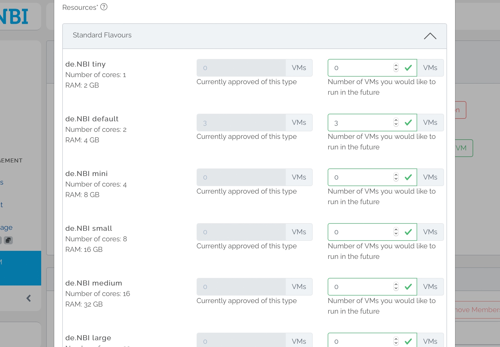
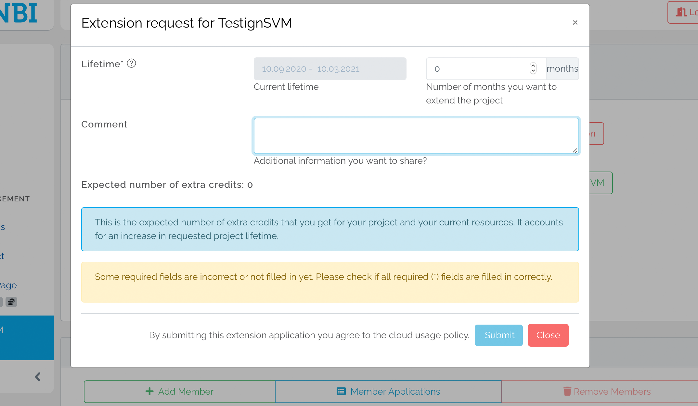

## Requesting changes

The resources or the lifetime of a running project can be adjusted very easily via the [project overview](project_overview.md). For this purpose two separate forms are available. It is also possible to apply for additional credits. All requests are processed and approved or rejected independently. The status of the requests can be seen in the project information on the project overview page.

### Resource modifications 

A click on the button "Request resource modification" displays the form for the modification of project resources. On the left side all currently available resources are listed. On the right side these numbers can be adjusted to the changed needs. It is also possible to leave a comment. 

After entering all desired data, a summary is displayed which allows the user to check his entries. With confirmation of the entries the request for the adjustment of the project resources is submitted.

### Lifetime extensions

You can submit an extension request by clicking on the button "Request extension". Similar to the application for project resources, the corresponding form is opened here, which shows the current project duration and allows the user to extend it by a number of up to 12 months. It is also possible to justify the extension request in the comment field.

Before entering this data, the user is given the opportunity to enter publications that have been created or published in connection with the project. 

After entering the desired extension, the user will be shown a summary which he/she must confirm in order to submit the extension request.

