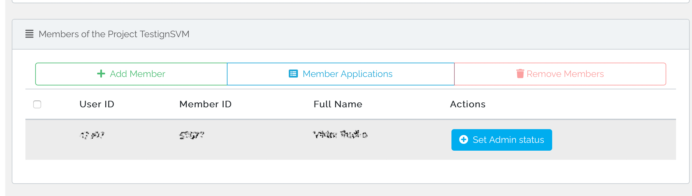

In the sidebar under "Project Management" all projects you are a member of are listed. By clicking on the corresponding project you will get to the project overview page, which contains all information about the project as well as the possibility of adjustments.

### Quick overview

The upper part of the overview page summarizes the most important information about the project. This information includes the runtime and the number of available virtual machines. In addition, the support of the project location where the project is running can be contacted directly. 
It is possible to [request extensions or resource modifications](modification.md) directly from the overview.
With a click on "Show more information" all further project information and currently requested changes/extensions can be displayed.

### Member management

In the area "Members of the Project" all members of the project can be viewed. 
Project administrators are also able to  

* Invite further members

* Accept/reject member applications for the project

* Remove existing members from the project

* Promote members to administrators or revoke their status

Members can be easily be added to the project.
If desired users already have a de.NBI Cloud account, they can easily be added using the search function under "Add member". Otherwise you will find an invitation link in the same section, which can be sent to the desired persons. These persons must then register for an ELIXIR and a de.NBI Cloud account. As soon as the invited person has completed this process and applied for your project, the project administrators will be informed by mail. Adding the people to the project can then be confirmed or declined under "Member Applications".

### Publications

Project administrators can add DOIs of publications that are related to the current project so that they are published on the de.NBI cloud page. You can find more information on this topic [here](../citation_and_publication.md).