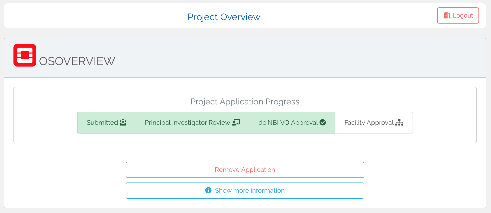
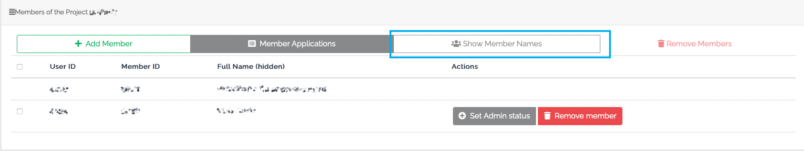
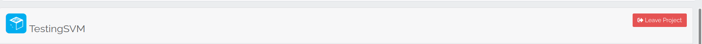

In the sidebar under "Project Management" all projects you are a member of are listed. By clicking on the corresponding
project you will get to the project overview page, which contains all information about the project as well as the
possibility of adjustments.

### Quick overview

If the evaluation of your project application is not yet completed, the current status can be seen here. Depending on
the project type, several steps are necessary for the evaluation of the application, which are visible in the progress
display. If you move the mouse over a step in the display, more information will be shown.

The evaluation of the application is divided into the following steps:

* Submitting the application

* Approval of the Principal Investigator: The application must be submitted or confirmed by the responsible principal
  investigator

* Confirmation by the Cloud committee: The application must be approved by the committee of the de.NBI Virtual
  Organization

* **Only for OpenStack projects** - Approval of the Facility Manager: The application must be confirmed by the facility
  manager of the compute center to which their project was assigned by the VO

The upper part of the overview page summarizes the most important information about the project. This information
includes the runtime and the number of available virtual machines. In addition, the support of the project location
where the project is running can be contacted directly. It is possible
to [request extensions or resource modifications](modification.md) directly from the overview. With a click on "Show
more information" all further project information and currently requested changes/extensions can be displayed.

### Member management

In the area "Members of the Project" all members of the project can be viewed if granted by the administrators. Project administrators are also able to

* Invite further members

* Accept/reject member applications for the project

* Remove existing members from the project

* Promote members to administrators or revoke their status

* Adjust the visiblity of member names

* Prevent the starting of machines by non-administrator

Members can be easily be added to the project. If desired users already have a de.NBI Cloud account, they can easily be
added using the search function under "Add member". Otherwise you will find an invitation link in the same section,
which can be sent to the desired persons. These persons must then register for an ELIXIR and a de.NBI Cloud account. As
soon as the invited person has completed this process and applied for your project, the project administrators will be
informed by mail. Adding the people to the project can then be confirmed or declined under "Member Applications".

By default, only admins of a project see all project members. This option can be disabled and re-enabled by admins using
the "Show/Hide Member Names" button (as seen below). If the option is enabled, this is also indicated by a "(hidden)"
next to "Full Name" in the header of the member table.

Also by default, all project members are able to start machines as soon as the project resources are available.
Administators of SimpleVM projects are able to prevent machines from being started by non-administrators or to allow this again after the restriction has been made. The "Allow/Prevent starting of machines" button can be used for this purpose.

### Leaving a Project

It is possible for all project members except the PI to leave a project at any time by clicking the "Leave Project"
button in the project overview.

The PI cannot leave the project as she/he is responsible for it. In order to leave the project, the PI must
contact <a href="mailto:cloud@denbi.de">cloud@denbi.de</a>  and clarify which person will take over further
responsibility for the project.

### Publications

Project administrators can add DOIs of publications that are related to the current project so that they are published
on the de.NBI cloud page. You can find more information on this topic [here](../citation_and_publication.md).
