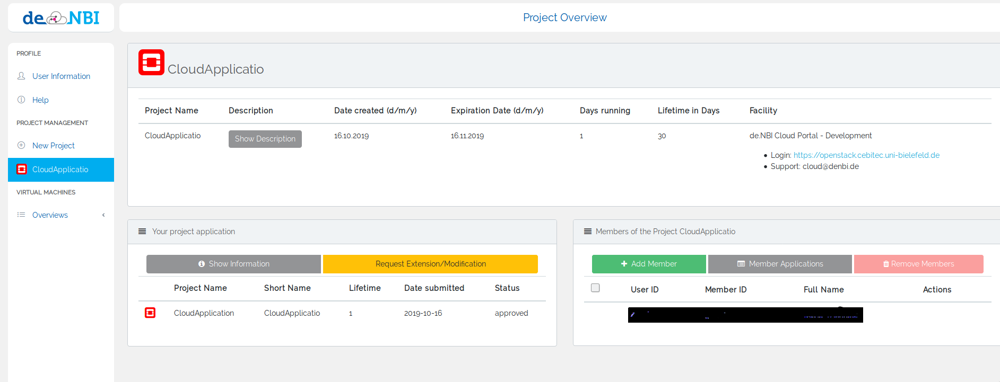
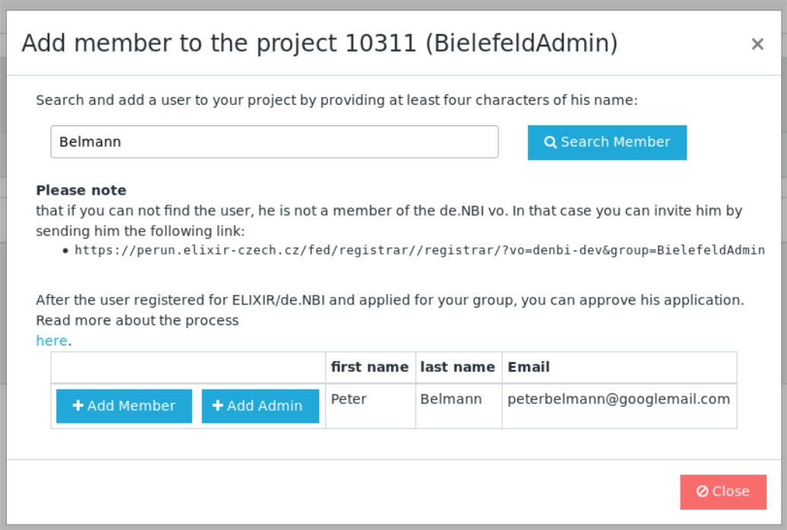
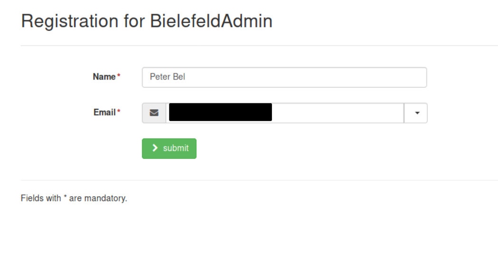
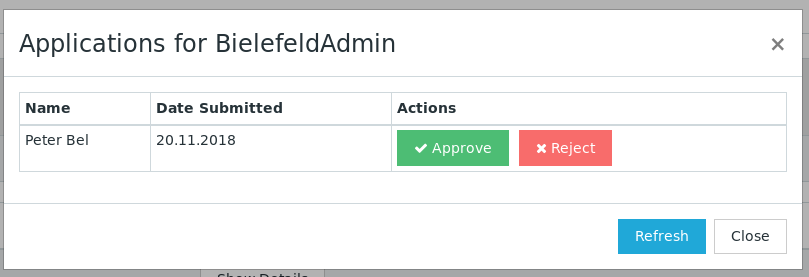

## Project Overview

In the "Project Management" sidebar your projects are listed and by clicking on a project tab the detailed overview opens.

The following actions are only available for a project manager:

* Overview of all project members. Project managers are colored in blue.
    
* Appoint another member as admin (project manager).

* Remove the admin (project manager) state.

* Remove a member from this project.
    
* Add another user to this project by inserting their name, email or even ELIXIR ID and clicking on `add member`.

* Add a DOI (Digital Object Identifier).
   

### Inviting Members

Through invitation links users can be easily added to a de.NBI Cloud project. The process is the following:

* __Step 1__: Send the invitation link which you can find in the "Add Member" modal to the user you want to add (see figure of the previous section).

* __Step 2__: By using this link the user will be requested to register for an ELIXIR and de.NBI Cloud account. In the final step the
user also registers for your project.

* __Step 3__: You will be informed by mail as soon as the user submits an application. You can then approve the application
in the application modal. Once the application is approved the user will have access to your project.

#### Adding a DOI (Digital Object Identifier)

In this field you can enter a DOI, which will be associated with your project. There is no limit on the number of DOI you can associate with your project. Clicking the delete Button will remove the DOI and its association to your project.  
If you do not know about DOI, the placeholder [10.1000/182](https://doi.org/10.1000/182) links to the DOI handbook, where you may find more information.  
Please Note that after completion, deletion or termination of your project, the association between the DOI and your project will remain.

#### Citation Information

The development and support of the cloud is possible above all through the funding of the cloud infrastructure by the Federal Ministry of Education and Research (BMBF)! We would highly appreciate the following citation in your next publication(s):

!!! note "" 
    ‘This work was supported by the BMBF-funded de.NBI Cloud within the German Network for Bioinformatics Infrastructure (de.NBI) (031A537B, 031A533A, 031A538A, 031A533B, 031A535A, 031A537C, 031A534A, 031A532B).
