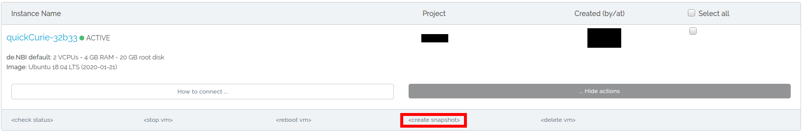
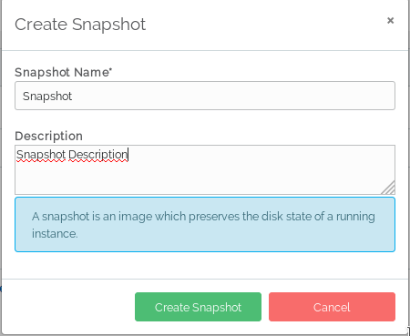
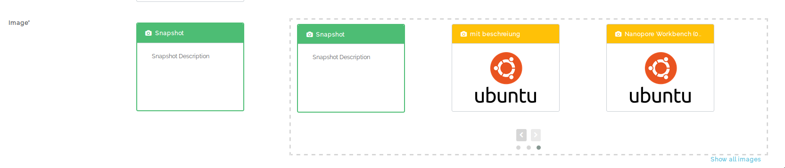

## Snapshots

A snapshot is an exact copy of your virtual machine. A snapshot of an instance can be used as the basis of an instance and booted up at a later time. 

### Create Snapshot

After starting a machine you can go to instance overview and create a snapshot. 

Now you can enter a name for your snapshot and confirm it by pressing Create Snapshot. 

### Start Snapshot

After the snapshot is successfully created you can go to the "New Instance" tab and choose the created snapshot as image to start a vm. 
