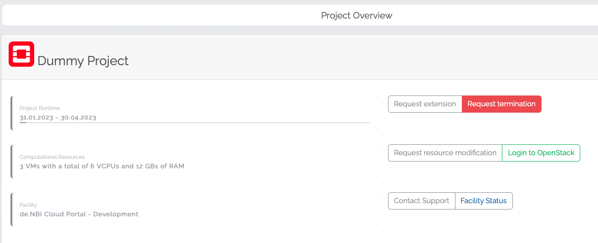

# Project Termination

If you want to terminate your project in the de.NBI Cloud, you can initiate this via the portal.

## Termination Process

The basic management of a project is possible on the [project overview](project_overview.md) page of each project.
There you can submit a termination request, by clicking on "Request termination"

Depending on which project type your project corresponds to, the display will be slightly different.
If it is a SimpleVM project, all resources affected by a termination are displayed. 
In case it is an OpenStack project, you will have to look up the machines, 
volumes and other resources yourself via the OpenStack dashboard of your respective site where the project is running.
You will need to confirm that you are irretrievably releasing the resources as part of the termination process.
Access to these resources will soon no longer be possible.
For a SimpleVM project, a member of the de.NBI Cloud governance will process the termination request and terminate the project in the cloud shortly after. 
In the case of an OpenStack project, this is additionally confirmed by a manager of the corresponding cloud site.
