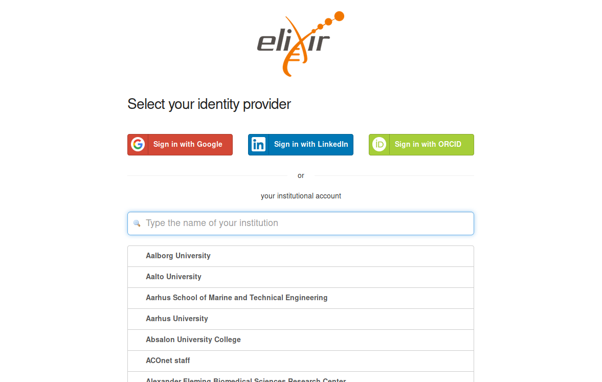

## Profile

The profile page can be used to manage your personal data.

### Profile Information

Personal data such as the elixir ID and the elixir login can be viewed on this page.
Your preferred e-mail address can also be changed here. 
On this page you will as well find your public SSH-Key (if it is already stored).

### SSH Key

You have the possibility to view, copy and deposit your public ssh key. A set key is required for starting machines. Furthermore, you can only be added to machines by other members of your projects, which are started by them, if the key is set. 
Read more about it [here](../simple_vm/new_instance.md#3-grant-access-for-project-members).
If you don't know how to generate a ssh key, you will find a link to the [instructions](../quickstart.md#generate-ssh-keys) on the page.

Alternatively you are also able to have a ECDSA key generated for you. Click on the `Generate Key` button and read and confirm the notification.  
  

The public key part will be automatically set for you and you are able to download the private key file once.  
  

If you do not save the private key generated for you, it will be irretrievably lost. We do not save the generated private keys for you. If you have cancelled or forgotten to download the key, you must repeat the process with a new key.

### Link Accounts to ELIXIR

On the profile page you can link multiple accounts to your existing ELIXIR-account.
By clicking on the button `Link accounts` you will be redirected to the [ELIXIR profile-page](https://perun.elixir-czech.cz/fed/profile/#identities "ELIXIR profile"). If you are not yet logged in to ELIXIR, please do so to be redirected to the page mentioned. Click on `My linked accounts` in the menu to see and manage your accounts linked to your ELIXIR account. 
To link another account click on `Link a new account` below `My linked accounts`. 

You will be redirected to the ELIXIR login-page. 

Log in to the account that you want to link to your ELIXIR account. In the example shown this is done with ORCID.
After you have signed up for the desired service, you will usually be asked to confirm/authorize the linking of the account.
 

Once this is done, you will be redirected to the ELIXIR profile page, where you will receive a confirmation of the successful linking of your account. 

To remove a linked account click on the red button next to the listed account.

### Newsletter

You can subscribe to the newsletter of the de.NBI Cloud. If you don't want to receive any more newsletters, you can as well deactivate the option.
