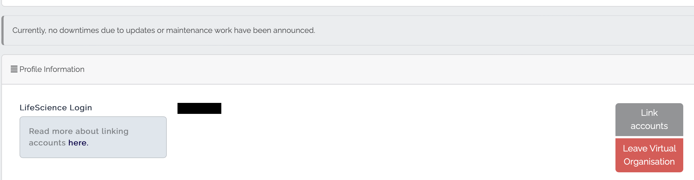
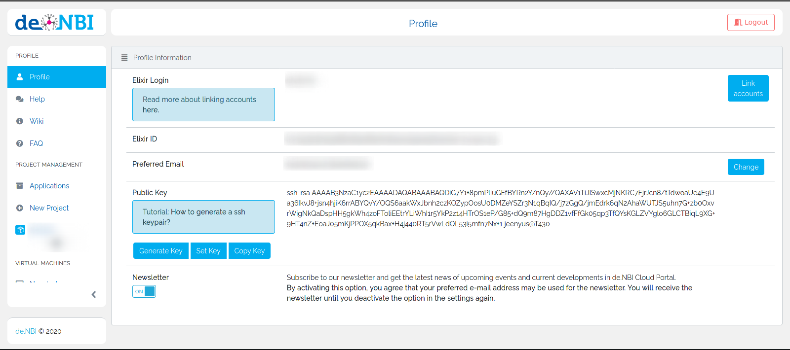
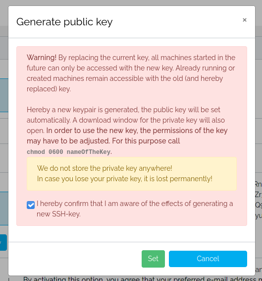
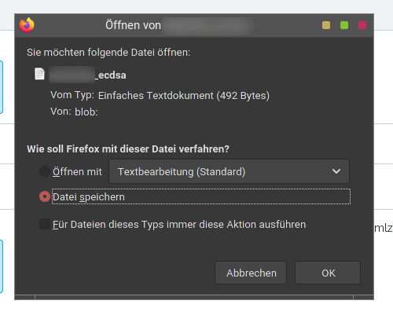
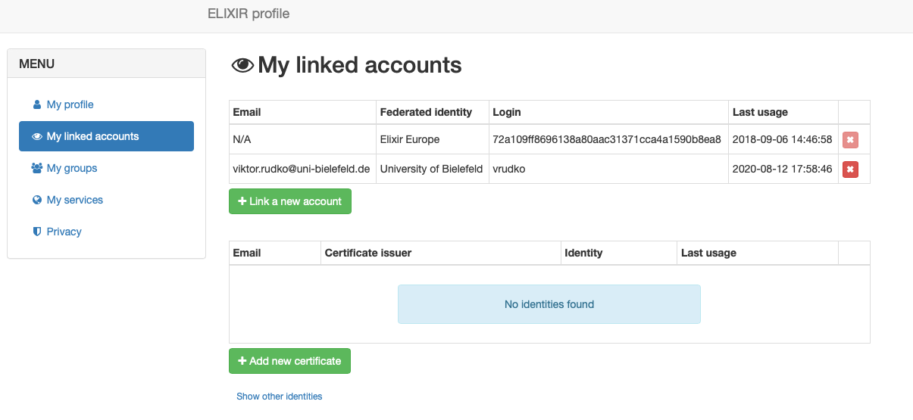
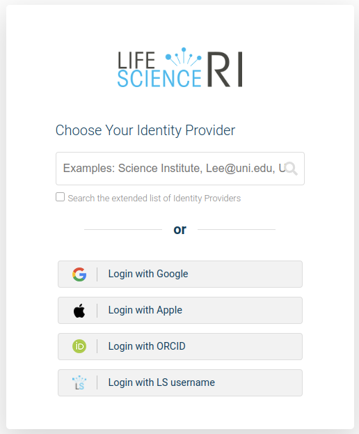
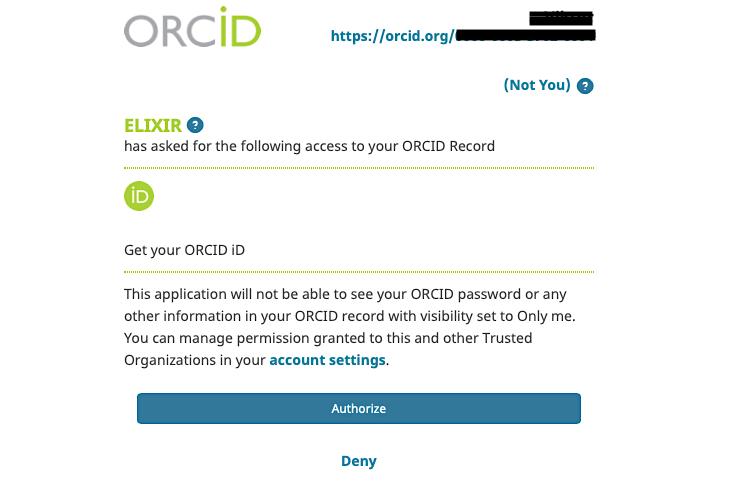
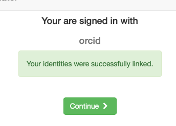

## Profile
The profile page can be used to manage your personal data.

### Profile Information
Personal data such as the elixir ID and the LifeScience login can be viewed on this page.
At this point, you can change your preferred email address as well as leave the de.NBI VO.
On this page you will as well find your public SSH-Key (if it is already stored).

### Prefered Email

Please note: If you change the email address, you must confirm this change before it takes effect. 
Keep in mind that the email address you enter should be used actively, as all relevant information for you as a user of the cloud will be sent to this address.

### Leaving the Virtual Organization / Deleting de.NBI account

If you want to leave the de.NBI Virtual Organization and delete your de.NBI account, because you do not want to use the portal or any de.NBI Cloud-related services any longer,
you can do so by clicking the "Leave Virtual Organization" button.
It is located in the column for the LifeScience Login.
Depending on which projects you are a member of, you will now be shown corresponding information about the projects and machines to which you no longer will have access. The machines displayed are limited to SimpleVM projects.
For your OpenStack projects, you have to check yourself at the corresponding compute-center whether machines of yours are still running.  
You must then confirm your leaving. 

**Please have in mind:** Deleting your de.NBI account does not delete your LifeScience-account.

You must carry out this deletion yourself under the following link:
https://signup.aai.lifescience-ri.eu/fed/registrar/?vo=anonymize

### SSH Key

You have the possibility to view, copy and deposit your public ssh key. An uploaded public key is required for starting machines. 
Read more about it [here](https://simplevm.denbi.de/wiki/simple_vm/create_instance/#9-grant-access-for-project-members).
If you don't know how to generate a ssh key, you can read the [instructions](../quickstart.md#generate-ssh-keys) on our quickstart page.

Alternatively you are also able to have a ECDSA key generated for you. Click on the `Generate Key` button and read and confirm the notification.  
  

The public key part will be automatically set for you and you are able to download the private key file once.  
  

If you do not save the private key generated for you, it will be irretrievably lost. We do not save the generated private keys for you. If you have cancelled or forgotten to download the key, you must repeat the process with a new key.
Please note that you will have to change the permissions of the key file as written in the notification you just confirmed.

#### Supported formats

In case you upload a key yourself, please note that we currently only support the following formats: RSA and ECDSA (SHA2, NIST P256, P384 or P521).
As mentioned above, regard the [instructions](../quickstart.md#generate-ssh-keys) to generate a supported key.

### Link Accounts to LifeScience (formerly Elixir)

On your [profile page](https://profile.aai.lifescience-ri.eu/profile/identities) you can link multiple accounts to your existing LifeScience-account.
If you are not yet logged in to LifeScience, please do so to be redirected to the page mentioned. 
Click on `Linkes identities` in the menu to see and manage your accounts linked to your LifeScience account. 
To link another account click on `Add` below `Linked identities`. 

You will be redirected to the LifeScience login-page. 

Log in to the account that you want to link to your LifeScience account. In the example shown this is done with ORCID.
After you have signed up for the desired service, you will usually be asked to confirm/authorize the linking of the account.
 

Once this is done, you will be redirected to the LifeScience profile page, where you will receive a confirmation of the successful linking of your account. 

To remove a linked account click on `Remove` below `Linked identities`.

### Newsletter

You can subscribe to the newsletter of the de.NBI Cloud. If you don't want to receive any more newsletters, you can as well deactivate the option.
