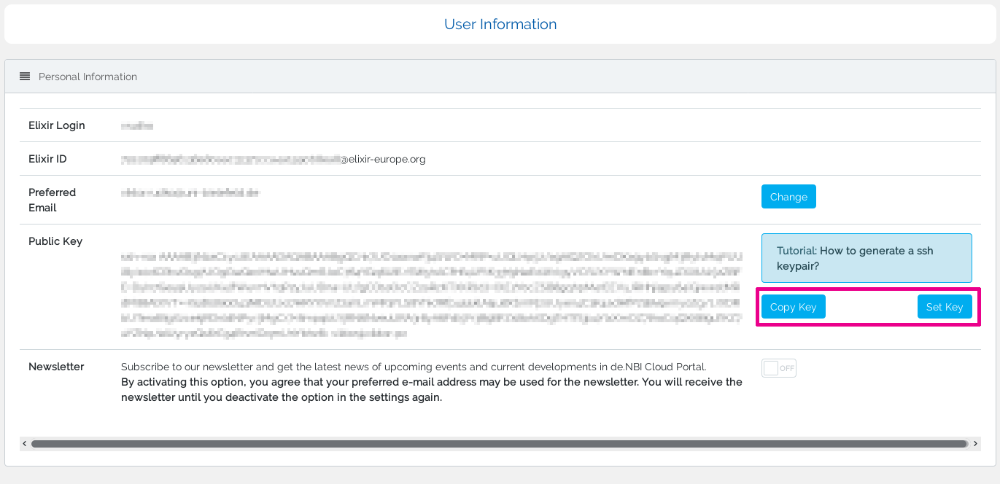

## User Information

The user information page can be used to manage your personal data.

### Personal Information

Personal data such as the elixir ID and the elixir login can be viewed on this page.
Your preferred e-mail address can also be changed here. 
On this page you will as well find your public SSH-Key (if it is already stored).

### SSH Key

You have the possibility to view, copy and deposit your public ssh key. This is necessary for starting machines. If you don't know how to generate a ssh key, you will find a link to the [instructions](../quickstart.md#generate-ssh-keys) on the page.

### Newsletter

You can subscribe to the newsletter of the de.NBI Cloud. If you don't want to receive any more newsletters, you can as well deactivate the option.
