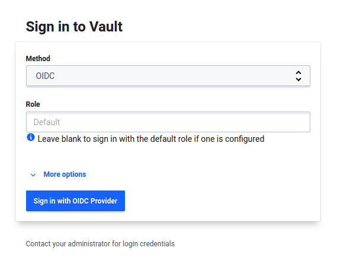
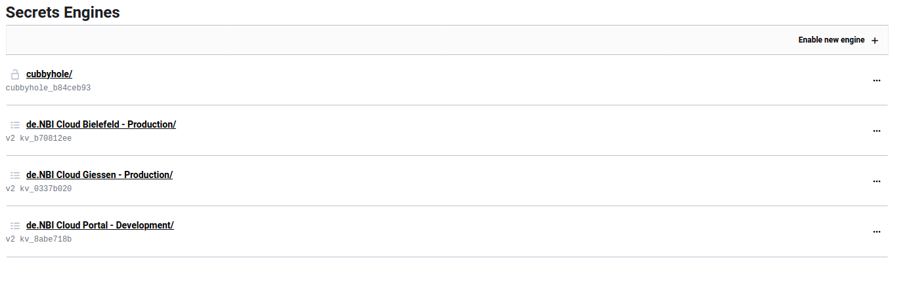
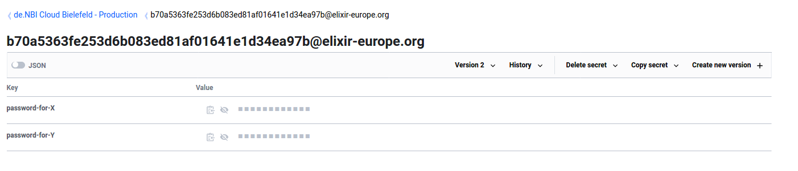
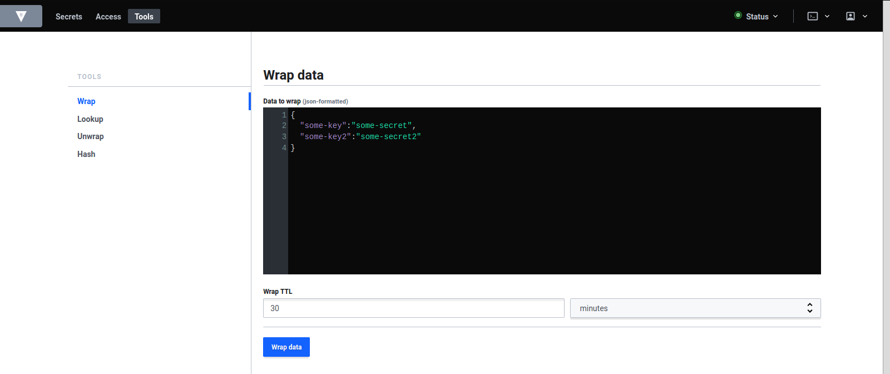
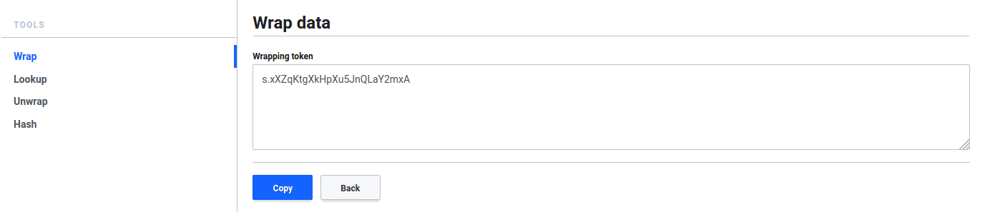
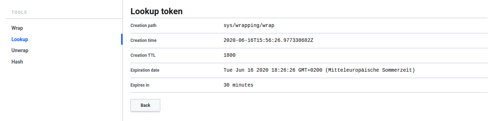
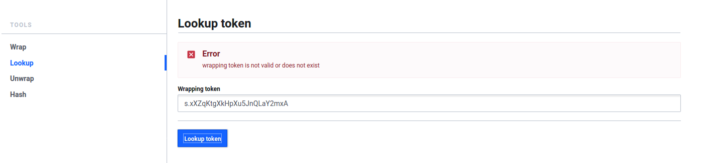
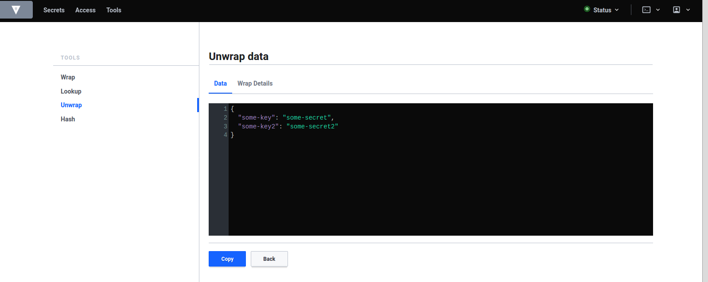

# Using Vault
For general information about Vault, please visit [Vault on github](https://github.com/hashicorp/vault).  

## Logging into Vault
You can find the Vault ui [here](https://cloud.denbi.de/ui/).  

!!! danger "OIDC popup"
    To log in with OIDC you need to have popups allowed for the vault login page! If the login is buggy after allowing popups, please reload the page.

Log in with OIDC as method and leave the role field blank.  
  

## Reading a secret
After logging in you should see the 'Secrets' tab.  
  
To access a secret, copy the URL with the compute center you want to access and add your Elixir ID at the end:  

!!! danger "Access a secret"
    Make sure that you are logged in to ELIXIR before you copy the link into the address bar, otherwise the process will not work.
 
```
Format:
https://cloud.denbi.de/ui/vault/secrets/<COMPUTE CENTER>/show/<YOUR ELIXIR ID>  
```
```
Example:
https://cloud.denbi.de/ui/vault/secrets/bielefeld/show/b70a5363fe253d6b083ed81af01641e1d34ea97b@elixir-europe.org  
```
```
List of URLS with compute center:  
Giessen:  
https://cloud.denbi.de/ui/vault/secrets/giessen/show/  
Bielefeld:  
https://cloud.denbi.de/ui/vault/secrets/bielefeld/show/  
Tübingen:
https://cloud.denbi.de/ui/vault/secrets/tuebingen/show/
```
To get your Elixir ID, please visist the [Profile page](https://cloud.denbi.de/portal/webapp/#/userinfo) of the portal. There you will find your Elixir ID.

  
Click on the eye-icon to read the secret value or click on the copy button next to it to copy the secret value directly.

### Share a one time secret
You have the possibility to have Vault wrap a JSON and create a token, which can be used to unwrap the JSON once.  
Every user that is able to log in with OIDC has access to the wrapping and unwrapping tools.

#### Wrapping
In the headbar, click on 'Tools'. At the left, click on 'Wrap'.  
  
Here you can write a JSON and choose how long the token should be valid. Click on 'Wrap data' and afterwards you can share the token.  
  
#### Lookup
In the headbar, click on 'Tools'. At the left, click on 'Lookup'.  
  
Here you can input the wrapping token. If the token got already unwrapped or is not valid anymore, an error message appears.  

#### Unwrap
In the headbar, click on 'Tools'. At the left, click on 'Unwrap'. Here you can input the wrapping token. After clicking on 'Unwrap data' you should be able to see the whole JSON.  
  
