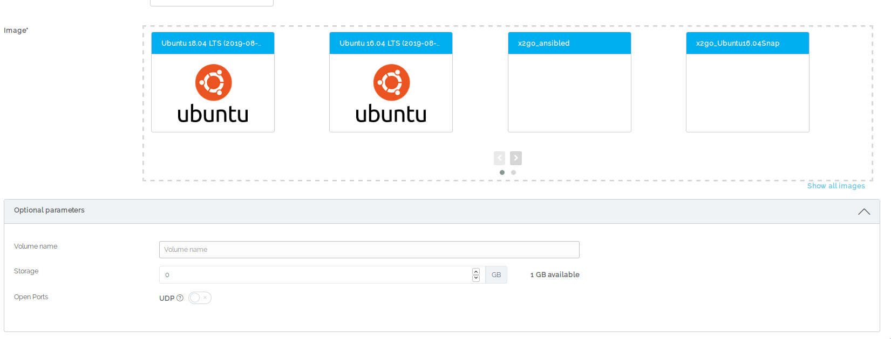
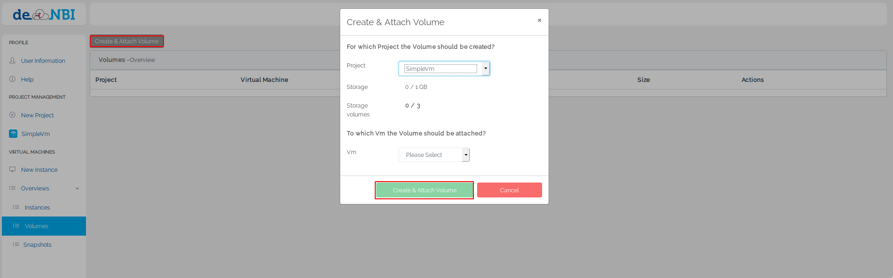

## Volume

### Create Volume

There are two ways to create a volume:

1.When starting a virtual machine you can choose to start a volume when selecting optional params.


The volume is automatically mounted this way.

2.At the Volume tab you can choose to create an volume.


In order to use the Volume you need to [mount](#mount-a-volume) it.

### Mount a volume

In order to mount a volume connect via ssh to your machine.
You will find your volume with the command

```BASH
lsblk
```

This command will list all your block devices connected to your VM.
Chose the correct device (mostly the name will be the second entry, you can orientate oneself on the SIZE parameter) and format it with a filesystem if you are using this volume for the first time.
Common filesystems are ext4 or xfs.

```BASH
mkfs.ext4 /dev/device_name
```

After the formating you have to create a mountpoint

```BASH
mkdir -p /mnt/volume
```

Check that you have the correct permissions for this directory, otherwise set them with the follwoing command

```BASH
chmod 777 /mnt/volume/
```

And mount the Cinder Volume under the created directory

```BASH
mount /dev/device_name /mnt/volume
```

Now you should see your device by executing the command

```BASH
df -h
```

If you do not need you Cinder Volume you can also unmount it with

```BASH
umount /dev/device_name
```
