This is the **Quickstart** to start your own running virtual machine in the de.NBI cloud. To start this guide you should have an individual account and be a member of an existing project. If you do not have an account, please visit [this page](https://cloud.denbi.de) and follow the instructions.

Throughout this guide, we will achive following goals:

  1.  [First Login](quickstart.md#first-login)
  2.  [Openstack Dashboard Overview](quickstart.md#openstack-dashboard-overview)
  3.  [SSH Setup](quickstart.md#ssh-setup)
  4.  [Creating a Router and a Network](quickstart.md#creating-a-router-and-a-network)
  5.  [Launching our Instance](quickstart.md#launching-an-instance)
  6.  [Getting Access to our Instance](quickstart.md#getting-access-to-the-instance)

----

# First Login

**This guide is based on the de.NBI cloud setup in Giessen. It should also be applicable to other de.NBI cloud sites. Please check the correct URL of your site in the _Compute Center Specific_ section.**

First of all, visit [de.NBI cloud Giessen login page](https://cloud.computational.bio.uni-giessen.de/). You should see the following login page:

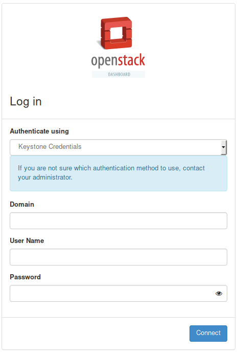

Please choose in the **Authenticate using** field, the **ELIXIR AAI** tag and click on the **Connect** button. You should be redirected to the [Openstack Dashboard](quickstart.md#openstack-dashboard-overview). If you have any problems or need help logging in, please do not hesitate to contact the Cloud Support of your site. You can find the corresponding support site in the _Compute Center Specific_ section.

# OpenStack Dashboard Overview

If the login was successful, you should see the overview page of the OpenStack dashboard:

----

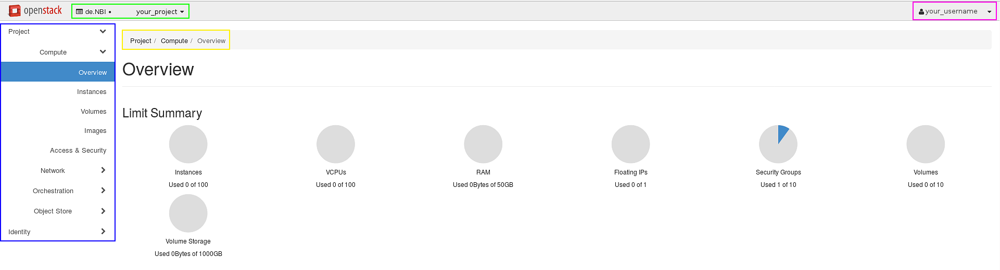

----

At the top left you should see your current [project](../Concept/basics/#project) in the **de.NBI** [Domain](../Concept/basics/#domain) (green box). If you have more than one project, you can switch into another one here (click on the arrow down button).

At the top right you can see your [username](../Concept/basics/#user) (pink box). When you click on that arrow, you will get a dropdown menu. Here, you can get to your user specific settings (changing dashboard settings and appearance and your password), get to the official user documentation by OpenStack, change your theme or log out.

On the left is the **control menu** (blue box) to navigate you through your project. The current page is highlighted in blue (In our case Project -> Compute -> Overview). This information can also be found in the yellow box. This could help you navigate to the right page, in the case you have trouble to find the current page we are operating on.

The overview page summarizes the resource allocation within the current project (center of the page):

*  Launched [instances](../Concept/basics/#instance)

*  Used VCPUs

*  Used RAM

*  Allocated [ floating IPs ](../quickstart#floating-ip)

*  Used [ security groups ](../quickstart#security-groups)

*  Number of [ Volumes ](../quickstart#using-cinder-volumes) and Volume Storage

# SSH Setup

Next, we have to setup SSH to login to our instances after they are launched. Go to 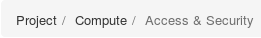 and click on **Key Pairs** (green box). You should see this page:

----

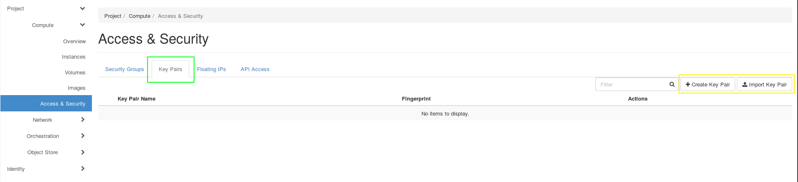

----
If you do not have an SSH key or you are not sure whether you have one, please generate one by following the instructions based on your operating system (**Windows**/**Linux**) in the next [Generate SSH-Keys](quickstart.md#generate-ssh-keys) section. You can import your SSH Key by clicking on **Import Key Pair** (right button in the yellow box)(e.g.: .pub in Linux or .key in Windows). 
Afterwards, your key should be listed on the key overview page. In chapter [ Getting Access to the Instance](quickstart.md#getting-access-to-the-instance) we will use this key. 

## Generate SSH-Keys
You have two options to generate your SSH Key:  
1. Manually. Follow the instructions for either Linux or Windows.  
2. Automatically. Please see our information on the [profile page](portal/user_information.md#ssh-key).  

Note that on your "User information" page only RSA and ECDSA public keys are accepted as valid.
The following instructions are for RSA keys.

**Linux**

On all UNIX based operating systems ‘keygen’ may be used to create a key pair. A Linux command example is given below:

~~~BASH
$ ssh-keygen -t rsa -f new_id
~~~

which will produce the files new_id and new_id.pub.

**Windows**

Download, install and start [puTTYgen](https://www.puttygen.com/download-putty#PuTTY_for_windows). Make sure RSA is chosen at the bottom of the window as 'type of key to generate'. You need to move your mouse cursor inside the grey field to create enough entropy until the key is generated. You now may enter a 'Key passphrase' (also enter the same passphrase in the Confirm passphrase field), which acts as a further security mechanism regarding the use of your key.
Save your private and public key into separate files e.g, new_private_key.ppk and new_public_key.key with the buttons at the bottom. The .key file can be opened and read with a standard text-editor if you wish to.  
The content of the public key file should look like this:
~~~BASH
---- BEGIN SSH2 PUBLIC KEY ----
Comment: "rsa-key-20191114"
AAAAB3NzaC1yc2EAAAABJQAAAQEA0DX7jcuqlsCXw51r4RYGkKeu78P9RXqx9VmQ
1bwQl+is2BxZJWZCYibY1x5FfAkKZio+KSG3TRdWMq0JLciWcUTpKfQPduAkUXYX
7pCAnDEzZt4wkabiQvf1odWbf0SWsg8hq46mgYvVMa9Yq1smHF+44WPjaTvHzOxt
tYYIJnQd73vdO/XULbrEnYahp2DSfJL+GDHoymOxYj+3YTQOAxmTGnje1ZjCvwZ2
33KZv+TXJRu6jx4eOMb9RjCvG+e2Bfn/JoaCPI6h4T1KLM5G2uh2tLXqIVN73PfR
ljWpr6NDdPsCd+5uURFnQ2zdjg6G62/5JU5WPZAZZgfKhrE7qw==
---- END SSH2 PUBLIC KEY ----
~~~
When setting your key on the [User Information page](portal/user_information.md#ssh-key), you need to add 'ssh-rsa' infront and can add a comment after your key, so it would look like this:
~~~BASH
ssh-rsa AAAAB3NzaC1yc2EAAAABJQAAAQEA0DX7jcuqlsCXw51r4RYGkKeu78P9RXqx9VmQ
1bwQl+is2BxZJWZCYibY1x5FfAkKZio+KSG3TRdWMq0JLciWcUTpKfQPduAkUXYX
7pCAnDEzZt4wkabiQvf1odWbf0SWsg8hq46mgYvVMa9Yq1smHF+44WPjaTvHzOxt
tYYIJnQd73vdO/XULbrEnYahp2DSfJL+GDHoymOxYj+3YTQOAxmTGnje1ZjCvwZ2
33KZv+TXJRu6jx4eOMb9RjCvG+e2Bfn/JoaCPI6h4T1KLM5G2uh2tLXqIVN73PfR
ljWpr6NDdPsCd+5uURFnQ2zdjg6G62/5JU5WPZAZZgfKhrE7qw== an-individual-comment-you-can-add-to-identify/seperate-keys
~~~
Alternatively you can copy the public key in the textbox above the key-fingerprint, after generating and saving the keys in puTTYgen. The public key string in this textbox has the correct 'ssh-rsa' prefix and the creation date as comment (but do not forget to save your private key!).  

An alternative for Windows 10 is to use the ssh-keygen command in Powershell (open the Start menu or press the "Win" button on your keyboard, type in 'powershell' and press enter or click on it to run it):
~~~BASH
PS C:\Users\myusername> ssh-keygen.exe -t rsa -f new_id
~~~
which will produce the files new_id and new_id.pub in the directory C:\Users\myusername.

Similarly, to create an ECDSA key, you can do the following, since it is recommended to use a key length of 521:

**Linux**

~~~BASH
ssh-keygen -t ecdsa -b 521 -f keyname
~~~

Your generated public key will then look something like this:

~~~BASH
ecdsa-sha2-nistp521 AAAAE2VjZHNhLXNoYTItbmlzdHA1MjEAAAAIbmlzdHA1MjEAAACFBAH3liBXX2P2H20VGrtuR9lnEoA9h7LvhbUfWaKVT9MWTiu9h7zSPcvAZTjGletDBdbhWpEp3LnjnuwcOeteHj9TsgCiuZSjvuGw8sT7DE6xReUq8jTG34n2hKmemOU9DHPJJFDdipDTAqkhxFAkBv+QGqoV9pSPHAN/m8LOnh9cQts29w== username@host
~~~

**Windows**

As mentioned above, on Windows you can use PowerShell to achieve the same result.

# Creating a Router and a Network

**This section does not apply to the de.NBI cloud site Tübingen. If your project is scheduled to Tübingen please follow the cloud site specific instructions for the [de.NBI cloud site Tübingen](https://cloud.denbi.de/wiki/Compute_Center/Tuebingen/).**

We want to create a network to get access to our in the near future launched instances. First, we get to the Network Topology page: . When you click on **Graph** (red box), you should see this page:

----

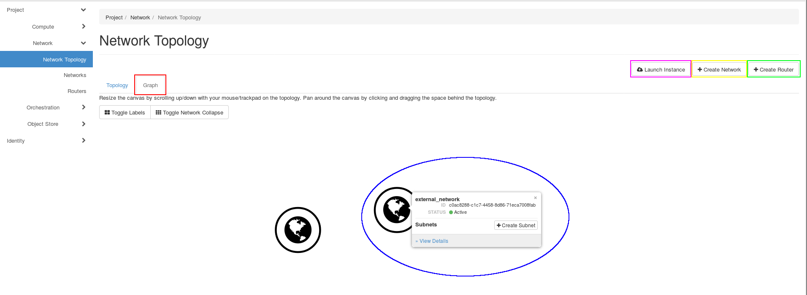

----

Here you can see the external network (blue elipse). 

What do we need to access our instances:


*  Router
*  Network
*  Subnet

## Router

Click on the **Create Router** button (green box). A form should appear:

----

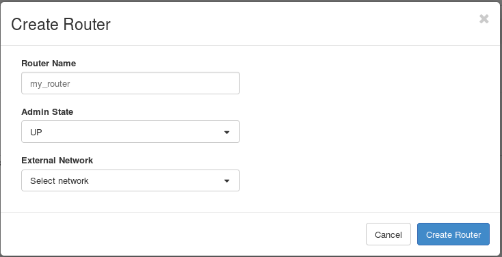

----

Fill in the **Router Name** and select the **external_network** for the **External Network**. Click on the blue button **Create Router**. Your network topology should looks like this:

----

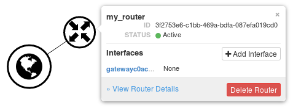

----

## Network and Subnet


Now, we need a network. Click on **Create Network** (yellow box). A three-part form should appear (**Network**, **Subnet**, **Subnet Details**):

----

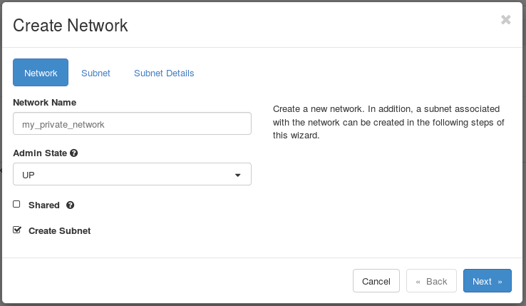

----

In the first part fill in the **Network Name** and then click on the blue **Next** button.

----

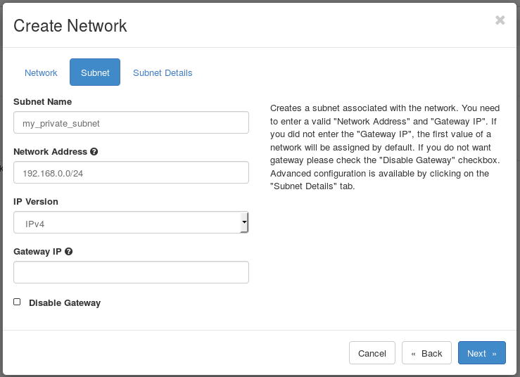

----

Here, you have to specify your **Subnet Name** and your **Network Adress** (e.g. **192.168.0.0/24**). After this, click on the blue **Next** button again. On the third page you can specify additional attributes for the subnet. For more information hover over the questionmarks. In this guide we skip this step and click on the blue **Create** button.

Now your topology should include your network:

----

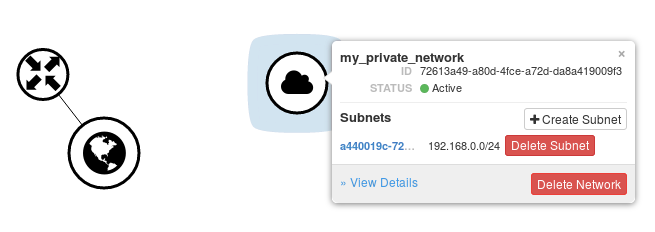

----

We want to connect our **Router** with our new **Network**. Click on your **Router**. A tooltip should pop up. Click on **Add Interface**. A form will appear:

----

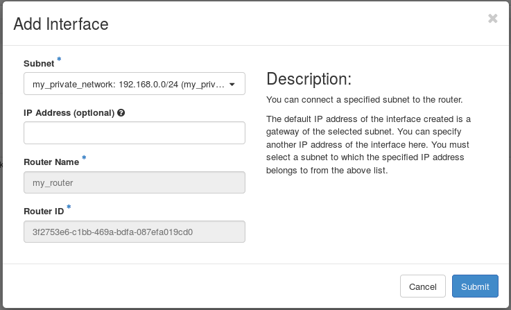

----

Select your **Subnet** and click on the blue **Submit** button. Your topology graph should look like this: 

----

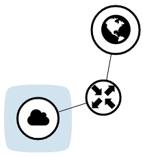

----

**For further reading visit our [Networking](Concept/basics.md#network) section**

# Launching an Instance

Finally, we can launch our instances. We are still on network overview page. 

Please note that it is absolutely essential having completed the [SSH Setup](quickstart.md#ssh-setup) before continuing. Otherwise, you will not be able to access your instance.

Click on the **Launch Instance** button (pink box on the picture in the last chapter). A new **Launch Instance** form will appear:

----

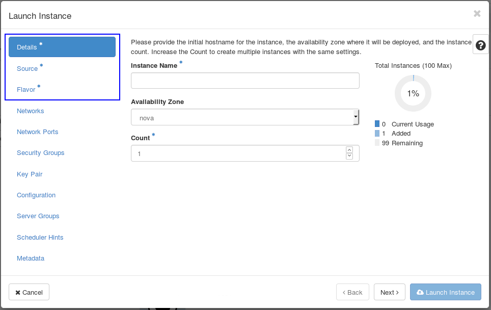

----

OpenStack fills some information with defaults. Thus, we have to fill the fields on the pages marked with a blue star (blue box).

On the first page we have to specify an **Instance Name**. After this, click on the **Next** button or on **Source* **. The blue star next to **Details** should disappear:

----

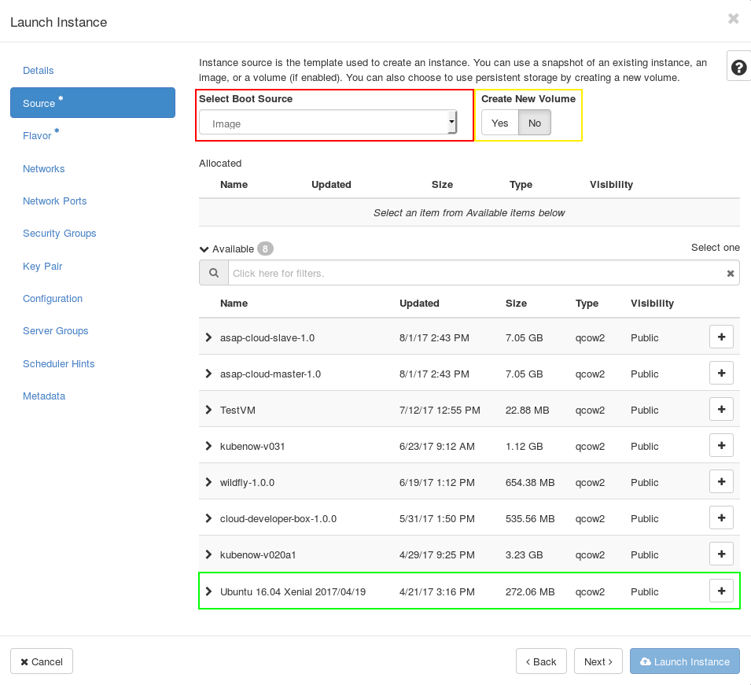

----

 1.  Select **Image** as **Boot Source** (red box).
 2.  Select **No** for **Create New Volume** (yellow box)
 3.  Select an image as source to create the instance (e.g. **Ubuntu 16.04 Xenial 2018/01/09** (green box))

After this, click on the **Next** Button or **Flavor* **. 

----

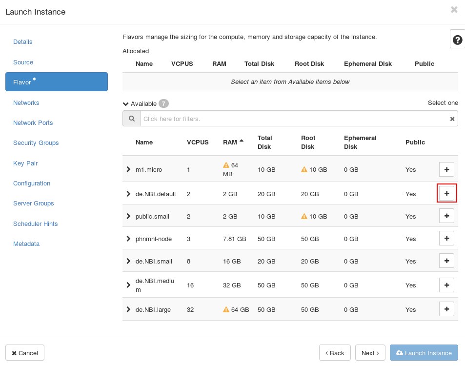

----

A flavor defines a virtual machine setup by defining parameters like hard disk size, available memory or CPU core number. Click on the **+** Button next to de.NBI.default flavor (red box). Now the star next to **Flavor** should disappear. You can click on the blue **Launch Instance** button to launch your instance. Your **Network Topology Graph** should look like this:

----

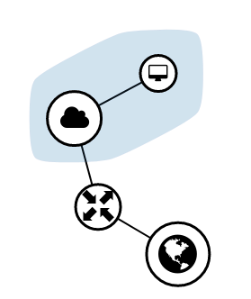

----


# Getting Access to the Instance

On the Project -> Compute -> Overview page, we can see that we have allocated some resources:

----

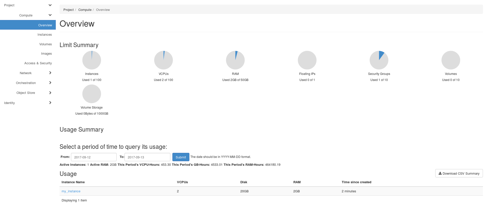

----

On Project -> Compute -> Instances we can see our instance and that it is running:

----

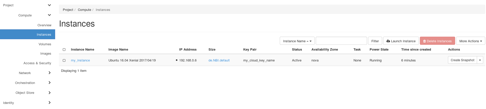

----

## Floating IP

In order to connect to your virtual machine (= instance), it must be related to a public network address. A private, fixed IP address, used "for communication between instances", will be assigned automatically to the instance. An IP adress "for communication with networks outside the cloud, including the internet" have to associated manually. Within the "Instances" tab, determine the machine for which a floating IP should allocated. To get access to our instance, we need to associate a **Floating IP** to it. Click on the arrow next to **Create Snapshot**. A dropdown menu appears:

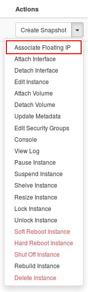

Click on **Associate Floating IP**: 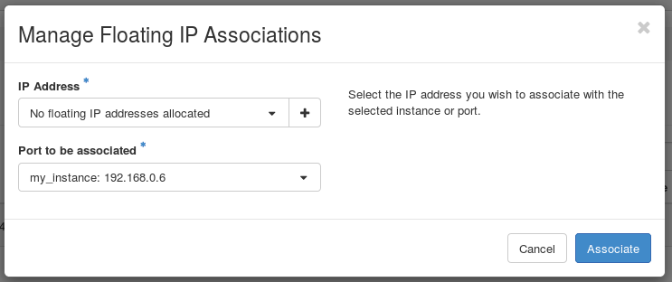

Click on the **+** next to **No floating IP addesses allocated** in the **IP Address** field:

----

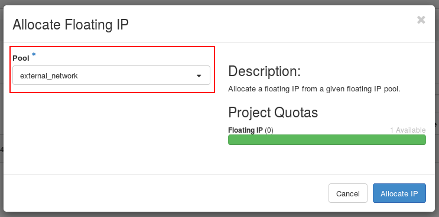

----

Select the **external_network** in the pool field (red box) and click on the blue **Associate IP** Button:

----

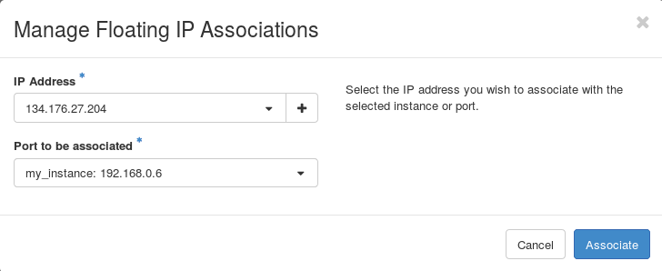

----

Click on **Associate** to associate your new floating ip to your instance. Now, your instance should have two ip adresses:

----

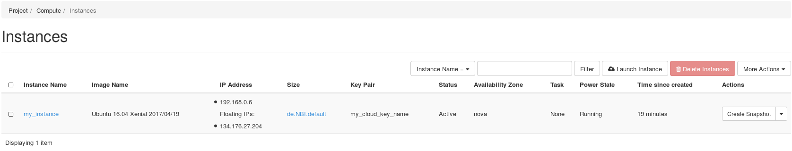

----

## Security Groups

First of all, you should read our [Security aspects in clouds](../security/#security-aspects-of-cloud-computing) page!
You are responsible for a secure setup of your VMs. To allow external access to your instance via SSH, you have to change the security group and allow SSH! Go to Project -> Compute -> Access & Security


----

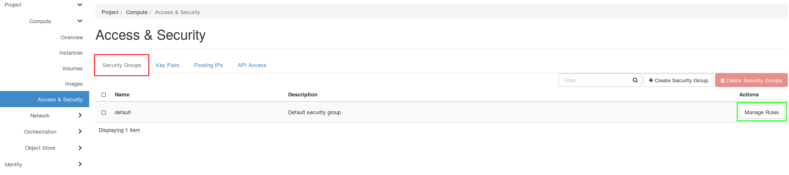

----

Click on the **Security Groups** Tab (red box). You should see one security group with the name **default**. Click on **Manage Rules** next to the **default** security group (green box).

----

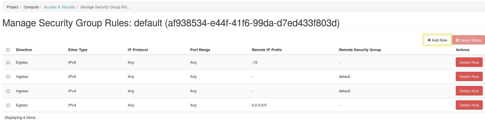

----

Click on **Add Rule** (yellow box)

----

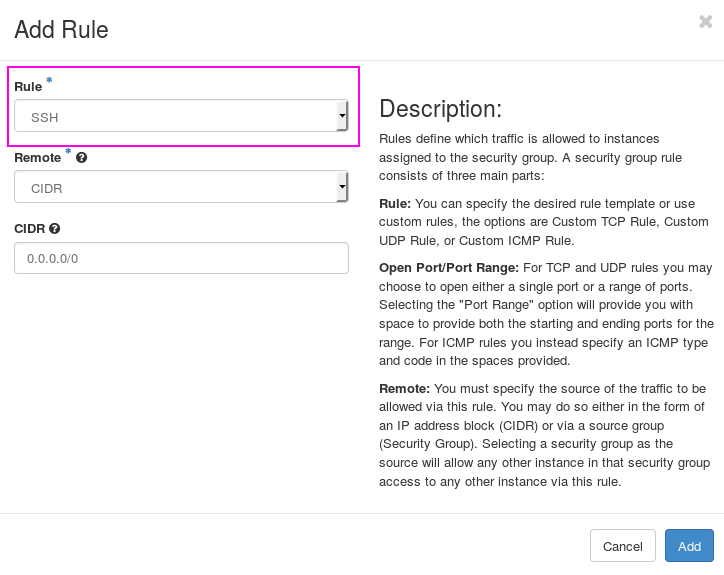

----

In the **Rule** field, select **SSH** (maybe you have to scroll a little bit down)(pink box). Click on the blue **Add** button.

## Login

### Linux and MacOS

For Linux and MacOS just use ssh, specifying the correct IP, the right key and the username of the OS you have chosen for example ‘ubuntu’. For Windows, start ‘Putty’ and enter the IP address of your VM under Hostname (or IP address).
It can be found within the Horizon dashboard under Instances. An example of a Linux command is given below:

~~~BASH
ssh -i /path/to/private/key @
~~~

An example for a Ubuntu machine with the floating IP 1.2.3.4 would be:

~~~BASH
ssh -i /path/to/private/key ubuntu@1.2.3.4
~~~

For a CentOS machine, it would be:

~~~BASH
ssh -i /path/to/private/key centos@1.2.3.4
~~~

If you need X-Forwarding for graphical user interfaces don’t forget to set the –X flag and check if the xauth package is installed on the host and the server and the X-Forwarding settings are correct. 
For Windows user we suggest to use xming (https://sourceforge.net/projects/xming/).

### Windows

!!! note
    Please note we offer a more detailed [tutorial](Tutorials/Win10_SSH/index.md) for accessing VMs from Windows 10.

For Windows using Putty you have to navigate in Putty to Connection / Data and enter ‘ubuntu’ as Auto-login username. The user name may be different for different Boot Sources, but here we have a CentOS based image.
Under Connection / SSH / Auth select the file containing your private key matching the public one you have used during the creation of your VM. Enable X11 forwarding under Connection / SSH / X11.
Go back to Session and save the settings for later reuse. Click on Open to connect to your VM via SSH. When connecting for the first time a warning related to server host keys may appear. Confirm with yes.
Enter the passphrase you have set during the creation of your key pair. You now should have a prompt on your VM. Please note, each time you are shutting down and deleting the VM or redeploy the VM, the IP address will change.
So first check if you have the correct IP address if problems occur. If you are just logging out of the VM via the exit command, the IP address will not change.

Great! You have started your first instance in the de.NBI cloud 8-)

## Using Cinder Volumes

Cinder Volumes are nothing else than block devices like a hard drive connected to your computer but in this case virtual. You can mount format and unmount it like a normal block device. In the following it is explained how to create a Cinder Volume and how to use it in your VM. But before some remarks. It is only possible to attach a Cinder Volume to exactly one VM. So you can not share one Volume with other VMs. A more cheerful remark is that the data saved on a Cinder Volume is persistent. As long you do not delete the Volume in the Dashboard (Horizon) your data will not get lost by deleting the VM.  

In the Dashboard (Horizon) you will navigate to the `Compute` section and then to the `Volume` section.
Here you can create a new volume entering the following parameters


* **Volume name:** Type in any name you want to

* **Description:** Describe for which purpose you will use the volume (optional) 

* **Volume Source:** Set it to `No source, empty Volume` to get an empty block device

* **Size (GiB):** Select the desired size in Gigabytes

* **Availability zone:** nova

Then click `create volume` and your volume will appear in the list of volumes with the status **Available**.
Now you have to attach the just created volume to your VM. This is done by changing to the `instance`section under the `compute` section and clicking on the arrow on the right side belonging to your VM.
Choose `Attach Volume` and choose the just created volume. Now your volume is connected to your VM similar to connecting a hard drive via USB with your computer.
In order to use the new volume you need to create a filesystem and mount it.

To be able to place files onto your newly attached volume there needs to be a file system on it. This process of file system generation is also called "formatting the device".
First, use this command to list all the block devices connected to your VM:

```BASH
lsblk
```

Now find the entry that corresponds to the volume you have attached previously. On most VMs it's the second item in the list, but you absolutely should verify that using its SIZE as well as through the fact that its MOUNTPOINTS should be empty.

!!! Danger "Formatting any device WILL DESTROY ALL THE DATA already on it!"
    New data disks (e.g. volumes) need to be formatted EXACTLY ONCE to use them.
    NEVER apply this command to an ALREADY FORMATTED DISK if you value the data on that disk.

Format the empty volume with a filesystem (e.g. `ext4` or `xfs`):

```BASH
sudo mkfs.ext4 /dev/vdx
```

Create a mountpoint for the new volume using

~~~BASH
sudo mkdir -p /mnt/volume
~~~

Check that you have the correct permissions for this directory, otherwise set them with the follwoing command

~~~BASH
sudo chmod 777 /mnt/volume/
~~~

And mount the Cinder Volume under the created directory

~~~
sudo mount /dev/device_name /mnt/volume
~~~

Now you should see your device by executing the command

~~~
df -h
~~~

If you do not need you Cinder Volume you can also unmount it with

~~~
umount /dev/device_name
~~~
