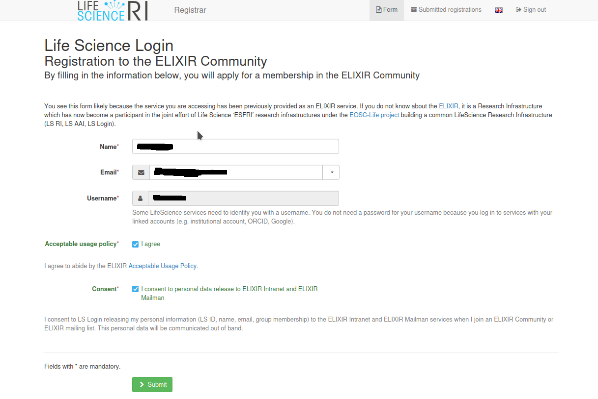
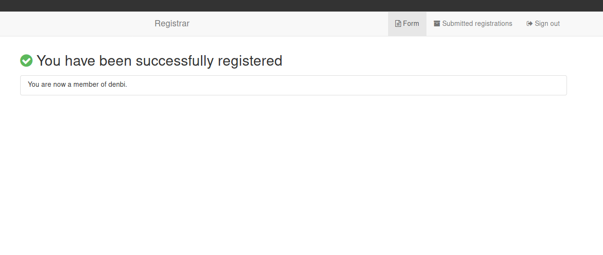

You can register for the de.NBI Cloud using an ELIXIR account. 
The registration is done via this [link](https://perun.elixir-czech.cz/registrar/?vo=elixir&targetnew=https://perun.elixir-czech.cz/registrar/?vo=denbi&targetexisting=https://perun.elixir-czech.cz/registrar/?vo=denbi).

### Step 1: Select your identity provider

First you have to select an identity provider where you have already an account: 

!!! note
    If you can not find your institution, you can as you see in the screenshot use a Google, LinkedIn or ORCID account.
    If a project applicant is using a Google, LinkedIn or ORCID account further identity verification checks must be done after the application is submitted.
    You can also at any time connect your ELIXIR account to as many other identity providers as you want through your [ELIXIR profile website](https://perun.elixir-czech.cz/fed/profile/).

### Step 2: Register for an ELIXIR account

After you are successfully logged in with the account of your identity provider, you will see the following registration page:

Clicking on submit leads you to this site:

This page indicates that you are now successfully registered for an ELIXIR account.

### Step 3:

Once you click on the `continue` button (above screenshot) you can also register for a de.NBI Cloud account: 

Finally you are after submitting the form a member of the de.NBI Cloud:

After the registration you might want to [apply](portal/#allocation) for a de.NBI Cloud project or you can be granted access to an already existing Cloud project through the [invitation function](portal/#inviting-members).
