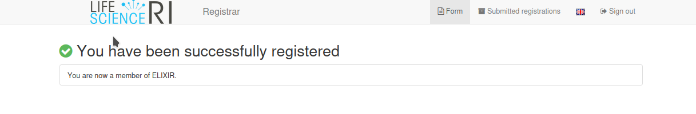

# Registering for de.NBI Cloud Access

To access the de.NBI Cloud, you'll need to create a LifeScienceAAI account and join three Virtual Organizations (VOs): 
**LifeScience**, **Elixir**, and **deNBI**.

Here's a quick summary of what you need to do. We'll follow up with a step-by-step guide in the next section.

## Short Version: Registration

1. Register for a **LifeScience** VO account [here](https://signup.aai.lifescience-ri.eu/fed/registrar/?vo=lifescience).
2. Register for an **Elixir** VO membership [here](https://signup.aai.lifescience-ri.eu/fed/registrar/?vo=elixir).
3. Register for a **deNBI** VO membership [here](https://signup.aai.lifescience-ri.eu/fed/registrar/?vo=denbi).
4. Log in to the **Cloud Portal** [here](https://cloud.denbi.de/portal).

## Detailed Registration Steps

### Step 1: Register for a **LifeScience** VO Account

Open [this link](https://signup.aai.lifescience-ri.eu/fed/registrar/?vo=lifescience).

#### 1. Select Your Identity Provider
Choose an identity provider where you already have an account, such as Google, LinkedIn, or ORCID if your institution is not listed.

!!! note
    If a project applicant is using a Google, LinkedIn or ORCID account further identity verification checks must be done
    after the application is submitted.
    You can also at any time connect your LifeScience account to as many other identity providers as you want through
    your [LifeScience profile website](https://profile.aai.lifescience-ri.eu/profile/identities).

#### 2. Register for a LifeScience Account

We will use ORCID as an example. Click the ORCID button and log in with your ORCID credentials.

Authorize LifeSciencesRI to pull information from your ORCID profile.

Specify your preferred name, email address, and username.

Submit the form and look for a verification email.

Check your spam folder if needed. The email should look like this:

Once you click the link, you will be redirected to the LifeSciencesRI page, where you need to log in with your preferred provider. You should then see a confirmation that your email has been verified.

> **_NOTE:_** In the meantime you will also have recieved an email confirmation of the new LifeSciencesRI account which
> will look like:

### Step 2: Register for an **Elixir** VO Account

Create membership for the Elixir VO [here](https://signup.aai.lifescience-ri.eu/fed/registrar/?vo=elixir) using the same identity provider.

Submit the application. You should become a member:

### Step 3: Register for a **de.NBI** VO Account

Join de.NBI via [this link](https://signup.aai.lifescience-ri.eu/fed/registrar/?vo=lifescience) using the same identity provider.

Ensure the input field data matches the LifeScience registration. Submit the form to become a de.NBI Cloud member.

After registration, apply for a de.NBI Cloud project or get access to an existing project through the invitation function.

### Step 4: Log into the de.NBI Portal

Go to [https://cloud.denbi.de](https://cloud.denbi.de) and click 'Login'.

Select your login provider and consent for deNBI to access your LifeScience information. Select 'Remember' for convenience.

You have now successfully registered for de.NBI Cloud access.